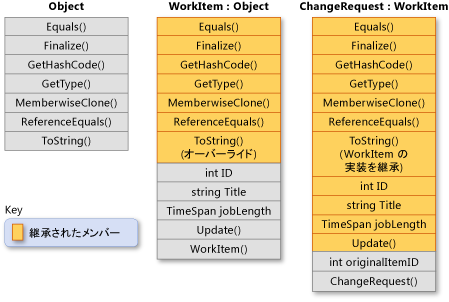

# 継承 (C# プログラミング ガイド)
[!INCLUDE[vs2017banner](../../../csharp/includes/vs2017banner.md)]

継承は、カプセル化やポリモーフィズムと共に、オブジェクト指向プログラミングの重要な 3 つの特性 \(*柱*\) の 1 つです。  継承を使用すると、他のクラスで定義されている動作を再利用、拡張、および変更する新しいクラスを作成できます。  メンバーが継承される側のクラスを*基本クラス*と呼び、メンバーを継承する側のクラスを*派生クラス*と呼びます。  派生クラスは直接基本クラスを 1 つだけ持つことができます。  ただし、継承には推移性があります。  ClassC が ClassB から派生し、ClassB が ClassA から派生している場合、ClassC には ClassB と ClassA で宣言されたメンバーが継承されます。  
  
> [!NOTE]
>  構造体では、継承はサポートされませんが、インターフェイスを実装することはできます。  詳細については、「[インターフェイス](../../../visual-basic/reference/command-line-compiler/index.md)」を参照してください。  
  
 概念的には、派生クラスは基本クラスから特化したクラスです。  たとえば、基本クラス `Animal` がある場合、`Mammal` という名前の派生クラスと、`Reptile` という名前の別の派生クラスを作成できます。  `Mammal` は `Animal` の 1 つであり、`Reptile` も `Animal` の 1 つですが、それぞれの派生クラスは、基本クラスからの別々の特化を表します。  
  
 別のクラスから派生するクラスを定義するとき、派生クラスには、基本クラスのコンストラクターとデストラクターを除くすべてのメンバーが暗黙的に引き継がれます。  したがって、派生クラスでは、基本クラスのコードを再実装しなくても再利用できます。  派生クラスにメンバーを追加することもできます。  このような方法で、派生クラスは基本クラスの機能を拡張します。  
  
 次の図は、あるビジネス プロセスにおける作業項目を表す `WorkItem` クラスを示します。  すべてのクラスと同様に、このクラスは <xref:System.Object?displayProperty=fullName> から派生し、そのすべてのメソッドを継承します。  `WorkItem` には、独自のメンバーが 5 つ追加されています。  これにはコンストラクターが含まれます。コンストラクターは継承されないためです。  `WorkItem` から継承される `ChangeRequest` クラスは、特定の種類の作業項目を表します。  `ChangeRequest` には、`WorkItem` および <xref:System.Object> から継承されるメンバーに、さらに 2 つのメンバーが追加されています。  追加される必要がある独自のコンストラクターの他に、`originalItemID` も追加されています。  この `originalItemID` プロパティによって、`ChangeRequest` インスタンスは、変更要求が適用される元の `WorkItem` と関連付けることができます。  
  
   
クラスの継承  
  
 次の例は、前の図に示したクラスの関係が C\# でどのように表現されるかを示しています。  また、この例は、`WorkItem` で仮想メソッド <xref:System.Object.ToString%2A?displayProperty=fullName> をオーバーライドする方法と、`ChangeRequest` クラスで `WorkItem` のメソッドの実装を継承する方法も示しています。  
  
 [!code-cs[csProgGuideInheritance#49](../../../csharp/programming-guide/classes-and-structs/codesnippet/CSharp/inheritance_1.cs)]  
  
## 抽象メソッドと仮想メソッド  
 基本クラスでメソッドが [virtual](../../../csharp/language-reference/keywords/virtual.md) として宣言されている場合、派生クラスはそのメソッドを独自の実装で[オーバーライド](../../../csharp/language-reference/keywords/override.md)できます。  基本クラスでメンバーが [abstract](../../../csharp/language-reference/keywords/abstract.md) として宣言されている場合は、クラスから直接継承される非抽象クラスで、そのメソッドをオーバーライドする必要があります。  派生クラス自体が抽象クラスの場合は、抽象メンバーを実装せずに継承します。  抽象メンバーと仮想メンバーは、オブジェクト指向プログラミングの重要な特性の 2 つ目であるポリモーフィズムの基礎です。  詳細については、「[ポリモーフィズム](../../../csharp/programming-guide/classes-and-structs/polymorphism.md)」を参照してください。  
  
## 抽象基本クラス  
 [new](../../../csharp/language-reference/keywords/new.md) キーワードを使用した直接のインスタンス化を禁止する場合は、クラスを [abstract](../../../csharp/language-reference/keywords/abstract.md) として宣言できます。  このようにすると、そのクラスは、新しいクラスを派生させなければ使用できなくなります。  抽象クラスには、それ自身が abstract として宣言された 1 つ以上のメソッド シグネチャを含むことができます。  これらのシグネチャはパラメーターと戻り値を指定しますが、実装 \(メソッド本体\) は持ちません。  抽象クラスは必ずしも抽象メンバーを含む必要はありませんが、クラスに抽象メンバーが含まれている場合は、クラス自体を抽象クラスとして宣言する必要があります。  それ自身が抽象クラスでない派生クラスは、抽象基本クラスから継承した抽象メソッドをすべて実装する必要があります。  詳細については、「[抽象クラスとシール クラス、およびクラス メンバー](../../../csharp/programming-guide/classes-and-structs/abstract-and-sealed-classes-and-class-members.md)」を参照してください。  
  
## インターフェイス  
 *インターフェイス*は、抽象メンバーだけで構成される抽象基本クラスに似た参照型です。  クラスでインターフェイスを実装する場合は、そのインターフェイスのすべてのメンバーを実装する必要があります。  1 つのクラスで複数のインターフェイスを実装できますが、直接継承できる基本クラスは 1 つだけです。  
  
 インターフェイスは、必ずしも "is\-a" 関係を持たない、クラスの特定の機能を定義するために使用します。  たとえば、ある型の 2 つのオブジェクトが等しいかどうかをクライアント コードで判別できるようにする \(ただし、等価性の定義は型によって行う\) 場合は、そのクラスまたは構造体で <xref:System.IEquatable%601?displayProperty=fullName> インターフェイスを実装できます。  <xref:System.IEquatable%601> は、基本クラスと派生クラスの間に存在する is\-a 関係 \("`Mammal` は `Animal` である" など\) と同様の意味を示すものではありません。  詳細については、「[インターフェイス](../../../visual-basic/reference/command-line-compiler/index.md)」を参照してください。  
  
## 派生クラスによる基本クラスのメンバーへのアクセス  
 派生クラスは、基本クラスのパブリック メンバー、プロテクト メンバー、内部メンバー、およびプロテクト内部メンバーにアクセスできます。  派生クラスは基本クラスのプライベート メンバーを継承しますが、これらのメンバーにはアクセスできません。  ただし、これらのすべてのプライベート メンバーは派生クラスにも存在し、基本クラス自体で行われるのと同じ処理を実行できます。  たとえば、基本クラスのプロテクト メソッドがプライベート フィールドにアクセスするとします。  継承された基本クラスのメソッドが正しく動作するためには、派生クラスにそのフィールドが存在する必要があります。  
  
## それ以上の派生の禁止  
 クラス自身またはメンバーを [sealed](../../../csharp/language-reference/keywords/sealed.md) として宣言することで、他のクラスがそのクラスやメンバーを継承できないように指定できます  詳細については、「[抽象クラスとシール クラス、およびクラス メンバー](../../../csharp/programming-guide/classes-and-structs/abstract-and-sealed-classes-and-class-members.md)」を参照してください。  
  
## 派生クラスによる基本クラスのメンバーの隠ぺい  
 派生クラスでは、同じ名前とシグネチャでメンバーを宣言することで、基本クラスのメンバーを隠ぺいできます。  [new](../../../csharp/language-reference/keywords/new.md) 修飾子を使用すると、そのメンバーが基本メンバーのオーバーライドとして用意されているのではないことを明示的に指定できます。  [new](../../../csharp/language-reference/keywords/new.md) の使用は必須ではありませんが、[new](../../../csharp/language-reference/keywords/new.md) を使用しない場合は、コンパイラの警告が生成されます。  詳細については、「[Override キーワードと New キーワードによるバージョン管理](../../../csharp/programming-guide/classes-and-structs/versioning-with-the-override-and-new-keywords.md)」および「[Override キーワードと New キーワードを使用する場合について](../../../csharp/programming-guide/classes-and-structs/knowing-when-to-use-override-and-new-keywords.md)」を参照してください。  
  
## 参照  
 [C\# プログラミング ガイド](../../../csharp/programming-guide/index.md)   
 [クラスと構造体](../../../csharp/programming-guide/classes-and-structs/index.md)   
 [クラス](../../../csharp/language-reference/keywords/class.md)   
 [struct](../../../csharp/language-reference/keywords/struct.md)