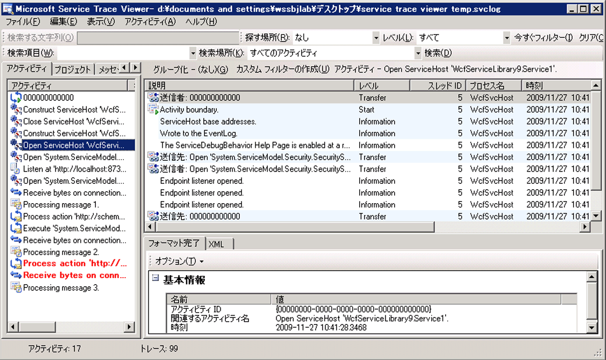

# <a name="emitting-user-code-traces"></a>ユーザー コード トレースの出力
Windows Communication Foundation (WCF) によって生成されるインストルメンテーション データを収集するための構成でのトレースを有効にするだけでなくもユーザー コードでプログラムからトレースを出力することができます。 この方法では、インストルメンテーション データを能動的に作成でき、後でそのデータを診断目的で詳細に調べることができます。 ここでは、この方法について説明します。  
  
 さらに、[トレースを拡張する](../../../../../docs/framework/wcf/samples/extending-tracing.md)サンプルには、次のセクションに示されているすべてのコードが含まれています。  
  
## <a name="creating-a-trace-source"></a>トレース ソースの作成  
 ユーザー トレース ソースを作成するには、次のコードを使用できます。  
  
```  
TraceSource ts = new TraceSource("myUserTraceSource");  
```  
  
## <a name="creating-activities"></a>アクティビティの作成  
 アクティビティは論理的な処理単位です。 トレースをグループ化する主要な処理単位ごとに 1 つのアクティビティを作成できます。 たとえば、サービスの要求ごとに 1 つのアクティビティを作成できます。 これを行うには、次の手順を実行します。  
  
1.  スコープでアクティブ ID を保存します。  
  
2.  新しいアクティビティ ID を作成します。  
  
3.  スコープ内のアクティビティから新しいアクティビティに移り、スコープ内に新しいアクティビティを設定し、そのアクティビティの Start トレースを出力します。  
  
 次のコードでは、この設定方法について説明します。  
  
```  
Guid oldID = Trace.CorrelationManager.ActivityId;  
Guid traceID = Guid.NewGuid();  
ts.TraceTransfer(0, "transfer", traceID);  
Trace.CorrelationManager.ActivityId = traceID; // Trace is static  
ts.TraceEvent(TraceEventType.Start, 0, "Add request");  
```  
  
## <a name="emitting-traces-within-a-user-activity"></a>ユーザー アクティビティ内でのトレースの出力  
 ユーザー アクティビティ内でトレースを出力するコードを次に示します。  
  
```  
double value1 = 100.00D;  
double value2 = 15.99D;  
ts.TraceInformation("Client sends message to Add " + value1 + ", " + value2);  
double result = client.Add(value1, value2);  
ts.TraceInformation("Client receives Add response '" + result + "'");  
```  
  
## <a name="stopping-the-activities"></a>アクティビティの停止  
 アクティビティを停止するには、旧アクティビティに戻り、現在のアクティビティ ID を停止して、スコープで旧アクティビティをリセットします。  
  
 次のコードでは、この設定方法について説明します。  
  
```  
ts.TraceTransfer(0, "transfer", oldID);  
ts.TraceEvent(TraceEventType.Stop, 0, "Add request");  
Trace.CorrelationManager.ActivityId = oldID;  
```  
  
## <a name="propagating-the-activity-id-to-a-service"></a>サービスへのアクティビティ ID の伝達  
 クライアントとサービスの両方の構成ファイルで、`propagateActivity` トレース ソースの `true` 属性を `System.ServiceModel` に設定した場合、Add 要求に対するサービス処理は、クライアントに定義されたものと同じアクティビティで発生します。 サービスに独自のアクティビティと転送が定義されている場合、そのサービス トレースは、クライアントにより伝達されたアクティビティには表示されません。 その代わり、クライアントから ID が伝達されたアクティビティに、転送トレースにより、関連付けられたアクティビティにサービス トレースが表示されます。  
  
> [!NOTE]
>  場合、`propagateActivity`属性に設定されている`true`両方のクライアントとサービスで、WCF によってサービスの操作スコープ内のアンビエント アクティビティが設定されます。  
  
 次のコードを使用すると、アクティビティは、WCF によってスコープで設定されたかどうかを確認します。  
  
```  
// Check if an activity was set in scope by WCF, if it was   
// propagated from the client. If not, ( ambient activity is   
// equal to Guid.Empty), create a new one.  
if(Trace.CorrelationManager.ActivityId == Guid.Empty)  
{  
    Guid newGuid = Guid.NewGuid();  
    Trace.CorrelationManager.ActivityId = newGuid;  
}  
// Emit your Start trace.  
ts.TraceEvent(TraceEventType.Start, 0, "Add Activity");  
  
// Emit the processing traces for that request.  
serviceTs.TraceInformation("Service receives Add "   
                            + n1 + ", " + n2);  
// double result = n1 + n2;  
serviceTs.TraceInformation("Service sends Add result" + result);  
  
// Emit the Stop trace and exit the method scope.  
ts.TraceEvent(TraceEventType.Stop, 0, "Add Activity");  
// return result;  
```  
  
## <a name="tracing-exceptions-thrown-in-code"></a>コード内でスローされる例外のトレース  
 コード内で例外をスローする場合、次のコードを使用して警告以上のレベルでその例外をトレースすることもできます。  
  
```  
ts.TraceEvent(TraceEventType.Warning, 0, "Throwing exception " + "exceptionMessage");  
```  
  
## <a name="viewing-user-traces-in-the-service-trace-viewer-tool"></a>サービス トレース ビューアー ツールでのユーザー トレースの表示  
 このセクションを実行して生成されたトレースのスクリーン ショットが含まれています、[トレースを拡張する](../../../../../docs/framework/wcf/samples/extending-tracing.md)を使用して表示するときに、サンプリング、[サービス トレース ビューアー ツール (SvcTraceViewer.exe)](../../../../../docs/framework/wcf/service-trace-viewer-tool-svctraceviewer-exe.md)です。  
  
 次の図では、以前作成した「Add 要求」アクティビティが左側のパネルで選択されます。 アプリケーション クライアント プログラムを構成する他の 3 つの算術演算アクティビティ (Divide、Subtract、Multiply) も表示されています。 どの要求でどのようなエラーが発生したかを明確にするため、ユーザー コードでは、操作ごとに新しいアクティビティが 1 つ定義されています。  
  
 転送の使用を示すために、[トレースを拡張する](../../../../../docs/framework/wcf/samples/extending-tracing.md)サンプルについては、次の 4 つの操作要求をカプセル化する Calculator アクティビティも作成します。 要求があるたびに、Calculator アクティビティから該当する要求のアクティビティへ、または該当する要求のアクティビティから Calculator アクティビティへ移転します (図の右上のパネルにトレースが表示されています)。  
  
 左のパネルでアクティビティを選択すると、そのアクティビティによって追加されたトレースが右上のパネルに表示されます。 場合`propagateActivity`は`true`要求に参加しているすべてのプロセスからトレースの要求アクティビティでは、要求パス内の各エンドポイントでします。 このサンプルでは、クライアントおよびサービスからのトレースをパネルの 4 番目の列で参照できます。  
  
 このアクティビティは次の順序で処理を行います。  
  
1.  クライアントはメッセージを Add に送信します。  
  
2.  サービスは Add 要求メッセージを受信します。  
  
3.  サービスは Add 応答を送信します。  
  
4.  クライアントは Add 応答を受信します。  
  
 これらすべてのトレースは、Information レベルで出力されています。 右上のパネルでトレースをクリックすると、トレースの詳細が右下のパネルに表示されます。  
  
 次の図には、Calculator アクティビティと要求アクティビティ間の転送トレースに加え、1 つの要求アクティビティについて Start トレースと Stop トレースが 2 組表示されています。1 組はクライアントのトレースで、もう 1 組はサーバーのトレースです (各トレース ソースにつき 1 組)。  
  
   
作成時刻によるアクティビティのリスト (左のパネル)、および入れ子にされたアクティビティ (右上のパネル)  
  
 クライアントがスローする原因となる例外を、サービス コードがスローする場合 (たとえば、クライアントが要求に対する応答を取得できなかった場合など)、直接的な相関関係を示すために、サービスとクライアントの両方の警告メッセージまたはエラー メッセージは、同じアクティビティ内に発生します。 次の図で、サービスは「サービスの退出をユーザー コードでは、この要求を処理します」という例外をスローします。 クライアントは、「サーバーでした内部エラーのため要求を処理できません。」という例外もがスローされます。  
  
   
要求アクティビティ ID が伝達された場合、どのエンドポイントで発生したかにかかわらず、その要求に関するすべてのエラーが同じアクティビティに表示されます。  
  
 左パネルの Multiply アクティビティをダブルクリックすると、次のグラフが表示されます。関連するプロセスごとの Multiply アクティビティに対するトレースが示されます。 まずサービスで発生した警告 (スローされた例外) が表示され、それに続いて、要求を処理できなかったために発生したクライアントの警告とエラーが表示されます。 したがって、エンドポイント間のエラーの因果関係が示され、エラーの根本原因を導き出すことができます。  
  
   
エラーの相関関係のグラフ表示  
  
 以前のトレースを取得するには、ユーザー トレース ソースに対して `ActivityTracing` を設定し、`propagateActivity=true` トレース ソースに対して `System.ServiceModel` を設定します。 ユーザー コード間のアクティビティの伝達を有効にするため、`ActivityTracing` トレース ソースの `System.ServiceModel` は設定されていません  (ServiceModel アクティビティ トレースが on の場合、クライアントに定義されたアクティビティ ID は反映されませんにサービスのユーザー コードです。転送では、ただし、関連しているクライアントとサービスのユーザー コード アクティビティの中間の WCF 活動。)  
  
 アクティビティを定義してアクティビティ ID を伝達することにより、エンドポイント間でエラーの直接相関関係を実行できます。 このようにして、エラーの根本原因をよりすばやく見つけることができるようになります。  
  
## <a name="see-also"></a>関連項目  
 [トレースの拡張](../../../../../docs/framework/wcf/samples/extending-tracing.md)
