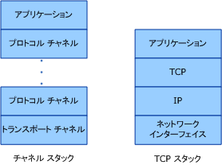

# チャネル モデルの概要
[!INCLUDE[indigo1](../../../../includes/indigo1-md.md)] チャネル スタックは、メッセージを処理する 1 つ以上のチャネルから成る階層構造の通信スタックです。 スタックの一番下には、基になるトランスポート (TCP、HTTP、SMTP、およびその他の種類のトランスポート) にチャネル スタックを適応させるためのトランスポート チャネルがあります。 チャネルによって、メッセージを送受信するための低レベルのプログラミング モデルが提供されます。 このプログラミング モデルは、複数のインターフェイスと、[!INCLUDE[indigo2](../../../../includes/indigo2-md.md)] チャネル モデルとして総称されるその他のモデルを利用します。 このトピックでは、チャネル形状、基本的なチャネル リスナーの構築 (サービス側)、およびチャネル ファクトリ (クライアント側) について説明します。  
  
## チャネル スタック  
 [!INCLUDE[indigo2](../../../../includes/indigo2-md.md)] エンドポイントでは、チャネル スタックと呼ばれる通信スタックを使用して通信が行われます。 次の図では、チャネル スタックと、TCP/IP などの他の通信スタックを比較します。  
  
   
  
 まず次のような類似点があります。いずれのスタックでも、スタックの各レイヤーにおいて、そのレイヤーより下の部分のアブストラクションと、直上のレイヤーだけに公開されるアブストラクションが提供されます。 各レイヤーでは、直下のレイヤーのアブストラクションだけが使用されます。 また、いずれのスタックでも、2 つのスタックが通信するときは、各レイヤーがもう一方のスタック内の対応するレイヤーと通信します。たとえば、IP レイヤーは IP レイヤーと、TCP レイヤーは TCP レイヤーと通信します。  
  
 次に相違点です。TCP スタックは、物理ネットワークのアブストクラションを提供するように設計されていますが、チャネル スタックは、メッセージの配信方法、すなわちトランスポートのアブストラクションだけでなく、メッセージの内容や通信用のプロトコルなど、トランスポートとそれ以上の機能を含む他の機能のアブストラクションも提供するように設計されています。 たとえば、信頼できるセッションのバインド要素は、チャネル スタックの一部ですが、トランスポートの下位でもトランスポート自体でもありません。 このアブストラクションは、スタック内の最下位チャネルに、基になるトランスポート プロトコルをチャネル スタック アーキテクチャに適応させるように要求し、スタック内の上位チャネルを利用して、信頼性の保証やセキュリティなどの通信機能を提供することによって、実現されます。  
  
 メッセージは、通信スタックを通して、<xref:System.ServiceModel.Channels.Message> オブジェクトとして転送されます。 上の図に示されているように、最下位チャネルはトランスポート チャネルと呼ばれます。 このチャネルは、他のパーティとメッセージの送受信を行うチャンネルです。 これには、他のパーティとの通信で使用されるフォーマットへの <xref:System.ServiceModel.Channels.Message> オブジェクトの変換が含まれます。 トランスポート チャネルには、それぞれが信頼できる配信保証などの通信機能を提供する任意の数のプロトコル チャネルを設定することができます。 プロトコル チャネルは、<xref:System.ServiceModel.Channels.Message> オブジェクトの形式で転送されるメッセージに対して機能します。 通常プロトコル チャネルでは、メッセージの変換 (ヘッダーの付加、本文の暗号化など) や独自のプロトコル制御メッセージの送受信 (確認応答の受信など) が行われます。  
  
## チャネル形状  
 各チャネルには、チャネル形状インターフェイスまたはチャネル形状と呼ばれる 1 つ以上のインターフェイスが実装されています。 このようなチャネル形状によって、チャネルが実装し、チャネルのユーザーが呼び出す送受信や要求、応答などの通信指向のメソッドが提供されます。 チャネル形状のベースでは、<xref:System.ServiceModel.Channels.IChannel>インターフェイスを提供するインターフェイスである、 `GetProperty` \<T > メソッドの複数層の機構として、スタック内のチャネルで公開される機能にアクセスするためのものです。 <xref:System.ServiceModel.Channels.IChannel> を拡張する 5 つのチャネル形状は、次のとおりです。  
  
-   <xref:System.ServiceModel.Channels.IInputChannel>  
  
-   <xref:System.ServiceModel.Channels.IOutputChannel>  
  
-   <xref:System.ServiceModel.Channels.IRequestChannel>  
  
-   <xref:System.ServiceModel.Channels.IReplyChannel>  
  
-   <xref:System.ServiceModel.Channels.IDuplexChannel>  
  
 さらに、これらの形状には、それぞれ <xref:System.ServiceModel.Channels.ISessionChannel%601?displayProperty=nameWithType> を拡張してセッションをサポートする同等の形状があります。 これらの数値は、次のとおりです。  
  
-   <xref:System.ServiceModel.Channels.IInputSessionChannel>  
  
-   <xref:System.ServiceModel.Channels.IOutputSessionChannel>  
  
-   <xref:System.ServiceModel.Channels.IRequestSessionChannel>  
  
-   <xref:System.ServiceModel.Channels.IReplySessionChannel>  
  
-   <xref:System.ServiceModel.Channels.IDuplexSessionChannel>  
  
 チャネル形状は、既存のトランスポート プロトコルでサポートされている基本的なメッセージ交換パターンにならってパターン化されます。 たとえば、一方向メッセージングに対応しています、 <xref:System.ServiceModel.Channels.IInputChannel> / <xref:System.ServiceModel.Channels.IOutputChannel>にペアでは、要求/応答対応<xref:System.ServiceModel.Channels.IRequestChannel> / <xref:System.ServiceModel.Channels.IReplyChannel>ペアと双方向多重通信に対応しています<xref:System.ServiceModel.Channels.IDuplexChannel>。(両方を拡張する<xref:System.ServiceModel.Channels.IInputChannel>と<xref:System.ServiceModel.Channels.IOutputChannel>)。  
  
## チャネル スタックを使用したプログラミング  
 通常、チャネル スタックは、バインドによってチャネル スタックが作成されるファクトリ パターンを使用して作成されます。 送信側では、バインドを使用して <xref:System.ServiceModel.ChannelFactory> が作成されます。これにより、次々にチャネル スタックが作成され、スタック内の最上位チャネルへの参照が返されます。 アプリケーションは、このチャネルを使用して、メッセージを送信できます。 詳細については、次を参照してください。[クライアント チャネル レベルのプログラミング](../../../../docs/framework/wcf/extending/client-channel-level-programming.md)です。  
  
 受信側では、バインドを使用して、入力メッセージを待ち受ける <xref:System.ServiceModel.Channels.IChannelListener> が作成されます。 <xref:System.ServiceModel.Channels.IChannelListener> では、チャネル スタックを作成し、最上位チャネルへのアプリケーション参照を渡すことによって、待ち受けているアプリケーションにメッセージが提供されます。 アプリケーションは、このチャネルを使用して、入力メッセージを受信します。 詳細については、次を参照してください。[サービス チャネル レベルのプログラミング](../../../../docs/framework/wcf/extending/service-channel-level-programming.md)です。  
  
## チャネル オブジェクト モデル  
 チャネル オブジェクト モデルは、チャネル、チャネル リスナー、およびチャネル ファクトリの実装に必要なインターフェイスのコア セットです。 また、カスタム実装を支援するために基本クラスもいくつか提供されます。  
  
 チャネル リスナーは、受信メッセージを待ち受け、チャネル リスナーによって作成されたチャネル経由で上位レイヤーに受信メッセージを配信します。  
  
 チャネル ファクトリは、メッセージの送信用のチャネルを作成し、チャネル ファクトリが閉じられたときに、作成したすべてのチャネルを閉じます。  
  
 <xref:System.ServiceModel.ICommunicationObject> は、すべての通信オブジェクトが実装する基本ステート マシンを定義するコア インターフェイスです。 <xref:System.ServiceModel.Channels.CommunicationObject> は、このコア インターフェイスの実装を提供し、他のチャネル クラスはインターフェイスを再実装せずに、これを派生させて利用できます。 ただし、これは必須でありません。カスタム チャネルは、<xref:System.ServiceModel.ICommunicationObject> を直接実装できますが、<xref:System.ServiceModel.Channels.CommunicationObject> を継承できません。 図 3 のクラスは、いずれもチャネル モデルの一部と見なされません。これらは、チャネルを作成するカスタム チャネル実装側が利用できるヘルパーです。  
  
   
  
 以下のトピックでは、チャネル オブジェクト モデルと共に、カスタム チャネルの作成に役立つさまざまな開発分野について説明します。  
  
|トピック|説明|  
|-----------|-----------------|  
|[サービス : チャネル リスナーとチャネル](../../../../docs/framework/wcf/extending/service-channel-listeners-and-channels.md)|サービス アプリケーションで受信チャネルを待ち受けるチャネル リスナーについて説明します。|  
|[クライアント : チャネル ファクトリとチャネル](../../../../docs/framework/wcf/extending/client-channel-factories-and-channels.md)|サービス アプリケーションに接続するチャネルを作成するチャネル ファクトリについて説明します。|  
|[状態変更の理解](../../../../docs/framework/wcf/extending/understanding-state-changes.md)|<xref:System.ServiceModel.ICommunicationObject?displayProperty=nameWithType> インターフェイス モデルの状態がチャネルでどのように変化するかについて説明します。|  
|[メッセージ交換パターンの選択](../../../../docs/framework/wcf/extending/choosing-a-message-exchange-pattern.md)|チャネルがサポートできる 6 つの基本メッセージ交換パターンについて説明します。|  
|[例外とエラーの処理](../../../../docs/framework/wcf/extending/handling-exceptions-and-faults.md)|カスタム チャネルでエラーと例外を処理する方法について説明します。|  
|[構成とメタデータのサポート](../../../../docs/framework/wcf/extending/configuration-and-metadata-support.md)|アプリケーション モデルからカスタム チャネルを使用できるようにする方法と、バインディングとバインド要素を使用してメタデータをエクスポートおよびインポートする方法について説明します。|
