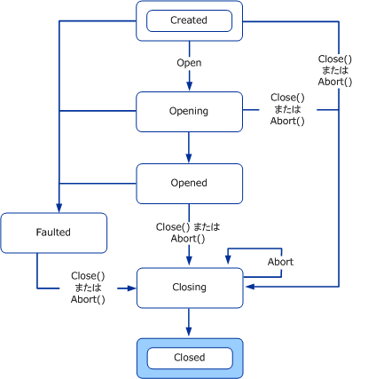
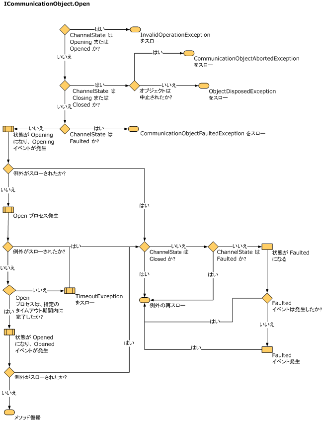
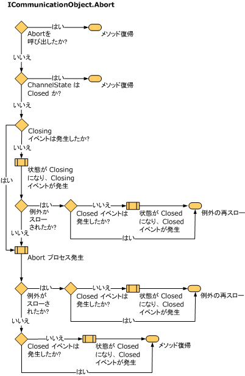

# 状態変更の理解
ここでは、チャネルの状態と遷移、チャネル状態の構成に使用する型、およびそれらの型の実装方法について説明します。  
  
## ステート マシンとチャネル  
 通信を処理する、ソケットなどのオブジェクトは、通常、ネットワーク リソースの割り当て、接続の確立や受け入れ、接続の閉鎖、および通信の終了に関連して状態が遷移するステート マシンを提供します。 チャネル ステート マシンは、通信オブジェクトの状態の統一モデルを提供します。モデルでは、そのオブジェクトの基になる実装が抽出されます。 <xref:System.ServiceModel.ICommunicationObject> インターフェイスは、状態、状態遷移メソッド、および状態遷移イベントのセットを提供します。 すべてのチャネル、チャネル ファクトリ、およびチャネル リスナーは、チャネル ステート マシンを実装します。  
  
 Closed、Closing、Faulted、Opened、および Opening の各イベントは、状態遷移の発生後に外部のオブザーバーに通知を行います。  
  
 Abort、Close、Open の各メソッド (およびそれぞれと同等の非同期メソッド) は、状態遷移を発生させます。  
  
 状態プロパティは、<xref:System.ServiceModel.CommunicationState> によって定義された現在の状態を返します。  
  
## ICommunicationObject、CommunicationObject、および各状態と状態遷移  
 <xref:System.ServiceModel.ICommunicationObject> は、そのさまざまなプロパティを構成できる Created 状態で開始します。 Opened 状態になると、このオブジェクトは、メッセージを送受信するために利用できるようになりますが、プロパティは不変と見なされます。 Closing 状態になると、このオブジェクトは新しい送受信要求を処理できなくなりますが、既存の要求は、Close タイムアウトに到達するまでに完了する可能性があります。  回復不可能なエラーが発生した場合は、オブジェクトは Faulted 状態に遷移し、そこでエラーに関する情報を点検し、最終的に閉じることができます。 Closed 状態になると、このオブジェクトは、実質的にステート マシンの最後に到達します。 オブジェクトが、ある状態から次の状態に遷移すると、前の状態には戻りません。  
  
 <xref:System.ServiceModel.ICommunicationObject> の各状態と状態遷移を次の図に示します。 状態遷移は、Abort、Open、Close の 3 つのメソッドのいずれかを呼び出すことによって発生させることができます。 また、実装固有の他のメソッドを呼び出すことによって発生させることもできます。 Faulted 状態への遷移は、通信オブジェクトを開いている途中または開いた後に発生することがあります。  
  
 すべての <xref:System.ServiceModel.ICommunicationObject> は Created 状態から開始します。 この状態では、アプリケーションがプロパティを設定してオブジェクトを構成できます。 オブジェクトが Created 以外の状態になると、オブジェクトは不変と見なされます。  
  
   
図 1 です。 ICommunicationObject ステート マシン  
  
 [!INCLUDE[indigo1](../../../../includes/indigo1-md.md)] は、<xref:System.ServiceModel.Channels.CommunicationObject> とチャネル ステート マシンを実装する <xref:System.ServiceModel.ICommunicationObject> という名前の抽象基本クラスを提供します。 次の図は、<xref:System.ServiceModel.Channels.CommunicationObject> に固有の、変更済みの状態図です。 <xref:System.ServiceModel.ICommunicationObject> ステート マシンのほかに、追加の <xref:System.ServiceModel.Channels.CommunicationObject> メソッドが呼び出されるタイミングも示しています。  
  
   
図 2 になります。 イベントと保護メソッドの呼び出しを含む、ICommunicationObject ステート マシンの CommunicationObject 実装  
  
### ICommunicationObject イベント  
 <xref:System.ServiceModel.Channels.CommunicationObject> は、<xref:System.ServiceModel.ICommunicationObject> によって定義された 5 つのイベントを公開します。 これらのイベントは、通信オブジェクトを使用するコードに状態遷移を通知するために設計されています。 上の図 2 に示されているように、オブジェクトの状態が、各イベントの名前が付けられた状態に遷移すると、該当するイベントが 1 回発生します。 イベントはすべて `EventHandler` 型であり、この型は次のように定義されています。  
  
 `public delegate void EventHandler(object sender, EventArgs e);`  
  
 <xref:System.ServiceModel.Channels.CommunicationObject> 実装では、送信側は <xref:System.ServiceModel.Channels.CommunicationObject> 自体、または送信側として <xref:System.ServiceModel.Channels.CommunicationObject> コンストラクターに渡されたオブジェクト (そのコンストラクター オーバーロードを使用した場合) になります。 EventArgs パラメーター `e` は、常に `EventArgs.Empty` です。  
  
### 派生オブジェクト コールバック  
 <xref:System.ServiceModel.Channels.CommunicationObject> は、5 つのイベントのほかに、状態遷移が発生する前後に派生オブジェクトのコールバックを可能にする 8 つの保護された仮想メソッドを宣言します。  
  
 <xref:System.ServiceModel.Channels.CommunicationObject.Open%2A?displayProperty=nameWithType> メソッドと <xref:System.ServiceModel.Channels.CommunicationObject.Close%2A?displayProperty=nameWithType> メソッドには、このような 3 つのコールバックがそれぞれに関連付けられています。 たとえば、<xref:System.ServiceModel.Channels.CommunicationObject.Open%2A?displayProperty=nameWithType> に対応するのは、<xref:System.ServiceModel.Channels.CommunicationObject.OnOpening%2A?displayProperty=nameWithType>、<xref:System.ServiceModel.Channels.CommunicationObject.OnOpen%2A?displayProperty=nameWithType>、および <xref:System.ServiceModel.Channels.CommunicationObject.OnOpened%2A?displayProperty=nameWithType> です。 <xref:System.ServiceModel.Channels.CommunicationObject.Close%2A?displayProperty=nameWithType> には、<xref:System.ServiceModel.Channels.CommunicationObject.OnClose%2A?displayProperty=nameWithType>、<xref:System.ServiceModel.Channels.CommunicationObject.OnClosing%2A?displayProperty=nameWithType>、および <xref:System.ServiceModel.Channels.CommunicationObject.OnClosed%2A?displayProperty=nameWithType> の各メソッドが関連付けられています。  
  
 同様に、<xref:System.ServiceModel.Channels.CommunicationObject.Abort%2A?displayProperty=nameWithType> メソッドには、対応する <xref:System.ServiceModel.Channels.CommunicationObject.OnAbort%2A?displayProperty=nameWithType> があります。  
  
 <xref:System.ServiceModel.Channels.CommunicationObject.OnOpen%2A?displayProperty=nameWithType>、<xref:System.ServiceModel.Channels.CommunicationObject.OnClose%2A?displayProperty=nameWithType>、および <xref:System.ServiceModel.Channels.CommunicationObject.OnAbort%2A?displayProperty=nameWithType> には既定の実装がありませんが、他のコールバックには、ステート マシンの正確さを保つために必要な既定の実装があります。 これらのメソッドをオーバーライドする場合は、必ず基本実装を呼び出すか、正確に置き換えてください。  
  
 <xref:System.ServiceModel.Channels.CommunicationObject.OnOpening%2A?displayProperty=nameWithType>、<xref:System.ServiceModel.Channels.CommunicationObject.OnClosing%2A?displayProperty=nameWithType>、および <xref:System.ServiceModel.Channels.CommunicationObject.OnFaulted%2A?displayProperty=nameWithType> は、それぞれ対応する <xref:System.ServiceModel.Channels.CommunicationObject.Opening?displayProperty=nameWithType>、<xref:System.ServiceModel.Channels.CommunicationObject.Closing?displayProperty=nameWithType>、および <xref:System.ServiceModel.Channels.CommunicationObject.Faulted?displayProperty=nameWithType> の各イベントを発生させます。 <xref:System.ServiceModel.Channels.CommunicationObject.OnOpened%2A?displayProperty=nameWithType> と <xref:System.ServiceModel.Channels.CommunicationObject.OnClosed%2A?displayProperty=nameWithType> は、オブジェクトの状態をそれぞれ Opened と Closed に設定してから、対応する <xref:System.ServiceModel.Channels.CommunicationObject.Opened?displayProperty=nameWithType> イベントと <xref:System.ServiceModel.Channels.CommunicationObject.Closed?displayProperty=nameWithType> イベントを発生させます。  
  
### 状態遷移メソッド  
 <xref:System.ServiceModel.Channels.CommunicationObject> は、Abort、Close、および Open の実装を提供します。 また、Faulted 状態への状態遷移を引き起こす Fault メソッドも提供します。 図 2 では、遷移の原因となったメソッドを各遷移に付記して <xref:System.ServiceModel.ICommunicationObject> ステート マシンを示しています (メソッドが付記されていない遷移は、メソッドが付記されている直前の遷移を発生させたメソッドの実装内部で発生します)。  
  
> [!NOTE]
>  通信状態の取得/設定の <xref:System.ServiceModel.Channels.CommunicationObject> 実装はすべて、スレッド同期されます。  
  
 コンストラクター  
  
 <xref:System.ServiceModel.Channels.CommunicationObject> は 3 つのコンストラクターを提供します。これらはすべて、オブジェクトを Created 状態にとどめます。 これらのコンストラクターは、次のように定義されています。  
  
 最初のコンストラクターは既定のコンストラクターで、オブジェクトを取得するコンストラクター オーバーロードで代行されます。  
  
 `protected CommunicationObject() : this(new object()) { … }`  
  
 オブジェクトを取得するコンストラクターは、通信オブジェクトの状態へのアクセスを同期するときにロックされるオブジェクトとしてパラメーターを使用します。  
  
 `protected CommunicationObject(object mutex) { … }`  
  
 最後に、3 番目のコンストラクターが、<xref:System.ServiceModel.ICommunicationObject> イベントが発生したときに送信側の引数として使用する追加のパラメーターを取得します。  
  
 `protected CommunicationObject(object mutex, object eventSender) { … }`  
  
 前の 2 つのコンストラクターは、送信側をこれに設定します。  
  
 Open メソッド  
  
 事前条件 : 状態は Created です。  
  
 事後条件 : 状態は Opened または Faulted です。 例外がスローされる場合があります。  
  
 Open() メソッドは通信オブジェクトを開き、状態を Opened に設定しようとします。 エラーが発生した場合は、状態を Faulted に設定します。  
  
 このメソッドは、まず現在の状態が Created であるかを確認します。 現在の状態が Opening または Opened の場合、<xref:System.InvalidOperationException> をスローします。 現在の状態が Closing または Closed の場合、オブジェクトが終了しているときは <xref:System.ServiceModel.CommunicationObjectAbortedException>、それ以外では <xref:System.ObjectDisposedException> をスローします。 現在の状態が Faulted の場合、<xref:System.ServiceModel.CommunicationObjectFaultedException> をスローします。  
  
 次に、状態を Opening に設定し、OnOpening() (Opening イベントを発生させます)、OnOpen()、および OnOpened() をこの順に呼び出します。 OnOpened() は、状態を Opened に設定し、Opened イベントを発生させます。 これらのいずれかが例外をスローした場合、Open() は Fault() を呼び出して例外をバブリングさせます。 Open プロセスの詳細を次の図に示します。  
  
   
カスタム オープン ロジック (内部通信オブジェクトを開くなど) を実装するように OnOpen メソッドをオーバーライドします。  
  
 Close メソッド  
  
 事前条件 : なし。  
  
 事後条件 : 状態は Closed です。 例外がスローされる場合があります。  
  
 Close() メソッドはどの状態でも呼び出すことができます。 このメソッドは、オブジェクトを正常に閉じようとします。 エラーが発生した場合は、オブジェクトを終了します。 現在の状態が Closing または Closed の場合、このメソッドは何もしません。 それ以外の場合は、状態を Closing に設定します。 元の状態が Created、Opening、または Faulted の場合は、Abort() を呼び出します (次の図を参照してください)。 元の状態が Opened の場合は、OnClosing() (Closing イベントを発生させます)、OnClose()、および OnClosed() をこの順に呼び出します。 これらのいずれかが例外をスローした場合、Close() は Abort() を呼び出して例外をバブリングさせます。 OnClosed() は状態をクローズに設定し、クローズ イベントを発生させます。 Close プロセスの詳細を次の図に示します。  
  
   
OnClose メソッドをオーバーライドして、カスタム クローズ ロジック (内部通信オブジェクトを閉じるなど) を実装します。 OnClose() はタイムアウト パラメーターを取り、Abort() の一部として呼び出されないため、長時間にわたってブロックできる正常なクロージング ロジック (たとえば、もう一方の側が応答するまで待機するなど) はすべて OnClose() で実装してください。  
  
 [中止]  
  
 事前条件 : なし。  
事後条件 : 状態は Closed です。 例外がスローされる場合があります。  
  
 現在の状態が Closed の場合、またはオブジェクトが既に終了している場合 (Abort() を別のスレッドで実行するなどにより)、Abort() メソッドは何もしません。 それ以外の場合は、状態を Closing に設定し、OnClosing() (Closing イベントを発生させます)、OnAbort()、および OnClosed をこの順に呼び出します (オブジェクトを閉じるのではなく、終了させるので OnClose を呼び出しません)。 OnClosed() は状態をクローズに設定し、クローズ イベントを発生させます。 これらのいずれかが例外をスローした場合は、Abort の呼び出し元に例外が再スローされます。 OnClosing()、OnClosed()、および OnAbort() の実装は、入出力などでブロックしないでください。 Abort プロセスの詳細を次の図に示します。  
  
   
カスタム終了ロジック (内部通信オブジェクトを終了するなど) を実装するように OnAbort メソッドをオーバーライドします。  
  
 Fault  
  
 Fault は、<xref:System.ServiceModel.Channels.CommunicationObject> に固有のメソッドであり、<xref:System.ServiceModel.ICommunicationObject> インターフェイスの一部ではありません。 ここで説明するのは、完全性を期してのことです。  
  
 事前条件 : なし。  
  
 事後条件 : 状態は Faulted です。 例外がスローされる場合があります。  
  
 現在の状態が Faulted または Closed の場合、Fault() は何もしません。 それ以外の場合は、状態を Faulted に設定し、Faulted イベントを発生させる OnFaulted() を呼び出します。 OnFaulted がスローした例外は再スローされます。  
  
### ThrowIfXxx メソッド  
 CommunicationObject には、オブジェクトが特定の状態にある場合に例外をスローするために使用できる 3 つの保護メソッドがあります。  
  
 <xref:System.ServiceModel.Channels.CommunicationObject.ThrowIfDisposed%2A> は、状態が Closing、Closed、または Faulted の場合に例外をスローします。  
  
 <xref:System.ServiceModel.Channels.CommunicationObject.ThrowIfDisposedOrImmutable%2A> は、状態が Created でない場合に例外をスローします。  
  
 <xref:System.ServiceModel.Channels.CommunicationObject.ThrowIfDisposedOrNotOpen%2A> は、状態が Opened でない場合に例外をスローします。  
  
 スローされる例外は状態によって決まります。 それぞれ異なる状態で ThrowIfXxx を呼び出すことによってスローされる例外の種類を次の表に示します。  
  
|状態|Abort を呼び出したか|例外|  
|-----------|----------------------------|---------------|  
|作成日時|N/A|<xref:System.InvalidOperationException?displayProperty=nameWithType>|  
|Opening|N/A|<xref:System.InvalidOperationException?displayProperty=nameWithType>|  
|Opened|N/A|<xref:System.InvalidOperationException?displayProperty=nameWithType>|  
|Closing|[はい]|<xref:System.ServiceModel.CommunicationObjectAbortedException?displayProperty=nameWithType>|  
|Closing|×|<xref:System.ObjectDisposedException?displayProperty=nameWithType>|  
|Closed|[はい]|事前に Abort を明示的に呼び出してオブジェクトを閉じた場合、<xref:System.ServiceModel.CommunicationObjectAbortedException?displayProperty=nameWithType>。 オブジェクトで Close を呼び出した場合は、<xref:System.ObjectDisposedException?displayProperty=nameWithType> がスローされます。|  
|Closed|×|<xref:System.ObjectDisposedException?displayProperty=nameWithType>|  
|Faulted|N/A|<xref:System.ServiceModel.CommunicationObjectFaultedException?displayProperty=nameWithType>|  
  
### タイムアウト  
 既に説明したメソッドには、タイムアウト パラメーターを取るものがあります。 それらは、Close、Open (特定のオーバーロードと非同期バージョン)、OnClose、および OnOpen です。 これらのメソッドは、時間のかかる操作 (たとえば、入出力でブロックしながら、接続を正常に閉じる操作など) を可能にするように設計されているため、そのような操作が中断されるまでに利用できる時間をタイムアウト パラメーターが示します。 これらのどのメソッドの実装も、指定されたタイムアウト値を使用して、そのタイムアウトの範囲内に呼び出し元に確実に復帰する必要があります。 タイムアウトを取らない他のメソッドの実装は、時間のかかる操作を目的として設計されていないため、入出力でブロックしないでください。  
  
 ただし、タイムアウトを取らない Open() オーバーロードと Close() オーバーロードは例外です。 これらは、派生クラスによって提供される既定のタイムアウト値を使用します。 <xref:System.ServiceModel.Channels.CommunicationObject> は、<xref:System.ServiceModel.Channels.CommunicationObject.DefaultCloseTimeout%2A> および <xref:System.ServiceModel.Channels.CommunicationObject.DefaultOpenTimeout%2A> という名前の 2 つの保護された抽象プロパティを公開します。これらは、次のように定義されています。  
  
 `protected abstract TimeSpan DefaultCloseTimeout { get; }`  
  
 `protected abstract TimeSpan DefaultOpenTimeout { get; }`  
  
 派生クラスは、タイムアウト値をとらない Open() オーバーロードと Close() オーバーロードに既定のタイムアウトを提供するために、これらのプロパティを実装します。 その後、Open() 実装と Close() 実装は、タイムアウトを取らないオーバーロードに代行させ、既定のタイムアウト値を渡します。この例を次に示します。  
  
 `public void Open()`  
  
 `{`  
  
 `this.Open(this.DefaultOpenTimeout);`  
  
 `}`  
  
#### IDefaultCommunicationTimeouts  
 このインターフェイスには、オープン、送信、受信、およびクローズに適用する既定のタイムアウト値を提供する 4 つの読み取り専用プロパティがあります。 各実装は、適切な方法で既定値を取得します。 便宜上、<xref:System.ServiceModel.Channels.ChannelFactoryBase> と <xref:System.ServiceModel.Channels.ChannelListenerBase> の既定値はそれぞれ 1 分です。
