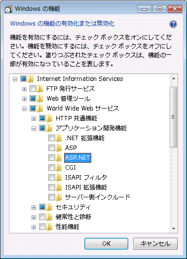

# Windows Communication Foundation での Internet Information Services 7.0 の構成

Internet Information Services (IIS) 7.0 はモジュール設計になっており、必要なコンポーネントを選択してインストールできます。 この設計は、[!INCLUDE[wv](../../../../includes/wv-md.md)] で新しく導入されたマニフェスト ドリブンのコンポーネント テクノロジに基づいています。 個別にインストールする IIS 7.0 の 40 以上のスタンドアロン機能コンポーネントがあります。 これにより、IT プロフェッショナルは必要に応じてインストールをカスタマイズできます。 このトピックでは、Windows Communication Foundation (WCF) を使用するための IIS 7.0 の構成し、必要なコンポーネントを決定する方法について説明します。

## 最小インストール : WAS のインストール
 IIS 7.0 パッケージ全体の最小インストールでは、Windows プロセス アクティブ化サービス (WAS) をインストールします。 スタンドアロン機能であり唯一の機能すべてに使用される IIS 7.0 からが[!INCLUDE[wv](../../../../includes/wv-md.md)]オペレーティング システム (Home Basic、Home Premium、Business、および Ultimate および Enterprise)。

 コントロール パネルの **プログラム**順にクリックします**オンまたはオフにする Windows 機能**の下にリストされている**プログラムと機能**、WAS コンポーネントがで示すように、次の図のようにリストします。

 

 この機能には、次のサブコンポーネントがあります。

-   .NET 環境

-   構成 API

-   プロセス モデル

 WAS のルート ノードのみを選択するかどうか、**プロセス モデル**サブ ノードは既定でオンにします。 このインストールでは Web サーバーをサポートしないため、WAS のみをインストールすることに注意してください。

 WCF または ASP.NET アプリケーション作業するために、確認、 **.NET 環境**チェック ボックスをオンします。 これはすべての WAS コンポーネントがうまく動作するためには、WCF と ASP.NET に必要なことを意味します。 これらのコンポーネントのいずれかを一度インストールすると、チェック ボックスは自動的にオンになります。

## IIS 7.0 : 既定のインストール
 チェックして、**インターネット インフォメーション サービス**機能は、一部のサブ ノードは次の図に示すように自動的にチェックします。

 

 これは、IIS 7.0 の既定のインストールです。 このインストールにより、サービスの静的コンテンツ (HTML ページやその他のコンテンツ) を IIS 7.0 を使用できます。 ただし、ASP.NET または CGI アプリケーションまたは WCF サービスをホストを実行することはできません。

## IIS 7.0 : ASP.NET サポートを行うインストール
 ASP.NET が IIS 7.0 で動作させる ASP.NET をインストールする必要があります。 確認後**ASP.NET**画面に次の図のようになります。

 

 これは、WCF と ASP.NET の両方のアプリケーションを IIS 7.0 で動作するための最低限の環境です。

## IIS 7.0 : IIS 6.0 互換コンポーネントを備えたインストール
 Visual Studio 2005 またはいくつか他の自動化スクリプトまたは IIS 6.0 メタベース API を使用した仮想アプリケーションの構成のツール (Adsutil.vbs) などのシステムで IIS 7.0 をインストールするときに、IIS 6.0 をチェックすることを確認**スクリプト ツール**. IIS 6.0 の他のサブ ノードを自動的にチェックし**互換性のある管理**します。 次の図は、これが完了した後、画面を示しています。

 

 このインストールにより、Web 上の IIS 7.0、ASP.NET および WCF の機能と使用可能なサンプルを使用するために必要なすべてのものがあります。

## 要求の制限
 IIS 7.0 がインストールされた [!INCLUDE[wv](../../../../includes/wv-md.md)] では、`maxUri` および `maxQueryStringSize` の設定の既定値が変更されています。 既定では、IIS 7.0 における要求のフィルター処理で使用できる文字数は、URL が 4096 文字、クエリ文字列が 2048 文字です。 これらの既定値を変更するには、App.config ファイルに次の XML を追加します。

 `<system.webServer>`

 `<security>`

 `<requestFiltering>`

 `<requestLimits maxUrl="8192" maxQueryString="8192" />`

 `</requestFiltering>`

 `</security>`

 `</system.webServer>`

## 関連項目

- [WAS アクティベーション アーキテクチャ](../../../../docs/framework/wcf/feature-details/was-activation-architecture.md)
- [WCF で使用するための WAS を設定する](../../../../docs/framework/wcf/feature-details/configuring-the-wpa--service-for-use-with-wcf.md)
- [方法 : WCF アクティブ化コンポーネントをインストールして設定する](../../../../docs/framework/wcf/feature-details/how-to-install-and-configure-wcf-activation-components.md)
- [Windows Server App Fabric のホスティング機能](https://go.microsoft.com/fwlink/?LinkId=201276)
