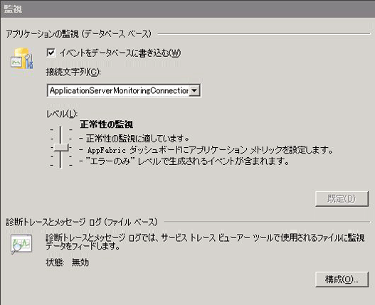
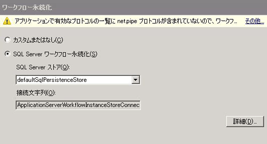
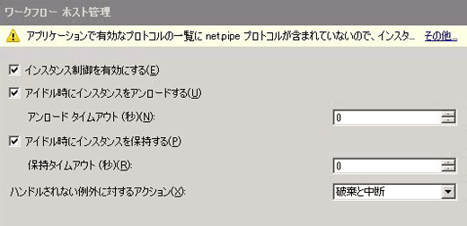

# 方法: Windows Server AppFabric を使用してワークフロー サービスをホストする
AppFabric でのワークフロー サービスのホスティングは IIS/WAS でのホスティングに似ています。 唯一の違いは、ワークフロー サービスの投入、監視、および管理のために AppFabric に用意されているツールです。 このトピックで作成したワークフロー サービスを使用して、[実行時間の長いワークフロー サービスを作成する](../../../../docs/framework/wcf/feature-details/creating-a-long-running-workflow-service.md)します。 ワークフロー サービスの作成方法はそちらのトピックで説明されています。 このトピックでは、AppFabric を使用したワークフロー サービスのホスティング方法を説明します。 Windows Server App Fabric の詳細については、次を参照してください。 [Windows Server Appfabric のドキュメント](https://go.microsoft.com/fwlink/?LinkID=193037&clcid=0x409)します。 下の手順を完了する前に、Windows Server AppFabric がインストールされていることを確認してください。  インターネット インフォメーション サービス (inetmgr.exe) を開いてでサーバー名をクリックします。、**接続**表示、サイト、 をクリックおよびクリック**既定の Web サイト**します。 画面の右側にあるという名前のセクションを参照する必要があります**App Fabric**します。 (右側のペインの一番上に表示される) このセクションが表示されない場合は、AppFabric がインストールされていません。 Windows Server Appfabric のインストールの詳細については、次を参照してください。[インストールの Windows Server App Fabric](https://go.microsoft.com/fwlink/?LinkId=193136)します。  
  
### 単純なワークフロー サービスの作成  
  
1.  Visual Studio 2012 を開きで作成した OrderProcessing ソリューションを読み込み、[実行時間の長いワークフロー サービスを作成する](../../../../docs/framework/wcf/feature-details/creating-a-long-running-workflow-service.md)トピック。  
  
2.  右クリックして、 **OrderService**順に選択して**プロパティ**を選択し、 **Web**タブ。  
  
3.  **開始動作**プロパティ ページのセクションを選択**特定ページ**Service1.xamlx を編集ボックスに入力します。  
  
4.  **サーバー**プロパティ ページのセクションを選択**ローカル IIS Web サーバーを使用**し、次の URL を入力:`http://localhost/OrderService`します。  
  
5.  をクリックして、**仮想ディレクトリの作成**ボタンをクリックします。 これで新しい仮想ディレクトリが作成され、プロジェクトが作成されるときに必要なファイルが仮想ディレクトリにコピーされるようにプロジェクトが設定されます。  または、仮想ディレクトリに .xamlx、web.config、および必要な DLL を手動でコピーすることもできます。  
  
### Windows Server AppFabric でホストされるワークフロー サービスの構成  
  
1.  インターネット インフォメーション サービス マネージャー (inetmgr.exe) を開きます。  
  
2.  OrderService 仮想ディレクトリに移動し、**接続**ウィンドウ。  
  
3.  [Orderservice] を右クリックし、選択**管理の WCF と WF サービス**、**構成しています**. **WCF と WF アプリケーションの構成** ダイアログ ボックスが表示されます。  
  
4.  選択、**全般**の次のスクリーン ショットに示すように、アプリケーションに関する一般情報を表示するタブ。  
  
     ![App Fabric の構成 ダイアログ ボックスの [全般] タブ](../../../../docs/framework/wcf/feature-details/media/appfabricconfiguration-general.gif "AppFabricConfiguration-全般")  
  
5.  選択、**監視**タブ。これにより、次のスクリーン ショットに示すように、さまざまな監視の設定を示しています。  
  
       
  
     ワークフロー サービスの構成の詳細については App Fabric での監視を参照してください[App Fabric での監視を構成する](https://go.microsoft.com/fwlink/?LinkId=193153)します。  
  
6.  選択、**ワークフローの永続化**タブ。これにより、次のスクリーン ショットに示すように App Fabric の既定の永続化プロバイダーを使用するアプリケーションを構成することができます。  
  
       
  
     Windows Server App Fabric でのワークフローの永続化の構成の詳細については、次を参照してください。 [Appfabric におけるワークフロー永続化の構成](https://go.microsoft.com/fwlink/?LinkId=193148)します。  
  
7.  選択、**ワークフロー ホスト管理**タブ。これにより、アイドル状態のワークフロー サービス インスタンスのアンロードし、次のスクリーン ショットに示すように永続化する必要がありますを指定することができます。  
  
       
  
     ワークフロー ホスト管理の構成の詳細については、次を参照してください。 [App Fabric を使用したワークフロー ホスト管理を構成する](https://go.microsoft.com/fwlink/?LinkId=193151)します。  
  
8.  選択、 **Auto-start**タブ。これにより、次のスクリーン ショットに示すように、アプリケーションでワークフロー サービスの自動開始設定を指定することができます。  
  
       
  
     Auto-start の構成の詳細については、次を参照してください。 [App Fabric で自動的に開始構成](https://go.microsoft.com/fwlink/?LinkId=193150)します。  
  
9. 選択、**スロットル**タブ。これにより、次のスクリーン ショットに示すように、ワークフロー サービスの制限の設定を構成することができます。  
  
       
  
     Throttling の構成の詳細については、次を参照してください。 [App Fabric で調整を構成する](https://go.microsoft.com/fwlink/?LinkId=193149)します。  
  
10. **[セキュリティ]** タブをクリックします。これにより、次のスクリーン ショットに示すように、アプリケーションのセキュリティ設定を構成することができます。  
  
       
  
     Windows Server App Fabric でのセキュリティの構成の詳細については、次を参照してください。 [App Fabric でのセキュリティ構成](https://go.microsoft.com/fwlink/?LinkId=193152)します。  
  
### Windows Server AppFabric の使用  
  
1.  ソリューションを作成して、仮想ディレクトリに必要なファイルをコピーします。  
  
2.  OrderClient プロジェクトを右クリックし、選択**デバッグ**、**新しいインスタンスを開始**クライアント アプリケーションを起動します。  
  
3.  クライアントが実行され、Visual Studio に表示されます、**アタッチのセキュリティ警告**ダイアログ ボックスで、 をクリックして、**アタッチしない**ボタン。 これにより、IIS プロセスにアタッチしてデバッグしないように Visual Studio に指示します。  
  
4.  クライアント アプリケーションは直ちにワークフロー サービスを呼び出して待機します。 ワークフロー サービスはアイドル状態になり永続化されます。 これは、インターネット インフォメーション サービス (inetmgr.exe) を開始して、[接続] ペインで [OrderService] に移動し、それを選択することによって確認できます。 次に、右側のペインで [App Fabric ダッシュボード] のアイコンをクリックします。 WF インスタンスの永続化は、次のスクリーン ショットに示すように、1 つの永続化されたワークフロー サービス インスタンスが表示されます。  
  
       
  
     **WF インスタンスの履歴**ワークフロー サービスのライセンス認証数、ワークフロー サービス インスタンスの入力候補の数の障害を持つワークフロー インスタンスの数など、ワークフロー サービスに関する情報を一覧表示します。 アクティブまたはアイドルの場合は、リンクが表示されます、下のリンクをクリックすると次のスクリーン ショットに示すように、アイドル状態のワークフロー インスタンスの詳細についてが表示されます。  
  
       
  
     Windows Server App Fabric の詳細については機能とその使用方法を参照してください[Windows Server Appfabric のホスティング機能](https://go.microsoft.com/fwlink/?LinkID=193143&clcid=0x409)  
  
## 関連項目
- [長時間のワークフロー サービスの作成](../../../../docs/framework/wcf/feature-details/creating-a-long-running-workflow-service.md)
- [AppFabric のホスティング機能](https://go.microsoft.com/fwlink/?LinkId=193143)
- [Windows Server App Fabric をインストールします。](https://go.microsoft.com/fwlink/?LinkId=193136)
- [Windows Server App Fabric のドキュメント](https://go.microsoft.com/fwlink/?LinkID=193037&clcid=0x409)
