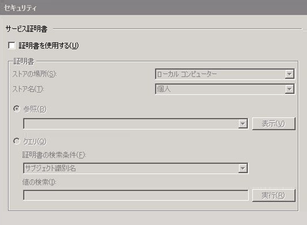

# 方法 : Windows Server AppFabric を使用してワークフロー サービスをホストする
AppFabric でのワークフロー サービスのホスティングは IIS/WAS でのホスティングに似ています。 唯一の違いは、ワークフロー サービスの投入、監視、および管理のために AppFabric に用意されているツールです。 このトピックで作成したワークフロー サービスを使用して、[実行時間の長いワークフロー サービスを作成する](../../../../docs/framework/wcf/feature-details/creating-a-long-running-workflow-service.md)です。 ワークフロー サービスの作成方法はそちらのトピックで説明されています。 このトピックでは、AppFabric を使用したワークフロー サービスのホスティング方法を説明します。 [!INCLUDE[crabout](../../../../includes/crabout-md.md)]Windows Server App Fabric を参照してください[Windows Server App Fabric ドキュメント](http://go.microsoft.com/fwlink/?LinkID=193037&clcid=0x409)です。 下の手順を完了する前に、Windows Server AppFabric がインストールされていることを確認してください。  インターネット インフォメーション サービス (inetmgr.exe) を開いてでサーバー名をクリックして、**接続**サイトをクリックし、をクリックして**既定の Web サイト**です。 画面の右側にある必要がありますと呼ばれるセクションを参照して**App Fabric**です。 (右側のペインの一番上に表示される) このセクションが表示されない場合は、AppFabric がインストールされていません。 [!INCLUDE[crabout](../../../../includes/crabout-md.md)]Windows Server App Fabric のインストールを参照してください[をインストールする Windows Server Appfabric](http://go.microsoft.com/fwlink/?LinkId=193136)です。  
  
### 単純なワークフロー サービスの作成  
  
1.  開いている[!INCLUDE[vs_current_long](../../../../includes/vs-current-long-md.md)]ソリューションを読み込み、OrderProcessing で作成して、[実行時間の長いワークフロー サービスを作成する](../../../../docs/framework/wcf/feature-details/creating-a-long-running-workflow-service.md)トピックです。  
  
2.  右クリックして、 **[orderservice]**プロジェクトし、選択**プロパティ**を選択し、 **Web**タブです。  
  
3.  **開始動作**プロパティ ページのセクションを選択**特定ページ**Service1.xamlx をエディット ボックスに入力します。  
  
4.  **サーバー**プロパティ ページのセクションを選択**ローカル IIS Web サーバー**し、次の URL を入力:`http://localhost/OrderService`です。  
  
5.  クリックして、**仮想ディレクトリの作成**ボタンをクリックします。 これで新しい仮想ディレクトリが作成され、プロジェクトが作成されるときに必要なファイルが仮想ディレクトリにコピーされるようにプロジェクトが設定されます。  または、仮想ディレクトリに .xamlx、web.config、および必要な DLL を手動でコピーすることもできます。  
  
### Windows Server AppFabric でホストされるワークフロー サービスの構成  
  
1.  インターネット インフォメーション サービス マネージャー (inetmgr.exe) を開きます。  
  
2.  OrderService 仮想ディレクトリに移動し、**接続**ウィンドウです。  
  
3.  [Orderservice] を右クリックし、選択**管理の WCF と WF サービス**、**構成しています**. **WCF と WF アプリケーションの構成** ダイアログ ボックスが表示されます。  
  
4.  選択、**全般**の次のスクリーン ショットに示すように、アプリケーションに関する一般情報を表示するタブです。  
  
     ![App Fabric の構成 ダイアログ ボックスの [全般] タブ](../../../../docs/framework/wcf/feature-details/media/appfabricconfiguration-general.gif "AppFabricConfiguration-全般")  
  
5.  選択、**監視**タブです。次のスクリーン ショットに示すような各種の監視設定が表示されます。  
  
     ![App Fabric の構成 [監視] タブ](../../../../docs/framework/wcf/feature-details/media/appfabricconfiguration-monitoring.gif "AppFabricConfiguration 監視")  
  
     [!INCLUDE[crabout](../../../../includes/crabout-md.md)]App Fabric でワークフロー サービスの監視の構成を参照してください[App Fabric の監視を構成する](http://go.microsoft.com/fwlink/?LinkId=193153)です。  
  
6.  選択、**ワークフローの永続化**タブです。ここでは、次のスクリーン ショットに示すように、AppFabric の既定の永続化プロバイダーをアプリケーションで使用するように構成できます。  
  
       
  
     [!INCLUDE[crabout](../../../../includes/crabout-md.md)]Windows Server App Fabric でのワークフローの永続化の構成を参照してください[ワークフロー永続化では、App Fabric の構成](http://go.microsoft.com/fwlink/?LinkId=193148)です。  
  
7.  選択、**ワークフロー ホスト管理**タブです。ここでは、次のスクリーン ショットに見られるように、アイドル状態のワークフロー サービス インスタンスをいつアンロードして永続化するかを指定できます。  
  
       
  
     [!INCLUDE[crabout](../../../../includes/crabout-md.md)]ワークフロー ホスト管理の構成を参照してください[App Fabric を使用したワークフロー ホスト管理を構成する](http://go.microsoft.com/fwlink/?LinkId=193151)です。  
  
8.  選択、 **Auto-start**タブです。ここでは、次のスクリーン ショットに示すように、アプリケーションでのワークフロー サービスに対する自動開始の設定を指定できます。  
  
       
  
     [!INCLUDE[crabout](../../../../includes/crabout-md.md)]自動開始の構成を参照してください[App Fabric を自動的に開始を構成する](http://go.microsoft.com/fwlink/?LinkId=193150)です。  
  
9. 選択、**スロットル**タブです。ここでは、次のスクリーン ショットに示すように、ワークフロー サービスのスロットル設定を構成できます。  
  
       
  
     [!INCLUDE[crabout](../../../../includes/crabout-md.md)]throttling の構成を参照してください[App Fabric の調整を構成する](http://go.microsoft.com/fwlink/?LinkId=193149)です。  
  
10. 選択、**セキュリティ**タブです。ここでは、次のスクリーン ショットに示すように、アプリケーションに対するセキュリティの設定を構成できます。  
  
       
  
     [!INCLUDE[crabout](../../../../includes/crabout-md.md)]Windows Server App Fabric のセキュリティの構成を参照してください[App Fabric のセキュリティの構成](http://go.microsoft.com/fwlink/?LinkId=193152)です。  
  
### Windows Server AppFabric の使用  
  
1.  ソリューションを作成して、仮想ディレクトリに必要なファイルをコピーします。  
  
2.  OrderClient プロジェクトを右クリックし、選択**デバッグ**、**新しいインスタンスを開始**クライアント アプリケーションを起動します。  
  
3.  クライアントが実行され、Visual Studio に表示されます、**アタッチのセキュリティ警告**ダイアログ ボックスで、をクリックして、**アタッチしない**ボタンをクリックします。 これにより、IIS プロセスにアタッチしてデバッグしないように Visual Studio に指示します。  
  
4.  クライアント アプリケーションは直ちにワークフロー サービスを呼び出して待機します。 ワークフロー サービスはアイドル状態になり永続化されます。 これは、インターネット インフォメーション サービス (inetmgr.exe) を開始して、[接続] ペインで [OrderService] に移動し、それを選択することによって確認できます。 次に、右側のペインで [App Fabric ダッシュボード] のアイコンをクリックします。 次のスクリーン ショットに示すように、[永続的な WF インスタンス] の下に、永続化されたワークフロー サービスのインスタンスが 1 つ表示されます。  
  
       
  
     **WF インスタンスの履歴**ワークフロー サービスのライセンス認証数、ワークフロー サービス インスタンスの入力候補の数の障害を持つワークフロー インスタンスの数など、ワークフロー サービスに関する情報を一覧表示します。 [アクティブなインスタンスまたはアイドル状態のインスタンス] の下に表示されるリンクをクリックすると、次のスクリーン ショットに示すように、アイドル状態のワークフロー インスタンスの詳細情報が表示されます。  
  
       
  
     Windows Server App Fabric の詳細については機能とその使用方法を参照してください[Windows Server App Fabric をホストしている機能](http://go.microsoft.com/fwlink/?LinkID=193143&clcid=0x409)  
  
## 関連項目  
 [実行時間の長いワークフロー サービスを作成します。](../../../../docs/framework/wcf/feature-details/creating-a-long-running-workflow-service.md)  
 [Windows Server App Fabric のホスティング機能](http://go.microsoft.com/fwlink/?LinkId=193143)  
 [Windows Server App Fabric をインストールします。](http://go.microsoft.com/fwlink/?LinkId=193136)  
 [Windows Server App Fabric のドキュメント](http://go.microsoft.com/fwlink/?LinkID=193037&clcid=0x409)
