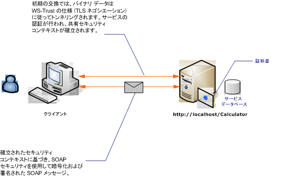

# <a name="message-security-with-an-anonymous-client"></a>メッセージ セキュリティと匿名クライアント
次のシナリオでは、[!INCLUDE[indigo1](../../../../includes/indigo1-md.md)] メッセージ セキュリティによって保護されているクライアントおよびサービスを示します。 設計目標は、トランスポート セキュリティではなくメッセージ セキュリティを使用することです。これによって将来、多様なクレームに基づくモデルをサポートできます。 詳細については、豊富な要求の承認を使用して、次を参照してください。[管理クレームと Id モデル承認](../../../../docs/framework/wcf/feature-details/managing-claims-and-authorization-with-the-identity-model.md)です。  
  
 サンプル アプリケーションについては、次を参照してください。[メッセージ セキュリティ匿名](../../../../docs/framework/wcf/samples/message-security-anonymous.md)です。  
  
   
  
|特徴|説明|  
|--------------------|-----------------|  
|セキュリティ モード|メッセージ|  
|相互運用性|[!INCLUDE[indigo2](../../../../includes/indigo2-md.md)] のみ|  
|認証 (サーバー)|初期ネゴシエーションには、サーバー認証が必要ですが、クライアント認証は不要です|  
|認証 (クライアント)|なし|  
|整合性|はい、共有のセキュリティ コンテキストを使用します|  
|機密性|はい、共有のセキュリティ コンテキストを使用します|  
|Transport|HTTP|  
  
## <a name="service"></a>サービス  
 次のコードと構成は、別々に実行します。 次のいずれかの操作を行います。  
  
-   構成を使用せずに、コードを使用してスタンドアロン サービスを作成します。  
  
-   提供された構成を使用してサービスを作成しますが、エンドポイントを定義しません。  
  
### <a name="code"></a>コード  
 次のコードは、メッセージ セキュリティを使用するサービス エンドポイントの作成方法を示します。  
  
 [!code-csharp[C_SecurityScenarios#8](../../../../samples/snippets/csharp/VS_Snippets_CFX/c_securityscenarios/cs/source.cs#8)]
 [!code-vb[C_SecurityScenarios#8](../../../../samples/snippets/visualbasic/VS_Snippets_CFX/c_securityscenarios/vb/source.vb#8)]  
  
### <a name="configuration"></a>構成  
 コードの代わりに次の構成を使用できます。 サービス動作要素を使用して、クライアントに対するサービスの認証に使用する証明書を指定します。 サービス要素は、`behaviorConfiguration` 属性を使用して動作を指定する必要があります。 バインド要素で、クライアント資格情報の種類が `None` であることを指定します。この資格情報の種類では、匿名クライアントがサービスを使用できます。  
  
```xml  
<?xml version="1.0" encoding="utf-8"?>  
<configuration>  
  <system.serviceModel>  
    <behaviors>  
      <serviceBehaviors>  
        <behavior name="ServiceCredentialsBehavior">  
          <serviceCredentials>  
            <serviceCertificate findValue="contoso.com"   
                                storeLocation="LocalMachine"  
                                storeName="My" />  
          </serviceCredentials>  
        </behavior>  
      </serviceBehaviors>  
    </behaviors>  
    <services>  
      <service behaviorConfiguration="ServiceCredentialsBehavior"   
               name="ServiceModel.Calculator">  
        <endpoint address="http://localhost/Calculator"   
                  binding="wsHttpBinding"  
                  bindingConfiguration="WSHttpBinding_ICalculator"   
                  name="CalculatorService"  
                  contract="ServiceModel.ICalculator" />  
      </service>  
    </services>  
    <bindings>  
      <wsHttpBinding>  
        <binding name="WSHttpBinding_ICalculator" >  
          <security mode="Message">  
            <message clientCredentialType="None" />  
          </security>  
        </binding>  
      </wsHttpBinding>  
    </bindings>  
    <client />  
  </system.serviceModel>  
</configuration>  
```  
  
## <a name="client"></a>Client  
 次のコードと構成は、別々に実行します。 次のいずれかの操作を行います。  
  
-   コード (およびクライアント コード) を使用してスタンドアロン クライアントを作成します。  
  
-   エンドポイント アドレスを定義しないクライアントを作成します。 代わりに、引数として構成名を受け取るクライアント コンストラクターを使用します。 次に例を示します。  
  
     [!code-csharp[C_SecurityScenarios#0](../../../../samples/snippets/csharp/VS_Snippets_CFX/c_securityscenarios/cs/source.cs#0)]
     [!code-vb[C_SecurityScenarios#0](../../../../samples/snippets/visualbasic/VS_Snippets_CFX/c_securityscenarios/vb/source.vb#0)]  
  
### <a name="code"></a>コード  
 クライアントのインスタンスを作成するコード例を次に示します。 バインディングはメッセージ モード セキュリティを使用し、クライアント資格情報の種類は None に設定されます。  
  
 [!code-csharp[C_SecurityScenarios#15](../../../../samples/snippets/csharp/VS_Snippets_CFX/c_securityscenarios/cs/source.cs#15)]
 [!code-vb[C_SecurityScenarios#15](../../../../samples/snippets/visualbasic/VS_Snippets_CFX/c_securityscenarios/vb/source.vb#15)]  
  
### <a name="configuration"></a>構成  
 クライアントを構成する場合のコード例を次に示します。  
  
```xml  
<?xml version="1.0" encoding="utf-8"?>  
<configuration>  
  <system.serviceModel>  
    <bindings>  
      <wsHttpBinding>  
        <binding name="WSHttpBinding_ICalculator" >  
          <security mode="Message">  
            <message clientCredentialType="None" />  
          </security>  
        </binding>  
      </wsHttpBinding>  
    </bindings>  
    <client>  
      <endpoint address="http://machineName/Calculator"  
        binding="wsHttpBinding"  
        bindingConfiguration="WSHttpBinding_ICalculator"   
        contract="ICalculator"  
        name="WSHttpBinding_ICalculator">  
        <identity>  
          <dns value="contoso.com" />  
        </identity>  
      </endpoint>  
    </client>  
  </system.serviceModel>  
</configuration>  
```  
  
## <a name="see-also"></a>関連項目  
 [セキュリティの概要](../../../../docs/framework/wcf/feature-details/security-overview.md)  
 [分散アプリケーションのセキュリティ](../../../../docs/framework/wcf/feature-details/distributed-application-security.md)  
 [メッセージ セキュリティ匿名](../../../../docs/framework/wcf/samples/message-security-anonymous.md)  
 [サービス ID と認証](../../../../docs/framework/wcf/feature-details/service-identity-and-authentication.md)  
 [Windows Server App Fabric のセキュリティ モデル](http://go.microsoft.com/fwlink/?LinkID=201279&clcid=0x409)
