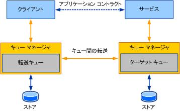

# サービス エンドポイントとキューのアドレス指定
ここでは、キューから読み取るサービスをクライアントがアドレス指定するしくみと、サービス エンドポイントがキューにマップされるしくみについて説明します。 キューに置かれた [!INCLUDE[indigo1](../../../../includes/indigo1-md.md)] アプリケーションの標準的な配置を次の図に示します。  
  
   
  
 クライアントは、メッセージをサービスに送信するために、メッセージをターゲット キューにアドレス指定します。 サービスは、キューからメッセージを読み取るために、リッスン アドレスをターゲット キューに設定します。 [!INCLUDE[indigo2](../../../../includes/indigo2-md.md)] でのアドレス指定は URI (Uniform Resource Identifier) ベースですが、メッセージ キュー (MSMQ) のキュー名は URI ベースでありません。 そのため、[!INCLUDE[indigo2](../../../../includes/indigo2-md.md)] を使用して、MSMQ で作成されたキューをアドレス指定する方法を理解しておくことが不可欠となります。  
  
## MSMQ のアドレス指定  
 MSMQ は、パスと形式名を使用してキューを識別します。 パスでは、ホスト名と `QueueName` を指定します。 必要に応じて、ホスト名と `Private$` の間に `QueueName` を指定して、Active Directory ディレクトリ サービスで公開されないプライベート キューを示すこともできます。  
  
 パス名は、ルーティングやキュー マネージャー転送プロトコルを含む、アドレスの追加の側面を確認する"FormatNames"にマップされます。 キュー マネージャーは、ネイティブの MSMQ プロトコルと SOAP リライアブル メッセージ プロトコル (SRMP: SOAP Reliable Messaging Protocol) の 2 つの転送プロトコルをサポートしています。  
  
 [!INCLUDE[crabout](../../../../includes/crabout-md.md)]MSMQ のパスと形式名を参照してください[メッセージがキューに関する](http://go.microsoft.com/fwlink/?LinkId=94837)です。  
  
## NetMsmqBinding とサービスのアドレス指定  
 メッセージをサービスにアドレス指定するときは、通信に使用するトランスポートに基づいて URI のスキームが選択されます。 [!INCLUDE[indigo2](../../../../includes/indigo2-md.md)] の各トランスポートには、一意のスキームがあります。 このスキームには、通信に使用されるトランスポートの性質を反映する必要があります。 たとえば、net.tcp、net.pipe、HTTP などがあります。  
  
 [!INCLUDE[indigo2](../../../../includes/indigo2-md.md)] 内の MSMQ のキューに置かれたトランスポートは、net.msmq スキームを公開します。 net.msmq スキームを使用してアドレス指定されたすべてのメッセージは、`NetMsmqBinding` を使用して、MSMQ のキューに置かれたトランスポート チャネル経由で送信されます。  
  
 [!INCLUDE[indigo2](../../../../includes/indigo2-md.md)] でのキューのアドレス指定は、次のパターンに基づきます。  
  
 net.msmq: // \<*host-name*> / [private/] \<*queue-name*>  
  
 それぞれの文字について以下に説明します。  
  
-   \<*ホスト名*> ターゲット キューをホストしているコンピューターの名前を指定します。  
  
-   [private] はオプションです。 専用キューであるターゲット キューをアドレス指定するときに使用します。 パブリック キューをアドレス指定する場合は、private を指定しないでください。 MSMQ のパスとは異なり、[!INCLUDE[indigo2](../../../../includes/indigo2-md.md)] の URI 形式には "$" はありません。  
  
-   \<*キュー名*> キューの名前を指定します。 キュー名では、サブキューを参照することもできます。 したがって、 \<*キュー名*> = \<*キュー名の*> [;*サブ queue 名前*] です。  
  
 例 1 : コンピューター abc atadatum.com でホストされているプライベート キュー PurchaseOrders をアドレス指定する場合、URI は net.msmq://abc.adatum.com/private/PurchaseOrders になります。  
  
 例 2 : コンピューター def atadatum.com でホストされているパブリック キュー AccountsPayable をアドレス指定する場合、URI は net.msmq://def.adatum.com/AccountsPayable になります。  
  
 キュー アドレスは、メッセージを読み取るリスナーにより、リッスン URI として使用されます。 つまり、キュー アドレスは TCP ソケットのリッスン ポートと同じです。  
  
 キューから読み取りを行うエンドポイントは、ServiceHost を開いたときにあらかじめ指定されているスキームと同じスキームを使用して、キューのアドレスを指定する必要があります。 例については、次を参照してください。[ネット MSMQ バインディング](../../../../docs/framework/wcf/samples/net-msmq-binding.md)と[メッセージ キュー統合バインディング サンプル](http://msdn.microsoft.com/library/997d11cb-f2c5-4ba0-9209-92843d4d0e1a)です。  
  
### キュー内の複数のコントラクト  
 キュー内のメッセージは、さまざまなコントラクトを実装している可能性があります。 この場合、すべてのメッセージを正常に読み取って処理するためには、次のいずれかの処置を行う必要があります。  
  
-   すべてのコントラクトを実装するサービス エンドポイントを指定します。 この方法をお勧めします。  
  
-   異なるコントラクトを持つ複数のエンドポイントを指定します。ただし、すべてのエンドポイントで同じ `NetMsmqBinding` オブジェクトを使用するようにしてください。 ServiceModel のディスパッチ ロジックでは、ディスパッチ用のトランスポート チャネルからメッセージを読み取るメッセージ ポンプを使用します。メッセージ ポンプは、最終的にコントラクトに基づいてこれらのメッセージをさまざまなエンドポイントに非多重化します。 メッセージ ポンプは、リッスン URI とバインディングの組み合わせに対して作成されます。 キュー アドレスは、キューに格納されたリスナーにより、リッスン URI として使用されます。 すべてのエンドポイントで同じバインディング オブジェクトを使用するようにすると、1 つのメッセージ ポンプを使用してメッセージを読み取り、コントラクトに基づいて関連するエンドポイントに非多重化できるようになります。  
  
### SRMP メッセージング  
 既に説明したように、キュー間の転送には SRMP プロトコルを使用できます。 このプロトコルは、HTTP トランスポートを使用して転送キューとターゲット キューの間でメッセージを送信する場合に使用するのが一般的です。  
  
 SRMP 転送プロトコルを使用するには、前述の net.msmq URI スキームを使用してメッセージをアドレス指定し、`QueueTransferProtocol` の `NetMsmqBinding` プロパティで SRMP または Secured SRMP を指定します。  
  
 `QueueTransferProtocol` プロパティの指定は、送信専用の機能です。 これは、使用するキュー転送プロトコルの種類の、クライアントによる指示です。  
  
### Active Directory の使用  
 MSMQ は、Active Directory 統合をサポートします。 MSMQ を Active Directory 統合と共にインストールした場合、コンピューターを Windows ドメインに含める必要があります。 探索; 用のキューを発行する active Directory が使用されます。このようなキューと呼ばれます*パブリック キュー*です。 アドレス指定されたキューは、Active Directory を使用して解決できます。 これは、ドメイン ネーム システム (DNS: Domain Name System) を使用して、ネットワーク名の IP アドレスを解決するしくみに似ています。 `UseActiveDirectory` の `NetMsmqBinding` プロパティは、キューに置かれたチャネルでキューの URI を解決するために Active Directory を使用する必要があるかどうかを示すブール値です。 既定では `false` に設定されています。 `UseActiveDirectory` プロパティを `true` に設定すると、キューに置かれたチャネルは、Active Directory を使用して net.msmq:// URI を形式名に変換します。  
  
 `UseActiveDirectory` プロパティは、メッセージの送信時にキューのアドレスを解決するために使用されるので、メッセージを送信するクライアントに対してのみ有効です。  
  
### メッセージ キュー形式名への net.msmq URI のマップ  
 キューに置かれたチャネルは、チャネルに提供された net.msmq URI 名を MSMQ 形式名にマップします。 これらをマップする際に使用されるルールを次の表にまとめます。  
  
|WCF の URI ベースのキュー アドレス|UseActiveDirectory プロパティ|QueueTransferProtocol プロパティ|結果の MSMQ 形式名|  
|----------------------------------|-----------------------------------|--------------------------------------|---------------------------------|  
|Net.msmq://\<machine-name>/private/abc|False (既定値)|Native (既定値)|DIRECT=OS:machine-name\private$\abc|  
|Net.msmq://\<machine-name>/private/abc|False|SRMP|DIRECT=http://machine/msmq/private$/abc|  
|Net.msmq://\<machine-name>/private/abc|True|ネイティブ|PUBLIC=some-guid (キューの GUID)|  
  
### 配信不能キューまたは有害メッセージ キューからのメッセージの読み取り  
 ターゲット キューのサブキューである有害メッセージ キューからメッセージを読み取るには、サブキューのアドレスを使用して `ServiceHost` を開きます。  
  
 例 : ローカル コンピューターの PurchaseOrders 専用キューの有害メッセージ キューから読み取るサービスでは、net.msmq://localhost/private/PurchaseOrders;poison というアドレスを指定します。  
  
 システム トランザクション配信不能キューからメッセージを読み取るには、URI を net.msmq://localhost/system$;DeadXact という形式にする必要があります。  
  
 システム非トランザクション配信不能キューからメッセージを読み取るには、URI を net.msmq://localhost/system$;DeadLetter という形式にする必要があります。  
  
 カスタムの配信不能キューを使用する場合は、配信不能キューをローカル コンピューターに配置する必要があります。 そのため、配信不能キューの URI は次の形式に限定されます。  
  
 net.msmq: //localhost/ [private/]  \<*custom-dead-letter-queue-name*>.  
  
 [!INCLUDE[indigo2](../../../../includes/indigo2-md.md)] サービスは、受信するすべてのメッセージが、リッスンしている特定のキューにアドレス指定されているかどうかを確認します。 メッセージの送信先キューとメッセージが置かれているキューが一致しない場合、サービスはメッセージを処理しません。 この問題には、配信不能キューをリッスンしているサービスが対処する必要があります。これは、配信不能キューにあるメッセージが、他の場所に配信されることになっていたメッセージであるためです。 配信不能キューや有害メッセージ キューからメッセージを読み取るには、`ServiceBehavior` パラメーターが設定された <xref:System.ServiceModel.AddressFilterMode.Any> を使用する必要があります。 例については、次を参照してください。[配信不能キュー](../../../../docs/framework/wcf/samples/dead-letter-queues.md)です。  
  
## MsmqIntegrationBinding とサービスのアドレス指定  
 `MsmqIntegrationBinding` は、従来の MSMQ アプリケーションとの通信に使用されます。 既存の MSMQ アプリケーションとの相互運用を容易にするために、[!INCLUDE[indigo2](../../../../includes/indigo2-md.md)] は形式名のアドレス指定のみをサポートしています。 そのため、このバインディングを使用して送信されるメッセージは、次の URI スキームに従う必要があります。  
  
 msmq.formatname:\<*MSMQ-format-name*>>  
  
 MSMQ によって指定されたフォームの MSMQ 形式名は、[メッセージがキューに関する](http://go.microsoft.com/fwlink/?LinkId=94837)です。  
  
 `MsmqIntegrationBinding` を使用してキューからメッセージを受信する場合、使用できるのは、直接形式名とパブリック/プライベート形式名 (ActiveDirectory 統合が必要です) のみです。 ただし、直接形式名を使用することをお勧めします。 たとえば、[!INCLUDE[wv](../../../../includes/wv-md.md)] では、他の形式名を使用すると、エラーが発生します。これは、システムがサブキューを開こうとしても、サブキューは直接形式名でしか開くことができないためです。  
  
 `MsmqIntegrationBinding` を使用して SRMP のアドレス指定を行う場合は、インターネット インフォメーション サービス (IIS: Internet Information Services) のディスパッチを支援するために、直接形式名で /msmq/ を追加するという要件はありません。 たとえば、SRMP プロトコルを使用してキュー abc をアドレス指定する場合は、DIRECT=http://adatum.com/msmq/private$/abc ではなく、DIRECT=http://adatum.com/private$/abc を使用してください。  
  
 `MsmqIntegrationBinding` では、net.msmq:// によるアドレス指定を使用できないことに注意してください。 `MsmqIntegrationBinding` は、自由形式の MSMQ 形式名によるアドレス指定をサポートしているため、このバインディングを使って MSMQ のマルチキャスト機能と配布リスト機能を使用する [!INCLUDE[indigo2](../../../../includes/indigo2-md.md)] サービスを使用できます。 ただし、`CustomDeadLetterQueue` を使用するときに、`MsmqIntegrationBinding` を指定する場合を除きます。 これは、`NetMsmqBinding` を使用して指定するのと同様に、net.msmq:// という形式にする必要があります。  
  
## 参照  
 [キューに置かれたアプリケーションの Web ホスト](../../../../docs/framework/wcf/feature-details/web-hosting-a-queued-application.md)
