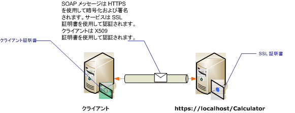

# <a name="transport-security-with-certificate-authentication"></a>トランスポート セキュリティと証明書認証
このトピックでは、トランスポート セキュリティを使用する場合にサーバーとクライアントの認証に X.509 証明書を使用する方法について説明します。 X.509 証明書の詳細については、「[X.509 Public Key Certificates](https://msdn.microsoft.com/library/bb540819\(VS.85\).aspx)」(X.509 公開キー証明書) を参照してください。 証明書のサードパーティ発行元は、多くの場合、証明機関証明書を発行する必要があります。 Windows サーバー ドメインでは、そのドメインのクライアント コンピューターに対して証明書を発行する際に Active Directory 証明書サービスを使用できます。 詳細については、次を参照してください。 [Windows 2008 R2 の証明書サービス](https://go.microsoft.com/fwlink/?LinkID=209949&clcid=0x409)します。 このシナリオでは、Secure Sockets Layer (SSL) を使用して構成されたインターネット インフォメーション サービス (IIS) でサービスをホストします。 サービスは、クライアントがサーバーの ID を確認するための SSL (X.509) 証明書を使用して構成されます。 クライアントも、サービスがクライアントの ID を確認するための X.509 証明書を使用して構成されます。 サーバーの証明書はクライアントによって信頼されている必要があり、クライアントの証明書はサーバーによって信頼されている必要があります。 サービスとクライアントが互いの ID を確認する方法の実際のしくみについては、このトピックでは説明しません。 詳細については、次を参照してください。 [Wikipedia のデジタル署名](https://go.microsoft.com/fwlink/?LinkId=253157)します。  
  
 このシナリオでは、次の図に示すような要求/応答のメッセージ パターンを実装します。  
  
   
  
 サービスで証明書の使用に関する詳細については、次を参照してください。 [Working with Certificates](../../../../docs/framework/wcf/feature-details/working-with-certificates.md)と[方法: SSL 証明書でポートを構成](../../../../docs/framework/wcf/feature-details/how-to-configure-a-port-with-an-ssl-certificate.md)します。 このシナリオのさまざまな特性を次の表に示します。  
  
|特徴|説明|  
|--------------------|-----------------|  
|セキュリティ モード|Transport|  
|相互運用性|既存の Web サービス クライアントおよびサービスとの相互運用性|  
|認証 (サーバー)<br /><br /> 認証 (クライアント)|○ (SSL 証明書を使用)<br /><br /> ○ (X.509 証明書を使用)|  
|データの整合性|はい|  
|データの機密性|はい|  
|Transport|HTTPS|  
|バインド|<xref:System.ServiceModel.WSHttpBinding>|  
  
## <a name="configure-the-service"></a>サービスの構成  
 このシナリオのサービスは IIS でホストされるので、web.config ファイルを使用して構成します。 次の web.config は、トランスポート セキュリティと X.509 クライアント資格情報を使用するように <xref:System.ServiceModel.WSHttpBinding> を構成する方法を示しています。  
  
```xml  
<configuration>  
  <system.serviceModel>  
    <protocolMapping>  
      <add scheme="https" binding="wsHttpBinding" />  
    </protocolMapping>  
    <bindings>  
      <wsHttpBinding>  
        <!-- configure wsHttp binding with Transport security mode and clientCredentialType as Certificate -->  
        <binding>  
          <security mode="Transport">  
            <transport clientCredentialType="Certificate"/>              
          </security>  
        </binding>  
      </wsHttpBinding>  
    </bindings>  
    <!--For debugging purposes set the includeExceptionDetailInFaults attribute to true-->  
    <behaviors>  
      <serviceBehaviors>  
        <behavior>            
           <serviceDebug includeExceptionDetailInFaults="True" />  
        </behavior>  
      </serviceBehaviors>  
    </behaviors>  
  </system.serviceModel>  
</configuration>  
```  
  
## <a name="configure-the-client"></a>クライアントの構成  
 クライアントはコードまたは app.config ファイルで構成できます。 次の例は、クライアントをコードで構成する方法を示しています。  
  
```vb  
// Create the binding.  
WSHttpBinding myBinding = new WSHttpBinding();  
myBinding.Security.Mode = SecurityMode.Transport;  
myBinding.Security.Transport.ClientCredentialType =  
   HttpClientCredentialType.Certificate;  
  
// Create the endpoint address. Note that the machine name   
// must match the subject or DNS field of the X.509 certificate  
// used to authenticate the service.   
EndpointAddress ea = new  
   EndpointAddress("https://localhost/CalculatorService/service.svc");  
  
// Create the client. The code for the calculator   
// client is not shown here. See the sample applications  
// for examples of the calculator code.  
CalculatorClient cc =  
   new CalculatorClient(myBinding, ea);  
  
// The client must specify a certificate trusted by the server.  
cc.ClientCredentials.ClientCertificate.SetCertificate(  
    StoreLocation.CurrentUser,  
    StoreName.My,  
    X509FindType.FindBySubjectName,  
    "contoso.com");  
  
// Begin using the client.  
Console.WriteLine(cc.Add(100, 1111));  
//...  
cc.Close();  
```  
  
 また、次の例のように App.config ファイルでクライアントを構成することもできます。  
  
```xml  
<configuration>  
  <system.serviceModel>  
    <client>  
      <!-- this endpoint has an https: address -->  
      <endpoint address=" https://localhost/CalculatorService/service.svc "   
                behaviorConfiguration="endpointCredentialBehavior"  
                binding="wsHttpBinding"   
                bindingConfiguration="Binding1"   
                contract="Microsoft.Samples.TransportSecurity.ICalculator"/>  
    </client>  
    <behaviors>  
      <endpointBehaviors>  
        <behavior name="endpointCredentialBehavior">  
          <clientCredentials>  
            <clientCertificate findValue="contoso.com"  
                               storeLocation="CurrentUser"  
                               storeName="My"  
                               x509FindType="FindBySubjectName" />  
          </clientCredentials>  
        </behavior>  
      </endpointBehaviors>  
    </behaviors>  
    <bindings>  
      <wsHttpBinding>  
        <!-- configure wsHttpbinding with Transport security mode  
                   and clientCredentialType as Certificate -->  
        <binding name="Binding1">  
          <security mode="Transport">  
            <transport clientCredentialType="Certificate"/>  
          </security>  
        </binding>  
      </wsHttpBinding>  
    </bindings>  
  </system.serviceModel>  
  
<startup><supportedRuntime version="v4.0" sku=".NETFramework,Version=v4.0"/></startup></configuration>  
```  
  
## <a name="see-also"></a>関連項目  
 [セキュリティの概要](../../../../docs/framework/wcf/feature-details/security-overview.md)  
 [Windows Server App Fabric のセキュリティ モデル](https://go.microsoft.com/fwlink/?LinkID=201279&clcid=0x409)
