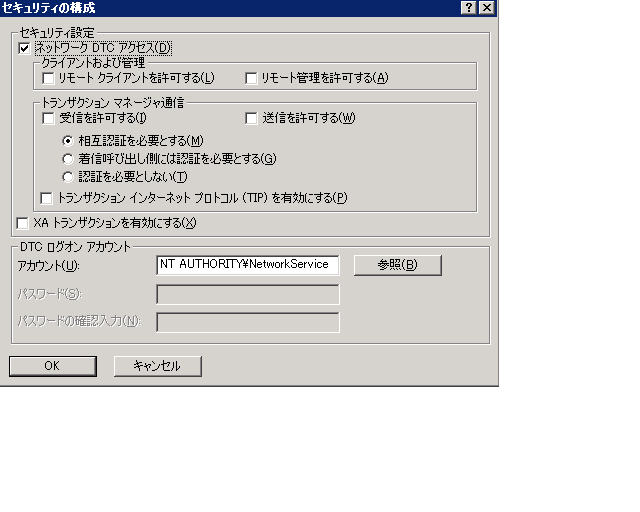

# キューに置かれたメッセージングのトラブルシューティング
ここでは、[!INCLUDE[indigo1](../../../../includes/indigo1-md.md)] でのキューの使用に関する一般的な質問とトラブルシューティング ヘルプについて説明します。  
  
## 一般的な質問  
 **Q:** [!INCLUDE[indigo2](../../../../includes/indigo2-md.md)] Beta 1 を使用しているときに MSMQ 修正プログラムをインストールしました。この修正プログラムを削除する必要がありますか。  
  
 **A:** 必要があります。この修正プログラムのサポートは終了しています。[!INCLUDE[indigo2](../../../../includes/indigo2-md.md)] は、現在、MSMQ で正常に動作し、修正プログラムは不要です。  
  
 **Q:** MSMQ 用のバインディングには、<xref:System.ServiceModel.NetMsmqBinding> と <xref:System.ServiceModel.MsmqIntegration.MsmqIntegrationBinding> の 2 つがあります。それぞれの用途を教えてください。  
  
 **A:** <xref:System.ServiceModel.NetMsmqBinding> を使用するのは、2 つの [!INCLUDE[indigo2](../../../../includes/indigo2-md.md)] アプリケーション間でのキューを使用した通信にトランスポートとして MSMQ を使用する場合です。また、<xref:System.ServiceModel.MsmqIntegration.MsmqIntegrationBinding> を使用するのは、既存の MSMQ アプリケーションを使用して、新しい [!INCLUDE[indigo2](../../../../includes/indigo2-md.md)] アプリケーションと通信する場合です。  
  
 **Q:** <xref:System.ServiceModel.NetMsmqBinding> バインディングと `MsmqIntegration` バインディングを使用するには、MSMQ をアップグレードする必要がありますか。  
  
 **A:** 必要ありません。これらは共に [!INCLUDE[wxp](../../../../includes/wxp-md.md)] および [!INCLUDE[ws2003](../../../../includes/ws2003-md.md)] 上の MSMQ 3.0 で使用できます。[!INCLUDE[wv](../../../../includes/wv-md.md)] で MSMQ 4.0 にアップグレードすると、バインディングの特定の機能が使用可能になります。  
  
 **Q:** <xref:System.ServiceModel.NetMsmqBinding> バインディングと <xref:System.ServiceModel.MsmqIntegration.MsmqIntegrationBinding> バインディングの機能のうち、MSMQ 4.0 では使用できるが MSMQ 3.0 では使用できないのはどれですか。  
  
 **A:** MSMQ 4.0 では使用できても MSMQ 3.0 では使用できない機能は次のとおりです。  
  
-   カスタム配信不能キューは、MSMQ 4.0 でのみサポートされます。  
  
-   MSMQ 3.0 と 4.0 では、有害メッセージの処理方法が異なります。  
  
-   MSMQ 4.0 のみが、リモート トランザクション読み取りをサポートします。  
  
 [!INCLUDE[crdefault](../../../../includes/crdefault-md.md)] [Windows Vista、Windows Server 2003、および Windows XP におけるキュー機能の相違点](../../../../docs/framework/wcf/feature-details/diff-in-queue-in-vista-server-2003-windows-xp.md).  
  
 **Q:** キューを使用する通信の一方の側で MSMQ 3.0 を使用し、もう一方の側で MSMQ 4.0 を使用できますか。  
  
 **A:** 使用できます。  
  
 **Q:** 既存の MSMQ アプリケーションを新しい [!INCLUDE[indigo2](../../../../includes/indigo2-md.md)] クライアントまたはサーバーと統合しようと考えています。使用している MSMQ インフラストラクチャの両方の側をアップグレードする必要がありますか。  
  
 **A:** 必要ありません。どちら側も MSMQ 4.0 にアップグレードする必要はありません。  
  
## トラブルシューティング  
 ここでは、一般的なトラブルシューティングの問題に対する解答を示します。既知の制限である一部の問題は、リリース ノートにも記載されています。  
  
 **Q:** プライベート キューを使用しようとすると、次の例外が表示されます。`System.InvalidOperationException` : この URL は無効です。キューの URL に '$' 文字を使用することはできません。net.msmq:\/\/machine\/private\/queueName の構文を使用して、プライベート キューをアドレス指定してください。  
  
 **A:** 構成とコードでキュー URI \(Uniform Resource Identifier\) を確認してください。URI では、"$" 文字を使用できません。たとえば、OrdersQueue という名前のプライベート キューのアドレスを指定する場合は、URI を net.msmq:\/\/localhost\/private\/ordersQueue と指定してください。  
  
 **Q:** キューに置かれたアプリケーションで `ServiceHost.Open()` を呼び出すと次の例外がスローされます。`System.ArgumentException` : ベース アドレスに URI クエリ文字列を含めることはできません。その理由を教えてください。  
  
 **A:** 構成とコードでキュー URI を確認してください。MSMQ のキューでは '?' 文字の使用がサポートされていますが、URI はこれを文字列クエリの開始と解釈します。この問題を回避するには、'?' 文字を含まないキュー名を使用してください。  
  
 **Q:** 送信は成功したのですが、受信側でサービス操作が呼び出されません。その理由を教えてください。  
  
 **A:** 理由を特定するには、次のチェック リストを検討してください。  
  
-   トランザクション キューの要件と指定済みの保証が適合することを確認します。次の原則に注意してください。  
  
    -   "1 回限りの" 配信の保証 \(<xref:System.ServiceModel.MsmqBindingBase.ExactlyOnce%2A> \= `true`\) 付きの永続的なメッセージ \(データグラムとセッション\) は、トランザクション キューにのみ送信できます。  
  
    -   "1 回限りの" 配信の保証付きのセッションのみを送信できます。  
  
    -   セッションでトランザクション キューからメッセージを受け取るには、1 つのトランザクションが必要です。  
  
    -   保証なし \(<xref:System.ServiceModel.MsmqBindingBase.ExactlyOnce%2A> \= `false`\) の一時的なメッセージまたは永続的なメッセージ \(ダイアグラムのみ\) は、非トランザクション キューにのみ送受信できます。  
  
-   配信不能キューを確認します。このキューにメッセージが置かれている場合は、メッセージが配信されなかった理由を特定してください。  
  
-   送信キューを確認して、接続性またはアドレス指定の問題を特定します。  
  
 **Q:** カスタム配信不能キューを指定したのですが、送信元アプリケーションを起動すると、カスタム配信不能キューが見つからない、または送信元アプリケーションにカスタム配信不能キューへのアクセス許可がないという例外が表示されます。なぜ、こうなるのでしょうか。  
  
 **A:** カスタム配信不能キューの URI には、先頭のセグメントに "localhost" またはコンピューター名を含める必要があります。たとえば、net.msmq:\/\/localhost\/private\/myAppdead\-letter queue のようにします。  
  
 **Q:** カスタム配信不能キューを常に定義する必要がありますか。それとも既定の配信不能キューがあるのですか。  
  
 **A:** 保証が "1 回限り" \(<xref:System.ServiceModel.MsmqBindingBase.ExactlyOnce%2A> \= `true`\) の場合、およびカスタム配信不能キューを指定していない場合は、システム全体のトランザクション配信不能キューが既定になります。  
  
 保証なし \(<xref:System.ServiceModel.MsmqBindingBase.ExactlyOnce%2A> \= `false`\) の場合、既定は配信不能キュー機能なしです。  
  
 **Q:** サービスが、SvcHost.Open で "EndpointListener が ListenerFactory の要件を満たすことができません" という内容のメッセージをスローします。その理由を教えてください。  
  
 A.サービス コントラクトを確認してください。"IsOneWay\=`true`" をすべてのサービス操作に配置するのを忘れた可能性があります。キューは、一方向のサービス操作しかサポートしません。  
  
 **Q:** キューにメッセージが置かれているのにサービス操作が呼び出されません。何が問題なのでしょうか。  
  
 **A:** サービス ホストがエラーになっているかどうかを確認してください。確認するには、トレースを調べるか、`IErrorHandler` を実装します。既定では、有害メッセージが検出された場合、サービス ホストはエラーになります。  
  
 **Q:** キューにメッセージが格納されているのに、Web ホスト型のキューを使用するサービスがアクティブになりません。その理由を教えてください。  
  
 **A:** 最も一般的な理由はアクセス許可です。  
  
1.  `NetMsmqActivator` プロセスが実行され、そのキューで、`NetMsmqActivator` の ID に読み取りおよびシーク アクセス許可が割り当てられていることを確認してください。  
  
2.  `NetMsmqActivator` がリモート コンピューター上のキューを監視している場合は、`NetMsmqActivator` が制限付きトークンの下で実行されていないことを確認してください。無制限のトークンを使用して `NetMsmqActivator` を実行するには、以下を実行します。  
  
    ```  
    sc sidtype NetMsmqActivator unrestricted  
    ```  
  
 セキュリティ関連以外の Web ホストの問題については、「[キューに置かれたアプリケーションの Web ホスト](../../../../docs/framework/wcf/feature-details/web-hosting-a-queued-application.md)」を参照してください。  
  
 **Q:** 最も簡単にセッションにアクセスする方法を教えてください。  
  
 **A:** セッションの最後のメッセージに対応する操作で AutoComplete\=`true` を設定し、残りのすべてのサービス操作で AutoComplete\=`false` を設定します。  
  
 **Q:** MSMQ に関する一般的な質問の解答はどこで見つけられますか。  
  
 **A:** MSMQ [!INCLUDE[crabout](../../../../includes/crabout-md.md)]、「[Microsoft Message Queuing](http://go.microsoft.com/fwlink/?LinkId=87810)」を参照してください。  
  
 **Q:** キューを使用するセッション メッセージとキューを使用するデータグラム メッセージの両方を格納するキューから読み取るときに、サービスが `ProtocolException` をスローするのはなぜですか。  
  
 **A:** キューを使用するセッション メッセージとキューを使用するデータグラム メッセージは、それぞれ構成する方法が基本的に異なります。このため、キューを使用するセッション メッセージを読み取ろうとするサービスは、キューを使用するデータグラム メッセージを受信できず、キューを使用するデータグラム メッセージを読み取ろうとするサービスは、セッション メッセージを受信できません。これら両方の種類のメッセージを同じキューから読み取ろうとすると、次の例外がスローされます。  
  
```  
System.ServiceModel.MsmqPoisonMessageException: The transport channel detected a poison message. This occurred because the message exceeded the maximum number of delivery attempts or because the channel detected a fundamental problem with the message. The inner exception may contain additional information.   
---> System.ServiceModel.ProtocolException: An incoming MSMQ message contained invalid or unexpected .NET Message Framing information in its body. The message cannot be received. Ensure that the sender is using a compatible service contract with a matching SessionMode.  
```  
  
 アプリケーションが同じコンピューターからキューを使用するセッション メッセージとキューを使用するデータグラム メッセージの両方を送信する場合は、任意のカスタム配信不能キューだけでなくシステム配信不能キューで特にこの問題が発生する可能性があります。メッセージを正常に送信できない場合、メッセージは配信不能キューに移されます。このような場合は、セッション メッセージとデータグラム メッセージの両方が配信不能キューに置かれる可能性があります。実行時にキューから読み取るときに両方の種類のメッセージを分離することはできません。そのため、アプリケーションでは、キューを使用するセッション メッセージとキューを使用するデータグラム メッセージの両方を同じコンピューターから送信しないでください。  
  
### MSMQ 統合 : 固有のトラブルシューティング  
 **Q:** メッセージを送信したり、サービス ホストを開いたりすると、スキームが不正であるというエラー メッセージが表示されます。その理由を教えてください。  
  
 **A:** MSMQ 統合バインディングを使用するときは、msmq.formatname スキームを使用する必要があります。たとえば、msmq.formatname:DIRECT\=OS:.\\private$\\OrdersQueue などです。ただし、カスタム配信不能キューを指定するときは、net.msmq スキームを使用する必要があります。  
  
 **Q:** 公開または専用の形式名を使用して、[!INCLUDE[wv](../../../../includes/wv-md.md)] 上のサービス ホストを開くと、エラーが発生します。その理由を教えてください。  
  
 **A:** [!INCLUDE[wv](../../../../includes/wv-md.md)] 上の [!INCLUDE[indigo2](../../../../includes/indigo2-md.md)] 統合チャネルは、メイン アプリケーション キューの有害メッセージ処理用のサブキューを開くことができるかどうかを確認します。サブキューの名前は、リスナーに渡される msmq.formatname URI から派生します。MSMQ でのサブキュー名は、直接形式名に限定されます。そのためにエラーが発生します。キュー URI を直接形式名に変更してください。  
  
 **Q:** MSMQ アプリケーションからメッセージを受信すると、メッセージはキューに置かれ、受信側の [!INCLUDE[indigo2](../../../../includes/indigo2-md.md)] アプリケーションによって読み取られません。その理由を教えてください。  
  
 **A:** メッセージに本文があるかどうか確認してください。メッセージに本文がない場合、MSMQ 統合チャネルはメッセージを無視します。例外を通知する `IErrorHandler` を実装し、トレースを確認してください。  
  
### セキュリティ関連のトラブルシューティング  
 **Q:** ワークグループ モードで既定のバインディングを使用するサンプルを実行すると、メッセージは送信されるように思われるのですが、受信側で受信されません。  
  
 **A:** 既定では、メッセージは、Active Directory ディレクトリ サービスを必要とする MSMQ の内部証明書を使用して署名されます。ワークグループ モードでは、Active Directory が使用できないため、メッセージに署名できません。そのため、メッセージは配信不能キューに置かれ、"署名が正しくありません" などのエラーの原因が示されます。  
  
 この問題を回避するには、セキュリティを無効にします。セキュリティを無効にするには、ワークグループ モードで動作するように <xref:System.ServiceModel.NetMsmqSecurity.Mode%2A> \= <xref:System.ServiceModel.NetMsmqSecurityMode> を設定します。  
  
 また、<xref:System.ServiceModel.NetMsmqSecurity.Transport%2A> プロパティから <xref:System.ServiceModel.MsmqTransportSecurity> を取得し、それを <xref:System.ServiceModel.MsmqAuthenticationMode> に設定して、クライアント証明書を設定する方法もあります。  
  
 さらに、MSMQ と Active Directory 統合をインストールして回避することもできます。  
  
 **Q:** Active Directory で既定のバインディング \(トランスポート セキュリティが有効\) を使用してメッセージをキューに送信すると、"内部証明書が見つからない" という内容のメッセージが表示されます。これを修復する方法を教えてください。  
  
 **A:** これは、送信側の Active Directory 内の証明書を更新する必要があることを意味します。証明書を更新するには、**\[コントロール パネル\]**、**\[管理ツール\]**、**\[コンピューターの管理\]** の順に開き、**\[MSMQ\]** を右クリックして **\[プロパティ\]** を選択します。**\[ユーザー証明書\]** タブをクリックし、**\[更新\]** をクリックします。  
  
 **Q:** <xref:System.ServiceModel.MsmqAuthenticationMode> を使用してメッセージを送信するときに、使用する証明書を指定すると、"無効な証明書" というメッセージが表示されます。これを修復する方法を教えてください。  
  
 **A:** 証明書モードでは、ローカル コンピューターの証明書ストアを使用できません。証明書スナップインを使用して、コンピューターの証明書ストアから現在のユーザー ストアに証明書をコピーする必要があります。証明書スナップインを開くには、以下を実行します。  
  
1.  **\[スタート\]** ボタンをクリックし、**\[ファイル名を指定して実行\]** を選択し、「`mmc`」と入力して、**\[OK\]** をクリックします。  
  
2.  **\[Microsoft 管理コンソール\]** の **\[ファイル\]** メニューを開き、**\[スナップインの追加と削除\]** を選択します。  
  
3.  **\[スナップインの追加と削除\]** ダイアログ ボックスで、**\[追加\]** をクリックします。  
  
4.  **\[スタンドアロン スナップインの追加\]** ダイアログ ボックスで証明書を選択し、**\[追加\]** をクリックします。  
  
5.  **\[証明書スナップイン\]** ダイアログ ボックスで、**\[ユーザー アカウント\]** を選択し、**\[完了\]** をクリックします。  
  
6.  次に、前の手順に従って 2 番目の証明書スナップインを追加しますが、今回は、**\[コンピューター アカウント\]** を選択して **\[次へ\]** をクリックします。  
  
7.  **\[ローカル コンピューター\]** を選択し、**\[完了\]** をクリックします。これで、コンピューターの証明書ストアから現在のユーザー ストアに証明書をドラッグ アンド ドロップできます。  
  
 **Q:** ワークグループモードで、サービスが別のコンピューター上のキューから読み取るときに "access denied" 例外が発生します。  
  
 **A:** ワークグループ モードでリモート アプリケーションがキューへのアクセスを取得するには、キューへのアクセス許可がアプリケーションに必要です。キューのアクセス制御リスト \(ACL\) に "匿名ログイン" を追加して、読み取りアクセス許可を割り当ててください。  
  
 **Q:** ネットワーク サービス クライアント \(またはドメイン アカウントを持たない任意のクライアント\) がキューを使用するメッセージを送信すると、証明書が無効であるというエラー メッセージが表示され、送信できません。これを修復する方法を教えてください。  
  
 **A:** バインディング構成を確認してください。既定のバインディングでは、メッセージに署名するために MSMQ トランスポート セキュリティを有効にしています。これを無効にしてください。  
  
### リモート トランザクション受信  
 **Q:** コンピューター A にキューがあるときに、コンピューター B のキューからメッセージを読み取る [!INCLUDE[indigo2](../../../../includes/indigo2-md.md)] サービスを実行すると \(リモート トランザクション受信シナリオ\)、キューからメッセージが読み取られません。トレース情報には、"Transaction cannot be imported." というメッセージが示され、受信に失敗したことがわかります。この問題を解決するには、どうすればいいですか。  
  
 **A:** これには、次の理由が考えられます。  
  
-   ドメイン モードの場合、リモート トランザクション受信には、Microsoft 分散トランザクション コーディネーター \(MSDTC\) ネットワーク アクセスが必要です。これは、**\[Windows コンポーネントの追加と削除\]** を使用して有効にできます。  
  
       
  
-   トランザクション マネージャーと通信するための認証モードを確認します。ワークグループ モードの場合は、\[認証を必要としない\] を選択する必要があります。ドメイン モードの場合は、\[相互認証を必要とする\] を選択する必要があります。  
  
       
  
-   MSDTC が **\[インターネット接続ファイアウォール\]** 設定の例外の一覧に含まれていることを確認します。  
  
-   [!INCLUDE[wv](../../../../includes/wv-md.md)] を使用していることを確認します。[!INCLUDE[wv](../../../../includes/wv-md.md)] 上の MSMQ は、リモート トランザクション読み取りをサポートします。以前の Windows リリース上の MSMQ は、リモート トランザクション読み取りをサポートしません。  
  
 **Q:** キューから読み取るサービスが、Web ホストなどでのネットワーク サービスであるときにキューから読み取ると、アクセス拒否例外が発生するのはなぜですか。  
  
 **A:** ネットワーク サービス読み取りアクセスをキュー ACL に追加して、ネットワーク サービスがキューから読み取れるようにしてください。  
  
 **Q:** MSMQ アクティベーション サービスを使用して、リモート コンピューター上のキュー内のメッセージに基づいてアプリケーションをアクティブ化することは可能ですか。  
  
 **A:** 可能です。これには、ネットワーク サービスとして動作するように MSMQ アクティベーション サービスを構成し、リモート コンピューター上のキューへのネットワーク サービス アクセスを追加する必要があります。  
  
## ReceiveContext を有効にしたカスタム MSMQ バインディングの使用  
 <xref:System.ServiceModel.Channels.ReceiveContext> を有効にしてカスタム MSMQ バインディングを使用すると、ネイティブの MSMQ が非同期の <xref:System.ServiceModel.Channels.ReceiveContext> 受信の I\/O 完了をサポートしないために、着信メッセージの処理にスレッド プール内のスレッドが使用されます。これは、このようなメッセージの処理に <xref:System.ServiceModel.Channels.ReceiveContext> の内部トランザクションが使用され、MSMQ が非同期処理をサポートしないためです。この問題を回避するには、<xref:System.ServiceModel.Description.SynchronousReceiveBehavior> をエンドポイントに追加して同期処理を強制するか、<xref:System.ServiceModel.Description.DispatcherSynchronizationBehavior.MaxPendingReceives%2A> を 1 に設定します。