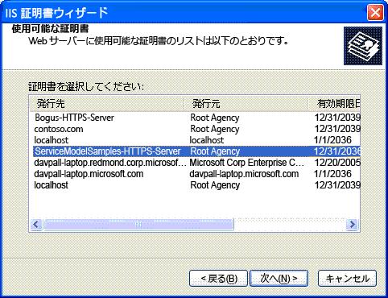

# インターネット インフォメーション サービス (IIS) サーバー証明書インストール手順
インターネット インフォメーション サービス \(IIS\) と安全に通信するこのサンプルを実行するには、サーバー証明書を作成してインストールする必要があります。  
  
## 手順 1.証明書の作成  
 使用しているコンピューター用の証明書を作成するには、管理特権を使用して Visual Studio コマンド プロンプトを開き、Setup.bat を実行します。Setup.bat は IIS と安全に通信する各サンプルに含まれています。このバッチ ファイルを実行する前に、Makecert.exe を含むフォルダがパスに含まれていることを確認します。Setup.bat で証明書の作成に使用されるコマンドは、次のとおりです。  
  
```  
makecert -sr LocalMachine -ss My -n CN=ServiceModelSamples-HTTPS-Server -sky exchange -sk ServiceModelSamples-HTTPS-Key  
```  
  
## 手順 2.証明書のインストール  
 先ほど作成した証明書をインストールするために必要な手順は、使用している IIS のバージョンによって異なります。  
  
#### IIS 5.1 \(Windows XP\) および IIS 6.0 \(Windows Server 2003\) に証明書をインストールするには  
  
1.  インターネット インフォメーション サービス マネージャ MMC スナップインを開きます。  
  
2.  \[既定の Web サイト\] を右クリックし、**\[プロパティ\]** をクリックします。  
  
3.  **\[ディレクトリ セキュリティ\]** タブをクリックします。  
  
4.  **\[サーバー証明書\]** ボタンをクリックします。Web サーバー証明書ウィザードが起動します。  
  
5.  ウィザードの指示に従います。証明書を割り当てるオプションを選択します。表示される証明書の一覧から ServiceModelSamples\-HTTPS\-Server 証明書を選択します。  
  
       
  
6.  サービスへのアクセスをテストします。ブラウザに HTTPS アドレス「https:\/\/localhost\/servicemodelsamples\/service.svc」を入力します。  
  
#### Httpcfg.exe であらかじめ SSL が構成されている場合  
  
1.  Makecert.exe を使用 \(または Setup.bat を実行\) して、サーバー証明書を作成します。  
  
2.  IIS マネージャを実行し、前の手順に従って証明書をインストールします。  
  
3.  クライアント プログラムに次のコード行を追加します。  
  
> [!IMPORTANT]
>  このコードが必要になるのは、Makecert.exe によって作成された証明書などをテストする場合のみです。製品版のコードには、お勧めしません。  
  
```  
PermissiveCertificatePolicy.Enact("CN=ServiceModelSamples-HTTPS-Server");  
```  
  
#### IIS 7.0 \(Windows Vista および Windows Server 2008\) に証明書をインストールするには  
  
1.  **\[スタート\]** メニューの **\[ファイル名を指定して実行\]** をクリックし、「**inetmgr**」と入力してインターネット インフォメーション サービス \(IIS\) MMC スナップインを開きます。  
  
2.  **\[既定の Web サイト\]** を右クリックし、**\[バインディングの編集...\]** をクリックします。  
  
3.  **\[Web サイト バインド\]** ダイアログ ボックスで、**\[追加\]** をクリックします。  
  
4.  **\[種類\]** ボックスの一覧から **\[HTTPS\]** を選択します。  
  
5.  **\[SSL 証明書\]** ボックスの一覧から **\[ServiceModelSamples\-HTTPS\-Server\]** を選択して、**\[OK\]** をクリックします。  
  
6.  サービスへのアクセスをテストします。ブラウザに HTTPS アドレス「https:\/\/localhost\/servicemodelsamples\/service.svc」を入力します。  
  
> [!NOTE]
>  先ほどインストールしたテスト証明書は信頼された証明書ではないので、この証明書でセキュリティ保護されたローカル Web アドレスを参照した場合、Internet Explorer のセキュリティ警告がさらに発生する場合があります。  
  
## 証明書の削除  
  
-   前に説明したようにインターネット インフォメーション サービス マネージャーを使用しますが、証明書またはバインディングを追加するのではなく削除します。  
  
-   次のコマンドを使用して、コンピューターの証明書を削除します。  
  
    ```  
    httpcfg delete ssl -i 0.0.0.0:443  
    ```