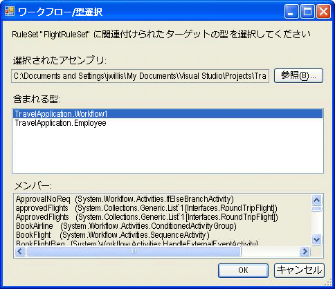

# <a name="external-ruleset-toolkit"></a>External RuleSet Toolkit

通常、ワークフロー アプリケーション内でルールが使用される場合は、そのルールはアセンブリの一部です。 場合によっては、ワークフロー アセンブリのリビルドや配置を行わずに RuleSet を更新できるように、RuleSet をアセンブリとは別に管理することもあります。 このサンプルでは、RuleSet をデータベース内で管理および編集し、実行時にそれらの RuleSet にワークフローからアクセスできるようにしています。 その結果、実行中のワークフロー インスタンスに、RuleSet への変更を自動的に組み込むことができます。

この External RuleSet Toolkit サンプルには、RuleSet のバージョンをデータベース内で管理および編集するために使用できる Windows フォーム ベースのツールが含まれています。 また、このようなルールを実行するためのアクティビティとホスト サービスも含まれます。

> [!NOTE]
> このサンプルが必要です[Microsoft SQL Server](https://go.microsoft.com/fwlink/?LinkId=96181)します。

Visual Studio には、Windows Workflow Foundation (WF) の一部として RuleSet エディタが用意されています。 このエディタは、ワークフロー内の `Policy` アクティビティをダブルクリックすると起動できます。これにより、定義済みの RuleSet オブジェクトが、ワークフローに関連付けられている .rules ファイルにシリアル化されます (`Policy` アクティビティにより、ワークフローに対して RuleSet インスタンスが実行されます)。 .rules ファイルは、ワークフロー プロジェクトをビルドするときに、リソースとしてアセンブリにコンパイルされます。

このサンプルは、次のコンポーネントで構成されています。

- RuleSet のバージョンをデータベース内で編集および管理するために使用できる RuleSet グラフィカル ユーザー インターフェイス ツール。

- ホスト アプリケーション上で構成され、データベースから RuleSet にアクセスする RuleSet サービス。

- RuleSet サービスから RuleSet を要求し、その RuleSet をワークフローに対して実行する `ExternalPolicy` アクティビティ。

これらのコンポーネントの相互関係を図 1 に示します。 図の後で各コンポーネントについて説明します。


図 1: サンプルの概要

> [!IMPORTANT]
> サンプルは、既にコンピューターにインストールされている場合があります。 続行する前に、次の (既定の) ディレクトリを確認してください。
>
> `<InstallDrive>:\WF_WCF_Samples`
>
> このディレクトリが存在しない場合に移動[Windows Communication Foundation (WCF) と .NET Framework 4 向けの Windows Workflow Foundation (WF) サンプル](https://go.microsoft.com/fwlink/?LinkId=150780)すべて Windows Communication Foundation (WCF) をダウンロードして[!INCLUDE[wf1](../../../../includes/wf1-md.md)]サンプル。 このサンプルは、次のディレクトリに格納されます。
>
> `<InstallDrive>:\WF_WCF_Samples\WF\Scenario\ExternalRuleSetToolKit`

## <a name="ruleset-tool"></a>RuleSet ツール

RuleSet ツールのスクリーンショットを図 2 に示します。 **ルール ストア**] メニューの [使用可能な Ruleset をデータベースから読み込み、変更済みの Ruleset をストアに保存することができます。 RuleSet データベースのデータベース接続文字列は、アプリケーション構成ファイルで指定されます。 ツールを起動すると、構成済みのデータベースから自動的に RuleSet が読み込まれます。


図 2: RuleSet ブラウザー

RuleSet ツールでは、RuleSet にメジャー バージョン番号とマイナー バージョン番号を割り当てます。これにより、複数のバージョンを同時に管理および保存できます (ツールには、バージョン管理機能以外に、ロックなどの構成管理機能は用意されていません)。 このツールを使用して、新しいバージョンの RuleSet を作成したり、既存のバージョンを削除したりできます。 クリックすると**新規**ツールは、新しい RuleSet 名が作成され、バージョン 1.0 が適用されます。 バージョンをコピーすると、含まれているルールを含め、選択した RuleSet バージョンのコピーが作成されて、新しい一意のバージョン番号が割り当てられます。 これらのバージョン番号は、既存の RuleSet のバージョン番号を基に割り当てられます。 RuleSet 名とバージョン番号は、フォーム上の対応するフィールドを使用して変更できます。

クリックすると**規則の編集**図 3 に示すように、RuleSet editor を起動します。


図 3:RuleSet エディター

これは、Windows Workflow Foundation の Visual Studio アドインの一部であるエディタ ダイアログのホストを変更します。 そのため、Intellisense サポートを含めて、同等の機能が用意されています。 ツール内で RuleSet に関連付けられている (ワークフロー) などの対象の型に対して作成されるため、ルールクリックすると**参照**ツールのメイン ダイアログ ボックスで、**ワークフロー/型セレクター**図 4 に示すダイアログが表示されます。



図 4: ワークフロー/型セレクター

使用することができます、**ワークフロー/型セレクター**アセンブリとそのアセンブリ内の特定の型を指定するためのダイアログ。 ルールの作成 (および実行) は、この型に対して行います。 多くの場合、対象となる型は、ワークフロー型または他の任意のアクティビティ型です。 ただし、RuleSet は任意の .NET 型に対して実行できます。

アセンブリ ファイルと型へのパス`name are stored with the`データベースで RuleSet をできるように、RuleSet をデータベースから取得するときにツールを読み込もうと自動的に対象の型。

クリックすると**OK**で、**ワークフロー/型セレクター**ダイアログ ボックスで、対象の型が、ルールによって参照されるすべてのメンバーであることを確認する RuleSet に照らして、選択した型を検証します。 エラーに表示されます、**検証エラー**ダイアログ (図 5 を参照してください)。 エラーに関係なく変更を続行するかをクリックすることもできます**キャンセル**します。 **ツール**ツールのメイン ダイアログで、メニューをクリックできます**検証**対象アクティビティに対して RuleSet のバージョンを再検証します。


図 5:検証エラー

**データ**メニュー、ツールには、インポートおよび Ruleset をエクスポートすることができます。 クリックすると**インポート**ファイルの選択ダイアログが表示されたら、.rules ファイルを選択することができます。 これは、Visual Studio で最初に作成されたファイルではない可能性がありますもかまいません。 .rules ファイルは、条件のコレクションと RuleSet のコレクションを含む、シリアル化された `RuleDefinitions` インスタンスを保持します。 ツールは、条件のコレクションを使用しませんを使用して、 `RuleDefinitions` .rules 形式、Visual Studio 環境との対話を許可します。

.Rules ファイルを選択した後、 **RuleSet Selector**ダイアログでは、(図 6 参照) が表示されます。 このダイアログ ボックスを使用して、インポートするファイルから RuleSet を選択できます (既定では、すべての RuleSet が指定されます)。 WF プロジェクト内の RuleSet のバージョンはアセンブリのバージョンと同じであるため、.rules ファイル内の RuleSet にはバージョン番号がありません。 インポート処理中に、ツールを自動的に割り当てます (これは、インポートした後は変更できます) [次へ] の使用のメジャー バージョン番号。割り当てられたバージョン番号を確認することができます、 **RuleSet Selector**一覧。

ツールでは、インポートする RuleSet ごとに、RuleSet で使用されるメンバに基づいて、.rules ファイルの場所の下に bin\Debug フォルダー (存在する場合) から関連付けられている型が検索されます。 一致する型が複数見つかった場合は、.rules ファイル名と型名の対応関係に基づいて型が選択されます (たとえば、`Workflow1` 型は Workflow1.rules に対応します)。 対応関係が複数存在する場合は、型を選択するように求められます。 この自動識別機構が一致するアセンブリまたは型の検索に失敗したかどうかは、クリックすることができますをインポートした後**参照**ツールのメイン ダイアログに関連付けられている型に移動します。


図 6:ルールセット セレクター

クリックすると**データ エクスポート**、ツールのメイン メニューから、 **RuleSet Selector**ダイアログが再度表示されます、エクスポートする必要があるデータベースから Ruleset を指定します。 クリックすると**OK**、**ファイルを保存**ダイアログが表示されたら、エクスポートした .rules ファイルの場所と名前を指定できます。 .rules ファイルではバージョン情報が保持されないため、特定の RuleSet 名を持つ RuleSet バージョンを 1 つだけ選択することができます。

## <a name="policyfromservice-activity"></a>PolicyFromService アクティビティ

`PolicyFromService` アクティビティのコードは単純です。 このコードの動作は、WF で提供される `Policy` アクティビティによく似ていますが、.rules ファイルから対象の RuleSet を取得するのではなく、ホスト サービスを呼び出して RuleSet のインスタンスを取得します。 その後、ルートのワークフロー アクティビティ インスタンスに対して RuleSet を実行します。

ワークフロー内でこのアクティビティを使用するには、ワークフロー プロジェクトから `PolicyActivities` アセンブリおよび `RuleSetService` アセンブリへの参照を追加します。 ツールボックスにアクティビティを追加する方法については、このトピックの最後にある手順を参照してください。

ワークフロー内にアクティビティを配置したら、実行する RuleSet の名前を指定する必要があります。 この名前は、リテラル値として入力することも、他のアクティビティのワークフロー変数やプロパティにバインドすることもできます。 必要に応じて、実行する特定の RuleSet のバージョン番号を入力できます。 メジャー バージョン番号とマイナー バージョン番号を既定値の 0 のままにしておくと、データベース内の最新のバージョン番号が自動的にアクティビティに指定されます。

## <a name="ruleset-service"></a>ルールセット サービス

このサービスには、指定された RuleSet のバージョンをデータベースから取得し、呼び出し元のアクティビティに返す役割があります。 既に説明したように、`GetRuleSet` の呼び出しで渡されるメジャー バージョンとマイナー バージョンの値がどちらも 0 の場合は、最新のバージョンが取得されます。 現時点では、RuleSet の定義と RuleSet インスタンスはキャッシュされず、RuleSet のバージョンに "配置済み" というマークを付けて実行中の RuleSet と区別する機能もありません。

サービスからアクセスされるデータベースは、アプリケーション構成ファイルを使用してホストで構成する必要があります。

#### <a name="to-run-the-tool"></a>ツールを実行するには

1. ツールとサービスで使用される RuleSet テーブルを設定するフォルダには Setup.sql ファイルがあります。 Setup.cmd バッチ ファイルを実行して SQL Express 上に Rules データベースを作成して RuleSet テーブルを設定します。

2. このバッチ ファイルまたは Setup.sql を編集して、SQL Express を使用しないように指定した場合、または `Rules` 以外の名前のデータベースにテーブルを配置するように指定した場合は、RuleSet ツールのアプリケーション構成ファイルと `UsageSample` プロジェクトを同じ情報で編集する必要があります。

3. Setup.sql スクリプトを実行したら、`ExternalRuleSetToolkit` ソリューションをビルドし、その後 ExternalRuleSetTool プロジェクトから RuleSet ツールを起動できます。

4. `RuleSetToolkitUsageSample` のシーケンシャル ワークフロー コンソール アプリケーション ソリューションにはサンプル ワークフローが含まれています。 このワークフローは、`PolicyFromService` アクティビティ、および `orderValue` と `discount` の 2 つの変数で構成されており、対象の RuleSet はこれらに対して実行されます。

5. サンプルを使用するには `RuleSetToolkitUsageSample` ソリューションをビルドします。 RuleSet ツールのメイン メニューからクリックします**データ インポート**し、RuleSetToolkitUsageSample フォルダー内の DiscountRuleSet.rules ファイルをポイントします。 をクリックして、**ルール ストアの保存**メニュー オプションをインポートした RuleSet をデータベースに保存します。

6. 
  `PolicyActivities` アセンブリがサンプル ワークフロー プロジェクトから参照されているため、`PolicyFromService` アクティビティがワークフロー内に表示されます。 ただし、既定ではツールボックスに表示されません。 ツールボックスに追加するには、次の手順を実行します。

    - ツールボックスを右クリックして**アイテムの選択**(しばらくかかる場合があります)。

    - ときに、**ツールボックス アイテムの選択**ダイアログが表示されたら、**アクティビティ** タブ。

    - 参照、`PolicyActivities`内のアセンブリ、`ExternalRuleSetToolkit`ソリューションとクリック**オープン**。

    - いることを確認、`PolicyFromService`でアクティビティが選択されている、**ツールボックス アイテムの選択**ダイアログをクリック**OK**。

    - アクティビティがツールボックスに表示されます、 **RuleSetToolkitUsageSample Components**カテゴリ。

7. RuleSet サービスは、Program.cs 内の次のステートメントを使用して既にコンソール アプリケーション ホストで構成されています。

    ```csharp
    workflowRuntime.AddService(new RuleSetService());
    ```

8. 構成ファイルを使用して、ホストでこのサービスを構成することもできます。詳細については、SDK のドキュメントを参照してください。

9. アプリケーション構成ファイルがワークフロー プロジェクトに追加され、サービスが使用するデータベース接続文字列が指定されます。 この接続文字列は、RuleSet テーブルを含むデータベースを指す、RuleSet ツールが使用する接続文字列と同一である必要があります。

10. これで、`RuleSetToolkitUsageSample` プロジェクトを他のワークフロー コンソール アプリケーションと同様に実行できるようになります。 F5 キーまたは Visual Studio 内で ctrl キーを押しながら f5 キーを押すか、直接 RuleSetToolkitUsageSample.exe ファイルを実行します。

    > [!NOTE]
    > RuleSet ツールは使用方法サンプルのアセンブリを読み込んでいるため、使用方法サンプルを再コンパイルするには RuleSet ツールを閉じる必要があります。
