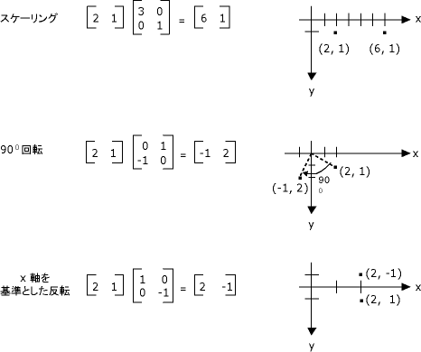

# 変換の行列表現
M × n マトリックスは、一連の数値の m 行と n 個の列に配置します。 次の図は、いくつかの行列を示します。  
  
   
  
 同じサイズの 2 つの行列を追加するには、個々 の要素を追加します。 次の図は、マトリックスの追加の 2 つの例を示します。  
  
   
  
 N × p マトリックスで m × n 行列を乗算でき、m × p 行列になります。 最初のマトリックスの列の数は、2 番目の行列内の行の数と同じである必要があります。 たとえば、4 × 2 マトリックスは、4 × 3 マトリックスを生成するために 2 × 3 行列を掛けることができます。  
  
 平面と行と列の行列内のポイントは、ベクトルとして考えることができます。 たとえば、(2, 5) は、2 つのコンポーネントを持つベクトルと (3, 7, 1) は 3 つのコンポーネントを持つベクター。 2 つのベクトルのドット積の定義は次のとおりです。  
  
 (a、b) • (c、d) = ac + bd  
  
 (a、b、c) • (d、e、f) = ad + する + cf  
  
 たとえば、ドット積 (2, 3) と (5, 4) は (2)(5) + (3)(4) = 22。 (2, 5, 1) のドット積と (4, 3, 1) は (2)(4) + (5)(3) + (1)(1) = 24。 2 つのベクトルのドット積が数、別のベクトルであることに注意してください。 ドット積を計算できるは、2 つのベクトルのコンポーネントの数が同じ場合のみにも注意してください。  
  
 ように A(i, j) には、i 番目の行と、j 番目の列の行列 A のエントリがあります。 たとえば、A (3, 2) は行列 A の 3 行目、2 番目の列内のエントリです。 A、B、および C、マトリックス、および AB と C. を =C のエントリは、次のように計算されます。  
  
 C (i, j) = (A の行 i) • (B の列 j)  
  
 次の図は、行列乗算のいくつかの例を示します。  
  
   
  
 1 × 2 マトリックス平面上のポイントの場合は、そのポイントを 2 × 2 の行列を乗算することによって変換できます。 次の図は、点 (2, 1) に適用されるいくつかの変換を示します。  
  
   
  
 上記の図に示すように変換のすべてが、線形変換します。 変換など、他の特定の変換は線形的ではなくで 2 × 2 の行列の乗算では表現できません。 たいとします最初に、点 (2, 1)、90 ° 回転して、3 ユニット x 方向に変換するためおよび y 方向の 4 つの単位に変換するためです。 マトリックスの追加後に、行列の乗算を使用して、これを行うことができます。  
  
   
  
 翻訳 (1 × 2 マトリックスの追加) 後に線形変換 (2 × 2 行列乗算) は、アフィン変換と呼ばれます。 マトリックス (線形の 1 つ)、および翻訳用に 1 つのペアでアフィン変換を格納する代わりにでは、3 × 3 行列で変換全体を格納します。 この作業を行うには、ダミーの 3 番目の座標で、1 × 3 マトリックスで平面のポイントを格納する必要があります。 通常の手法は、すべての 3 番目の座標を 1 に等しいようにすることです。 たとえば、行列 [2 1 1] を使用して、ポイント (2, 1) が表されます。 次の図は、アフィン変換 (90 度回転、平行移動 3 ユニット x 方向に、y 方向の 4 つの単位) で 1 つの 3 つ × 3 行列の乗算で表されます。  
  
   
  
 前の例では、点 (2, 1) は、ポイント (2, 6) にマップされます。 数値 0、0、1 を 3 つ × 3 行列の 3 番目の列が含まれているに注意してください。 アフィン変換の 3 つ × 3 マトリックスの場合と常になります。 重要な数値は、列 1 と 2 列に 6 桁の数字です。 マトリックスの左上の 2 × 2 部分は、変換の線形の一部を表し、3 番目の行の最初の 2 つのエントリが、翻訳を表します。  
  
   
  
 [!INCLUDE[ndptecgdiplus](../../../../includes/ndptecgdiplus-md.md)]でアフィン変換を格納することができます、<xref:System.Drawing.Drawing2D.Matrix>オブジェクト。 アフィン変換を表す行列の 3 番目の列は常にあるため (0, 0, 1) を構築するとき、最初の 2 つの列に 6 桁の数字のみを指定する、<xref:System.Drawing.Drawing2D.Matrix>オブジェクト。 ステートメント`Matrix myMatrix = new Matrix(0, 1, -1, 0, 3, 4)`上記の図に示すように、マトリックスを作成します。  
  
## 複合変換  
 複合変換とは、変換後にもう 1 つのシーケンスです。 マトリックスと、次の一覧で変換を考慮してください。  
  
|||  
|-|-|  
|行列 A|90 度回転します。|  
|行列 B|X 方向に 2 倍でスケーリングします。|  
|マトリックス C|Y 方向のユニット 3 つを変換します。|  
  
 ポイント (2, 1) でまず — マトリックス [2 1 1] によって表される、C、点 (2, 1) が行われる順序で 3 つの変換し、A、B、乗算。  
  
 [2 1 1]ABC = [-2 5 1]  
  
 はなく 3 つの独立した行列に複合変換の 3 つの部分を格納するよりは、A を乗算できます複合変換全体を格納する 1 つの 3 つ × 3 行列を取得するには、まとめて、B、および C。 たとえば、ABC D. を =D を掛けたポイントが A、B、C の乗算ポイントと同じ結果を提供し、  
  
 [2 1 1]D = [-2 5 1]  
  
 次の図は、A、B、C および D のマトリックス  
  
   
  
 複合変換の行列は、個々 の変換行列を掛け合わせることで形成できますファクトは 1 つの任意のアフィン変換のシーケンスを格納できることを意味<xref:System.Drawing.Drawing2D.Matrix>オブジェクト。  
  
> [!CAUTION]
>  複合変換の順序が重要です。 一般に、回転、拡大縮小、変換が同じではありません、スケーリング、回転、順に変換します。 同様に、行列乗算の順序が重要です。 一般に、ABC はバックアップと同じです。  
  
 <xref:System.Drawing.Drawing2D.Matrix>クラスが複合変換を構築するためのいくつかのメソッドを提供します。 <xref:System.Drawing.Drawing2D.Matrix.Multiply%2A>、 <xref:System.Drawing.Drawing2D.Matrix.Rotate%2A>、 <xref:System.Drawing.Drawing2D.Matrix.RotateAt%2A>、 <xref:System.Drawing.Drawing2D.Matrix.Scale%2A>、 <xref:System.Drawing.Drawing2D.Matrix.Shear%2A>、および<xref:System.Drawing.Drawing2D.Matrix.Translate%2A>します。 次の例では、30 ° 度回転し、y 方向の 2 倍で拡大または縮小し、x 方向に 5 つのユニットを変換する複合変換の行列を作成します。  
  
 [!code-csharp[System.Drawing.CoordinateSystems#11](../../../../samples/snippets/csharp/VS_Snippets_Winforms/System.Drawing.CoordinateSystems/CS/Class1.cs#11)]
 [!code-vb[System.Drawing.CoordinateSystems#11](../../../../samples/snippets/visualbasic/VS_Snippets_Winforms/System.Drawing.CoordinateSystems/VB/Class1.vb#11)]  
  
 次の図は、マトリックスを示します。  
  
   
  
## 関連項目
- [座標系と変換](../../../../docs/framework/winforms/advanced/coordinate-systems-and-transformations.md)
- [マネージド GDI+ での変換の使用](../../../../docs/framework/winforms/advanced/using-transformations-in-managed-gdi.md)
