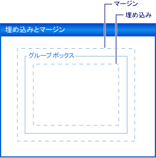

# チュートリアル : Padding、Margin、および AutoSize プロパティを使用した Windows フォーム コントロールのレイアウト
フォーム上にコントロールを正確に配置することは、多くのアプリケーションで重要度の高い処理です。  **Windows フォーム デザイナー**には、そのためのさまざまなレイアウト ツールが用意されています。  最も重要な 3 つのプロパティは、<xref:System.Windows.Forms.Control.Margin%2A>、<xref:System.Windows.Forms.Control.Padding%2A>、および <xref:System.Windows.Forms.Control.AutoSize%2A> です。これらは、すべての Windows フォーム コントロールに存在します。  
  
 <xref:System.Windows.Forms.Control.Margin%2A> プロパティは、コントロール周囲の空白領域を定義します。これによってコントロールの境界線と他のコントロールとの間で、指定した距離が保たれます。  
  
 <xref:System.Windows.Forms.Control.Padding%2A> プロパティはコントロールの内部の空白領域を定義します。これによって、コントロールの内容 \(たとえばその <xref:System.Windows.Forms.Control.Text%2A> プロパティの値\) とコントロールの境界線との間で、指定した距離が保たれます。  
  
 コントロールの <xref:System.Windows.Forms.Control.Padding%2A> プロパティと <xref:System.Windows.Forms.Control.Margin%2A> プロパティを次の図に示します。  
  
   
  
 <xref:System.Windows.Forms.Control.AutoSize%2A> プロパティを使用すると、コントロールのサイズが内容に合わせて自動的に調整されます。  コントロールは元の <xref:System.Windows.Forms.Control.Size%2A> プロパティの値よりも小さいサイズには自動調整されず、<xref:System.Windows.Forms.Control.Padding%2A> プロパティの値に対する領域を占めます。  
  
 このチュートリアルでは、以下のタスクを行います。  
  
-   Windows フォーム プロジェクトの作成  
  
-   コントロールのマージンの設定  
  
-   コントロールの埋め込みの設定  
  
-   コントロールの自動サイズ変更  
  
 ここでは、これらの重要なレイアウト機能が果たす役割について理解します。  
  
> [!NOTE]
>  実際に画面に表示されるダイアログ ボックスとメニュー コマンドは、アクティブな設定またはエディションによっては、ヘルプの説明と異なる場合があります。  設定を変更するには、**\[ツール\]** メニューの **\[設定のインポートとエクスポート\]** をクリックします。  詳細については、「[Customizing Development Settings in Visual Studio](http://msdn.microsoft.com/ja-jp/22c4debb-4e31-47a8-8f19-16f328d7dcd3)」を参照してください。  
  
## 必須コンポーネント  
 このチュートリアルを完了するための要件は次のとおりです。  
  
-   Visual Studio がインストールされているコンピューターで、Windows フォーム アプリケーション プロジェクトを作成および実行するための十分なアクセス許可が付与されていること。  
  
## プロジェクトの作成  
 最初にプロジェクトを作成し、フォームを設定します。  
  
#### プロジェクトを作成するには  
  
1.  `LayoutExample` という名前の **Windows アプリケーション** プロジェクトを作成します。  詳細については、「[How to: Create a Windows Application Project](http://msdn.microsoft.com/ja-jp/b2f93fed-c635-4705-8d0e-cf079a264efa)」を参照してください。  
  
2.  **Windows フォーム デザイナー**でフォームを選択します。  
  
## コントロールのマージンの設定  
 <xref:System.Windows.Forms.Control.Margin%2A> プロパティを使用すると、コントロール間の既定の距離を設定できます。  別のコントロールのすぐ近くまでコントロールを移動すると、両方のコントロールのマージンを示すスナップ線が表示されます。  また、移動中のコントロールは、マージンで定義された距離にスナップします。  
  
#### Margin プロパティを使用してフォーム上にコントロールを配置するには  
  
1.  **ツールボックス**から 2 つの <xref:System.Windows.Forms.Button> コントロールをフォームにドラッグします。  
  
2.  <xref:System.Windows.Forms.Button> コントロールのどちらかを選択し、もう 1 つのコントロールにほぼ接触するまで近づけます。  
  
     両方のコントロールの間にスナップ線が表示されることを確認します。  この距離は、この 2 つのコントロールの <xref:System.Windows.Forms.Control.Margin%2A> 値の合計です。  移動中のコントロールは、この距離にスナップします。  詳細については、「[チュートリアル : スナップ線を使用した Windows フォーム上のコントロールの配置](../../../../docs/framework/winforms/controls/walkthrough-arranging-controls-on-windows-forms-using-snaplines.md)」を参照してください。  
  
3.  一方のコントロールの <xref:System.Windows.Forms.Control.Margin%2A> プロパティを変更します。これを行うには **\[プロパティ\]** ウィンドウで <xref:System.Windows.Forms.Control.Margin%2A> エントリを展開し、<xref:System.Windows.Forms.Padding.All%2A> プロパティを 20 に設定します。  
  
4.  <xref:System.Windows.Forms.Button> コントロールの一方を選択し、他方のコントロールに近づけます。  
  
     マージンの合計値を定義しているスナップ線が延長され、他方のコントロールからより遠い距離にコントロールがスナップします。  
  
5.  選択したコントロールの <xref:System.Windows.Forms.Control.Margin%2A> プロパティを変更します。これを行うには **\[プロパティ\]** ウィンドウで <xref:System.Windows.Forms.Control.Margin%2A> エントリを展開し、<xref:System.Windows.Forms.Padding.Top%2A> プロパティを 5 に設定します。  
  
6.  選択したコントロールを他方のコントロールの下に移動し、スナップ線が短くなったことを確認します。  選択したコントロールを他方のコントロールの左に移動し、手順 4. で確認した値をスナップ線が維持していることを確認します。  
  
7.  <xref:System.Windows.Forms.Control.Margin%2A> プロパティの各要素 \(<xref:System.Windows.Forms.Padding.Left%2A>、<xref:System.Windows.Forms.Padding.Top%2A>、<xref:System.Windows.Forms.Padding.Right%2A>、<xref:System.Windows.Forms.Padding.Bottom%2A>\) を異なる値に設定できます。また、<xref:System.Windows.Forms.Padding.All%2A> プロパティを使用してすべての要素を同じ値に設定することもできます。  
  
## コントロールの埋め込みの設定  
 アプリケーションに要求される正確なレイアウトを実現するために、コントロール内に子コントロールを含めることもあります。  子コントロールの境界線と親コントロールの境界線の間隔を指定するには、親コントロールの <xref:System.Windows.Forms.Control.Padding%2A> プロパティと子コントロールの <xref:System.Windows.Forms.Control.Margin%2A> プロパティを組み合わせて使用します。  <xref:System.Windows.Forms.Control.Padding%2A> プロパティは、コントロールの内容 \(たとえば、<xref:System.Windows.Forms.Button> コントロールの <xref:System.Windows.Forms.Control.Text%2A> プロパティ\) と境界線の間隔を制御するためにも使用します。  
  
#### 埋め込みを使用してフォーム上にコントロールを配置するには  
  
1.  **ツールボックス**からフォームに、<xref:System.Windows.Forms.Button> コントロールをドラッグします。  
  
2.  <xref:System.Windows.Forms.Button> コントロールの <xref:System.Windows.Forms.Control.AutoSize%2A> プロパティの値を `true` に変更します。  
  
3.  <xref:System.Windows.Forms.Control.Padding%2A> プロパティを変更します。これを行うには **\[プロパティ\]** ウィンドウで <xref:System.Windows.Forms.Control.Padding%2A> エントリを展開し、<xref:System.Windows.Forms.Padding.All%2A> プロパティを 5 に設定します。  
  
     コントロールが拡大され、新しい埋め込みのための領域が確保されます。  
  
4.  **ツールボックス**からフォームに、<xref:System.Windows.Forms.GroupBox> コントロールをドラッグします。  **ツールボックス**の <xref:System.Windows.Forms.Button> コントロールを <xref:System.Windows.Forms.GroupBox> コントロールにドラッグします。  <xref:System.Windows.Forms.Button> コントロールを <xref:System.Windows.Forms.GroupBox> コントロールの右下隅に揃えて配置します。  
  
     <xref:System.Windows.Forms.Button> コントロールが <xref:System.Windows.Forms.GroupBox> コントロールの下側と右側の境界線に近づくと、スナップ線が表示されることを確認します。  これらのスナップ線は、<xref:System.Windows.Forms.Button> の <xref:System.Windows.Forms.Control.Margin%2A> プロパティに対応します。  
  
5.  <xref:System.Windows.Forms.GroupBox> コントロールの <xref:System.Windows.Forms.Control.Padding%2A> プロパティを変更します。これを行うには **\[プロパティ\]** ウィンドウで <xref:System.Windows.Forms.Control.Padding%2A> エントリを展開し、<xref:System.Windows.Forms.Padding.All%2A> プロパティを 20 に設定します。  
  
6.  <xref:System.Windows.Forms.GroupBox> コントロール内の <xref:System.Windows.Forms.Button> コントロールを選択し、<xref:System.Windows.Forms.GroupBox> の中心の方向に移動します。  
  
     <xref:System.Windows.Forms.GroupBox> コントロールの境界線からより遠い距離でスナップ線が表示されます。  この距離は、<xref:System.Windows.Forms.Button> コントロールの <xref:System.Windows.Forms.Control.Margin%2A> プロパティと <xref:System.Windows.Forms.GroupBox> コントロールの <xref:System.Windows.Forms.Control.Padding%2A> プロパティの合計です。  
  
## コントロールの自動サイズ変更  
 アプリケーションによっては、デザイン時と実行時でコントロールのサイズが異なるものがあります。  たとえば、<xref:System.Windows.Forms.Button> コントロールのテキストはデータベースから取得されることがあり、その長さを事前に知ることはできません。  
  
 <xref:System.Windows.Forms.Control.AutoSize%2A> プロパティを `true` に設定すると、コントロールのサイズはその内容に合わせて自動的に調整されます。  詳細については、「[AutoSize プロパティの概要](../../../../docs/framework/winforms/controls/autosize-property-overview.md)」を参照してください。  
  
#### AutoSize プロパティを使用してフォーム上にコントロールを配置するには  
  
1.  **ツールボックス**からフォームに、<xref:System.Windows.Forms.Button> コントロールをドラッグします。  
  
2.  <xref:System.Windows.Forms.Button> コントロールの <xref:System.Windows.Forms.Control.AutoSize%2A> プロパティの値を `true` に変更します。  
  
3.  <xref:System.Windows.Forms.Button> コントロールの <xref:System.Windows.Forms.Control.Text%2A> プロパティを "This button has a long string for its Text property." に変更します。  
  
     この変更をコミットすると、<xref:System.Windows.Forms.Button> コントロールのサイズが新しいテキストに合わせて変更されます。  
  
4.  **ツールボックス**から別の <xref:System.Windows.Forms.Button> コントロールをフォームにドラッグします。  
  
5.  <xref:System.Windows.Forms.Button> コントロールの <xref:System.Windows.Forms.Control.Text%2A> プロパティを "This button has a long string for its Text property." に変更します。  
  
     この変更をコミットすると、<xref:System.Windows.Forms.Button> コントロールのサイズは自動的に調整されず、テキストがコントロールの右端でクリップされます。  
  
6.  <xref:System.Windows.Forms.Control.Padding%2A> プロパティを変更します。これを行うには **\[プロパティ\]** ウィンドウで <xref:System.Windows.Forms.Control.Padding%2A> エントリを展開し、<xref:System.Windows.Forms.Padding.All%2A> プロパティを 5 に設定します。  
  
     コントロールの内部のテキストが 4 辺でクリップされます。  
  
7.  <xref:System.Windows.Forms.Button> コントロールの <xref:System.Windows.Forms.Control.AutoSize%2A> プロパティを `true` に変更します。  
  
     <xref:System.Windows.Forms.Button> コントロールのサイズが自動的に変更され、文字列全体が囲まれます。  また、テキストの周囲に埋め込みが追加され、<xref:System.Windows.Forms.Button> コントロールが上下左右に拡大されます。  
  
8.  **ツールボックス**からフォームに、<xref:System.Windows.Forms.Button> コントロールをドラッグします。  フォームの右下隅付近に配置してください。  
  
9. <xref:System.Windows.Forms.Button> コントロールの <xref:System.Windows.Forms.Control.AutoSize%2A> プロパティの値を `true` に変更します。  
  
10. <xref:System.Windows.Forms.Button> コントロールの <xref:System.Windows.Forms.Control.Anchor%2A> プロパティを <xref:System.Windows.Forms.AnchorStyles>、<xref:System.Windows.Forms.AnchorStyles> に設定します。  
  
11. <xref:System.Windows.Forms.Button> コントロールの <xref:System.Windows.Forms.Control.Text%2A> プロパティを "This button has a long string for its Text property." に変更します。  
  
     この変更をコミットすると、<xref:System.Windows.Forms.Button> コントロールのサイズが左方向に調整されます。  通常、自動サイズ変更により、コントロールは <xref:System.Windows.Forms.Control.Anchor%2A> プロパティ設定と反対の方向に拡大されます。  
  
## AutoSize プロパティと AutoSizeMode プロパティ  
 一部のコントロールは、`AutoSizeMode` プロパティをサポートしています。このプロパティにより、コントロールの自動サイズ変更動作をより細かく制御できます。  
  
#### AutoSizeMode プロパティを使用するには  
  
1.  **ツールボックス**からフォームに、<xref:System.Windows.Forms.Panel> コントロールをドラッグします。  
  
2.  <xref:System.Windows.Forms.Panel> コントロールの <xref:System.Windows.Forms.Control.AutoSize%2A> プロパティの値を `true` に設定します。  
  
3.  **ツールボックス**の <xref:System.Windows.Forms.Button> コントロールを <xref:System.Windows.Forms.Panel> コントロールにドラッグします。  
  
4.  <xref:System.Windows.Forms.Button> コントロールを <xref:System.Windows.Forms.Panel> コントロールの右下隅付近に配置します。  
  
5.  <xref:System.Windows.Forms.Panel> コントロールを選択し、右下のサイズ変更ハンドルをグラブします。  <xref:System.Windows.Forms.Panel> コントロールを拡大または縮小します。  
  
    > [!NOTE]
    >  <xref:System.Windows.Forms.Panel> コントロールのサイズは自由に変更できますが、<xref:System.Windows.Forms.Button> コントロールの右下隅の位置を越えて縮小できません。  この動作は、`AutoSizeMode` プロパティの既定値である <xref:System.Windows.Forms.AutoSizeMode> で指定されます。  
  
6.  <xref:System.Windows.Forms.Panel> コントロールの `AutoSizeMode` プロパティの値を <xref:System.Windows.Forms.AutoSizeMode> に設定します。  
  
     <xref:System.Windows.Forms.Panel> コントロールのサイズが自動的に変更され、<xref:System.Windows.Forms.Button> コントロールが囲まれます。  <xref:System.Windows.Forms.Panel> コントロールのサイズは変更できません。  
  
7.  <xref:System.Windows.Forms.Button> コントロールを <xref:System.Windows.Forms.Panel> コントロールの左上隅の方向にドラッグします。  
  
     <xref:System.Windows.Forms.Button> コントロールの新しい位置に合わせて、<xref:System.Windows.Forms.Panel> コントロールのサイズが変更されます。  
  
## 次の手順  
 Windows フォーム アプリケーションにコントロールを配置するためのレイアウト機能は、他にも数多くあります。  次のような組み合わせを試すことができます。  
  
-   <xref:System.Windows.Forms.TableLayoutPanel> コントロールを使用してフォームをビルドします。  詳細については、「[チュートリアル : TableLayoutPanel を使用した Windows フォーム上のコントロールの配置](../../../../docs/framework/winforms/controls/walkthrough-arranging-controls-on-windows-forms-using-a-tablelayoutpanel.md)」を参照してください。  <xref:System.Windows.Forms.TableLayoutPanel> コントロールの <xref:System.Windows.Forms.Control.Padding%2A> プロパティの値、およびその子コントロールの <xref:System.Windows.Forms.Control.Margin%2A> プロパティの値を変更してみてください。  
  
-   また、<xref:System.Windows.Forms.FlowLayoutPanel> コントロールを使用して同じ内容を試みます。  詳細については、「[チュートリアル : FlowLayoutPanel を使用した Windows フォーム上のコントロールの配置](../../../../docs/framework/winforms/controls/walkthrough-arranging-controls-on-windows-forms-using-a-flowlayoutpanel.md)」を参照してください。  
  
-   <xref:System.Windows.Forms.Panel> コントロール内で子コントロールのドッキングを試みます。  <xref:System.Windows.Forms.Control.Padding%2A> プロパティは、<xref:System.Windows.Forms.ScrollableControl.DockPadding%2A> プロパティをより一般化したものです。機能を確認するには、<xref:System.Windows.Forms.Panel> コントロール内に子コントロールを配置し、その子コントロールの <xref:System.Windows.Forms.Control.Dock%2A> プロパティを <xref:System.Windows.Forms.DockStyle> に設定します。  次に、<xref:System.Windows.Forms.Panel> コントロールの <xref:System.Windows.Forms.Control.Padding%2A> プロパティをさまざまな値に変更して変化を確認します。  
  
## 参照  
 <xref:System.Windows.Forms.Control.AutoSize%2A>   
 <xref:System.Windows.Forms.ScrollableControl.DockPadding%2A>   
 <xref:System.Windows.Forms.Control.Margin%2A>   
 <xref:System.Windows.Forms.Control.Padding%2A>   
 [AutoSize プロパティの概要](../../../../docs/framework/winforms/controls/autosize-property-overview.md)   
 [チュートリアル : TableLayoutPanel を使用した Windows フォーム上のコントロールの配置](../../../../docs/framework/winforms/controls/walkthrough-arranging-controls-on-windows-forms-using-a-tablelayoutpanel.md)   
 [チュートリアル : FlowLayoutPanel を使用した Windows フォーム上のコントロールの配置](../../../../docs/framework/winforms/controls/walkthrough-arranging-controls-on-windows-forms-using-a-flowlayoutpanel.md)   
 [チュートリアル : スナップ線を使用した Windows フォーム上のコントロールの配置](../../../../docs/framework/winforms/controls/walkthrough-arranging-controls-on-windows-forms-using-snaplines.md)