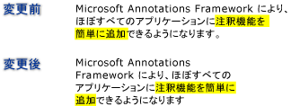

# 注釈の概要
紙に印刷されたドキュメントにメモやコメントを書き込むことは、当然のように行われる一般的な行為です。  これらのメモやコメントは、後で参照するために、情報に目印を付けたり、関心のある項目を強調するためにドキュメントに追加する "注釈" です。  印刷されたドキュメントにメモを書き込むことは簡単で一般的ですが、電子ドキュメントに個人的なコメントを追加する機能は、利用できるとしても、通常は非常に限られています。  
  
 ここでは、いくつかの一般的な種類の注釈、特に付箋と強調表示について説明し、[!INCLUDE[TLA#tla_caf](../../../../includes/tlasharptla-caf-md.md)] で [!INCLUDE[TLA#tla_wpf](../../../../includes/tlasharptla-wpf-md.md)] ドキュメント表示コントロールを使用することにより、アプリケーションでこれらの種類の注釈を使用できるようにする方法を示します。  注釈をサポートする [!INCLUDE[TLA2#tla_wpf](../../../../includes/tla2sharptla-wpf-md.md)] ドキュメント表示コントロールには、<xref:System.Windows.Controls.FlowDocumentReader> や <xref:System.Windows.Controls.FlowDocumentScrollViewer> などがあり、また、<xref:System.Windows.Controls.Primitives.DocumentViewerBase> から派生した <xref:System.Windows.Controls.DocumentViewer> や <xref:System.Windows.Controls.FlowDocumentPageViewer> などのコントロールも含まれます。  
  
   
  
   
## 付箋  
 通常の付箋の場合は、色の付いた小さな用紙に情報を書き込み、それをドキュメントに貼り付けます。  デジタル付箋は、電子ドキュメントに対する同様の機能を提供しますが、入力したテキスト、手書きのメモ \(たとえば [!INCLUDE[TLA#tla_tpc](../../../../includes/tlasharptla-tpc-md.md)] の "インク" ストローク\)、Web リンクなど、さまざまな種類のコンテンツを格納できる柔軟性も備えています。  
  
 強調表示、テキスト付箋、およびインク付箋による注釈の例を次の図に示します。  
  
   
  
 アプリケーションで注釈のサポートを有効にするために使用できる方法を次の例に示します。  
  
 [!code-csharp[DocViewerAnnotationsXml#DocViewXmlStartAnnotations](../../../../samples/snippets/csharp/VS_Snippets_Wpf/DocViewerAnnotationsXml/CSharp/Window1.xaml.cs#docviewxmlstartannotations)]
 [!code-vb[DocViewerAnnotationsXml#DocViewXmlStartAnnotations](../../../../samples/snippets/visualbasic/VS_Snippets_Wpf/DocViewerAnnotationsXml/visualbasic/window1.xaml.vb#docviewxmlstartannotations)]  
  
   
## 強調表示  
 多くの人は、紙に印刷されたドキュメントに印を付ける場合、関心のある項目を目立たせるために、下線を引く、蛍光ペンで強調する、文中の単語を丸で囲む、余白に記号や注釈を書き込むなど、さまざまな方法を工夫して使用します。  [!INCLUDE[TLA#tla_caf](../../../../includes/tlasharptla-caf-md.md)] での強調表示による注釈は、[!INCLUDE[TLA2#tla_wpf](../../../../includes/tla2sharptla-wpf-md.md)] ドキュメント表示コントロールに表示された情報に印を付けるための、同様の機能を提供します。  
  
 強調表示による注釈の例を次の図に示します。  
  
   
  
 通常、ユーザーが注釈を作成する場合には、最初にテキストまたは関心のある項目を選択し、次に右クリックして、注釈オプションの <xref:System.Windows.Controls.ContextMenu> を表示します。  ユーザーが注釈を作成および管理するためにアクセスできるルーティング コマンドを格納した <xref:System.Windows.Controls.ContextMenu> を宣言するために使用できる [!INCLUDE[TLA#tla_xaml](../../../../includes/tlasharptla-xaml-md.md)] を次の例に示します。  
  
 [!code-xml[DocViewerAnnotationsXps#CreateDeleteAnnotations](../../../../samples/snippets/csharp/VS_Snippets_Wpf/DocViewerAnnotationsXps/CSharp/Window1.xaml#createdeleteannotations)]  
  
   
## データ アンカー  
 [!INCLUDE[TLA2#tla_caf](../../../../includes/tla2sharptla-caf-md.md)] では、注釈は、表示ビュー上の位置に対してだけでなく、ユーザーが選択したデータに対してもバインドされます。  そのため、ドキュメント ビューが変更された場合 \(ユーザーが表示ウィンドウをスクロールまたはサイズ変更した場合など\) でも、注釈はそれがバインドされているデータ選択を保持します。  たとえば、次の図は、ユーザーがテキストを選択して行った注釈を示しています。  ドキュメント ビューが変更 \(スクロール、サイズ変更、スケーリング、または移動\) されると、強調表示による注釈は、元のデータ選択と共に移動します。  
  
   
  
   
## 注釈と注釈先オブジェクトの対応付け  
 注釈と、それに応じた注釈先オブジェクトとを対応付けることができます。  たとえば、コメント ペインを持つ簡単なドキュメント リーダー アプリケーションがあるとします。  そのコメント ペインは、そのドキュメントにアンカーされている注釈のリストのテキストを表示するリスト ボックスです。  ユーザーがリスト ボックスの項目を選択すると、対応する注釈オブジェクトがアンカーされているドキュメント内の段落が表示されます。  
  
 このようなコメント ペインとして使用するリスト ボックスのイベント ハンドラーを実装する方法を次の例に示します。  
  
 [!code-csharp[FlowDocumentAnnotatedViewer#Handler](../../../../samples/snippets/csharp/VS_Snippets_Wpf/FlowDocumentAnnotatedViewer/CSharp/Window1.xaml.cs#handler)]
 [!code-vb[FlowDocumentAnnotatedViewer#Handler](../../../../samples/snippets/visualbasic/VS_Snippets_Wpf/FlowDocumentAnnotatedViewer/visualbasic/window1.xaml.vb#handler)]  
  
 別のサンプル シナリオとしては、ドキュメント リーダー間で注釈および付箋を電子メールで交換できるアプリケーションが考えられます。  この機能があるアプリケーションでは、交換した注釈を含むページにリーダーを移動できます。  
  
## 参照  
 <xref:System.Windows.Controls.Primitives.DocumentViewerBase>   
 <xref:System.Windows.Controls.DocumentViewer>   
 <xref:System.Windows.Controls.FlowDocumentPageViewer>   
 <xref:System.Windows.Controls.FlowDocumentScrollViewer>   
 <xref:System.Windows.Controls.FlowDocumentReader>   
 <xref:System.Windows.Annotations.IAnchorInfo>   
 [注釈スキーマ](../../../../docs/framework/wpf/advanced/annotations-schema.md)   
 [ContextMenu の概要](../../../../docs/framework/wpf/controls/contextmenu-overview.md)   
 [コマンド実行の概要](../../../../docs/framework/wpf/advanced/commanding-overview.md)   
 [フロー ドキュメントの概要](../../../../docs/framework/wpf/advanced/flow-document-overview.md)   
 [How to: Add a Command to a MenuItem](http://msdn.microsoft.com/ja-jp/013d68a0-5373-4a68-bd91-5de574307370)