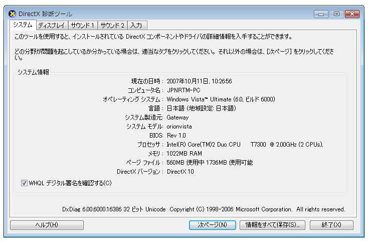

# グラフィックスの描画層
[!INCLUDE[TLA2#tla_winclient](../../../../includes/tla2sharptla-winclient-md.md)] アプリケーションを実行するデバイスのグラフィックス ハードウェア性能は描画層で決まります。  
  

  
   
## グラフィックス ハードウェア  
 描画層に最も影響を与えるグラフィックス ハードウェアの機能:  
  
-   **ビデオ RAM** グラフィックス ハードウェアのビデオ メモリの量で、グラフィックスの構築に利用できるバッファーのサイズと数が決まります。  
  
-   **ピクセル シェーダー** ピクセル シェーダーは、ピクセル単位で効果を計算するグラフィックス処理機能です。 表示されるグラフィックスの解像度によっては、各表示フレームの処理に数百万単位のピクセルが必要になることがあります。  
  
-   **頂点シェーダー** 頂点シェーダーは、オブジェクトの頂点データに数学演算を実行するグラフィックス処理機能です。  
  
-   **マルチテクスチャ サポート** マルチテクスチャ サポートとは、3D グラフィックス オブジェクトにブレンド操作を実行するとき、2 つ以上の異なるテクスチャを適用できる機能のことです。 マルチテクスチャ サポートの度合いは、グラフィックス ハードウェア上のマルチテクスチャ ユニットの数で決まります。  
  
   
## 描画層の定義  
 グラフィックス ハードウェアの機能により [!INCLUDE[TLA2#tla_winclient](../../../../includes/tla2sharptla-winclient-md.md)] アプリケーションのレンダリング能力が決まります。 [!INCLUDE[TLA2#tla_winclient](../../../../includes/tla2sharptla-winclient-md.md)] システムには次の 3 つの描画層があります。  
  
-   **描画層 0** グラフィックス ハードウェアの高速化はありません。 すべてのグラフィックス機能でソフトウェア高速化が利用されます。 [!INCLUDE[TLA2#tla_dx](../../../../includes/tla2sharptla-dx-md.md)] バージョン レベルはバージョン 9.0 より前です。  
  
-   **描画層 1** 一部のグラフィックス機能でグラフィックス ハードウェア高速が利用されます。 [!INCLUDE[TLA2#tla_dx](../../../../includes/tla2sharptla-dx-md.md)] バージョンのレベルはバージョン 9.0 以上です。  
  
-   **描画層 2** ほとんどのグラフィックス機能でグラフィックス ハードウェア高速が利用されます。 [!INCLUDE[TLA2#tla_dx](../../../../includes/tla2sharptla-dx-md.md)] バージョンのレベルはバージョン 9.0 以上です。  
  
 <xref:System.Windows.Media.RenderCapability.Tier%2A?displayProperty=nameWithType>プロパティでは、アプリケーションの実行時に描画層を取得することができます。 描画層を利用し、特定のハードウェア高速化グラフィックス機能にデバイスが対応しているか判断します。 その後、デバイスでサポートされている描画層に基づき、アプリケーションが実行時にさまざまなコード パスを取ります。  
  
### 描画層 0  
 0 値の描画層は、デバイスのアプリケーションでグラフィックス ハードウェア高速化を利用できないことを意味します。 この層レベルでは、ハードウェア高速化がなく、すべてのグラフィックスがソフトウェアにより描画されるものと想定してください。 この層の機能は、9.0 より前のバージョンの [!INCLUDE[TLA2#tla_dx](../../../../includes/tla2sharptla-dx-md.md)] に相当します。  
  
### 描画層 1 と描画層 2  
  
> [!NOTE]
>  .NET Framework 4 より、描画層 1 が再定義され、[!INCLUDE[TLA2#tla_dx](../../../../includes/tla2sharptla-dx-md.md)] 9.0 以上をサポートするグラフィックスのみが含まれます。 [!INCLUDE[TLA2#tla_dx](../../../../includes/tla2sharptla-dx-md.md)] 7 または 8 をサポートするグラフィックス ハードウェアは現在、描画層 0 として定義されています。  
  
 描画層の値 1 または 2 は、必要なシステム リソースがあり、枯渇していなければ、[!INCLUDE[TLA2#tla_winclient](../../../../includes/tla2sharptla-winclient-md.md)] のグラフィックス機能のほとんどでハードウェア高速化が利用されることを意味します。 これは 9.0 以上のバージョンの [!INCLUDE[TLA2#tla_dx](../../../../includes/tla2sharptla-dx-md.md)] に相当します。  
  
 次の表は、描画層 1 と描画層 2 のグラフィックス ハードウェア要件の違いをまとめたものです。  
  
|機能|層 1|層 2|  
|-------------|------------|------------|  
|[!INCLUDE[TLA2#tla_dx](../../../../includes/tla2sharptla-dx-md.md)] のバージョン|9.0 以上が要求されます。|9.0 以上が要求されます。|  
|ビデオ RAM|60MB 以上が要求されます。|120MB 以上が要求されます。|  
|ピクセル シェーダー|バージョン 2.0 以上が要求されます。|バージョン 2.0 以上が要求されます。|  
|頂点シェーダー|要件はありません。|バージョン 2.0 以上が要求されます。|  
|マルチテクスチャ ユニット|要件はありません。|ユニット数が 4 以上であることが要求されます。|  
  
 次の機能は、描画層 1 と描画層 2 でハードウェア高速化されます。  
  
|機能|メモ|  
|-------------|-----------|  
|2D 描画|ほとんどの 2D 描画をサポートします。|  
|3D ラスター化|ほとんどの 3D ラスター化をサポートします。|  
|3D 異方性フィルター処理|[!INCLUDE[TLA2#tla_winclient](../../../../includes/tla2sharptla-winclient-md.md)] は 3D コンテンツを描画するとき、異方性フィルター処理を試行します。 異方性フィルター処理は、カメラから遠くにあり、カメラに対して急な角度が付く表面の画質を上げます。|  
|3D MIP マッピング|[!INCLUDE[TLA2#tla_winclient](../../../../includes/tla2sharptla-winclient-md.md)] は 3D コンテンツを描画するとき、MIP マッピングを試行します。 テクスチャで小さな視野を占めるとき、MIP マッピングがテクスチャの描画品質を向上する<xref:System.Windows.Controls.Viewport3D>します。|  
|放射状グラデーション|サポートされていますの使用を避けるため<xref:System.Windows.Media.RadialGradientBrush>ラージ オブジェクトにします。|  
|3D ライティング計算|[!INCLUDE[TLA2#tla_winclient](../../../../includes/tla2sharptla-winclient-md.md)] は頂点ごとに照明を実行します。つまり、メッシュに適用される素材ごとに各頂点で光の強度を計算する必要があります。|  
|テキスト描画|サブピクセル フォント描画では、グラフィックス ハードウェアのピクセル シェーダーを利用します。|  
  
 次の機能は、描画層 2 でのみハードウェア高速化されます。  
  
|機能|メモ|  
|-------------|-----------|  
|3D アンチエイリアス|3D アンチエイリアシングは、[!INCLUDE[TLA2#tla_winvista](../../../../includes/tla2sharptla-winvista-md.md)] や [!INCLUDE[win7](../../../../includes/win7-md.md)] など、Windows Display Driver Model (WDDM) 対応のオペレーティング システムでのみサポートされています。|  
  
 次の機能はハードウェア高速化**されません**。  
  
|機能|メモ|  
|-------------|-----------|  
|印刷コンテンツ|印刷コンテンツはすべて、[!INCLUDE[TLA2#tla_winclient](../../../../includes/tla2sharptla-winclient-md.md)] ソフトウェア パイプラインを利用して描画されます。|  
|使用されているラスタライズされたコンテンツ <xref:System.Windows.Media.Imaging.RenderTargetBitmap>|使用して描画されたあらゆるコンテンツ、<xref:System.Windows.Media.Imaging.RenderTargetBitmap.Render%2A>メソッドの<xref:System.Windows.Media.Imaging.RenderTargetBitmap>します。|  
|タイル化コンテンツを使用します。 <xref:System.Windows.Media.TileBrush>|タイル化コンテンツを<xref:System.Windows.Media.TileBrush.TileMode%2A>のプロパティ、<xref:System.Windows.Media.TileBrush>に設定されている<xref:System.Windows.Media.TileMode.Tile>します。|  
|グラフィックス ハードウェアの最大テクスチャ サイズを超過する表面|ほとんどのグラフィックス ハードウェアの場合、大きな表面のサイズは 2048x2048 ピクセルか 4096x4096 ピクセルになります。|  
|ビデオ RAM 要件がグラフィックス ハードウェアのメモリを超える操作|Windows SDK の [WPF Performance Suite](https://docs.microsoft.com/previous-versions/dotnet/netframework-4.0/aa969767(v=vs.100)) に含まれる Perforator ツールを利用し、アプリケーションのビデオ RAM 使用率を監視できます。|  
|レイヤード ウィンドウ|レイヤード ウィンドウを利用することで、[!INCLUDE[TLA2#tla_winclient](../../../../includes/tla2sharptla-winclient-md.md)] アプリケーションは四角形以外のウィンドウ内の画面にコンテンツを描画できます。 [!INCLUDE[TLA2#tla_winvista](../../../../includes/tla2sharptla-winvista-md.md)] や [!INCLUDE[win7](../../../../includes/win7-md.md)] など、Windows Display Driver Model (WDDM) 対応のオペレーティング システムでは、レイヤード ウィンドウがハードウェア高速化されます。 [!INCLUDE[winxp](../../../../includes/winxp-md.md)] のような他のシステムの場合、ハードウェア高速化なしで、ソフトウェアによりレイヤード ウィンドウが描画されます。   レイヤード ウィンドウを有効にすることができます[!INCLUDE[TLA2#tla_winclient](../../../../includes/tla2sharptla-winclient-md.md)]、次を設定して<xref:System.Windows.Window>プロパティ。   -   <xref:System.Windows.Window.WindowStyle%2A> = <xref:System.Windows.WindowStyle.None> -   <xref:System.Windows.Window.AllowsTransparency%2A> = `true` -   <xref:System.Windows.Controls.Control.Background%2A> = <xref:System.Windows.Media.Brushes.Transparent%2A>|  
  
   
## その他の参照情報  
 次のリソースは、[!INCLUDE[TLA2#tla_winclient](../../../../includes/tla2sharptla-winclient-md.md)] アプリケーションのパフォーマンス特性の分析に役立ちます。  
  
### グラフィックス レンダリングのレジストリ設定  
 [!INCLUDE[TLA2#tla_winclient](../../../../includes/tla2sharptla-winclient-md.md)] には、[!INCLUDE[TLA2#tla_winclient](../../../../includes/tla2sharptla-winclient-md.md)] の描画を制御するためのレジストリ設定が 4 つあります。  
  
|設定|説明|  
|-------------|-----------------|  
|**Disable Hardware Acceleration Option (ハードウェア高速化オプションを無効にする)**|ハードウェア高速化を有効にするかどうかを指定します。|  
|**Maximum Multisample Value (最大マルチサンプル値)**|[!INCLUDE[TLA2#tla_3d](../../../../includes/tla2sharptla-3d-md.md)] コンテンツをアンチエイリアシングするためのマルチサンプリングの度合いを指定します。|  
|**Required Video Driver Date Setting (ビデオ ドライバーの日付設定が必須)**|2004 年 11 月より前にリリースされたドライバーについて、ハードウェア高速化を無効にするかどうかを指定します。|  
|**Use Reference Rasterizer Option (リファレンス ラスタライザー オプションを使用する)**|[!INCLUDE[TLA2#tla_winclient](../../../../includes/tla2sharptla-winclient-md.md)] でリファレンス ラスタライザーを使用するかどうかを指定します。|  
  
 これらの設定には、[!INCLUDE[TLA2#tla_winclient](../../../../includes/tla2sharptla-winclient-md.md)] レジストリ設定の参照方法を認識する外部構成ユーティリティを使用してアクセスできます。 これらの設定は、[!INCLUDE[TLA#tla_mswin](../../../../includes/tlasharptla-mswin-md.md)] レジストリ エディターを使用して値に直接アクセスして作成または変更することもできます。 詳細については、「[グラフィックス レンダリングのレジストリ設定](../../../../docs/framework/wpf/graphics-multimedia/graphics-rendering-registry-settings.md)」を参照してください。  
  
### WPF パフォーマンス プロファイリング データ  
 [!INCLUDE[TLA2#tla_winclient](../../../../includes/tla2sharptla-winclient-md.md)] にはパフォーマンス プロファイリング ツールのセットがあります。アプリケーションの実行時動作を分析したり、適用できるパフォーマンス最適化の種類を決定したりできます。 次の表は、[!INCLUDE[TLA2#tla_lhsdk](../../../../includes/tla2sharptla-lhsdk-md.md)] ツール、WPF Performance Suite に含まれるパフォーマンス プロファイリング ツールをまとめたものです。  
  
|ツール|説明|  
|----------|-----------------|  
|Perforator|描画動作を分析します。|  
|ビジュアル プロファイラー|ビジュアル ツリーの要素による [!INCLUDE[TLA2#tla_winclient](../../../../includes/tla2sharptla-winclient-md.md)] サービス (レイアウトやイベント処理など) の使用状況をプロファイルします。|  
  
 WPF Performance Suite では、パフォーマンス データを豊富な機能でグラフィカルに表示できます。 WPF パフォーマンス ツールの詳細については、「[WPF Performance Suite](https://docs.microsoft.com/previous-versions/dotnet/netframework-4.0/aa969767(v=vs.100))」を参照してください。  
  
### DirectX 診断ツール  
 [!INCLUDE[TLA2#tla_dx](../../../../includes/tla2sharptla-dx-md.md)] 診断ツール、Dxdiag.exe は、[!INCLUDE[TLA2#tla_dx](../../../../includes/tla2sharptla-dx-md.md)] 関連の問題解決に役立ちます。 [!INCLUDE[TLA2#tla_dx](../../../../includes/tla2sharptla-dx-md.md)] 診断ツールの既定のインストール フォルダー:  
  
 `~\Windows\System32`  
  
 [!INCLUDE[TLA2#tla_dx](../../../../includes/tla2sharptla-dx-md.md)] 診断ツールを実行すると、メイン ウィンドウにタブ セットが表示されます。このタブ セットで [!INCLUDE[TLA2#tla_dx](../../../../includes/tla2sharptla-dx-md.md)] 関連の情報を表示し、診断できます。 たとえば、**[システム]** タブにはコンピューターに関するシステム情報とコンピューターにインストールされている [!INCLUDE[TLA2#tla_dx](../../../../includes/tla2sharptla-dx-md.md)] のバージョンが表示されます。  
  
   
DirectX 診断ツールのメイン ウィンドウ  
  
## 関連項目
- <xref:System.Windows.Media.RenderCapability>
- <xref:System.Windows.Media.RenderOptions>
- [WPF アプリケーションのパフォーマンスの最適化](../../../../docs/framework/wpf/advanced/optimizing-wpf-application-performance.md)
- [WPF Performance Suite](https://docs.microsoft.com/previous-versions/dotnet/netframework-4.0/aa969767(v=vs.100))
- [グラフィックス レンダリングのレジストリ設定](../../../../docs/framework/wpf/graphics-multimedia/graphics-rendering-registry-settings.md)
- [アニメーションのヒントとテクニック](../../../../docs/framework/wpf/graphics-multimedia/animation-tips-and-tricks.md)
