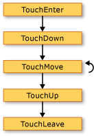

# 入力の概要
 [!INCLUDE[TLA#tla_winclient](../../../../includes/tlasharptla-winclient-md.md)]サブシステムは、強力な[!INCLUDE[TLA#tla_api](../../../../includes/tlasharptla-api-md.md)]を提供しており、マウス、キーボード、タッチ、スタイラスを含むさまざまなデバイスからの入力を取得できます。
このトピックでは、[!INCLUDE[TLA2#tla_winclient](../../../../includes/tla2sharptla-winclient-md.md)] で提供されるサービスと、入力システムのアーキテクチャについて説明します。

## 入力 API
 主な入力[!INCLUDE[TLA2#tla_api](../../../../includes/tla2sharptla-api-md.md)]は、基本要素クラス（<xref:System.Windows.UIElement>、 <xref:System.Windows.ContentElement>、 <xref:System.Windows.FrameworkElement>、<xref:System.Windows.FrameworkContentElement>）で利用できます。
基本要素の詳細については、「[基本要素の概要](../../../../docs/framework/wpf/advanced/base-elements-overview.md)」を参照してください。
これらのクラスは、キー操作、マウス ボタン、マウス ホイール、マウス動作、フォーカス管理、マウス キャプチャなどに関連する入力イベントの機能を提供しています。
入力アーキテクチャでは、すべての入力イベントをサービスとして処理するのではなく、基本要素に入力 [!INCLUDE[TLA2#tla_api](../../../../includes/tla2sharptla-api-md.md)] を配置することで、UI 内の特定のオブジェクトによって入力イベントを供給し、複数の要素が入力イベントを処理できるイベント ルーティング スキームをサポートしています。 多くの入力イベントには、それぞれに関連付けられたペアとなるイベントがあります。
たとえば、キー ダウンのイベントには、<xref:System.Windows.Input.Keyboard.KeyDown>と<xref:System.Windows.Input.Keyboard.PreviewKeyDown>イベントが関連付けられています。
これらのイベントは、ターゲット要素にルーティングされる方法が異なります。
プレビュー イベントは、ルート要素からターゲット要素へ、要素ツリーを下位に向かいます (トンネル)。  バブル イベントは、ターゲット要素からルート要素へ、上位に向かいます (バブル)。  [!INCLUDE[TLA2#tla_winclient](../../../../includes/tla2sharptla-winclient-md.md)] のイベント ルーティングについては、この概要の後半、および「[ルーティング イベントの概要](../../../../docs/framework/wpf/advanced/routed-events-overview.md)」でさらに詳しく説明されています。

### Keyboard クラスと Mouse クラス
 基本要素クラス上の入力[!INCLUDE[TLA2#tla_api](../../../../includes/tla2sharptla-api-md.md)]に加えて、キーボード入力とマウス入力を処理する追加の(../../../../includes/tla2sharptla-api-md.md)]を提供するために、<xref:System.Windows.Input.Keyboard>クラスと<xref:System.Windows.Input.Mouse>クラスが準備されています。

 <xref:System.Windows.Input.Keyboard>クラスの入力[!INCLUDE[TLA2#tla_api](../../../../includes/tla2sharptla-api-md.md)]の例として、<xref:System.Windows.Input.Keyboard.Modifiers%2A>プロパティがあります。このプロパティは、現在押されている<xref:System.Windows.Input.ModifierKeys>を返します。また、<xref:System.Windows.Input.Keyboard.IsKeyDown%2A>メソッドは、特定のキーが押されているかどうかを示します。

 次の例では、<xref:System.Windows.Input.Keyboard.GetKeyStates%2A>メソッドを用いて、ある<xref:System.Windows.Input.Key>が押された状態かどうかを調べます。

 [!code-csharp[keyargssnippetsample#KeyEventArgsKeyBoardGetKeyStates](../../../../samples/snippets/csharp/VS_Snippets_Wpf/KeyArgsSnippetSample/CSharp/Window1.xaml.cs#keyeventargskeyboardgetkeystates)]
 [!code-vb[keyargssnippetsample#KeyEventArgsKeyBoardGetKeyStates](../../../../samples/snippets/visualbasic/VS_Snippets_Wpf/KeyArgsSnippetSample/visualbasic/window1.xaml.vb#keyeventargskeyboardgetkeystates)]

 <xref:System.Windows.Input.Mouse>クラスの入力[!INCLUDE[TLA2#tla_api](../../../../includes/tla2sharptla-api-md.md)]の例として 、マウスの中央ボタンの状態を取得する<xref:System.Windows.Input.Mouse.MiddleButton%2A>、現在マウス ポインターの下にある要素を取得する<xref:System.Windows.Input.Mouse.DirectlyOver%2A>があります。

 次の例では、マウスの<xref:System.Windows.Input.Mouse.LeftButton%2A>が<xref:System.Windows.Input.MouseButtonState.Pressed>の状態かどうかを調べています。

 [!code-csharp[mouserelatedsnippets#MouseRelatedSnippetsGetLeftButtonMouse](../../../../samples/snippets/csharp/VS_Snippets_Wpf/MouseRelatedSnippets/CSharp/Window1.xaml.cs#mouserelatedsnippetsgetleftbuttonmouse)]
 [!code-vb[mouserelatedsnippets#MouseRelatedSnippetsGetLeftButtonMouse](../../../../samples/snippets/visualbasic/VS_Snippets_Wpf/MouseRelatedSnippets/visualbasic/window1.xaml.vb#mouserelatedsnippetsgetleftbuttonmouse)]

 <xref:System.Windows.Input.Mouse>クラスと<xref:System.Windows.Input.Keyboard>クラスについては、この記事でさらに詳細を扱います。

### スタイラス入力
 [!INCLUDE[TLA2#tla_winclient](../../../../includes/tla2sharptla-winclient-md.md)]には、<xref:System.Windows.Input.Stylus>のサポートが統合されています。
 <xref:System.Windows.Input.Stylus>はペン入力の一種で、[!INCLUDE[TLA#tla_tpc](../../../../includes/tlasharptla-tpc-md.md)]によって一般的になりました。
[!INCLUDE[TLA2#tla_winclient](../../../../includes/tla2sharptla-winclient-md.md)] アプリケーションでは、マウス[!INCLUDE[TLA2#tla_api](../../../../includes/tla2sharptla-api-md.md)]を使用してスタイラスをマウスとして処理できますが、キーボードとマウスに類似したモデルを使用するスタイラス デバイスの抽象型も公開しています。
スタイラス関連のすべての [!INCLUDE[TLA2#tla_api#plural](../../../../includes/tla2sharptla-apisharpplural-md.md)]には、"Stylus" という単語が含まれています。

 スタイラスはマウスとして動作できるため、マウス入力のみをサポートするアプリケーションでも、ある程度のスタイラス入力が自動的にサポートされます。
スタイラスがこのような手法で使用される場合、適切なスタイラス イベントを処理する機会が与えられた後に、対応するマウス イベントを処理する機会が与えられます。
さらに、インク入力などのより高レベルなサービスも、スタイラス デバイスの抽象型を使って利用できます。
入力としてのインクの詳細については、「[インクの概要](../../../../docs/framework/wpf/advanced/getting-started-with-ink.md)」を参照してください。

## イベント ルーティング
 <xref:System.Windows.FrameworkElement>は、コンテンツ モデルの子要素として他の要素を含めることができ、要素ツリーを形成します。
[!INCLUDE[TLA2#tla_winclient](../../../../includes/tla2sharptla-winclient-md.md)]では、イベントを処理することで、親要素が、その子孫要素への入力に関与できます。
これは、小さいコントロールから成るコントロールを構築する場合に特に役立ちます。このプロセスは "コントロール合成" または "合成" と呼ばれます。
要素ツリーおよび要素ツリーとイベント ルーティングの関連については、「[WPF のツリー](../../../../docs/framework/wpf/advanced/trees-in-wpf.md)」を参照してください。

 イベント ルーティングは、イベントを複数の要素に転送するプロセスで、ルート内のオブジェクトや要素は、別の要素からのイベントに、(イベント処理によって) 応答することができます。
ルーティング イベントには、直接、バブル、トンネルのいずれかのルーティング メカニズムが使用されます。
直接ルーティングでは、ソース要素のみが通知を受け取り、イベントは他の要素にルーティングされません。
ただし、直接ルーティング イベントは、標準の [!INCLUDE[TLA2#tla_clr](../../../../includes/tla2sharptla-clr-md.md)] イベントとは対照的に、ルーティング イベントにのみ存在するいくつかの追加機能を提供します。
バブル ルーティングは、最初にイベント ソースである要素に通知し、次にその親要素へ、その次へと順に通知することで、要素ツリーの上に向かって処理を実行します。
トンネル ルーティングは、要素ツリーのルートから下に向かって処理を実行し、イベント ソースで終了します。
ルーティング イベントの詳細については、「[ルーティング イベントの概要](../../../../docs/framework/wpf/advanced/routed-events-overview.md)」を参照してください。

 [!INCLUDE[TLA2#tla_winclient](../../../../includes/tla2sharptla-winclient-md.md)] の入力イベントは、一般にトンネル イベントとバブル イベントのペアで構成されます。
トンネル イベントは、"Preview" プレフィックスによりバブル イベントと区別されます。
たとえば、<xref:System.Windows.Input.Mouse.PreviewMouseMove>はマウス移動のトンネル イベントであり、<xref:System.Windows.Input.Mouse.MouseMove>は対応するバブル イベントです。
このイベントのペアは、要素レベルで実装される規則であり、[!INCLUDE[TLA2#tla_winclient](../../../../includes/tla2sharptla-winclient-md.md)] イベント システムの継承機能ではありません。
詳細については、「[ルーティング イベントの概要](../../../../docs/framework/wpf/advanced/routed-events-overview.md)」の「WPFの入力イベント」を参照してください。

## 入力イベントの処理
要素で入力を受け取るには、イベント ハンドラーをその特定のイベントに関連付ける必要があります。
[!INCLUDE[TLA2#tla_xaml](../../../../includes/tla2sharptla-xaml-md.md)] を使えば、これは簡単です。
このイベントをリッスンする要素の属性としてイベントの名前を参照します。
次に、デリゲートに基づいて定義したイベント ハンドラーの名前を属性の値として設定します。
イベント ハンドラーは、C# などのコードで記述する必要があり、コード ビハインド ファイルに含めることができます。

キーボード イベントは、キーボード フォーカスが要素上にある状態で、オペレーティング システムがキー操作を報告すると発生します。
マウス イベントとスタイラス イベントはそれぞれ、要素との相対的なポインター位置の変化を報告するイベントと、
ボタンの状態の変更を報告するイベントの 2 つのカテゴリに分類されます。

### キーボード入力イベントの例
次の例では、左方向キーが押下されるのをリッスンします。
<xref:System.Windows.Controls.Button>を含む<xref:System.Windows.Controls.StackPanel>が作成されます。
左矢印キーの押下をリッスンするイベント ハンドラーは、<xref:System.Windows.Controls.Button>インスタンスに関連付けられます。

例の最初のセクションでは、<xref:System.Windows.Controls.StackPanel>と<xref:System.Windows.Controls.Button>を作成し、
<xref:System.Windows.UIElement.KeyDown>のイベント ハンドラーをアタッチしています。

 [!code-xaml[InputOvw#Input_OvwKeyboardExampleXAML](../../../../samples/snippets/csharp/VS_Snippets_Wpf/InputOvw/CSharp/Page1.xaml#input_ovwkeyboardexamplexaml)]

 [!code-csharp[InputOvw#Input_OvwKeyboardExampleUICodeBehind](../../../../samples/snippets/csharp/VS_Snippets_Wpf/InputOvw/CSharp/Page1.xaml.cs#input_ovwkeyboardexampleuicodebehind)]
 [!code-vb[InputOvw#Input_OvwKeyboardExampleUICodeBehind](../../../../samples/snippets/visualbasic/VS_Snippets_Wpf/InputOvw/VisualBasic/Page1.xaml.vb#input_ovwkeyboardexampleuicodebehind)]

2番目のセクションはコード内に記述され、イベント ハンドラーを定義しています。
左方向キーが押下されたときに<xref:System.Windows.Controls.Button>がキーボード フォーカスを持っていれば、
イベント ハンドラーが実行され、<xref:System.Windows.Controls.Button>の<xref:System.Windows.Controls.Control.Background%2A>の色が変更されます。
左矢印キー以外のキーが押下された場合、<xref:System.Windows.Controls.Button>の<xref:System.Windows.Controls.Control.Background%2A>の色は元に戻されます。

 [!code-csharp[InputOvw#Input_OvwKeyboardExampleHandlerCodeBehind](../../../../samples/snippets/csharp/VS_Snippets_Wpf/InputOvw/CSharp/Page1.xaml.cs#input_ovwkeyboardexamplehandlercodebehind)]
 [!code-vb[InputOvw#Input_OvwKeyboardExampleHandlerCodeBehind](../../../../samples/snippets/visualbasic/VS_Snippets_Wpf/InputOvw/VisualBasic/Page1.xaml.vb#input_ovwkeyboardexamplehandlercodebehind)]

### マウス入力イベントの例
次の例では、<xref:System.Windows.Controls.Button>の<xref:System.Windows.Controls.Control.Background%2A>の色は、
マウス ポインターが<xref:System.Windows.Controls.Button>に入ったときに変更され、マウス ポインターが離れるときに元に戻されます。

例の最初のセクションでは、<xref:System.Windows.Controls.StackPanel>と<xref:System.Windows.Controls.Button>を作成し、
<xref:System.Windows.UIElement.MouseEnter>と<xref:System.Windows.UIElement.MouseLeave>イベントのイベント ハンドラーを<xref:System.Windows.Controls.Button>にアタッチします。

 [!code-xaml[InputOvw#Input_OvwMouseExampleXAML](../../../../samples/snippets/csharp/VS_Snippets_Wpf/InputOvw/CSharp/Page1.xaml#input_ovwmouseexamplexaml)]

 [!code-csharp[InputOvw#Input_OvwMouseExampleUICodeBehind](../../../../samples/snippets/csharp/VS_Snippets_Wpf/InputOvw/CSharp/Page1.xaml.cs#input_ovwmouseexampleuicodebehind)]
 [!code-vb[InputOvw#Input_OvwMouseExampleUICodeBehind](../../../../samples/snippets/visualbasic/VS_Snippets_Wpf/InputOvw/VisualBasic/Page1.xaml.vb#input_ovwmouseexampleuicodebehind)]

例の2番目のセクションはコード内に記述され、イベント ハンドラーを定義しています。
マウスが<xref:System.Windows.Controls.Button>に入ったとき、<xref:System.Windows.Controls.Button>の<xref:System.Windows.Controls.Control.Background%2A>の色は<xref:System.Windows.Media.Brushes.SlateGray%2A>に変更されます。
マウスが離れたとき、<xref:System.Windows.Controls.Button>の<xref:System.Windows.Controls.Control.Background%2A>の色は、<xref:System.Windows.Media.Brushes.AliceBlue%2A>に戻されます。

 [!code-csharp[InputOvw#Input_OvwMouseExampleEneterHandler](../../../../samples/snippets/csharp/VS_Snippets_Wpf/InputOvw/CSharp/Page1.xaml.cs#input_ovwmouseexampleeneterhandler)]
 [!code-vb[InputOvw#Input_OvwMouseExampleEneterHandler](../../../../samples/snippets/visualbasic/VS_Snippets_Wpf/InputOvw/VisualBasic/Page1.xaml.vb#input_ovwmouseexampleeneterhandler)]

 [!code-csharp[InputOvw#Input_OvwMouseExampleLeaveHandler](../../../../samples/snippets/csharp/VS_Snippets_Wpf/InputOvw/CSharp/Page1.xaml.cs#input_ovwmouseexampleleavehandler)]
 [!code-vb[InputOvw#Input_OvwMouseExampleLeaveHandler](../../../../samples/snippets/visualbasic/VS_Snippets_Wpf/InputOvw/VisualBasic/Page1.xaml.vb#input_ovwmouseexampleleavehandler)]

## テキスト入力
<xref:System.Windows.ContentElement.TextInput>イベントでは、デバイスに依存しない方法でテキスト入力をリッスンすることができます。
テキスト入力の主な手段はキーボードですが、音声認識、手書き入力、その他の入力デバイスでもテキストを入力できます。

キーボード入力の場合、[!INCLUDE[TLA2#tla_winclient](../../../../includes/tla2sharptla-winclient-md.md)]は、
まず適切な<xref:System.Windows.ContentElement.KeyDown> / <xref:System.Windows.ContentElement.KeyUp>イベントを発生させます。
これらのイベントが処理されず、かつキーが方向キーやファンクション キーなどではなくテキストである場合、
<xref:System.Windows.ContentElement.TextInput>イベントが発生します。
<xref:System.Windows.ContentElement.KeyDown> / <xref:System.Windows.ContentElement.KeyUp>と<xref:System.Windows.ContentElement.TextInput>イベントの間には、常に単純な1対1のマッピングがあるわけではありません。
複数のキーストロークが1つの文字を入力したり、単一のキーストロークで複数の文字から成る文字列を入力したりできるからです。
これは、中国語、日本語、韓国語のように、[!INCLUDE[TLA#tla_ime#plural](../../../../includes/tlasharptla-imesharpplural-md.md)]を使用して幾千の文字をローマ字入力するような言語の場合に特に当てはまります。

[!INCLUDE[TLA2#tla_winclient](../../../../includes/tla2sharptla-winclient-md.md)]が
<xref:System.Windows.ContentElement.KeyUp> / <xref:System.Windows.ContentElement.KeyDown>イベントを送信する時、
キーストロークが<xref:System.Windows.ContentElement.TextInput>イベントの一部になる可能性がある場合(例えばALT + S が押された場合)には、
<xref:System.Windows.Input.KeyEventArgs.Key%2A>を<xref:System.Windows.Input.Key.System?displayProperty=nameWithType>に設定します。
これにより、コードで、<xref:System.Windows.ContentElement.KeyDown>をチェックするイベント ハンドラー<xref:System.Windows.Input.Key.System?displayProperty=nameWithType>し見つかると、以降に発生のハンドラーの処理のままの場合は、<xref:System.Windows.ContentElement.TextInput>イベント。 これらの場合のさまざまなプロパティ、<xref:System.Windows.Input.TextCompositionEventArgs>引数を使用してを元のキーストロークを確認できます。 同様に場合、[!INCLUDE[TLA2#tla_ime](../../../../includes/tla2sharptla-ime-md.md)]アクティブになっている<xref:System.Windows.Input.Key>の値を持つ<xref:System.Windows.Input.Key.ImeProcessed?displayProperty=nameWithType>と<xref:System.Windows.Input.KeyEventArgs.ImeProcessedKey%2A>元のキーストロークやキーストロークを提供します。

 次の例では、<xref:System.Windows.Controls.Primitives.ButtonBase.Click>イベントと<xref:System.Windows.UIElement.KeyDown>イベントのイベント ハンドラーを定義しています。

 最初のセクションでは、ユーザー インターフェイスを作成します。

 [!code-xaml[InputOvw#Input_OvwTextInputXAML](../../../../samples/snippets/csharp/VS_Snippets_Wpf/InputOvw/CSharp/Page1.xaml#input_ovwtextinputxaml)]

 [!code-csharp[InputOvw#Input_OvwTextInputUICodeBehind](../../../../samples/snippets/csharp/VS_Snippets_Wpf/InputOvw/CSharp/Page1.xaml.cs#input_ovwtextinputuicodebehind)]
 [!code-vb[InputOvw#Input_OvwTextInputUICodeBehind](../../../../samples/snippets/visualbasic/VS_Snippets_Wpf/InputOvw/VisualBasic/Page1.xaml.vb#input_ovwtextinputuicodebehind)]

 次のセクションには、イベント ハンドラーが含まれています。

 [!code-csharp[InputOvw#Input_OvwTextInputHandlersCodeBehind](../../../../samples/snippets/csharp/VS_Snippets_Wpf/InputOvw/CSharp/Page1.xaml.cs#input_ovwtextinputhandlerscodebehind)]
 [!code-vb[InputOvw#Input_OvwTextInputHandlersCodeBehind](../../../../samples/snippets/visualbasic/VS_Snippets_Wpf/InputOvw/VisualBasic/Page1.xaml.vb#input_ovwtextinputhandlerscodebehind)]

入力イベントはイベントのルートをバブルアップするため、
<xref:System.Windows.Controls.StackPanel>は要素がキーボード フォーカスを持っているかどうかに関係なく入力を受け取ります。
<xref:System.Windows.Controls.TextBox>コントロールが最初に通知を受け取り、
<xref:System.Windows.Controls.TextBox>が入力を処理しなかった場合にのみ`OnTextInputKeyDown`ハンドラーが呼び出されます。
<xref:System.Windows.UIElement.PreviewKeyDown>イベントが<xref:System.Windows.UIElement.KeyDown>イベントの代わりに使用された場合、
`OnTextInputKeyDown`ハンドラーが最初に呼び出されます。

この例では、Ctrl + O キー操作とボタンのクリック イベントの2つの部分に、同じ処理ロジックが記述されています。
これは、入力イベントを直接処理する代わりにコマンドを使用すると、簡略化することができます。
コマンドについては、この概要と「[コマンド実行の概要](../../../../docs/framework/wpf/advanced/commanding-overview.md)」で説明されています。

## タッチおよび操作
 Windows 7 オペレーティング システムの新しいハードウェアと API では、アプリケーションが、複数のタッチからの入力を同時に受け取ることができる機能を提供しています。 [!INCLUDE[TLA2#tla_winclient](../../../../includes/tla2sharptla-winclient-md.md)] を使用すると、タッチが行われたときにイベントを発生させることで、マウスやキーボードなどの他の入力に応答する場合と同様に、アプリケーションでタッチを検出して応答できます。

 [!INCLUDE[TLA2#tla_winclient](../../../../includes/tla2sharptla-winclient-md.md)] では、タッチが行われると、タッチ イベントと操作イベントという 2 種類のイベントを公開します。 タッチ イベントは、タッチスクリーン上の各指とその動きについて生データを提供します。 操作イベントは、入力を特定のアクションとして解釈します。 このセクションでは、この 2 種類のイベントについて説明します。

### 必須コンポーネント
 タッチに応答するアプリケーションを開発するには、次のコンポーネントが必要です。

-   Visual Studio 2010。

-   Windows 7。

-   Windows タッチをサポートするデバイス (タッチスクリーンなど)。

### 用語
 タッチについて説明するときに使用される用語を次に示します。

-   **タッチ**は、Windows 7 で認識されるユーザー入力の種類です。 通常、タッチを検知するスクリーンに指を当てると、タッチが開始されます。 デバイスによって指の位置と動きがマウス入力として変換されるだけの場合、ノート PC で一般的なタッチパッドなどのデバイスでは、タッチがサポートされないことに注意してください。

-   **マルチタッチ**は、複数のポイントが同時に行われるときのタッチです。 Windows 7 および [!INCLUDE[TLA2#tla_winclient](../../../../includes/tla2sharptla-winclient-md.md)] では、マルチタッチをサポートします。 [!INCLUDE[TLA2#tla_winclient](../../../../includes/tla2sharptla-winclient-md.md)] に関するドキュメントでタッチについて説明されている場合、その概念はマルチタッチを対象とします。

-   **操作**は、タッチが、オブジェクトに適用される物理的なアクションとして解釈されるときに発生します。 [!INCLUDE[TLA2#tla_winclient](../../../../includes/tla2sharptla-winclient-md.md)] では、操作イベントによって、平行移動、拡大縮小、または回転の各操作として入力が解釈されます。

-   `touch device` は、タッチスクリーン上での 1 本の指など、タッチ入力を生成するデバイスを表します。

### タッチに応答するコントロール
 次のコントロールは、スクロールされて見えないコンテンツがある場合に、コントロール上を指でドラッグするとスクロールできます。

-   <xref:System.Windows.Controls.ComboBox>

-   <xref:System.Windows.Controls.ContextMenu>

-   <xref:System.Windows.Controls.DataGrid>

-   <xref:System.Windows.Controls.ListBox>

-   <xref:System.Windows.Controls.ListView>

-   <xref:System.Windows.Controls.MenuItem>

-   <xref:System.Windows.Controls.TextBox>

-   <xref:System.Windows.Controls.ToolBar>

-   <xref:System.Windows.Controls.TreeView>

 <xref:System.Windows.Controls.ScrollViewer>定義、<xref:System.Windows.Controls.ScrollViewer.PanningMode%2A?displayProperty=nameWithType>添付プロパティかどうかタッチ パンを有効に水平、垂直方向に、両方、またはどちらも指定することができます。 <xref:System.Windows.Controls.ScrollViewer.PanningDeceleration%2A?displayProperty=nameWithType>プロパティは、どの程度の速度、スクロール速度を遅く、ユーザーがタッチ スクリーンから指を離したときに指定します。 <xref:System.Windows.Controls.ScrollViewer.PanningRatio%2A?displayProperty=nameWithType>添付プロパティは、スクロール オフセットと平行移動操作オフセットの比率を指定します。

### タッチ イベント
 基本クラス、 <xref:System.Windows.UIElement>、 <xref:System.Windows.UIElement3D>、および<xref:System.Windows.ContentElement>アプリケーションがタッチに応答するようにサブスクライブするイベントを定義します。 タッチ イベントは、アプリケーションでタッチがオブジェクトの操作以外の動作として解釈される場合に役立ちます。 たとえば、ユーザーが 1 本以上の指を使って描画できるアプリケーションは、タッチ イベントをサブスクライブします。

 この 3 つのクラスはすべて、定義クラスに関係なく、動作がよく似た次のイベントを定義します。

-   <xref:System.Windows.UIElement.TouchDown>

-   <xref:System.Windows.UIElement.TouchMove>

-   <xref:System.Windows.UIElement.TouchUp>

-   <xref:System.Windows.UIElement.TouchEnter>

-   <xref:System.Windows.UIElement.TouchLeave>

-   <xref:System.Windows.UIElement.PreviewTouchDown>

-   <xref:System.Windows.UIElement.PreviewTouchMove>

-   <xref:System.Windows.UIElement.PreviewTouchUp>

-   <xref:System.Windows.UIElement.GotTouchCapture>

-   <xref:System.Windows.UIElement.LostTouchCapture>

 キーボード イベントやマウス イベントと同様に、タッチ イベントはルーティング イベントです。 `Preview` で始まるイベントはトンネル イベントで、`Touch` で始まるイベントはバブル イベントです。 ルーティング イベントの詳細については、「[ルーティング イベントの概要](../../../../docs/framework/wpf/advanced/routed-events-overview.md)」を参照してください。 これらのイベントを処理するときに呼び出すことで、任意の要素を基準とした、入力の位置を取得できます、<xref:System.Windows.Input.TouchEventArgs.GetTouchPoint%2A>または<xref:System.Windows.Input.TouchEventArgs.GetIntermediateTouchPoints%2A>メソッド。

 タッチ イベント間の対話について理解するには、ユーザーがある要素の上に指を 1 本置き、その要素内で指を動かした後、要素から指を離すシナリオを考えてみます。 次の図は、バブル イベントの実行について示しています (わかりやすくするため、トンネル イベントは省略しています)。

 タッチ イベント

 次のリストに、前の図のイベントのシーケンスを示します。

1.  <xref:System.Windows.UIElement.TouchEnter>イベント要素のユーザーの指が 1 回発生します。

2.  <xref:System.Windows.UIElement.TouchDown>イベントが 1 回に発生します。

3.  <xref:System.Windows.UIElement.TouchMove>要素内で指を動かしたイベントに複数回に発生します。

4.  <xref:System.Windows.UIElement.TouchUp>イベント、ユーザーが要素から指を離したときに 1 回発生します。

5.  <xref:System.Windows.UIElement.TouchLeave>イベントが 1 回に発生します。

 3 本以上の指を使用した場合は、それぞれの指に対してイベントが発生します。

### 操作イベント
 アプリケーションが、オブジェクトを操作するユーザーを有効の場合、<xref:System.Windows.UIElement>クラスは、操作イベントを定義します。 単にタッチの位置を報告するタッチ イベントとは異なり、操作イベントは、入力がどのように解釈されるかを報告します。 操作には、平行移動、拡大縮小、および回転の 3 種類があります。 次のリストでは、3 種類の操作を呼び出す方法を示します。

-   平行移動の操作を呼び出すには、オブジェクトの上に指を置き、タッチスクリーン上で指を動かします。 通常、この操作を行うと、オブジェクトが移動します。

-   拡大縮小の操作を呼び出すには、オブジェクトの上に 2 本の指を置き、2 本の指を近づけたり離したりします。 通常、この操作を行うと、オブジェクトのサイズが変更されます。

-   回転の操作を呼び出すには、オブジェクトの上に 2 本の指を置き、一方の指を中心にもう一方の指を回転させます。 通常、この操作を行うと、オブジェクトが回転します。

 2 種類以上の操作を同時に発生させることもできます。

 オブジェクトを操作に応答させると、オブジェクトに慣性があるように見せることができます。 これにより、オブジェクトに現実の世界をシミュレートさせることができます。 たとえば、テーブル上で書籍を押す場合、強く押すと、書籍は離した後も移動し続けます。 [!INCLUDE[TLA2#tla_winclient](../../../../includes/tla2sharptla-winclient-md.md)] を使用すると、ユーザーがオブジェクトから指を離した後に、操作イベントを発生させることで、この動作をシミュレートできます。

 ユーザーがオブジェクトの移動、サイズ変更、および回転を実行できるアプリケーションを作成する方法は、「[チュートリアル: 初めてのタッチ アプリケーションの作成](../../../../docs/framework/wpf/advanced/walkthrough-creating-your-first-touch-application.md)」を参照してください。

 <xref:System.Windows.UIElement>次の操作イベントを定義します。

-   <xref:System.Windows.UIElement.ManipulationStarting>

-   <xref:System.Windows.UIElement.ManipulationStarted>

-   <xref:System.Windows.UIElement.ManipulationDelta>

-   <xref:System.Windows.UIElement.ManipulationInertiaStarting>

-   <xref:System.Windows.UIElement.ManipulationCompleted>

-   <xref:System.Windows.UIElement.ManipulationBoundaryFeedback>

 既定で、<xref:System.Windows.UIElement>これらの操作イベントを受信しません。 操作イベントを受信する、<xref:System.Windows.UIElement>設定<xref:System.Windows.UIElement.IsManipulationEnabled%2A?displayProperty=nameWithType>に`true`します。

#### 操作イベントの実行パス
 ユーザーがオブジェクトを "スローする" シナリオを検討します。 ユーザーは、オブジェクトの上に指を置き、タッチスクリーン上で指を短い距離移動させ、オブジェクトの移動中に指を離します。 この結果、オブジェクトはユーザーの指の下で移動し、ユーザーが指を離した後も移動を続けます。

 次の図は、操作イベントの実行パスと各イベントに関する重要な情報を示しています。

 操作イベント

 次のリストに、前の図のイベントのシーケンスを示します。

1.  <xref:System.Windows.UIElement.ManipulationStarting>イベントは、ユーザーは、オブジェクトの指を置いた場合に発生します。 特に、このイベントを使用すると、設定、<xref:System.Windows.Input.ManipulationStartingEventArgs.ManipulationContainer%2A>プロパティ。 関連する後続のイベントで、操作の位置であるが、<xref:System.Windows.Input.ManipulationStartingEventArgs.ManipulationContainer%2A>します。 以外のイベントで<xref:System.Windows.UIElement.ManipulationStarting>、このプロパティは読み取り専用ため、<xref:System.Windows.UIElement.ManipulationStarting>イベントは、このプロパティを設定できる唯一の時間。

2.  <xref:System.Windows.UIElement.ManipulationStarted>イベントは次が発生します。 このイベントは、操作の起点を報告します。

3.  <xref:System.Windows.UIElement.ManipulationDelta>イベントがタッチ スクリーンで、ユーザーの本の指の移動として複数回に発生します。 <xref:System.Windows.Input.ManipulationDeltaEventArgs.DeltaManipulation%2A>のプロパティ、<xref:System.Windows.Input.ManipulationDeltaEventArgs>クラスは、操作が移動、拡大縮小、または変換として解釈されるかどうかを報告します。 ここで、オブジェクトを操作する作業のほとんどを実行します。

4.  <xref:System.Windows.UIElement.ManipulationInertiaStarting>イベントは、ユーザーの本の指がオブジェクトとの接続が失われるときに発生します。 このイベントでは、慣性による処理中の操作の減速を指定できます。 これは、選択した場合、オブジェクトが異なる物理領域や属性をエミュレートできるようにするためです。 たとえば、アプリケーションが現実の世界のアイテムを表す 2 つのオブジェクトを保持していて、一方のオブジェクトがもう一方のオブジェクトよりも重いとします。 重いオブジェクトを軽いオブジェクトよりもすばやく減速させるようにすることができます。

5.  <xref:System.Windows.UIElement.ManipulationDelta>慣性による処理が発生するとイベントに複数回に発生します。 このイベントは、ユーザーの指がタッチスクリーン上で移動したとき、および [!INCLUDE[TLA2#tla_winclient](../../../../includes/tla2sharptla-winclient-md.md)] が慣性による処理をシミュレートしたときに発生することに注意してください。 つまり、<xref:System.Windows.UIElement.ManipulationDelta>発生前に、と後、<xref:System.Windows.UIElement.ManipulationInertiaStarting>イベント。 <xref:System.Windows.Input.ManipulationDeltaEventArgs.IsInertial%2A?displayProperty=nameWithType>プロパティ レポートかどうか、<xref:System.Windows.UIElement.ManipulationDelta>イベントが慣性による処理中に、発生しますので、そのプロパティを確認し、その値に応じて、さまざまなアクションを実行することができます。

6.  <xref:System.Windows.UIElement.ManipulationCompleted>イベントが発生した操作と、慣性による処理が終了します。 後のすべて、<xref:System.Windows.UIElement.ManipulationDelta>イベントが発生する、<xref:System.Windows.UIElement.ManipulationCompleted>操作が完了したことを通知するイベントが発生します。

 <xref:System.Windows.UIElement>も定義、<xref:System.Windows.UIElement.ManipulationBoundaryFeedback>イベント。 このイベントが発生したときに、<xref:System.Windows.Input.ManipulationDeltaEventArgs.ReportBoundaryFeedback%2A>メソッドが呼び出される、<xref:System.Windows.UIElement.ManipulationDelta>イベント。 <xref:System.Windows.UIElement.ManipulationBoundaryFeedback>イベントにより、アプリケーションやコンポーネントは、オブジェクトが境界に接したときに、視覚的なフィードバックを提供します。 たとえば、<xref:System.Windows.Window>クラスのハンドル、<xref:System.Windows.UIElement.ManipulationBoundaryFeedback>ウィンドウを少し移動の端が発生した場合に発生するイベントです。

 呼び出して操作を取り消すことができます、<xref:System.Windows.Input.ManipulationStartingEventArgs.Cancel%2A>メソッドを除く任意の操作イベントのイベント引数を<xref:System.Windows.UIElement.ManipulationBoundaryFeedback>イベント。 呼び出すと<xref:System.Windows.Input.ManipulationStartingEventArgs.Cancel%2A>操作イベントは発生しなく、タッチに対してマウス イベントが発生します。 次の表は、操作が取り消される時間と発生するマウス イベントとの間の関係を示しています。

|Cancel が呼び出されるイベント|既に行われている入力に対して発生するマウス イベント|
|----------------------------------------|-----------------------------------------------------------------|
|<xref:System.Windows.UIElement.ManipulationStarting> および <xref:System.Windows.UIElement.ManipulationStarted>|マウス ボタンを押すイベント。|
|<xref:System.Windows.UIElement.ManipulationDelta>|マウス ボタンを押すイベントおよびマウス移動イベント。|
|<xref:System.Windows.UIElement.ManipulationInertiaStarting> および <xref:System.Windows.UIElement.ManipulationCompleted>|マウス ボタンを押すイベント、マウス移動イベント、およびマウス ボタンを放すイベント。|

 呼び出す場合<xref:System.Windows.Input.ManipulationStartingEventArgs.Cancel%2A>メソッドが返す操作が慣性による処理が、`false`し、入力では、マウス イベントは発生しません。

### タッチ イベントと操作イベントの関係
 A<xref:System.Windows.UIElement>常にタッチ イベントを受け取ることができます。 ときに、<xref:System.Windows.UIElement.IsManipulationEnabled%2A>プロパティに設定されて`true`、<xref:System.Windows.UIElement>タッチおよび操作の両方のイベントを受け取ることができます。  場合、<xref:System.Windows.UIElement.TouchDown>イベントが処理されない (つまり、<xref:System.Windows.RoutedEventArgs.Handled%2A>プロパティは`false`)、操作ロジックが要素にタッチをキャプチャし、操作イベントを生成します。 場合、<xref:System.Windows.RoutedEventArgs.Handled%2A>プロパティに設定されて`true`で、<xref:System.Windows.UIElement.TouchDown>イベント、操作ロジックで操作イベントを生成しません。 次の図は、タッチ イベントと操作イベントの関係を示しています。

 タッチおよび操作イベント

 次のリストに、前の図に示したタッチ イベントと操作イベントの関係を示します。

-   最初のタッチ デバイスを生成するとき、<xref:System.Windows.UIElement.TouchDown>上のイベントを<xref:System.Windows.UIElement>、操作ロジックの呼び出し、<xref:System.Windows.UIElement.CaptureTouch%2A>メソッドで、生成、<xref:System.Windows.UIElement.GotTouchCapture>イベント。

-   ときに、<xref:System.Windows.UIElement.GotTouchCapture>発生すると、操作ロジックの呼び出し、<xref:System.Windows.Input.Manipulation.AddManipulator%2A?displayProperty=nameWithType>メソッドで、生成、<xref:System.Windows.UIElement.ManipulationStarting>イベント。

-   ときに、<xref:System.Windows.UIElement.TouchMove>イベントが発生した、操作ロジックを生成、<xref:System.Windows.UIElement.ManipulationDelta>する前に発生するイベント、<xref:System.Windows.UIElement.ManipulationInertiaStarting>イベント。

-   最後デバイスをタッチすると、要素を発生させます、<xref:System.Windows.UIElement.TouchUp>イベント、操作ロジックが生成されます、<xref:System.Windows.UIElement.ManipulationInertiaStarting>イベント。

## フォーカス
 [!INCLUDE[TLA2#tla_winclient](../../../../includes/tla2sharptla-winclient-md.md)] では、フォーカスに関してキーボード フォーカスと論理フォーカスという 2 つの主要な概念があります。

### キーボード フォーカス
 キーボード フォーカスは、キーボード入力を受け取っている要素を参照しています。  キーボード フォーカスを持つ要素は、デスクトップ全体で 1 つしかありません。  [!INCLUDE[TLA2#tla_winclient](../../../../includes/tla2sharptla-winclient-md.md)]、キーボード フォーカスを持つ要素が必要があります<xref:System.Windows.IInputElement.IsKeyboardFocused%2A>設定`true`します。  静的な<xref:System.Windows.Input.Keyboard>メソッド<xref:System.Windows.Input.Keyboard.FocusedElement%2A>現在キーボード フォーカスがある要素を返します。

 要素に tab キーをなど、特定の要素上にマウス ポインターをクリックするか、キーボード フォーカスを取得できます、<xref:System.Windows.Controls.TextBox>します。  キーボード フォーカスを使用してプログラムで取得することもできます、<xref:System.Windows.Input.Keyboard.Focus%2A>メソッドを<xref:System.Windows.Input.Keyboard>クラス。  <xref:System.Windows.Input.Keyboard.Focus%2A> 指定された要素のキーボード フォーカスを試行します。  によって返される要素<xref:System.Windows.Input.Keyboard.Focus%2A>は現在キーボード フォーカスがある要素です。

 要素にキーボード フォーカスを取得するために、<xref:System.Windows.UIElement.Focusable%2A>プロパティおよび<xref:System.Windows.UIElement.IsVisible%2A>にプロパティを設定する必要があります**true**します。  などのいくつかのクラス<xref:System.Windows.Controls.Panel>が<xref:System.Windows.UIElement.Focusable%2A>設定`false`既定ではそのため、必要に応じてこのプロパティを設定する`true`する場合はその要素にフォーカスを取得できるようにします。

 次の例では<xref:System.Windows.Input.Keyboard.Focus%2A>にキーボード フォーカスを設定する、<xref:System.Windows.Controls.Button>します。  アプリケーションで初期フォーカスを設定する推奨場所は、<xref:System.Windows.FrameworkElement.Loaded>イベント ハンドラー。

 [!code-csharp[focussample#FocusSampleSetFocus](../../../../samples/snippets/csharp/VS_Snippets_Wpf/FocusSample/CSharp/Window1.xaml.cs#focussamplesetfocus)]
 [!code-vb[focussample#FocusSampleSetFocus](../../../../samples/snippets/visualbasic/VS_Snippets_Wpf/FocusSample/visualbasic/window1.xaml.vb#focussamplesetfocus)]

 キーボード フォーカスの詳細については、「[フォーカスの概要](../../../../docs/framework/wpf/advanced/focus-overview.md)」を参照してください。

### 論理フォーカス
 論理フォーカスを指す、<xref:System.Windows.Input.FocusManager.FocusedElement%2A?displayProperty=nameWithType>フォーカス範囲内です。  アプリケーションでは、複数の要素が論理フォーカスを持つことがありますが、特定のフォーカス範囲で論理フォーカスを持つ要素は 1 つだけに限られます。

 フォーカス範囲を追跡するコンテナー要素とは、<xref:System.Windows.Input.FocusManager.FocusedElement%2A>そのスコープ内で。  フォーカスがフォーカス範囲を離れると、フォーカスがある要素はキーボード フォーカスを失いますが、論理フォーカスはそのまま保持されます。  フォーカスがフォーカス範囲に戻ると、フォーカスがある要素はキーボード フォーカスを取得します。  これにより、キーボード フォーカスを複数のフォーカス範囲間で変更できますが、フォーカスが戻ると、そのフォーカス範囲内のフォーカスのある要素がフォーカスのある要素として保持されることが保証されます。

 フォーカス範囲内に要素を変換できます[!INCLUDE[TLA#tla_xaml](../../../../includes/tlasharptla-xaml-md.md)]を設定して、<xref:System.Windows.Input.FocusManager>添付プロパティ<xref:System.Windows.Input.FocusManager.IsFocusScope%2A>に`true`、またはコードを使用して、添付プロパティを設定して、<xref:System.Windows.Input.FocusManager.SetIsFocusScope%2A>メソッド。

 次の例では、<xref:System.Windows.Controls.StackPanel>を設定してフォーカス範囲に、<xref:System.Windows.Input.FocusManager.IsFocusScope%2A>添付プロパティ。

 [!code-xaml[MarkupSnippets#MarkupIsFocusScopeXAML](../../../../samples/snippets/csharp/VS_Snippets_Wpf/MarkupSnippets/CSharp/Window1.xaml#markupisfocusscopexaml)]

 [!code-csharp[FocusSnippets#FocusSetIsFocusScope](../../../../samples/snippets/csharp/VS_Snippets_Wpf/FocusSnippets/CSharp/Window1.xaml.cs#focussetisfocusscope)]
 [!code-vb[FocusSnippets#FocusSetIsFocusScope](../../../../samples/snippets/visualbasic/VS_Snippets_Wpf/FocusSnippets/visualbasic/window1.xaml.vb#focussetisfocusscope)]

 クラス[!INCLUDE[TLA2#tla_winclient](../../../../includes/tla2sharptla-winclient-md.md)]は既定でフォーカス範囲である<xref:System.Windows.Window>、 <xref:System.Windows.Controls.Menu>、 <xref:System.Windows.Controls.ToolBar>、および<xref:System.Windows.Controls.ContextMenu>します。

 キーボード フォーカスを持つ要素には、それが属するフォーカス範囲の論理フォーカスがあります。そのため、と共に要素にフォーカスを設定、<xref:System.Windows.Input.Keyboard.Focus%2A>メソッドを<xref:System.Windows.Input.Keyboard>要素にキーボード フォーカスと論理フォーカスを提供するクラスまたは基本要素クラスを試みます。

 フォーカス範囲でフォーカスがある要素を調べるには<xref:System.Windows.Input.FocusManager.GetFocusedElement%2A>します。 フォーカス範囲のフォーカスがある要素を変更する<xref:System.Windows.Input.FocusManager.SetFocusedElement%2A>します。

 論理フォーカスの詳細については、「[フォーカスの概要](../../../../docs/framework/wpf/advanced/focus-overview.md)」を参照してください。

## マウスの位置
 [!INCLUDE[TLA2#tla_winclient](../../../../includes/tla2sharptla-winclient-md.md)] の入力 [!INCLUDE[TLA2#tla_api](../../../../includes/tla2sharptla-api-md.md)] は、座標空間に関する有益な情報を提供します。  たとえば、座標 `(0,0)` は左上の座標ですが、これはツリーのどの要素の左上でしょうか。 入力対象の要素でしょうか。 イベント ハンドラーを適用した要素でしょうか。 または、それ以外でしょうか。 混乱を防ぐため、[!INCLUDE[TLA2#tla_winclient](../../../../includes/tla2sharptla-winclient-md.md)] の入力 [!INCLUDE[TLA2#tla_api](../../../../includes/tla2sharptla-api-md.md)] で、マウスを使って取得した座標を扱う場合は、座標系を指定する必要があります。 <xref:System.Windows.Input.Mouse.GetPosition%2A>メソッドは、指定された要素に対する相対的なマウス ポインターの座標を返します。

## マウス キャプチャ
 マウス デバイスは、マウス キャプチャと呼ばれるモーダル特性を特別に備えています。 マウス キャプチャは、ドラッグ アンド ドロップ操作が開始されたときの入力の遷移状態を保持するために使用されます。これにより、マウス ポインターの画面上の標準位置に関係する他の操作は、必ずしも発生しません。 ドラッグの間、ユーザーはドラッグ アンド ドロップを中止しない限り、クリックすることはできません。このため、マウス キャプチャはドラッグ元によって保持され、マウスを置いたときのキューの大部分は適切でなくなります。 入力システムは、マウス キャプチャの状態を判断できる [!INCLUDE[TLA2#tla_api#plural](../../../../includes/tla2sharptla-apisharpplural-md.md)]、および、特定の要素に対してマウス キャプチャを実行したり、マウス キャプチャの状態をクリアしたりできる [!INCLUDE[TLA2#tla_api#plural](../../../../includes/tla2sharptla-apisharpplural-md.md)] を公開します。 ドラッグ アンド ドロップ操作の詳細については、「[ドラッグ アンド ドロップの概要](../../../../docs/framework/wpf/advanced/drag-and-drop-overview.md)」を参照してください。

## コマンド
 コマンドでは、デバイス入力よりもセマンティックなレベルの入力処理が可能です。  コマンドは、`Cut`、`Copy`、`Paste`、`Open` などの簡単なディレクティブです。  コマンドは、コマンド ロジックを一元管理するために役立ちます。  アクセスできるように、同じコマンド、<xref:System.Windows.Controls.Menu>の<xref:System.Windows.Controls.ToolBar>、またはキーボード ショートカットを使用します。 また、コマンドでは、コマンドが使用できないときに、コントロールを無効にするための機構も提供されます。

 <xref:System.Windows.Input.RoutedCommand> [!INCLUDE[TLA2#tla_winclient](../../../../includes/tla2sharptla-winclient-md.md)]の実装<xref:System.Windows.Input.ICommand>します。  ときに、<xref:System.Windows.Input.RoutedCommand>が実行される、<xref:System.Windows.Input.CommandManager.PreviewExecuted>と<xref:System.Windows.Input.CommandManager.Executed>イベントがどのトンネルとバブル要素ツリーを通じてなどその他の入力、コマンド ターゲットで発生します。  コマンドの対象が設定されていない場合は、キーボード フォーカスを持つ要素がコマンドの対象になります。  コマンドを実行するロジックに接続されている、<xref:System.Windows.Input.CommandBinding>します。  ときに、<xref:System.Windows.Input.CommandManager.Executed>イベント到達、 <xref:System.Windows.Input.CommandBinding> 、特定のコマンド、<xref:System.Windows.Input.ExecutedRoutedEventHandler>上、<xref:System.Windows.Input.CommandBinding>が呼び出されます。  このハンドラーが、コマンドのアクションを実行します。

 コマンド実行の詳細については、「[コマンド実行の概要](../../../../docs/framework/wpf/advanced/commanding-overview.md)」を参照してください。

 [!INCLUDE[TLA2#tla_winclient](../../../../includes/tla2sharptla-winclient-md.md)] 構成される一般的なコマンドのライブラリを提供します<xref:System.Windows.Input.ApplicationCommands>、 <xref:System.Windows.Input.MediaCommands>、 <xref:System.Windows.Input.ComponentCommands>、 <xref:System.Windows.Input.NavigationCommands>、および<xref:System.Windows.Documents.EditingCommands>、独自に定義することもできます。

 次の例を設定する方法を示しています、<xref:System.Windows.Controls.MenuItem>ことによって起動されるためがクリックされたとき、<xref:System.Windows.Input.ApplicationCommands.Paste%2A>コマンドを<xref:System.Windows.Controls.TextBox>と見なし、<xref:System.Windows.Controls.TextBox>キーボード フォーカスがあります。

 [!code-xaml[CommandingOverviewSnippets#CommandingOverviewSimpleCommand](../../../../samples/snippets/csharp/VS_Snippets_Wpf/CommandingOverviewSnippets/CSharp/Window1.xaml#commandingoverviewsimplecommand)]

 [!code-csharp[CommandingOverviewSnippets#CommandingOverviewCommandTargetCodeBehind](../../../../samples/snippets/csharp/VS_Snippets_Wpf/CommandingOverviewSnippets/CSharp/Window1.xaml.cs#commandingoverviewcommandtargetcodebehind)]
 [!code-vb[CommandingOverviewSnippets#CommandingOverviewCommandTargetCodeBehind](../../../../samples/snippets/visualbasic/VS_Snippets_Wpf/CommandingOverviewSnippets/visualbasic/window1.xaml.vb#commandingoverviewcommandtargetcodebehind)]

 [!INCLUDE[TLA2#tla_winclient](../../../../includes/tla2sharptla-winclient-md.md)] のコマンドの詳細については、「[コマンド実行の概要](../../../../docs/framework/wpf/advanced/commanding-overview.md)」を参照してください。

## 入力システムと基本要素
 によって定義される添付イベントなどの入力イベント、 <xref:System.Windows.Input.Mouse>、 <xref:System.Windows.Input.Keyboard>、および<xref:System.Windows.Input.Stylus>クラスは、入力システムによって生成され、ヒット テストの実行時に、ビジュアル ツリーに基づくオブジェクト モデル内の特定位置に挿入します。

 各イベントを<xref:System.Windows.Input.Mouse>、 <xref:System.Windows.Input.Keyboard>、および<xref:System.Windows.Input.Stylus>基本要素クラスで添付イベントが再公開も定義<xref:System.Windows.UIElement>と<xref:System.Windows.ContentElement>新しいルーティング イベントとして。 基本要素のルーティング イベントは、元の添付イベントを処理し、イベント データを再利用するクラスによって生成されます。

 入力イベントが、その基本要素の入力イベントの実装によって、特定のソース要素に関連付けられると、論理ツリー オブジェクトとビジュアル ツリー オブジェクトの組み合わせに基づく残りのイベント ルートを通じてルーティングされ、アプリケーション コードで処理することができます。  一般に、上のルーティング イベントを使用してデバイスに関連する入力イベントこれらを処理する方が便利です<xref:System.Windows.UIElement>と<xref:System.Windows.ContentElement>より直感的なイベント ハンドラーの構文両方で使用できるため、[!INCLUDE[TLA2#tla_xaml](../../../../includes/tla2sharptla-xaml-md.md)]およびコード。 プロセスを開始した添付イベントを処理することもできますが、いくつかの問題があります。添付イベントには、基本要素クラス処理によって処理されることがマークされる可能性があり、添付イベントにハンドラーを添付するために、実際のイベント構文ではなく、アクセサー メソッドを使用する必要があります。

## 次の内容
 [!INCLUDE[TLA2#tla_winclient](../../../../includes/tla2sharptla-winclient-md.md)] で入力を処理するには、さまざまな方法があります。  また、さまざまな種類の入力イベントと、[!INCLUDE[TLA2#tla_winclient](../../../../includes/tla2sharptla-winclient-md.md)] で使用されるルーティングされたイベントの機能について、理解を深める必要もあります。

 [!INCLUDE[TLA2#tla_winclient](../../../../includes/tla2sharptla-winclient-md.md)] のフレームワーク要素とイベントのルーティングの詳細については、他のリソースを参照することができます。 詳細については、「[コマンド実行の概要](../../../../docs/framework/wpf/advanced/commanding-overview.md)」、「[フォーカスの概要](../../../../docs/framework/wpf/advanced/focus-overview.md)」、「[基本要素の概要](../../../../docs/framework/wpf/advanced/base-elements-overview.md)」、「[WPF のツリー](../../../../docs/framework/wpf/advanced/trees-in-wpf.md)」、および「[ルーティング イベントの概要](../../../../docs/framework/wpf/advanced/routed-events-overview.md)」を参照してください。

## 関連項目
 [フォーカスの概要](../../../../docs/framework/wpf/advanced/focus-overview.md)[コマンド実行の概要](../../../../docs/framework/wpf/advanced/commanding-overview.md)[ルーティング イベントの概要](../../../../docs/framework/wpf/advanced/routed-events-overview.md)[基本要素の概要](../../../../docs/framework/wpf/advanced/base-elements-overview.md)[プロパティ](../../../../docs/framework/wpf/advanced/properties-wpf.md)
