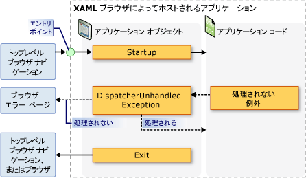

# <a name="application-management-overview"></a>アプリケーション管理の概要
すべてのアプリケーションは、アプリケーションの実装と管理に適用される機能を共有することがよくあります。 このトピックでは、機能の概要を示します、<xref:System.Windows.Application>を作成して、アプリケーションを管理するためのクラスです。  
   
  
## <a name="the-application-class"></a>Application クラス  
 [!INCLUDE[TLA2#tla_wpf](../../../../includes/tla2sharptla-wpf-md.md)]にアプリケーション スコープの共通の機能がカプセル化されて、<xref:System.Windows.Application>クラスです。 <xref:System.Windows.Application>クラスには、次の機能が含まれています。  
  
-   アプリケーションの有効期間を追跡し、相互作用する。  
  
-   コマンド ライン パラメーターを取得し、処理する。  
  
-   未処理の例外を検出し、応答する。  
  
-   アプリケーション スコープのプロパティと リソースを共有する。  
  
-   スタンドアロン アプリケーションのウィンドウを管理する。  
  
-   ナビゲーションを追跡し、管理する。  
  
<a name="The_Application_Class"></a>   
## <a name="how-to-perform-common-tasks-using-the-application-class"></a>アプリケーションのクラスを使用して一般的なタスクを実行する方法  
 すべての詳細の必要がないかどうか、<xref:System.Windows.Application>クラスでは、次の表の一般的なタスク<xref:System.Windows.Application>およびそれを達成する方法です。 関連する API とトピックを表示することによって、詳細情報とサンプル コードを参照できます。  
  
|タスク|方法|  
|----------|--------------|  
|現在のアプリケーションを表すオブジェクトを取得する|<xref:System.Windows.Application.Current%2A?displayProperty=nameWithType> プロパティを使用します。|  
|起動画面をアプリケーションに追加する|参照してください[WPF アプリケーションのスプラッシュ スクリーンを追加](../../../../docs/framework/wpf/app-development/how-to-add-a-splash-screen-to-a-wpf-application.md)です。|  
|アプリケーションを起動する|<xref:System.Windows.Application.Run%2A?displayProperty=nameWithType> メソッドを使用します。|  
|アプリケーションを停止する|使用して、<xref:System.Windows.Application.Shutdown%2A>のメソッド、<xref:System.Windows.Application.Current%2A?displayProperty=nameWithType>オブジェクト。|  
|コマンド ラインから引数を取得する|処理、<xref:System.Windows.Application.Startup?displayProperty=nameWithType>イベントと使用、<xref:System.Windows.StartupEventArgs.Args%2A?displayProperty=nameWithType>プロパティです。 例については、次を参照してください。、<xref:System.Windows.Application.Startup?displayProperty=nameWithType>イベント。|  
|アプリケーションの終了コードを取得し、設定する|設定、<xref:System.Windows.ExitEventArgs.ApplicationExitCode%2A?displayProperty=nameWithType>プロパティに、<xref:System.Windows.Application.Exit?displayProperty=nameWithType>イベント ハンドラーまたは呼び出し、<xref:System.Windows.Application.Shutdown%2A>メソッドおよび整数を渡します。|  
|未処理の例外を検出し、応答する|処理、<xref:System.Windows.Application.DispatcherUnhandledException>イベント。|  
|アプリケーション スコープのリソースを取得し、設定する|<xref:System.Windows.Application.Resources%2A?displayProperty=nameWithType> プロパティを使用します。|  
|アプリケーション スコープのリソース ディクショナリを使用する|参照してください[アプリケーション スコープのリソース ディクショナリを使用する](../../../../docs/framework/wpf/app-development/how-to-use-an-application-scope-resource-dictionary.md)です。|  
|アプリケーション スコープのプロパティを取得し、設定する|<xref:System.Windows.Application.Properties%2A?displayProperty=nameWithType> プロパティを使用します。|  
|アプリケーションの状態を取得し、保存する|参照してください[永続化し、アプリケーション セッション間でのアプリケーション スコープのプロパティを復元](../../../../docs/framework/wpf/app-development/persist-and-restore-application-scope-properties.md)です。|  
|リソース ファイル、コンテンツ ファイル、起点ファイルなど、コード以外のデータ ファイルを管理する。|参照してください[WPF アプリケーションのリソース、コンテンツ、およびデータ ファイル](../../../../docs/framework/wpf/app-development/wpf-application-resource-content-and-data-files.md)です。|  
|スタンドアロン アプリケーションのウィンドウを管理する|「[WPF ウィンドウの概要](../../../../docs/framework/wpf/app-development/wpf-windows-overview.md)」を参照してください。|  
|ナビゲーションを追跡し、管理する|参照してください[ナビゲーション概要](../../../../docs/framework/wpf/app-development/navigation-overview.md)です。|  
  
<a name="The_Application_Definition"></a>   
## <a name="the-application-definition"></a>アプリケーション定義  
 機能を利用する、<xref:System.Windows.Application>クラス、アプリケーション定義を実装する必要があります。 A[!INCLUDE[TLA2#tla_wpf](../../../../includes/tla2sharptla-wpf-md.md)]アプリケーション定義から派生するクラスは、<xref:System.Windows.Application>で特別な構成[!INCLUDE[TLA#tla_msbuild](../../../../includes/tlasharptla-msbuild-md.md)]設定します。  
  
### <a name="implementing-an-application-definition"></a>アプリケーション定義の実装  
 一般的な[!INCLUDE[TLA2#tla_wpf](../../../../includes/tla2sharptla-wpf-md.md)]アプリケーション定義は、マークアップと分離コードの両方を使用して実装されます。 これにより、マークアップを使用して、アプリケーションのプロパティやリソースを宣言によって設定したり、イベントを登録したりでき、分離コードでイベントを処理し、アプリケーション固有の動作を実装することができます。  
  
 次の例では、マークアップと分離コードの両方を使用してアプリケーション定義を実装する方法を示します。  
  
 [!code-xaml[ApplicationSnippets#ApplicationXAML](../../../../samples/snippets/csharp/VS_Snippets_Wpf/ApplicationSnippets/CSharp/App.xaml#applicationxaml)]  
  
 [!code-csharp[ApplicationSnippets#ApplicationCODEBEHIND](../../../../samples/snippets/csharp/VS_Snippets_Wpf/ApplicationSnippets/CSharp/App.xaml.cs#applicationcodebehind)]
 [!code-vb[ApplicationSnippets#ApplicationCODEBEHIND](../../../../samples/snippets/visualbasic/VS_Snippets_Wpf/ApplicationSnippets/visualbasic/application.xaml.vb#applicationcodebehind)]  
  
 マークアップ ファイルと分離コード ファイルを連携させるには、次のようにする必要があります。  
  
-   マークアップで、`Application`要素を含める必要があります、`x:Class`属性。 アプリケーションのビルド時の存在`x:Class`マークアップ ファイルが原因となって[!INCLUDE[TLA2#tla_msbuild](../../../../includes/tla2sharptla-msbuild-md.md)]を作成する、`partial`から派生したクラス<xref:System.Windows.Application>によって指定される名前を持つ、`x:Class`属性。 追加が必要です、[!INCLUDE[TLA2#tla_xml](../../../../includes/tla2sharptla-xml-md.md)]の名前空間宣言、[!INCLUDE[TLA2#tla_xaml](../../../../includes/tla2sharptla-xaml-md.md)]スキーマ ( `xmlns:x="http://schemas.microsoft.com/winfx/2006/xaml"` )。  
  
-   分離コード クラスがある必要があります、`partial`によって指定される同じ名前のクラス、`x:Class`マークアップ属性し、から派生する必要があります<xref:System.Windows.Application>です。 これにより、分離コード ファイルに関連付けられる、`partial`アプリケーションのビルド時に、マークアップ ファイルに対して生成されるクラス (を参照してください[WPF アプリケーションのビルド](../../../../docs/framework/wpf/app-development/building-a-wpf-application-wpf.md))。  
  
> [!NOTE]
>  使用して、新しい WPF アプリケーション プロジェクトまたは WPF ブラウザー アプリケーション プロジェクトを作成する場合[!INCLUDE[TLA#tla_visualstu](../../../../includes/tlasharptla-visualstu-md.md)]、アプリケーション定義が既定では含まれており、マークアップと分離コードの両方を使用して定義します。  
  
 このコードは、アプリケーション定義を実装するために最低限必要です。 ただし、追加の[!INCLUDE[TLA2#tla_msbuild](../../../../includes/tla2sharptla-msbuild-md.md)]構成する必要がありますを構築して、アプリケーションを実行する前にアプリケーション定義します。  
  
### <a name="configuring-the-application-definition-for-msbuild"></a>MSBuild 用のアプリケーション定義の構成  
 スタンドアロン アプリケーションと[!INCLUDE[TLA#tla_xbap#plural](../../../../includes/tlasharptla-xbapsharpplural-md.md)]を実行する前に、インフラストラクチャの特定のレベルの実装を必要とします。 このインフラストラクチャの最も重要な部分は、エントリ ポイントです。 ユーザーがアプリケーションを起動するとき、オペレーティング システムはエントリ ポイントを呼び出します。これは、アプリケーションを起動するための、よく知られている機能です。  
  
 従来、開発者は、テクノロジに応じて、このコードの一部または全部を自分で記述する必要がありました。 ただし、[!INCLUDE[TLA2#tla_wpf](../../../../includes/tla2sharptla-wpf-md.md)]として、アプリケーション定義のマークアップ ファイルが構成されている場合のこのコードを生成、 [!INCLUDE[TLA2#tla_msbuild](../../../../includes/tla2sharptla-msbuild-md.md)] `ApplicationDefinition`項目を次に示すように[!INCLUDE[TLA2#tla_msbuild](../../../../includes/tla2sharptla-msbuild-md.md)]プロジェクト ファイル。  
  
```xml  
<Project   
  DefaultTargets="Build"  
                        xmlns="http://schemas.microsoft.com/developer/msbuild/2003">  
  ...  
  <ApplicationDefinition Include="App.xaml" />  
  <Compile Include="App.xaml.cs" />  
  ...  
</Project>  
```  
  
 としてマークされている分離コード ファイルにコードが含まれているため、 [!INCLUDE[TLA2#tla_msbuild](../../../../includes/tla2sharptla-msbuild-md.md)] `Compile`アイテムのアイテムとしては通常の動作です。  
  
 これらのアプリケーション[!INCLUDE[TLA2#tla_msbuild](../../../../includes/tla2sharptla-msbuild-md.md)]マークアップと分離コード ファイルにアプリケーション定義の構成により[!INCLUDE[TLA2#tla_msbuild](../../../../includes/tla2sharptla-msbuild-md.md)]次のようにコードを生成します。  
  
 [!code-csharp[AppDefAugSnippets#AppDefAugCODE1](../../../../samples/snippets/csharp/VS_Snippets_Wpf/AppDefAugSnippets/CSharp/App.cs#appdefaugcode1)]
 [!code-vb[AppDefAugSnippets#AppDefAugCODE1](../../../../samples/snippets/visualbasic/VS_Snippets_Wpf/AppDefAugSnippets/VisualBasic/App.vb#appdefaugcode1)]  
[!code-csharp[AppDefAugSnippets#AppDefAugCODE2](../../../../samples/snippets/csharp/VS_Snippets_Wpf/AppDefAugSnippets/CSharp/App.cs#appdefaugcode2)]
[!code-vb[AppDefAugSnippets#AppDefAugCODE2](../../../../samples/snippets/visualbasic/VS_Snippets_Wpf/AppDefAugSnippets/VisualBasic/App.vb#appdefaugcode2)]  
  
 結果のコードは、アプリケーション定義のエントリ ポイント メソッドが含まれる追加のインフラストラクチャ コードを拡張`Main`です。 <xref:System.STAThreadAttribute>属性に適用する、`Main`ことを示すメソッド メイン[!INCLUDE[TLA2#tla_ui](../../../../includes/tla2sharptla-ui-md.md)]のスレッド、[!INCLUDE[TLA2#tla_wpf](../../../../includes/tla2sharptla-wpf-md.md)]アプリケーションは STA スレッドが必要な[!INCLUDE[TLA2#tla_wpf](../../../../includes/tla2sharptla-wpf-md.md)]アプリケーションです。 呼び出されると、`Main`の新しいインスタンスを作成`App`呼び出す前に、`InitializeComponent`マークアップで、イベントを登録し、プロパティを設定するメソッドが実装されます。 `InitializeComponent`が生成された、明示的に呼び出す必要はありません`InitializeComponent`に対して実行するようにアプリケーション定義から<xref:System.Windows.Controls.Page>と<xref:System.Windows.Window>実装します。 最後に、<xref:System.Windows.Application.Run%2A>メソッドが呼び出されてアプリケーションを起動します。  
  
<a name="Getting_the_Current_Application"></a>   
## <a name="getting-the-current-application"></a>現在のアプリケーションの取得  
 の機能、<xref:System.Windows.Application>クラスは、アプリケーション全体で共有されるのインスタンスは 1 つだけ指定できます、<xref:System.Windows.Application>あたりクラス<xref:System.AppDomain>です。 これには、適用する、<xref:System.Windows.Application>クラスがシングルトン クラスとして実装されている (を参照してください[(C#) を実装するシングルトン](http://go.microsoft.com/fwlink/?LinkId=100567))、それ自体の 1 つのインスタンスを作成し、提供する共有を使ってアクセス、 `static` <xref:System.Windows.Application.Current%2A>プロパティ。  
  
 次のコードへの参照を取得する方法を示しています、<xref:System.Windows.Application>現在のオブジェクト<xref:System.AppDomain>です。  
  
 [!code-csharp[ApplicationManagementOverviewSnippets#GetCurrentAppCODE](../../../../samples/snippets/csharp/VS_Snippets_Wpf/ApplicationManagementOverviewSnippets/CSharp/MainWindow.xaml.cs#getcurrentappcode)]
 [!code-vb[ApplicationManagementOverviewSnippets#GetCurrentAppCODE](../../../../samples/snippets/visualbasic/VS_Snippets_Wpf/ApplicationManagementOverviewSnippets/VisualBasic/MainWindow.xaml.vb#getcurrentappcode)]  
  
 <xref:System.Windows.Application.Current%2A> インスタンスへの参照を返します、<xref:System.Windows.Application>クラスです。 参照の場合、<xref:System.Windows.Application>派生クラスの値をキャストする必要があります、<xref:System.Windows.Application.Current%2A>プロパティ、次の例で示すようにします。  
  
 [!code-csharp[ApplicationManagementOverviewSnippets#GetSTCurrentAppCODE](../../../../samples/snippets/csharp/VS_Snippets_Wpf/ApplicationManagementOverviewSnippets/CSharp/MainWindow.xaml.cs#getstcurrentappcode)]
 [!code-vb[ApplicationManagementOverviewSnippets#GetSTCurrentAppCODE](../../../../samples/snippets/visualbasic/VS_Snippets_Wpf/ApplicationManagementOverviewSnippets/VisualBasic/MainWindow.xaml.vb#getstcurrentappcode)]  
  
 値を検査する<xref:System.Windows.Application.Current%2A>の有効期間のどの時点でも、<xref:System.Windows.Application>オブジェクト。 ただし、注意が必要です。 後に、<xref:System.Windows.Application>クラスをインスタンス化は、実行する期間の状態、<xref:System.Windows.Application>オブジェクトに一貫性がありません。 この期間中に<xref:System.Windows.Application>を実行する、さまざまな初期化タスクを実行するには、コードで必要なアプリケーションのインフラストラクチャを確立する、プロパティの設定、イベントを登録するなどです。 使用しようとする場合、<xref:System.Windows.Application>コードがあります。 この期間中にオブジェクトの予期しない結果が、さまざまなに依存している場合に特に<xref:System.Windows.Application>プロパティを設定します。  
  
 ときに<xref:System.Windows.Application>、初期化作業を完了する有効期間にわたってが実際に開始します。  
  
<a name="Application_Lifetime"></a>   
## <a name="application-lifetime"></a>アプリケーションの有効期間  
 有効期間、[!INCLUDE[TLA2#tla_wpf](../../../../includes/tla2sharptla-wpf-md.md)]によって発生するいくつかのイベントによってアプリケーションがマークされている<xref:System.Windows.Application>アプリケーションが開始された時点を通知するアクティブ化され、非アクティブ化し、シャット ダウンされました。  
  
  
<a name="Splash_Screen"></a>   
### <a name="splash-screen"></a>スプラッシュ スクリーン  
 以降では、 [!INCLUDE[net_v35SP1_short](../../../../includes/net-v35sp1-short-md.md)]、起動時のウィンドウで使用するイメージを指定することができますか*スプラッシュ スクリーン*です。 <xref:System.Windows.SplashScreen>クラスでは、簡単に、アプリケーションの読み込み中に、[スタートアップ] ウィンドウを表示します。 <xref:System.Windows.SplashScreen>ウィンドウが作成され、前に表示<xref:System.Windows.Application.Run%2A>と呼びます。 詳細については、次を参照してください。[アプリケーションの起動時間](../../../../docs/framework/wpf/advanced/application-startup-time.md)と[WPF アプリケーションのスプラッシュ スクリーンを追加](../../../../docs/framework/wpf/app-development/how-to-add-a-splash-screen-to-a-wpf-application.md)です。  
  
<a name="Starting_an_Application"></a>   
### <a name="starting-an-application"></a>アプリケーションの起動  
 後に<xref:System.Windows.Application.Run%2A>が呼び出されたと、アプリケーションが初期化される、アプリケーションを実行する準備ができます。 ときにこの時点で表されますが、<xref:System.Windows.Application.Startup>イベントが発生します。  
  
 [!code-csharp[ApplicationStartupSnippets#StartupCODEBEHIND1](../../../../samples/snippets/csharp/VS_Snippets_Wpf/ApplicationStartupSnippets/CSharp/App.xaml.cs#startupcodebehind1)]
 [!code-vb[ApplicationStartupSnippets#StartupCODEBEHIND1](../../../../samples/snippets/visualbasic/VS_Snippets_Wpf/ApplicationStartupSnippets/visualbasic/application.xaml.vb#startupcodebehind1)]  
[!code-csharp[ApplicationStartupSnippets#StartupCODEBEHIND2](../../../../samples/snippets/csharp/VS_Snippets_Wpf/ApplicationStartupSnippets/CSharp/App.xaml.cs#startupcodebehind2)]
[!code-vb[ApplicationStartupSnippets#StartupCODEBEHIND2](../../../../samples/snippets/visualbasic/VS_Snippets_Wpf/ApplicationStartupSnippets/visualbasic/application.xaml.vb#startupcodebehind2)]  
  
 この時点で、アプリケーションの有効期間を行うには、最も一般的なことは表示、[!INCLUDE[TLA2#tla_ui](../../../../includes/tla2sharptla-ui-md.md)]です。  
  
<a name="Showing_a_User_Interface"></a>   
### <a name="showing-a-user-interface"></a>ユーザー インターフェイスの表示  
 ほとんどのスタンドアロンの Windows アプリケーションを開く、<xref:System.Windows.Window>開始時期を実行しています。 <xref:System.Windows.Application.Startup>次のコードに示すように、イベント ハンドラーは 1 つの場所がこれを行うことができます。  
  
 [!code-xaml[AppShowWindowHardSnippets#StartupEventMARKUP](../../../../samples/snippets/csharp/VS_Snippets_Wpf/AppShowWindowHardSnippets/CSharp/App.xaml#startupeventmarkup)]  
  
 [!code-csharp[AppShowWindowHardSnippets#StartupEventCODEBEHIND](../../../../samples/snippets/csharp/VS_Snippets_Wpf/AppShowWindowHardSnippets/CSharp/App.xaml.cs#startupeventcodebehind)]
 [!code-vb[AppShowWindowHardSnippets#StartupEventCODEBEHIND](../../../../samples/snippets/visualbasic/VS_Snippets_Wpf/AppShowWindowHardSnippets/VisualBasic/Application.xaml.vb#startupeventcodebehind)]  
  
> [!NOTE]
>  最初の<xref:System.Windows.Window>スタンドアロンでインスタンス化するアプリケーションでは、既定ではアプリケーションのメイン ウィンドウがします。 これは、<xref:System.Windows.Window>によってオブジェクトが参照される、<xref:System.Windows.Application.MainWindow%2A?displayProperty=nameWithType>プロパティです。 値、<xref:System.Windows.Application.MainWindow%2A>場合よりも、別のウィンドウにプロパティをプログラムで変更できますをインスタンス化<xref:System.Windows.Window>メイン ウィンドウをする必要があります。  
  
 ときに、[!INCLUDE[TLA2#tla_xbap](../../../../includes/tla2sharptla-xbap-md.md)]最初起動すると、これはほとんどの場合に移動、<xref:System.Windows.Controls.Page>です。 これを次のコードに示します。  
  
 [!code-xaml[XBAPAppStartupSnippets#StartupXBAPMARKUP](../../../../samples/snippets/csharp/VS_Snippets_Wpf/XBAPAppStartupSnippets/CSharp/App.xaml#startupxbapmarkup)]  
  
 [!code-csharp[XBAPAppStartupSnippets#StartupXBAPCODEBEHIND](../../../../samples/snippets/csharp/VS_Snippets_Wpf/XBAPAppStartupSnippets/CSharp/App.xaml.cs#startupxbapcodebehind)]
 [!code-vb[XBAPAppStartupSnippets#StartupXBAPCODEBEHIND](../../../../samples/snippets/visualbasic/VS_Snippets_Wpf/XBAPAppStartupSnippets/VisualBasic/Application.xaml.vb#startupxbapcodebehind)]  
  
 処理する場合<xref:System.Windows.Application.Startup>のみ開く、<xref:System.Windows.Window>かに移動して、 <xref:System.Windows.Controls.Page>、設定することができます、`StartupUri`マークアップの属性の代わりにします。  
  
 次の例を使用する方法を示しています、<xref:System.Windows.Application.StartupUri%2A>を開くにはスタンドアロン アプリケーションから、<xref:System.Windows.Window>です。  
  
 [!code-xaml[ApplicationManagementOverviewSnippets#OverviewStartupUriMARKUP](../../../../samples/snippets/csharp/VS_Snippets_Wpf/ApplicationManagementOverviewSnippets/CSharp/App.xaml#overviewstartupurimarkup)]  
  
 次の例は、使用する方法を示しています。<xref:System.Windows.Application.StartupUri%2A>から、[!INCLUDE[TLA2#tla_xbap](../../../../includes/tla2sharptla-xbap-md.md)]に移動する、<xref:System.Windows.Controls.Page>です。  
  
 [!code-xaml[PageSnippets#XBAPStartupUriMARKUP](../../../../samples/snippets/csharp/VS_Snippets_Wpf/PageSnippets/CSharp/App.xaml#xbapstartupurimarkup)]  
  
 このマークアップは、ウィンドウを開くことについて、前のコードと同じ効果があります。  
  
> [!NOTE]
>  ナビゲーションの詳細については、次を参照してください。[ナビゲーション概要](../../../../docs/framework/wpf/app-development/navigation-overview.md)です。  
  
 処理する必要があります、<xref:System.Windows.Application.Startup>イベントを開くには、<xref:System.Windows.Window>既定以外のコンス トラクターを使用してそれをインスタンス化する必要がありますまたはそのプロパティを設定または表示するには、前にそのイベントをサブスクライブする必要がありますまたはコマンドライン引数を処理する必要がある場合ですアプリケーションを起動したときに指定されました。  
  
<a name="Processing_Command_Line_Arguments"></a>   
### <a name="processing-command-line-arguments"></a>コマンド ライン引数の処理  
 Windows には、コマンド プロンプトまたはデスクトップのいずれかからスタンドアロン アプリケーションを起動することができます。 どちらの場合も、コマンド ライン引数をアプリケーションに渡すことができます。 次の例は、1 つのコマンド ライン引数 "/StartMinimized" を指定して起動されるアプリケーションを示しています。  
  
 `wpfapplication.exe /StartMinimized`  
  
 アプリケーションの初期化中に[!INCLUDE[TLA2#tla_wpf](../../../../includes/tla2sharptla-wpf-md.md)]オペレーティング システムから、コマンドライン引数を取得し、コマンドを渡し、<xref:System.Windows.Application.Startup>を介してイベント ハンドラー、<xref:System.Windows.StartupEventArgs.Args%2A>のプロパティ、<xref:System.Windows.StartupEventArgs>パラメーター。 次のようなコードを使用して、コマンド ライン引数を取得し、格納することができます。  
  
 [!code-xaml[ApplicationStartupSnippets#HandleStartupXAML](../../../../samples/snippets/csharp/VS_Snippets_Wpf/ApplicationStartupSnippets/CSharp/App.xaml#handlestartupxaml)]  
  
 [!code-csharp[ApplicationStartupSnippets#HandleStartupCODEBEHIND](../../../../samples/snippets/csharp/VS_Snippets_Wpf/ApplicationStartupSnippets/CSharp/App.xaml.cs#handlestartupcodebehind)]
 [!code-vb[ApplicationStartupSnippets#HandleStartupCODEBEHIND](../../../../samples/snippets/visualbasic/VS_Snippets_Wpf/ApplicationStartupSnippets/visualbasic/application.xaml.vb#handlestartupcodebehind)]  
  
 コード ハンドル<xref:System.Windows.Application.Startup>を確認するかどうか、 **/StartMinimized**コマンドライン引数が指定されました。 でメイン ウィンドウを開きます。 その場合は、、<xref:System.Windows.WindowState>の<xref:System.Windows.WindowState.Minimized>します。 ため、<xref:System.Windows.Window.WindowState%2A>はプロパティを設定、プログラムによって、メイン<xref:System.Windows.Window>コードで明示的に開く必要があります。  
  
 [!INCLUDE[TLA2#tla_xbap#plural](../../../../includes/tla2sharptla-xbapsharpplural-md.md)] 取得しを使用して起動するためにコマンドライン引数を処理できません[!INCLUDE[TLA#tla_clickonce](../../../../includes/tlasharptla-clickonce-md.md)]展開 (を参照してください[WPF アプリケーションを配置する](../../../../docs/framework/wpf/app-development/deploying-a-wpf-application-wpf.md))。 ただし、起動に使用される URL のクエリ文字列パラメーターを取得して処理することはできます。  
  
<a name="Application_Activation_and_Deactivation"></a>   
### <a name="application-activation-and-deactivation"></a>アプリケーションのアクティブ化と非アクティブ化  
 Windows では、アプリケーション間で切り替えることができます。 最も一般的な方法は、Alt キーを押しながら Tab キーを押す方法です。 アプリケーションのみに切り替えられる場合は、表示がある<xref:System.Windows.Window>項目を選択できます。 現在選択されている<xref:System.Windows.Window>は、*アクティブなウィンドウ*(とも呼ばれる、*前面のウィンドウの*) は、<xref:System.Windows.Window>ユーザー入力を受け取る。 アクティブ ウィンドウで、アプリケーションが、*アクティブなアプリケーション*(または*フォア グラウンド アプリケーション*)。 アプリケーションは、次の状況でアクティブ アプリケーションになります。  
  
-   起動し、示しています、、<xref:System.Windows.Window>です。  
  
-   選択すると、ユーザーが別のアプリケーションからスイッチ、<xref:System.Windows.Window>アプリケーションにします。  
  
 処理することにより、アプリケーションがアクティブになったときに検出することができます、<xref:System.Windows.Application.Activated?displayProperty=nameWithType>イベント。  
  
 同様に、アプリケーションは、次の状況で非アクティブになります。  
  
-   ユーザーが現在のアプリケーションから別のアプリケーションに切り替えた。  
  
-   アプリケーションがシャットダウンされた。  
  
 処理することにより、アプリケーションが非アクティブになったときに検出することができます、<xref:System.Windows.Application.Deactivated?displayProperty=nameWithType>イベント。  
  
 次のコードを処理する方法を示しています、<xref:System.Windows.Application.Activated>と<xref:System.Windows.Application.Deactivated>イベント、アプリケーションがアクティブかどうかを確認します。  
  
 [!code-xaml[ApplicationActivationSnippets#DetectActivationStateXAML](../../../../samples/snippets/csharp/VS_Snippets_Wpf/ApplicationActivationSnippets/CSharp/App.xaml#detectactivationstatexaml)]  
  
 [!code-csharp[ApplicationActivationSnippets#DetectActivationStateCODEBEHIND](../../../../samples/snippets/csharp/VS_Snippets_Wpf/ApplicationActivationSnippets/CSharp/App.xaml.cs#detectactivationstatecodebehind)]
 [!code-vb[ApplicationActivationSnippets#DetectActivationStateCODEBEHIND](../../../../samples/snippets/visualbasic/VS_Snippets_Wpf/ApplicationActivationSnippets/visualbasic/application.xaml.vb#detectactivationstatecodebehind)]  
  
 A<xref:System.Windows.Window>もアクティブ化して非アクティブ化します。 詳細については、「<xref:System.Windows.Window.Activated?displayProperty=nameWithType>」および「<xref:System.Windows.Window.Deactivated?displayProperty=nameWithType>」を参照してください。  
  
> [!NOTE]
>  どちらも<xref:System.Windows.Application.Activated?displayProperty=nameWithType>も<xref:System.Windows.Application.Deactivated?displayProperty=nameWithType>に対して発生[!INCLUDE[TLA2#tla_xbap#plural](../../../../includes/tla2sharptla-xbapsharpplural-md.md)]です。  
  
<a name="Application_Shutdown"></a>   
### <a name="application-shutdown"></a>アプリケーションのシャットダウン  
 アプリケーションの有効期間は、シャット ダウンされると終了します。シャットダウンは、次の理由で発生します。  
  
-   ユーザーが閉じたすべて<xref:System.Windows.Window>です。  
  
-   ユーザーがメインを閉じる<xref:System.Windows.Window>です。  
  
-   ユーザーは、ログオフまたはシャット ダウンによって、Windows セッションを終了します。  
  
-   アプリケーション固有の条件が満たされた。  
  
 アプリケーションのシャット ダウンを管理するために<xref:System.Windows.Application>提供、<xref:System.Windows.Application.Shutdown%2A>メソッド、<xref:System.Windows.Application.ShutdownMode%2A>プロパティ、および<xref:System.Windows.Application.SessionEnding>と<xref:System.Windows.Application.Exit>イベント。  
  
> [!NOTE]
>  <xref:System.Windows.Application.Shutdown%2A> 持つアプリケーションからのみ呼び出すことができます<xref:System.Security.Permissions.UIPermission>です。 スタンドアロン[!INCLUDE[TLA2#tla_wpf](../../../../includes/tla2sharptla-wpf-md.md)]アプリケーションは常にこの権限を持っています。 ただし、[!INCLUDE[TLA2#tla_xbap#plural](../../../../includes/tla2sharptla-xbapsharpplural-md.md)]しないインターネット ゾーンの部分的に信頼されたセキュリティ サンド ボックスで実行されています。  
  
#### <a name="shutdown-mode"></a>シャットダウン モード  
 ほとんどのアプリケーションは、すべてのウィンドウが閉じられるか、メイン ウィンドウが閉じられたときにシャットダウンします。 ただし、場合によっては、他のアプリケーションに固有の条件によって、アプリケーションがシャット ダウンするタイミングに影響します。 対象アプリケーションはシャット ダウンを設定して条件を指定することができます<xref:System.Windows.Application.ShutdownMode%2A>、次のいずれかの<xref:System.Windows.ShutdownMode>列挙値。  
  
-   <xref:System.Windows.ShutdownMode.OnLastWindowClose>  
  
-   <xref:System.Windows.ShutdownMode.OnMainWindowClose>  
  
-   <xref:System.Windows.ShutdownMode.OnExplicitShutdown>  
  
 既定値の<xref:System.Windows.Application.ShutdownMode%2A>は<xref:System.Windows.ShutdownMode.OnLastWindowClose>アプリケーションに自動的にシャット ダウン、ユーザーがアプリケーションの最後のウィンドウが閉じられたときにことを意味します。 ただし、アプリケーションをシャット ダウンする場合、メイン ウィンドウが閉じているときに、[!INCLUDE[TLA2#tla_wpf](../../../../includes/tla2sharptla-wpf-md.md)]自動的に設定した場合は<xref:System.Windows.Application.ShutdownMode%2A>に<xref:System.Windows.ShutdownMode.OnMainWindowClose>です。 これを次の例に示します。  
  
 [!code-xaml[ApplicationShutdownModeSnippets#OnMainWindowCloseMARKUP](../../../../samples/snippets/csharp/VS_Snippets_Wpf/ApplicationShutdownModeSnippets/CS/Page1.xaml#onmainwindowclosemarkup)]  
  
 設定するアプリケーション固有のシャット ダウンの条件を確認したら、<xref:System.Windows.Application.ShutdownMode%2A>に<xref:System.Windows.ShutdownMode.OnExplicitShutdown>です。 ここではユーザーの責任を明示的に呼び出すことによって、アプリケーションをシャット ダウン、<xref:System.Windows.Application.Shutdown%2A>メソッドです。 それ以外の場合、アプリケーションは引き続きすべてのウィンドウを閉じた場合でも実行します。 注意してください<xref:System.Windows.Application.Shutdown%2A>は暗黙的に呼び出されます場合、<xref:System.Windows.Application.ShutdownMode%2A>か<xref:System.Windows.ShutdownMode.OnLastWindowClose>または<xref:System.Windows.ShutdownMode.OnMainWindowClose>です。  
  
> [!NOTE]
>  <xref:System.Windows.Application.ShutdownMode%2A> 設定することができます、[!INCLUDE[TLA2#tla_xbap](../../../../includes/tla2sharptla-xbap-md.md)]は無視されますが、;[!INCLUDE[TLA2#tla_xbap](../../../../includes/tla2sharptla-xbap-md.md)]が常にシャット ダウンに移動したときから離れていても、ブラウザーまたはブラウザーをホストするときに、[!INCLUDE[TLA2#tla_xbap](../../../../includes/tla2sharptla-xbap-md.md)]が閉じられます。 詳細については、「[ナビゲーションの概要](../../../../docs/framework/wpf/app-development/navigation-overview.md)」を参照してください。  
  
#### <a name="session-ending"></a>セッションの終了  
 シャット ダウンの条件で説明されている、<xref:System.Windows.Application.ShutdownMode%2A>プロパティは、アプリケーションに固有です。 ただし、場合によっては、アプリケーションは、外部条件の結果としてシャットダウンすることもあります。 最も一般的な外部の状態は、ユーザーが次のアクションによって Windows セッションを終了したときに発生します。  
  
-   ログオフ  
  
-   シャット ダウン  
  
-   再起動  
  
-   休止  
  
 Windows セッションの終了時に検出すると、処理、<xref:System.Windows.Application.SessionEnding>イベント、次の例に示すようにします。  
  
 [!code-xaml[ApplicationSessionEndingSnippets#HandlingSessionEndingXAML](../../../../samples/snippets/csharp/VS_Snippets_Wpf/ApplicationSessionEndingSnippets/CSharp/App.xaml#handlingsessionendingxaml)]  
  
 [!code-csharp[ApplicationSessionEndingSnippets#HandlingSessionEndingCODEBEHIND](../../../../samples/snippets/csharp/VS_Snippets_Wpf/ApplicationSessionEndingSnippets/CSharp/App.xaml.cs#handlingsessionendingcodebehind)]
 [!code-vb[ApplicationSessionEndingSnippets#HandlingSessionEndingCODEBEHIND](../../../../samples/snippets/visualbasic/VS_Snippets_Wpf/ApplicationSessionEndingSnippets/visualbasic/application.xaml.vb#handlingsessionendingcodebehind)]  
  
 この例では、コードを検査、 <xref:System.Windows.SessionEndingCancelEventArgs.ReasonSessionEnding%2A> Windows セッションが終了する方法を決定するプロパティです。 この値を使用して、ユーザーに確認メッセージを表示します。 コードを設定する場合は、ユーザーはセッションを終了、<xref:System.ComponentModel.CancelEventArgs.Cancel%2A>に`true`Windows セッションが終了するを防ぐにします。  
  
> [!NOTE]
>  <xref:System.Windows.Application.SessionEnding> 発生しません[!INCLUDE[TLA2#tla_xbap#plural](../../../../includes/tla2sharptla-xbapsharpplural-md.md)]です。  
  
#### <a name="exit"></a>終了  
 アプリケーションがシャット ダウンするときには、アプリケーション状態の保存など、いくつかの最終処理を実行しなければならない場合があります。 このような場合は、処理することができます、<xref:System.Windows.Application.Exit>イベント。  
  
 [!code-xaml[HOWTOApplicationModelSnippets#PersistRestoreAppScopePropertiesXAML1](../../../../samples/snippets/csharp/VS_Snippets_Wpf/HOWTOApplicationModelSnippets/CSharp/App.xaml#persistrestoreappscopepropertiesxaml1)]  
[!code-xaml[HOWTOApplicationModelSnippets#PersistRestoreAppScopePropertiesXAML2](../../../../samples/snippets/csharp/VS_Snippets_Wpf/HOWTOApplicationModelSnippets/CSharp/App.xaml#persistrestoreappscopepropertiesxaml2)]  
  
 [!code-csharp[HOWTOApplicationModelSnippets#PersistAppScopePropertiesCODEBEHIND1](../../../../samples/snippets/csharp/VS_Snippets_Wpf/HOWTOApplicationModelSnippets/CSharp/App.xaml.cs#persistappscopepropertiescodebehind1)]
 [!code-vb[HOWTOApplicationModelSnippets#PersistAppScopePropertiesCODEBEHIND1](../../../../samples/snippets/visualbasic/VS_Snippets_Wpf/HOWTOApplicationModelSnippets/visualbasic/application.xaml.vb#persistappscopepropertiescodebehind1)]  
[!code-csharp[HOWTOApplicationModelSnippets#PersistAppScopePropertiesCODEBEHIND2](../../../../samples/snippets/csharp/VS_Snippets_Wpf/HOWTOApplicationModelSnippets/CSharp/App.xaml.cs#persistappscopepropertiescodebehind2)]
[!code-vb[HOWTOApplicationModelSnippets#PersistAppScopePropertiesCODEBEHIND2](../../../../samples/snippets/visualbasic/VS_Snippets_Wpf/HOWTOApplicationModelSnippets/visualbasic/application.xaml.vb#persistappscopepropertiescodebehind2)]  
  
 完了の例では、次を参照してください。[永続化し、アプリケーション セッション間でアプリケーション スコープのプロパティを復元](../../../../docs/framework/wpf/app-development/persist-and-restore-application-scope-properties.md)です。  
  
 <xref:System.Windows.Application.Exit> 両方のスタンドアロン アプリケーションで処理できると[!INCLUDE[TLA2#tla_xbap#plural](../../../../includes/tla2sharptla-xbapsharpplural-md.md)]です。 [!INCLUDE[TLA2#tla_xbap#plural](../../../../includes/tla2sharptla-xbapsharpplural-md.md)]、<xref:System.Windows.Application.Exit>ときに、次の状況が発生します。  
  
-   [!INCLUDE[TLA2#tla_xbap](../../../../includes/tla2sharptla-xbap-md.md)]から移動します。  
  
-   [!INCLUDE[TLA2#tla_ie7](../../../../includes/tla2sharptla-ie7-md.md)]、ときに、タブをホストしている、[!INCLUDE[TLA2#tla_xbap](../../../../includes/tla2sharptla-xbap-md.md)]が閉じられます。  
  
-   ブラウザーが閉じられた。  
  
#### <a name="exit-code"></a>終了コード  
 ほとんどのアプリケーションは、ユーザー要求に応じてオペレーティング システムから起動されます。 ただし、アプリケーションは、特定のタスクを実行するために、別のアプリケーションに起動されることもあります。 起動されたアプリケーションがシャット ダウンするとき、起動元のアプリケーションは、起動されたアプリケーションのシャット ダウン条件を知ならなければならないことがあります。 これらの状況では、Windows は、アプリケーションをシャット ダウン時に、アプリケーションの終了コードを返すをできます。 既定では、[!INCLUDE[TLA2#tla_wpf](../../../../includes/tla2sharptla-wpf-md.md)]アプリケーションは、値の終了コード 0 を返します。  
  
> [!NOTE]
>  デバッグする場合に[!INCLUDE[TLA2#tla_visualstu](../../../../includes/tla2sharptla-visualstu-md.md)]、アプリケーションの終了コードに表示されます、**出力**アプリケーションがシャット ダウンした、次のようになりますが、メッセージ内のウィンドウ。  
>   
>  `The program '[5340] AWPFApp.vshost.exe: Managed' has exited with code 0 (0x0).`  
>   
>  開く、**出力** をクリックしてウィンドウ**出力**上、**ビュー**メニュー。  
  
 終了コードを変更するに呼び出せる、<xref:System.Windows.Application.Shutdown%28System.Int32%29>過負荷、終了コードを指定する整数の引数を受け入れます。  
  
 [!code-csharp[ApplicationExitSnippets#AppExitCODE](../../../../samples/snippets/csharp/VS_Snippets_Wpf/ApplicationExitSnippets/CSharp/MainWindow.xaml.cs#appexitcode)]
 [!code-vb[ApplicationExitSnippets#AppExitCODE](../../../../samples/snippets/visualbasic/VS_Snippets_Wpf/ApplicationExitSnippets/visualbasic/mainwindow.xaml.vb#appexitcode)]  
  
 終了コードの値を検出して処理することにより、変更、<xref:System.Windows.Application.Exit>イベント。 <xref:System.Windows.Application.Exit>渡されるイベント ハンドラー、 <xref:System.Windows.ExitEventArgs> exit を使用してコードにアクセスできるように、<xref:System.Windows.ExitEventArgs.ApplicationExitCode%2A>プロパティです。 詳細については、「<xref:System.Windows.Application.Exit>」を参照してください。  
  
> [!NOTE]
>  両方のスタンドアロン アプリケーションで、終了コードを設定することができ、[!INCLUDE[TLA2#tla_xbap#plural](../../../../includes/tla2sharptla-xbapsharpplural-md.md)]です。 ただし、終了コード値は無視されます[!INCLUDE[TLA2#tla_xbap#plural](../../../../includes/tla2sharptla-xbapsharpplural-md.md)]です。  
  
<a name="Unhandled_Exceptions"></a>   
### <a name="unhandled-exceptions"></a>未処理の例外  
 ときには、アプリケーションは、予期しない例外がスローされたときなど、異常な条件下でシャットダウンすることがあります。 この場合、アプリケーションには、例外を検出して処理するためのコードがありません。 この種類の例外は、未処理の例外と呼ばれます。アプリケーションが閉じられる前に、次の図に示されているような通知が表示されます。  
  
   
  
 ユーザー エクスペリエンスの観点から、アプリケーションは、次のいずれか、またはすべてを行うことによって、この既定の動作を回避することをお勧めします。  
  
-   わかりやすい情報を表示する。  
  
-   アプリケーションの続行を試みる。  
  
-   記録の詳細、開発者向け、例外、Windows イベント ログにします。  
  
 このサポートの実装によって異なります、未処理の例外を検出できることはどのような<xref:System.Windows.Application.DispatcherUnhandledException>に対してイベントが生成されます。  
  
 [!code-xaml[ApplicationDispatcherUnhandledExceptionSnippets#HandleDispatcherUnhandledExceptionXAML](../../../../samples/snippets/csharp/VS_Snippets_Wpf/ApplicationDispatcherUnhandledExceptionSnippets/CSharp/App.xaml#handledispatcherunhandledexceptionxaml)]  
  
 [!code-csharp[ApplicationDispatcherUnhandledExceptionSnippets#HandleDispatcherUnhandledExceptionCODEBEHIND1](../../../../samples/snippets/csharp/VS_Snippets_Wpf/ApplicationDispatcherUnhandledExceptionSnippets/CSharp/App.xaml.cs#handledispatcherunhandledexceptioncodebehind1)]
 [!code-vb[ApplicationDispatcherUnhandledExceptionSnippets#HandleDispatcherUnhandledExceptionCODEBEHIND1](../../../../samples/snippets/visualbasic/VS_Snippets_Wpf/ApplicationDispatcherUnhandledExceptionSnippets/visualbasic/application.xaml.vb#handledispatcherunhandledexceptioncodebehind1)]  
[!code-csharp[ApplicationDispatcherUnhandledExceptionSnippets#HandleDispatcherUnhandledExceptionCODEBEHIND2](../../../../samples/snippets/csharp/VS_Snippets_Wpf/ApplicationDispatcherUnhandledExceptionSnippets/CSharp/App.xaml.cs#handledispatcherunhandledexceptioncodebehind2)]
[!code-vb[ApplicationDispatcherUnhandledExceptionSnippets#HandleDispatcherUnhandledExceptionCODEBEHIND2](../../../../samples/snippets/visualbasic/VS_Snippets_Wpf/ApplicationDispatcherUnhandledExceptionSnippets/visualbasic/application.xaml.vb#handledispatcherunhandledexceptioncodebehind2)]  
  
 <xref:System.Windows.Application.DispatcherUnhandledException>渡されるイベント ハンドラー、<xref:System.Windows.Threading.DispatcherUnhandledExceptionEventArgs>例外自体を含め、未処理の例外に関するコンテキスト情報を含むパラメーター (<xref:System.Windows.Threading.DispatcherUnhandledExceptionEventArgs.Exception%2A?displayProperty=nameWithType>)。 この情報を使用して、例外の処理方法を決定できます。  
  
 処理するときに<xref:System.Windows.Application.DispatcherUnhandledException>、設定する必要があります、<xref:System.Windows.Threading.DispatcherUnhandledExceptionEventArgs.Handled%2A?displayProperty=nameWithType>プロパティを`true`、それ以外の[!INCLUDE[TLA2#tla_wpf](../../../../includes/tla2sharptla-wpf-md.md)]まだ未処理の例外を考慮し、前に説明した既定の動作に戻ります。 未処理の例外が発生した場合、<xref:System.Windows.Application.DispatcherUnhandledException>イベントが処理されない、またはイベントを処理および<xref:System.Windows.Threading.DispatcherUnhandledExceptionEventArgs.Handled%2A>に設定されている`false`アプリケーションがすぐにシャット ダウンします。 さらに、他の<xref:System.Windows.Application>イベントが発生します。 そのため、処理する必要があります<xref:System.Windows.Application.DispatcherUnhandledException>アプリケーションに、アプリケーションがシャット ダウンする前に実行する必要がありますのあるコードがある場合。  
  
 アプリケーションは、未処理の例外の結果としてシャットダウンすることがありますが、通常は、次のセクションで説明されているように、ユーザーの要求に応じてシャットダウンします。  
  
<a name="Application_Lifetime_Events"></a>   
### <a name="application-lifetime-events"></a>アプリケーションの有効期間イベント  
 スタンドアロン アプリケーションと[!INCLUDE[TLA2#tla_xbap#plural](../../../../includes/tla2sharptla-xbapsharpplural-md.md)]正確に同じの有効期間がありません。 次の図は、スタンドアロン アプリケーションの有効期間中の主なイベントと発生順を示しています。  
  
   
  
 同様に、次の図の重要なイベントの有効期間中に、 [!INCLUDE[TLA2#tla_xbap](../../../../includes/tla2sharptla-xbap-md.md)]、し、発生するシーケンスを示しています。  
  
   
  
## <a name="see-also"></a>関連項目  
 <xref:System.Windows.Application>  
 [WPF ウィンドウの概要](../../../../docs/framework/wpf/app-development/wpf-windows-overview.md)  
 [ナビゲーションの概要](../../../../docs/framework/wpf/app-development/navigation-overview.md)  
 [WPF アプリケーションのリソース ファイル、コンテンツ ファイル、およびデータ ファイル](../../../../docs/framework/wpf/app-development/wpf-application-resource-content-and-data-files.md)  
 [WPF におけるパッケージの URI](../../../../docs/framework/wpf/app-development/pack-uris-in-wpf.md)  
 [アプリケーション モデル: 操作方法に関するトピック](http://msdn.microsoft.com/library/76771b09-3688-4d1c-8818-9b3f4cf39a30)  
 [アプリケーションの開発](../../../../docs/framework/wpf/app-development/index.md)
