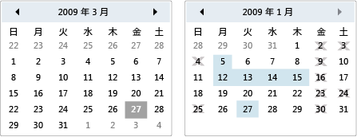

# 予定表
予定表では、ビジュアルな予定表を使用して日付を選択するユーザーができます。  
  
 A<xref:System.Windows.Controls.Calendar>単独、またはドロップダウン リストの一部としてコントロールを使用できる、<xref:System.Windows.Controls.DatePicker>コントロール。 詳細については、「 <xref:System.Windows.Controls.DatePicker> 」を参照してください。  
  
 次の図は 2 つ<xref:System.Windows.Controls.Calendar>選択および選択できない日付に 1 つとなしのいずれかを制御します。  
  
   
予定表コントロール  
  
 次の表に、一般に関連付けられているタスクに関する情報を提供する、<xref:System.Windows.Controls.Calendar>します。  
  
|タスク|実装|  
|----------|--------------------|  
|指定の日付を選択することはできません。|<xref:System.Windows.Controls.Calendar.BlackoutDates%2A> プロパティを使用します。|  
|<xref:System.Windows.Controls.Calendar> 1 か月、1 年、または 10 年を表示します。|設定、<xref:System.Windows.Controls.Calendar.DisplayMode%2A>プロパティを 1 か月、年、または 10 年間です。|  
|ユーザーが日付を選択するかどうか、日付の範囲または複数の日付の範囲を指定します。|使用して、<xref:System.Windows.Controls.Calendar.SelectionMode%2A>します。|  
|日付の範囲を指定する、<xref:System.Windows.Controls.Calendar>が表示されます。|
  <xref:System.Windows.Controls.Calendar.DisplayDateStart%2A> プロパティおよび <xref:System.Windows.Controls.Calendar.DisplayDateEnd%2A> プロパティを使用します。|  
|現在の日付が強調表示されているかどうかを指定します。|<xref:System.Windows.Controls.Calendar.IsTodayHighlighted%2A> プロパティを使用します。 既定では、<xref:System.Windows.Controls.Calendar.IsTodayHighlighted%2A>は`true`します。|  
|サイズを変更、<xref:System.Windows.Controls.Calendar>します。|使用して、<xref:System.Windows.Controls.Viewbox>設定や、<xref:System.Windows.FrameworkElement.LayoutTransform%2A>プロパティを<xref:System.Windows.Media.ScaleTransform>。 設定した場合、<xref:System.Windows.FrameworkElement.Width%2A>と<xref:System.Windows.FrameworkElement.Height%2A>のプロパティを<xref:System.Windows.Controls.Calendar>、実際の予定表では、そのサイズは変更されません。|  
  
 <xref:System.Windows.Controls.Calendar>コントロールがマウスまたはキーボードを使用して基本的なナビゲーションを提供します。 次の表では、キーボード ナビゲーションをまとめたものです。  
  
|キーの組み合わせ|<xref:System.Windows.Controls.Calendar.DisplayMode%2A>|アクション|  
|---------------------|-----------------------------------------------------------------------------------------------------------------------------------------------------------|------------|  
|矢印|<xref:System.Windows.Controls.CalendarMode.Month>|変更、<xref:System.Windows.Controls.Calendar.SelectedDate%2A>プロパティ場合、<xref:System.Windows.Controls.Calendar.SelectionMode%2A>プロパティに設定されていない<xref:System.Windows.Controls.CalendarSelectionMode.None>します。|  
|矢印|<xref:System.Windows.Controls.CalendarMode.Year>|月の変更、<xref:System.Windows.Controls.Calendar.DisplayDate%2A>プロパティ。 なお、<xref:System.Windows.Controls.Calendar.SelectedDate%2A>は変わりません。|  
|矢印|<xref:System.Windows.Controls.CalendarMode.Decade>|年を変更、<xref:System.Windows.Controls.Calendar.DisplayDate%2A>します。 なお、<xref:System.Windows.Controls.Calendar.SelectedDate%2A>は変わりません。|  
|SHIFT + 方向キー|<xref:System.Windows.Controls.CalendarMode.Month>|場合<xref:System.Windows.Controls.Calendar.SelectionMode%2A>に設定されていない<xref:System.Windows.Controls.CalendarSelectionMode.SingleDate>または<xref:System.Windows.Controls.CalendarSelectionMode.None>、選択した日付の範囲が広がります。|  
|ホーム|<xref:System.Windows.Controls.CalendarMode.Month>|変更、<xref:System.Windows.Controls.Calendar.SelectedDate%2A>現在の月の最初の日にします。|  
|ホーム|<xref:System.Windows.Controls.CalendarMode.Year>|月の変更、<xref:System.Windows.Controls.Calendar.DisplayDate%2A>年の最初の月にします。 <xref:System.Windows.Controls.Calendar.SelectedDate%2A>は変わりません。|  
|ホーム|<xref:System.Windows.Controls.CalendarMode.Decade>|年を変更、 <xref:System.Windows.Controls.Calendar.DisplayDate%2A> 10 年の最初の年にします。 <xref:System.Windows.Controls.Calendar.SelectedDate%2A>は変わりません。|  
|End|<xref:System.Windows.Controls.CalendarMode.Month>|変更、<xref:System.Windows.Controls.Calendar.SelectedDate%2A>現在の月の最終日にします。|  
|End|<xref:System.Windows.Controls.CalendarMode.Year>|月の変更、<xref:System.Windows.Controls.Calendar.DisplayDate%2A>年の過去 1 か月にします。 <xref:System.Windows.Controls.Calendar.SelectedDate%2A>は変わりません。|  
|End|<xref:System.Windows.Controls.CalendarMode.Decade>|年を変更、 <xref:System.Windows.Controls.Calendar.DisplayDate%2A> 10 年の最後の年にします。 <xref:System.Windows.Controls.Calendar.SelectedDate%2A>は変わりません。|  
|Ctrl + ↑|どれでも可|次に大きい<xref:System.Windows.Controls.Calendar.DisplayMode%2A>します。 場合<xref:System.Windows.Controls.Calendar.DisplayMode%2A>は既に<xref:System.Windows.Controls.CalendarMode.Decade>操作はありません。|  
|Ctrl +↓|どれでも可|次に小さい<xref:System.Windows.Controls.Calendar.DisplayMode%2A>します。 場合<xref:System.Windows.Controls.Calendar.DisplayMode%2A>は既に<xref:System.Windows.Controls.CalendarMode.Month>操作はありません。|  
|Space キーまたは ENTER|<xref:System.Windows.Controls.CalendarMode.Year> または <xref:System.Windows.Controls.CalendarMode.Decade>|スイッチ<xref:System.Windows.Controls.Calendar.DisplayMode%2A>を<xref:System.Windows.Controls.CalendarMode.Month>または<xref:System.Windows.Controls.CalendarMode.Year>フォーカスがあるアイテムによって表されます。|  
  
## 関連項目
- [コントロール](index.md)
- [スタイルとテンプレート](styling-and-templating.md)
