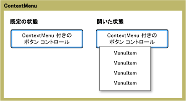

# ContextMenu
<xref:System.Windows.Controls.ContextMenu>コントロールが表示できるように、<xref:System.Windows.Controls.Menu>コントロールのコンテキストに固有です。 通常、<xref:System.Windows.Controls.ContextMenu>で公開されている、[!INCLUDE[TLA#tla_ui](../../../../includes/tlasharptla-ui-md.md)]マウスの右ボタンまたはキーボードのメニュー ボタンを使用します。  
  
 次の図は、<xref:System.Windows.Controls.ContextMenu>の 2 つの異なる状態: 既定の状態と開いている状態です。 既定の状態では、コントロールが折りたたまれています。 メニューの親の上でマウスの右ボタンが押されると、コントロールを展開し、メニュー項目を表示します。  
  
   
さまざまな状態でコンテキスト メニュー  
  
## このセクションの内容  
 [ContextMenu の概要](../../../../docs/framework/wpf/controls/contextmenu-overview.md)  
  
## 参照  
 <xref:System.Windows.Controls.ContextMenu>  
  
## 関連項目
