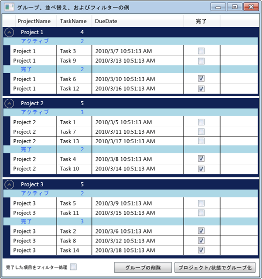

# 方法: DataGrid コントロールでデータをグループ化、並べ替え、およびフィルター処理する
<xref:System.Windows.Controls.DataGrid> はグループ化、並べ替え、フィルターなどを適用することによって、さまざまな角度からデータを表示することができます。  <xref:System.Windows.Controls.DataGrid> のデータをグループ化、並べ替え、およびフィルター処理するには、これらの機能がサポートされている <xref:System.Windows.Data.CollectionView> に DataGrid をバインドします。  そうすると、<xref:System.Windows.Data.CollectionView> のデータを操作できるようになり、基になるソース データに影響が及ぶことはありません。  コレクション ビューにおける変更は、<xref:System.Windows.Controls.DataGrid> のユーザー インターフェイス \(UI\) に反映されます。  
  
 <xref:System.Windows.Data.CollectionView> クラスには、<xref:System.Collections.IEnumerable> インターフェイスを実装したデータ ソースに対するグループ化および並べ替えの機能があります。  <xref:System.Windows.Data.CollectionViewSource> クラスを使用すると、XAML の <xref:System.Windows.Data.CollectionView> のプロパティを設定できます。  
  
 この例では、`Task` オブジェクトのコレクションが <xref:System.Windows.Data.CollectionViewSource> オブジェクトにバインドされます。  この <xref:System.Windows.Data.CollectionViewSource> が <xref:System.Windows.Controls.DataGrid> の <xref:System.Windows.Controls.ItemsControl.ItemsSource%2A> として使用されます。  グループ化、並べ替え、およびフィルター処理は <xref:System.Windows.Data.CollectionViewSource> に対して実行され、<xref:System.Windows.Controls.DataGrid> の UI に表示されることになります。  
  
   
DataGrid 内のグループ化されたデータ  
  
## CollectionViewSource を ItemsSource として使用する  
 <xref:System.Windows.Controls.DataGrid> コントロールのデータをグループ化、並べ替え、およびフィルター処理するには、これらの機能がサポートされている <xref:System.Windows.Data.CollectionView> に <xref:System.Windows.Controls.DataGrid> をバインドします。  この例では、`Task` オブジェクトのコレクションをラップする <xref:System.Windows.Data.CollectionViewSource> に <xref:System.Windows.Controls.DataGrid> をバインドすることによって、このオブジェクトの <xref:System.Collections.Generic.List%601> データをさまざまな角度から表示できるようにします。  
  
#### DataGrid を CollectionViewSource にバインドするには  
  
1.  <xref:System.Collections.IEnumerable> インターフェイスを実装するデータ コレクションを作成します。  
  
     <xref:System.Collections.Generic.List%601> を使用してコレクションを作成する場合、<xref:System.Collections.Generic.List%601> のインスタンスをインスタンス化する代わりに、<xref:System.Collections.Generic.List%601> を継承する新しいクラスを作成する必要があります。  これにより、XAML のコレクションへのデータ バインドが可能になります。  
  
    > [!NOTE]
    >  プロパティの変化や編集に対して <xref:System.Windows.Controls.DataGrid> が正しく応答するためには、コレクション内のオブジェクトに <xref:System.ComponentModel.INotifyPropertyChanged> 変更通知インターフェイスおよび <xref:System.ComponentModel.IEditableObject> インターフェイスが実装されている必要があります。  詳細については、「[プロパティの変更通知を実装する](../../../../docs/framework/wpf/data/how-to-implement-property-change-notification.md)」を参照してください。  
  
     [!code-csharp[DataGrid_GroupSortFilter#101](../../../../samples/snippets/csharp/VS_Snippets_Wpf/DataGrid_GroupSortFilter/CS/MainWindow.xaml.cs#101)]
     [!code-vb[DataGrid_GroupSortFilter#101](../../../../samples/snippets/visualbasic/VS_Snippets_Wpf/DataGrid_GroupSortFilter/VB/MainWindow.xaml.vb#101)]  
  
2.  XAML で、コレクション クラスのインスタンスを作成し、[x:Key ディレクティブ](../../../../docs/framework/xaml-services/x-key-directive.md)を設定します。  
  
3.  XAML で、<xref:System.Windows.Data.CollectionViewSource> クラスのインスタンスを作成し、[x:Key ディレクティブ](../../../../docs/framework/xaml-services/x-key-directive.md)を設定します。次に、コレクション クラスのインスタンスを <xref:System.Windows.Data.CollectionViewSource.Source%2A> として設定します。  
  
     [!code-xml[DataGrid_GroupSortFilter#201](../../../../samples/snippets/csharp/VS_Snippets_Wpf/DataGrid_GroupSortFilter/CS/WindowSnips1.xaml#201)]  
  
4.  <xref:System.Windows.Controls.DataGrid> クラスのインスタンスを作成し、<xref:System.Windows.Controls.ItemsControl.ItemsSource%2A> プロパティを <xref:System.Windows.Data.CollectionViewSource> に設定します。  
  
     [!code-xml[DataGrid_GroupSortFilter#002](../../../../samples/snippets/csharp/VS_Snippets_Wpf/DataGrid_GroupSortFilter/CS/MainWindow.xaml#002)]  
  
5.  コードから <xref:System.Windows.Data.CollectionViewSource> にアクセスするには、<xref:System.Windows.Data.CollectionViewSource.GetDefaultView%2A> メソッドを使用して、<xref:System.Windows.Data.CollectionViewSource> の参照を取得します。  
  
     [!code-csharp[DataGrid_GroupSortFilter#102](../../../../samples/snippets/csharp/VS_Snippets_Wpf/DataGrid_GroupSortFilter/CS/MainWindow.xaml.cs#102)]
     [!code-vb[DataGrid_GroupSortFilter#102](../../../../samples/snippets/visualbasic/VS_Snippets_Wpf/DataGrid_GroupSortFilter/VB/MainWindow.xaml.vb#102)]  
  
## DataGrid 内の項目をグループ化する  
 <xref:System.Windows.Controls.DataGrid> における項目のグループ化方法を指定するには、<xref:System.Windows.Data.PropertyGroupDescription> 型を使用し、ソース ビューで項目をグループ化します。  
  
#### XAML を使用して DataGrid 内の項目をグループ化するには  
  
1.  グループ化に使用するプロパティを指定する <xref:System.Windows.Data.PropertyGroupDescription> を作成します。  プロパティは、XAML またはコードで指定できます。  
  
    1.  XAML では、<xref:System.Windows.Data.PropertyGroupDescription.PropertyName%2A> をグループ化に使用するプロパティの名前に設定します。  
  
    2.  コードでは、グループ化に使用するプロパティの名前をコンストラクターに渡します。  
  
2.  <xref:System.Windows.Data.PropertyGroupDescription> を <xref:System.Windows.Data.CollectionViewSource.GroupDescriptions%2A?displayProperty=fullName> コレクションに追加します。  
  
3.  グループ化のレベルを追加するには、<xref:System.Windows.Data.PropertyGroupDescription> の別のインスタンスを <xref:System.Windows.Data.CollectionViewSource.GroupDescriptions%2A> コレクションに追加します。  
  
     [!code-xml[DataGrid_GroupSortFilter#012](../../../../samples/snippets/csharp/VS_Snippets_Wpf/DataGrid_GroupSortFilter/CS/MainWindow.xaml#012)]  
  
     [!code-csharp[DataGrid_GroupSortFilter#112](../../../../samples/snippets/csharp/VS_Snippets_Wpf/DataGrid_GroupSortFilter/CS/MainWindow.xaml.cs#112)]
     [!code-vb[DataGrid_GroupSortFilter#112](../../../../samples/snippets/visualbasic/VS_Snippets_Wpf/DataGrid_GroupSortFilter/VB/MainWindow.xaml.vb#112)]  
  
4.  グループを削除するには、<xref:System.Windows.Data.PropertyGroupDescription> を <xref:System.Windows.Data.CollectionViewSource.GroupDescriptions%2A> コレクションから削除します。  
  
5.  すべてのグループを削除するには、<xref:System.Windows.Data.CollectionViewSource.GroupDescriptions%2A> コレクションの <xref:System.Collections.ObjectModel.Collection%601.Clear%2A> メソッドを呼び出します。  
  
     [!code-csharp[DataGrid_GroupSortFilter#114](../../../../samples/snippets/csharp/VS_Snippets_Wpf/DataGrid_GroupSortFilter/CS/MainWindow.xaml.cs#114)]
     [!code-vb[DataGrid_GroupSortFilter#114](../../../../samples/snippets/visualbasic/VS_Snippets_Wpf/DataGrid_GroupSortFilter/VB/MainWindow.xaml.vb#114)]  
  
 <xref:System.Windows.Controls.DataGrid> 内の項目をグループ化した場合、各グループの外観を指定する <xref:System.Windows.Controls.GroupStyle> を定義できます。  <xref:System.Windows.Controls.GroupStyle> を適用するには、これを DataGrid の <xref:System.Windows.Controls.ItemsControl.GroupStyle%2A> コレクションに追加します。  グループ化のレベルが複数存在する場合は、グループ レベルごとに異なるスタイルを定義できます。  スタイルはその定義順に適用されます。  たとえば、2 つのスタイルを定義した場合、最上位の行グループには 1 つ目のスタイルが適用されます。  第 2 レベル以下のすべての行グループには、2 つ目のスタイルが適用されます。  <xref:System.Windows.Controls.GroupStyle> の <xref:System.Windows.FrameworkElement.DataContext%2A> は、グループが表す <xref:System.Windows.Data.CollectionViewGroup> です。  
  
#### 行グループ ヘッダーの外観を変更するには  
  
1.  行グループの外観を定義する <xref:System.Windows.Controls.GroupStyle> を作成します。  
  
2.  <xref:System.Windows.Controls.GroupStyle> を `<DataGrid.GroupStyle>` タグ内に配置します。  
  
     [!code-xml[DataGrid_GroupSortFilter#003](../../../../samples/snippets/csharp/VS_Snippets_Wpf/DataGrid_GroupSortFilter/CS/MainWindow.xaml#003)]  
  
## DataGrid 内の項目を並べ替える  
 <xref:System.Windows.Controls.DataGrid> における項目の並べ替え方法を指定するには、<xref:System.ComponentModel.SortDescription> 型を使用し、ソース ビューで項目を並べ替えます。  
  
#### DataGrid 内の項目を並べ替えるには  
  
1.  並べ替えに使用するプロパティを指定する <xref:System.ComponentModel.SortDescription> を作成します。  プロパティは、XAML またはコードで指定できます。  
  
    1.  XAML では、<xref:System.ComponentModel.SortDescription.PropertyName%2A> を並べ替えに使用するプロパティの名前に設定します。  
  
    2.  コードでは、並べ替えに使用するプロパティの名前と <xref:System.ComponentModel.ListSortDirection> をコンストラクターに渡します。  
  
2.  <xref:System.ComponentModel.SortDescription> を <xref:System.Windows.Data.CollectionViewSource.SortDescriptions%2A?displayProperty=fullName> コレクションに追加します。  
  
3.  並べ替えの基準として使用するプロパティを追加するには、<xref:System.ComponentModel.SortDescription> の別のインスタンスを <xref:System.Windows.Data.CollectionViewSource.SortDescriptions%2A> コレクションに追加します。  
  
     [!code-xml[DataGrid_GroupSortFilter#011](../../../../samples/snippets/csharp/VS_Snippets_Wpf/DataGrid_GroupSortFilter/CS/MainWindow.xaml#011)]  
  
     [!code-csharp[DataGrid_GroupSortFilter#211](../../../../samples/snippets/csharp/VS_Snippets_Wpf/DataGrid_GroupSortFilter/CS/WindowSnips1.xaml.cs#211)]
     [!code-vb[DataGrid_GroupSortFilter#211](../../../../samples/snippets/visualbasic/VS_Snippets_Wpf/DataGrid_GroupSortFilter/VB/MainWindow.xaml.vb#211)]  
  
## DataGrid 内の項目をフィルター処理するには  
 <xref:System.Windows.Data.CollectionViewSource> を使用して <xref:System.Windows.Controls.DataGrid> 内の項目をフィルター処理するには、<xref:System.Windows.Data.CollectionViewSource.Filter?displayProperty=fullName> イベントのハンドラーにフィルタリング ロジックを指定します。  
  
#### DataGrid 内の項目をフィルター処理するには  
  
1.  <xref:System.Windows.Data.CollectionViewSource.Filter?displayProperty=fullName> イベントのハンドラーを追加します。  
  
2.  <xref:System.Windows.Data.CollectionViewSource.Filter> イベント ハンドラーで、フィルター処理のロジックを定義します。  
  
     フィルターは、ビューが更新されるたびに適用されます。  
  
     [!code-xml[DataGrid_GroupSortFilter#013](../../../../samples/snippets/csharp/VS_Snippets_Wpf/DataGrid_GroupSortFilter/CS/MainWindow.xaml#013)]  
  
     [!code-csharp[DataGrid_GroupSortFilter#113](../../../../samples/snippets/csharp/VS_Snippets_Wpf/DataGrid_GroupSortFilter/CS/MainWindow.xaml.cs#113)]
     [!code-vb[DataGrid_GroupSortFilter#113](../../../../samples/snippets/visualbasic/VS_Snippets_Wpf/DataGrid_GroupSortFilter/VB/MainWindow.xaml.vb#113)]  
  
 また、<xref:System.Windows.Controls.DataGrid> 内の項目をフィルター処理する別の方法として、フィルター処理のロジックを提供するメソッドを作成し、フィルターを適用する <xref:System.Windows.Data.CollectionView.Filter%2A?displayProperty=fullName> プロパティを設定します。  この方法の例については、「[ビュー内のデータをフィルター処理する](../../../../docs/framework/wpf/data/how-to-filter-data-in-a-view.md)」を参照してください。  
  
## 使用例  
 次の例では、<xref:System.Windows.Data.CollectionViewSource> 内の `Task` データをグループ化、並べ替え、およびフィルター処理し、その結果の `Task` データを <xref:System.Windows.Controls.DataGrid> に表示します。  この <xref:System.Windows.Data.CollectionViewSource> が <xref:System.Windows.Controls.DataGrid> の <xref:System.Windows.Controls.ItemsControl.ItemsSource%2A> として使用されます。  グループ化、並べ替え、およびフィルター処理は <xref:System.Windows.Data.CollectionViewSource> に対して実行され、<xref:System.Windows.Controls.DataGrid> の UI に表示されることになります。  
  
 この例をテストするには、プロジェクト名に合わせて DGGroupSortFilterExample 名を調整する必要があります。  Visual Basic を使用している場合は、<xref:System.Windows.Window> のクラス名を以下の名前に変更する必要があります。  
  
 `<Window x:Class="MainWindow"`  
  
 [!code-xml[DataGrid_GroupSortFilter#000](../../../../samples/snippets/csharp/VS_Snippets_Wpf/DataGrid_GroupSortFilter/CS/MainWindow.xaml#000)]  
  
 [!code-csharp[DataGrid_GroupSortFilter#100](../../../../samples/snippets/csharp/VS_Snippets_Wpf/DataGrid_GroupSortFilter/CS/MainWindow.xaml.cs#100)]
 [!code-vb[DataGrid_GroupSortFilter#100](../../../../samples/snippets/visualbasic/VS_Snippets_Wpf/DataGrid_GroupSortFilter/VB/MainWindow.xaml.vb#100)]  
  
## コードのコンパイル  
  
## 信頼性の高いプログラミング  
  
## .NET Framework セキュリティ  
  
## 参照  
 [データ バインドの概要](../../../../docs/framework/wpf/data/data-binding-overview.md)   
 [ObservableCollection を作成およびバインドする](../../../../docs/framework/wpf/data/how-to-create-and-bind-to-an-observablecollection.md)   
 [ビュー内のデータをフィルター処理する](../../../../docs/framework/wpf/data/how-to-filter-data-in-a-view.md)   
 [ビュー内のデータの並べ替え](../../../../docs/framework/wpf/data/how-to-sort-data-in-a-view.md)   
 [XAML でビューを使用してデータの並べ替えおよびグループ化を行う](../../../../docs/framework/wpf/data/how-to-sort-and-group-data-using-a-view-in-xaml.md)