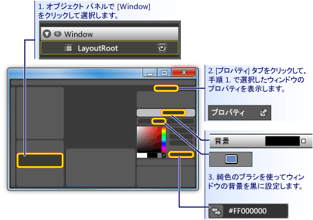
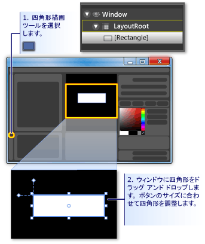
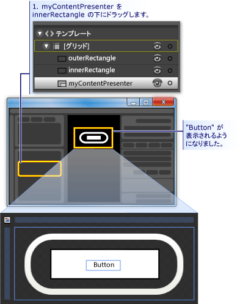
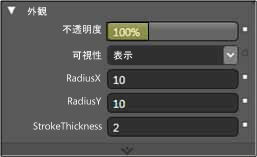
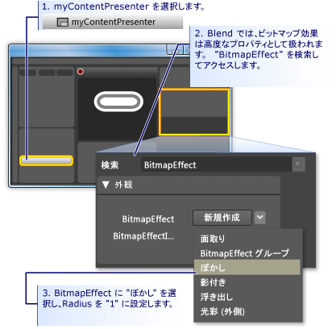
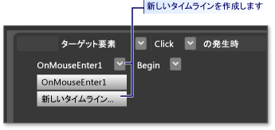

# チュートリアル: Microsoft Expression Blend を使用してボタンを作成するWalkthrough: Create a Button by Using Microsoft Expression Blend

このチュートリアルでは、Microsoft Expression Blend を使用[!INCLUDE[TLA2#tla_wpf](../../../../includes/tla2sharptla-wpf-md.md)]してカスタマイズされたボタンを作成する手順について説明します。This walkthrough steps you through the process of creating a [!INCLUDE[TLA2#tla_wpf](../../../../includes/tla2sharptla-wpf-md.md)] customized button using Microsoft Expression Blend.

> [!IMPORTANT]
> Microsoft Expression Blend は、実行[!INCLUDE[TLA#tla_xaml](../../../../includes/tlasharptla-xaml-md.md)]可能プログラムを作成するためにコンパイルされるを生成することによって機能します。Microsoft Expression Blend works by generating [!INCLUDE[TLA#tla_xaml](../../../../includes/tlasharptla-xaml-md.md)] that is then compiled to make the executable program. を[!INCLUDE[TLA#tla_xaml](../../../../includes/tlasharptla-xaml-md.md)]直接操作する場合は、Blend ではなく Visual Studio を使用して[!INCLUDE[TLA#tla_xaml](../../../../includes/tlasharptla-xaml-md.md)] 、同じアプリケーションを作成するもう1つのチュートリアルがあります。If you would rather work with [!INCLUDE[TLA#tla_xaml](../../../../includes/tlasharptla-xaml-md.md)] directly, there is another walkthrough that creates the same application as this one using [!INCLUDE[TLA#tla_xaml](../../../../includes/tlasharptla-xaml-md.md)] with Visual Studio rather than Blend. 詳細について[は、「XAML を使用したボタンの作成](walkthrough-create-a-button-by-using-xaml.md)」を参照してください。See [Create a Button by Using XAML](walkthrough-create-a-button-by-using-xaml.md) for more information.

次の図は、作成するカスタマイズされたボタンを示しています。The following illustration shows the customized button that you will create.

## 図形をボタンに変換するConvert a Shape to a Button

このチュートリアルの最初の部分では、カスタムボタンの外観を独自に作成します。In the first part of this walkthrough you create the custom look of the custom button. これを行うには、最初に四角形をボタンに変換します。To do this, you first convert a rectangle to a button. 次に、ボタンのテンプレートに図形を追加して、より複雑な外観のボタンを作成します。You then add additional shapes to the template of the button, creating a more complex looking button. 通常のボタンで開始してカスタマイズするのはなぜですか。Why not start with a regular button and customize it? ボタンには必要のない組み込みの機能があるため、カスタムボタンの場合は、四角形から始める方が簡単です。Because a button has built-in functionality that you do not need; for custom buttons, it is easier to start with a rectangle.

### Expression Blend で新しいプロジェクトを作成するにはTo create a new project in Expression Blend

1. Expression Blend を開始します。Start Expression Blend. ( **[スタート]** をクリックし、 **[すべてのプログラム]** 、 **[microsoft expression]** の順にポイントし、 **[microsoft expression Blend]** をクリックします)。(Click **Start**, point to **All Programs**, point to **Microsoft Expression**, and then click **Microsoft Expression Blend**.)

2. 必要に応じて、アプリケーションを最大化します。Maximize the application if needed.

3. **[ファイル]** メニューの **[新しいプロジェクト]** をクリックします。On the **File** menu, click **New Project**.

4. **[標準アプリケーション (.exe)]** を選択します。Select **Standard Application (.exe)**.

5. プロジェクト`CustomButton`に名前を指定し、 **[OK]** をクリックします。Name the project `CustomButton` and press **OK**.

この時点で、空[!INCLUDE[TLA2#tla_wpf](../../../../includes/tla2sharptla-wpf-md.md)]のプロジェクトがあります。At this point you have a blank [!INCLUDE[TLA2#tla_wpf](../../../../includes/tla2sharptla-wpf-md.md)] project. F5 キーを押してアプリケーションを実行できます。You can press F5 to run the application. ご想像のとおり、アプリケーションは空のウィンドウだけで構成されています。As you might expect, the application consists of only a blank window. 次に、角丸四角形を作成し、ボタンに変換します。Next, you create a rounded rectangle and convert it into a button.

### 四角形をボタンに変換するにはTo convert a Rectangle to a Button

1. **Window Background プロパティを black に設定します。** ウィンドウを選択し、[**プロパティ] タブ**をクリックし<xref:System.Windows.Controls.Control.Background%2A>て、 `Black`プロパティをに設定します。**Set the Window Background property to black:** Select the Window, click the **Properties Tab**, and set the <xref:System.Windows.Controls.Control.Background%2A> property to `Black`.

    

2. **ウィンドウのボタンのサイズとほぼ同じ四角形を描画します。** 左側のツールパネルで [四角形] ツールを選択し、四角形をウィンドウにドラッグします。**Draw a rectangle approximately the size of a button on the Window:** Select the rectangle tool on the left-hand tool panel and drag the rectangle onto the Window.

    

3. **四角形の角を丸めます。** 四角形のコントロールポイントをドラッグするか、プロパティ<xref:System.Windows.Shapes.Rectangle.RadiusX%2A>と<xref:System.Windows.Shapes.Rectangle.RadiusY%2A>プロパティを直接設定します。**Round out the corners of the rectangle:** Either drag the control points of the rectangle or directly set the <xref:System.Windows.Shapes.Rectangle.RadiusX%2A> and <xref:System.Windows.Shapes.Rectangle.RadiusY%2A> properties. <xref:System.Windows.Shapes.Rectangle.RadiusX%2A> と<xref:System.Windows.Shapes.Rectangle.RadiusY%2A>の値を20に設定します。Set the values of <xref:System.Windows.Shapes.Rectangle.RadiusX%2A> and <xref:System.Windows.Shapes.Rectangle.RadiusY%2A> to 20.

    

4. **四角形をボタンに変更します。** 四角形を選択します。**Change the rectangle into a button:** Select the rectangle. **[ツール]** メニューの [**作成] ボタン**をクリックします。On the **Tools** menu, click **Make Button**.

    

5. **スタイル/テンプレートのスコープを指定します。** 次のようなダイアログボックスが表示されます。**Specify the scope of the style/template:** A dialog box like the following appears.

    ![[Style リソースの作成] ダイアログ ボックス](./media/custom-button-blend-makebutton2.gif)

    **[リソース名 (キー)]** で、 **[すべてに適用]** を選択します。For **Resource name (Key)**, select **Apply to all**.  これにより、結果のスタイルとボタンテンプレートが、ボタンであるすべてのオブジェクトに適用されます。This will make the resulting style and button template apply to all objects that are buttons. [**定義] で**、 **[アプリケーション]** を選択します。For **Define in**, select **Application**. これにより、結果のスタイルとボタンテンプレートにアプリケーション全体のスコープが設定されます。This will make the resulting style and button template have scope over the entire application. これらの2つのボックスの値を設定すると、ボタンのスタイルとテンプレートはアプリケーション全体のすべてのボタンに適用され、アプリケーションで作成したボタンは既定でこのテンプレートを使用します。When you set the values in these two boxes, the button style and template apply to all buttons within the entire application and any button you create in the application will, by default, use this template.

## ボタンテンプレートを編集するEdit the Button Template

これで、四角形がボタンに変更されました。You now have a rectangle that has been changed to a button. このセクションでは、ボタンのテンプレートを変更し、その外観をカスタマイズします。In this section, you'll modify the template of the button and further customize how it looks.

### ボタンテンプレートを編集してボタンの外観を変更するにはTo edit the button template to change the button appearance

1. **テンプレートビューの編集に進む:** ボタンの外観をさらにカスタマイズするには、ボタンテンプレートを編集する必要があります。**Go into edit template view:** To further customize the look of our button, we need to edit the button template. このテンプレートは、四角形をボタンに変換したときに作成されたものです。This template was created when we converted the rectangle into a button. ボタンテンプレートを編集するには、ボタンを右クリックし、[**コントロールパーツの編集] (テンプレート)** 、 **[テンプレートの編集]** の順に選択します。To edit the button template, right-click the button and select **Edit Control Parts (Template)** and then **Edit Template**.

    

    テンプレートエディターで、ボタンが<xref:System.Windows.Shapes.Rectangle> <xref:System.Windows.Controls.ContentPresenter>とに分割されていることを確認します。In the template editor, notice that the button is now separated into a <xref:System.Windows.Shapes.Rectangle> and the <xref:System.Windows.Controls.ContentPresenter>. は<xref:System.Windows.Controls.ContentPresenter> 、ボタン内にコンテンツを表示するために使用されます (たとえば、文字列 "button")。The <xref:System.Windows.Controls.ContentPresenter> is used to present content within the button (for example, the string "Button"). 四角形とは両方<xref:System.Windows.Controls.ContentPresenter>とも内<xref:System.Windows.Controls.Grid>にレイアウトされます。Both the rectangle and <xref:System.Windows.Controls.ContentPresenter> are laid out inside of a <xref:System.Windows.Controls.Grid>.

    

2. **テンプレートコンポーネントの名前を変更します。** テンプレートインベントリ内の四角形を右クリックし、 <xref:System.Windows.Shapes.Rectangle>名前を "[四角形]" から "outerRectangle" に変更し、"[ContentPresenter]" を "myContentPresenter" に変更します。**Change the names of the template components:** Right-click the rectangle in the template inventory, change the <xref:System.Windows.Shapes.Rectangle> name from "[Rectangle]" to "outerRectangle", and change "[ContentPresenter]" to "myContentPresenter".

    

3. **(ドーナツのように) 内側に空になるように四角形を変更します。** **OuterRectangle**を選択し<xref:System.Windows.Shapes.Shape.Fill%2A> 、を "Transparent" <xref:System.Windows.Shapes.Shape.StrokeThickness%2A>に、を5に設定します。**Alter the rectangle so that it is empty inside (like a donut):** Select **outerRectangle** and set <xref:System.Windows.Shapes.Shape.Fill%2A> to "Transparent" and <xref:System.Windows.Shapes.Shape.StrokeThickness%2A> to 5.

    

    次に、 <xref:System.Windows.Shapes.Shape.Stroke%2A>を、テンプレートのすべての色に設定します。Then set the <xref:System.Windows.Shapes.Shape.Stroke%2A> to the color of whatever the template will be. これを行うには、 **[ストローク]** の横にある小さな白いボックスをクリックし、 **[customexpression]** を選択して、ダイアログボックスに「{TemplateBinding Background}」と入力します。To do this, click the small white box next to **Stroke**, select **CustomExpression**, and type "{TemplateBinding Background}" in the dialog box.

    

4. **内部の四角形を作成します。** 次に、別の四角形を作成し ("innerRectangle" という名前を指定)、 **outerRectangle**の内部に対称的に配置します。**Create an inner rectangle:** Now, create another rectangle (name it "innerRectangle") and position it symmetrically on the inside of **outerRectangle** . このような作業では、ズームして、編集領域のボタンのサイズを大きくすることをお勧めします。For this kind of work, you will probably want to zoom to make the button larger in the editing area.

    > [!NOTE]
    > 四角形は、図の場合とは異なる場合があります (たとえば、角が丸くなる場合があります)。Your rectangle might look different than the one in the figure (for example, it might have rounded corners).

    

5. **ContentPresenter を一番上に移動します。** この時点で、テキスト "Button" が表示されなくなる可能性があります。**Move ContentPresenter to the top:** At this point, it is possible that the text "Button" will not be visible any longer. これが原因である場合、これは、 **Innerrectangle**が**myContentPresenter**の上にあるためです。If this is so, this is because **innerRectangle** is on top of the **myContentPresenter**. これを修正するには、 **myContentPresenter**を**innerrectangle**の下にドラッグします。To fix this, drag **myContentPresenter** below **innerRectangle**. 四角形と**myContentPresenter**の位置を変更して、次のようにします。Reposition rectangles and **myContentPresenter** to look similar to below.

    > [!NOTE]
    > または、 **myContentPresenter**を右クリックして **[Send Forward]** をクリックして、上に配置することもできます。Alternatively, you can also position **myContentPresenter** on top by right-clicking it and pressing **Send Forward**.

    

6. **InnerRectangle の外観を変更します。** 、 <xref:System.Windows.Shapes.Rectangle.RadiusX%2A> 、<xref:System.Windows.Shapes.Rectangle.RadiusY%2A>およびの値を20に<xref:System.Windows.Shapes.Shape.StrokeThickness%2A>設定します。**Change the look of innerRectangle:** Set the <xref:System.Windows.Shapes.Rectangle.RadiusX%2A>, <xref:System.Windows.Shapes.Rectangle.RadiusY%2A>, and <xref:System.Windows.Shapes.Shape.StrokeThickness%2A> values to 20. さらに、カスタム式<xref:System.Windows.Shapes.Shape.Fill%2A> "{TemplateBinding background}" を使用してテンプレートの背景をに設定し、を<xref:System.Windows.Shapes.Shape.Stroke%2A> "transparent" に設定します。In addition, set the <xref:System.Windows.Shapes.Shape.Fill%2A> to the background of the template using the custom expression "{TemplateBinding Background}" ) and set <xref:System.Windows.Shapes.Shape.Stroke%2A> to "transparent". <xref:System.Windows.Shapes.Shape.Fill%2A> **Innerrectangle**のおよびの設定は<xref:System.Windows.Shapes.Shape.Stroke%2A> 、 **outerRectangle**のとは逆の設定であることに注意してください。Notice that the settings for the <xref:System.Windows.Shapes.Shape.Fill%2A> and <xref:System.Windows.Shapes.Shape.Stroke%2A> of **innerRectangle** are the opposite of those for **outerRectangle**.

    

7. **グラスレイヤーを上に追加します。** ボタンの外観をカスタマイズする最後の部分は、ガラスレイヤーを上部に追加することです。**Add a glass layer on top:** The final piece of customizing the look of the button is to add a glass layer on top. このグラスレイヤーは、3番目の四角形で構成されています。This glass layer consists of a third rectangle. グラスではボタン全体が表示されるので、ガラスの四角形は**outerRectangle**のような大きさに似ています。Because the glass will cover the entire button, the glass rectangle is similar in dimensions to the **outerRectangle**. そのため、 **outerRectangle**のコピーを作成するだけで、四角形を作成できます。Therefore, create the rectangle by simply making a copy of the **outerRectangle**. **OuterRectangle**を強調表示し、Ctrl + C キーと Ctrl + V キーを使用してコピーを作成します。Highlight **outerRectangle** and use CTRL+C and CTRL+V to make a copy. この新しい四角形に "glassCube" という名前を指定します。Name this new rectangle "glassCube".

8. **必要に応じて glassCube の位置を変更します。** **GlassCube**がボタン全体をカバーするように配置されていない場合は、その位置にドラッグします。**Reposition glassCube if necessary:** If **glassCube** is not already positioned so that it covers the entire button, drag it into position.

9. **GlassCube は、outerRectangle とは少し異なる形で指定します。** **GlassCube**のプロパティを変更します。**Give glassCube a slightly different shape than outerRectangle:** Change the properties of **glassCube**. まず、 <xref:System.Windows.Shapes.Rectangle.RadiusX%2A> <xref:System.Windows.Shapes.Rectangle.RadiusY%2A>プロパティとプロパティを10に、を 2に変更します。<xref:System.Windows.Shapes.Shape.StrokeThickness%2A>Start off by changing the <xref:System.Windows.Shapes.Rectangle.RadiusX%2A> and <xref:System.Windows.Shapes.Rectangle.RadiusY%2A> properties to 10 and the <xref:System.Windows.Shapes.Shape.StrokeThickness%2A> to 2.

    

10. **GlassCube をガラスのように表示します。** を glassy <xref:System.Windows.Shapes.Shape.Fill%2A>に設定します。これは、不透明度が 75% の線形グラデーションを使用して、白と透明度が異なる6分の間隔で透明色を交互に交互に表示します。**Make glassCube look like glass:** Set the <xref:System.Windows.Shapes.Shape.Fill%2A> to a glassy look by  using a linear gradient that is 75% opaque and alternates between the color White and Transparent over 6 approximately evenly spaced intervals. 次に、グラデーションの分岐点を設定する方法を示します。This is what to set the gradient stops to:

    - グラデーションの分岐点 1:白 (アルファ値は 75%)Gradient Stop 1: White with Alpha value of 75%

    - グラデーションの分岐点 2:透明Gradient Stop 2: Transparent

    - グラデーションの分岐点 3:白 (アルファ値は 75%)Gradient Stop 3: White with Alpha value of 75%

    - グラデーションの分岐点 4:透明Gradient Stop 4: Transparent

    - グラデーションの分岐点 5:白 (アルファ値は 75%)Gradient Stop 5: White with Alpha value of 75%

    - グラデーションの分岐点 6:透明Gradient Stop 6: Transparent

    これにより、"波" グラスが作成されます。This creates a "wavy" glass look.

    

11. **グラスレイヤーを非表示にします。** Glassy レイヤーがどのように見えるかを確認したので、[**プロパティ] パネル**の [**外観] ウィンドウ**に戻り、不透明度を 0% に設定して非表示にします。**Hide the glass layer:** Now that you see what the glassy layer looks like, go into the **Appearance pane** of the **Properties panel** and set the Opacity to 0% to hide it. 前のセクションでは、プロパティトリガーとイベントを使用して、グラスレイヤーを表示および操作します。In the sections ahead, we'll use property triggers and events to show and manipulate the glass layer.

    

## ボタンの動作をカスタマイズするCustomize the Button Behavior

この時点では、テンプレートを編集してボタンの表示をカスタマイズしていますが、ボタンは通常のボタンとは異なります (たとえば、マウスオーバーでの外観の変更、フォーカスの受け取り、クリックなど)。次の2つの手順では、これらのような動作をカスタムボタンにビルドする方法を示します。At this point, you have customized the presentation of the button by editing its template, but the button does not react to user actions as typical buttons do (for example, changing appearance upon mouse-over, receiving focus, and clicking.) The next two procedures show how to build behaviors like these into the custom button. 単純なプロパティトリガーから始めて、イベントトリガーとアニメーションを追加します。We'll start with simple property triggers, and then add event triggers and animations.

### プロパティトリガーを設定するにはTo set property triggers

1. **新しいプロパティ トリガーを作成します。**  **GlassCube** 選択されていること、 **+ プロパティ** で、 **トリガー** パネル (次の手順を次の図を参照してください)。**Create a new property trigger:** With **glassCube** selected, click **+ Property** in the **Triggers** panel (see the figure that follows the next step). これにより、既定のプロパティトリガーを持つプロパティトリガーが作成されます。This creates a property trigger with a default property trigger.

2. **トリガーによって使用されるプロパティを次のように設定します。** プロパティをに<xref:System.Windows.UIElement.IsMouseOver%2A>変更します。**Make IsMouseOver the property used by the trigger:** Change the property to <xref:System.Windows.UIElement.IsMouseOver%2A>. これにより、プロパティが<xref:System.Windows.UIElement.IsMouseOver%2A> `true`の場合 (ユーザーがマウスを使用してボタンをポイントしたとき)、プロパティトリガーがアクティブになります。This makes the property trigger activate when the <xref:System.Windows.UIElement.IsMouseOver%2A> property is `true` (when the user points to the button with the mouse).

    

3. **GlassCube の IsMouseOver トリガーの 100% の不透明度。** **トリガーの記録がオンになっ**ていることに注意してください (前の図を参照してください)。**IsMouseOver triggers opacity of 100% for glassCube:** Notice that the **Trigger recording is on** (see the preceding figure). つまり、記録中に**glassCube**のプロパティ値に加えた変更は、が<xref:System.Windows.UIElement.IsMouseOver%2A> `true`のときに行われるアクションになります。This means that any changes you make to the property values of **glassCube** while recording is on will become an action that takes place when <xref:System.Windows.UIElement.IsMouseOver%2A> is `true`. 記録中に、 <xref:System.Windows.UIElement.Opacity%2A> **glassCube**のを 100% に変更します。While recording, change the <xref:System.Windows.UIElement.Opacity%2A> of **glassCube** to 100%.

    

    これで、最初のプロパティトリガーが作成されました。You have now created your first property trigger. エディターの [**トリガー] パネル**に、変更され<xref:System.Windows.UIElement.Opacity%2A>たが 100% に記録されていることがわかります。Notice that the **Triggers panel** of the editor has recorded the <xref:System.Windows.UIElement.Opacity%2A> being changed to 100%.

    ![[トリガー] パネル](./media/custom-button-blend-propertytriggerinfo.png)

    F5 キーを押してアプリケーションを実行し、マウスポインターをボタンの上または下に移動します。Press F5 to run the application, and move the mouse pointer over and off the button. ボタンをマウスでポイントするとグラスレイヤーが表示され、ポインターが離れると消えます。You should see the glass layer appear when you mouse-over the button and disappear when the pointer leaves.

4. **IsMouseOver トリガーのストローク値の変更:** 他のアクションを<xref:System.Windows.UIElement.IsMouseOver%2A>トリガーに関連付けてみましょう。**IsMouseOver triggers stroke value change:** Let's associate some other actions with the <xref:System.Windows.UIElement.IsMouseOver%2A> trigger. 記録が続行されたら、選択内容を**glassCube**から**outerRectangle**に切り替えます。While recording continues, switch your selection from **glassCube** to **outerRectangle**. 次に、 <xref:System.Windows.Shapes.Shape.Stroke%2A> **outerRectangle**のをカスタム式 "{dynamicresource {HighlightBrushKey}}" に設定します。Then set the <xref:System.Windows.Shapes.Shape.Stroke%2A> of **outerRectangle** to the custom expression of "{DynamicResource {x:Static SystemColors.HighlightBrushKey}}". これにより<xref:System.Windows.Shapes.Shape.Stroke%2A> 、がボタンによって使用される一般的な強調表示色に設定されます。This sets the <xref:System.Windows.Shapes.Shape.Stroke%2A> to the typical highlight color used by buttons. F5 キーを押して、ボタンの上にマウスを置いたときの効果を確認します。Press F5 to see the effect when you mouse over the button.

    

5. **IsMouseOver トリガーがぼやけたテキスト:** 1つ以上のアクションをプロパティトリガー <xref:System.Windows.UIElement.IsMouseOver%2A>に関連付けてみましょう。**IsMouseOver triggers blurry text:** Let's associate one more action to the <xref:System.Windows.UIElement.IsMouseOver%2A> property trigger. ボタンの上にグラスが表示されているときに、ボタンの内容が少しぼやけて表示されるようにします。Make the content of the button appear a little blurry when the glass appears over it. これを行うには、 <xref:System.Windows.Media.Effects.BitmapEffect> <xref:System.Windows.Controls.ContentPresenter> (**myContentPresenter**) にぼかしを適用します。To do this, we can apply a blur <xref:System.Windows.Media.Effects.BitmapEffect> to the <xref:System.Windows.Controls.ContentPresenter> (**myContentPresenter**).

    

    > [!NOTE]
    > [**プロパティ] パネル**を検索<xref:System.Windows.Media.Effects.BitmapEffect>を開始する前の内容に戻すには、**検索ボックス**のテキストをクリアします。To return the **Properties panel** back to what it was before you did the search for <xref:System.Windows.Media.Effects.BitmapEffect>, clear the text from the **Search box**.

    この時点で、いくつかの関連するアクションを含むプロパティトリガーを使用して、マウスポインターがボタン領域に出入りするときの強調表示動作を作成しました。At this point, we have used a property trigger with several associated actions to create highlighting behavior for when the mouse pointer enters and leaves the button area. ボタンのもう1つの一般的な動作は、フォーカスがあるときに強調表示されます (クリックされた後)。Another typical behavior for a button is to highlight when it has focus (as after it is clicked). このような動作を追加するには、 <xref:System.Windows.UIElement.IsFocused%2A>プロパティに対して別のプロパティトリガーを追加します。We can add such behavior by adding another property trigger for the <xref:System.Windows.UIElement.IsFocused%2A> property.

6. **IsFocused のプロパティトリガーを作成します。** と<xref:System.Windows.UIElement.IsMouseOver%2A>同じ手順 (このセクションの最初の手順を参照) を使用して、 <xref:System.Windows.UIElement.IsFocused%2A>プロパティに対して別のプロパティトリガーを作成します。**Create property trigger for IsFocused:** Using the same procedure as for <xref:System.Windows.UIElement.IsMouseOver%2A> (see the first step of this section), create another property trigger for the <xref:System.Windows.UIElement.IsFocused%2A> property. **トリガーの記録がオンになって**いる間に、次のアクションをトリガーに追加します。While **Trigger recording is on**, add the following actions to the trigger:

    - **glassCube**は、 <xref:System.Windows.UIElement.Opacity%2A> 100% のを取得します。**glassCube** gets an <xref:System.Windows.UIElement.Opacity%2A> of 100%.

    - **outerRectangle**は、 <xref:System.Windows.Shapes.Shape.Stroke%2A> "{dynamicresource {x:Static systemcolors}}" というカスタム式の値を取得します。**outerRectangle** gets a <xref:System.Windows.Shapes.Shape.Stroke%2A> custom expression value of "{DynamicResource {x:Static SystemColors.HighlightBrushKey}}".

このチュートリアルの最後の手順として、アニメーションをボタンに追加します。As the final step in this walkthrough, we will add animations to the button. これらのアニメーションは、イベント、イベント、 <xref:System.Windows.UIElement.MouseEnter> <xref:System.Windows.Controls.Primitives.ButtonBase.Click>イベントによってトリガーされます。These animations will be triggered by events—specifically, the <xref:System.Windows.UIElement.MouseEnter> and <xref:System.Windows.Controls.Primitives.ButtonBase.Click> events.

### イベントトリガーとアニメーションを使用して対話機能を追加するにはTo use event triggers and animations to add interactivity

1. **MouseEnter イベントトリガーを作成します。** 新しいイベントトリガーを追加し、 <xref:System.Windows.UIElement.MouseEnter>トリガーで使用するイベントとしてを選択します。**Create a MouseEnter Event Trigger:** Add a new event trigger and select <xref:System.Windows.UIElement.MouseEnter> as the event to use in the trigger.

     

2. **アニメーションタイムラインを作成します。** 次に、アニメーションタイムラインを<xref:System.Windows.UIElement.MouseEnter>イベントに関連付けます。**Create an animation timeline:** Next, associate an animation timeline to the <xref:System.Windows.UIElement.MouseEnter> event.

    

    **[OK]** をクリックして新しいタイムラインを作成すると、[タイムライン **] パネル**が表示され、[タイムラインの記録がオンになっています] がデザインパネルに表示されます。After you press **OK** to create a new timeline, a **Timeline Panel** appears and "Timeline recording is on" is visible in the design panel. これは、タイムラインでプロパティの変更の記録を開始できることを意味します (プロパティの変更をアニメーション化します)。This means we can start recording property changes in the timeline (animate property changes).

    > [!NOTE]
    > 画面を表示するには、ウィンドウやパネルのサイズを変更する必要がある場合があります。You may need to resize your window and/or panels to see the display.

    

3. **キーフレームを作成します。** アニメーションを作成するには、アニメーション化するオブジェクトを選択し、タイムライン上に複数のキーフレームを作成します。これらのキーフレームについては、アニメーションで補間するプロパティ値を設定します。**Create a keyframe:** To create an animation, select the object you want to animate, create two or more keyframes on the timeline, and for those keyframes, set the property values you want the animation to interpolate between. 次の図は、キーフレームを作成する手順を示しています。The following figure guides you through the creation of a keyframe.

    

4. **このキーフレームで glassCube を圧縮します。** 2番目のキーフレームを選択した状態で、**サイズ変換**を使用して、 **glassCube**のサイズを完全なサイズの 90% に縮小します。**Shrink glassCube at this keyframe:** With the second keyframe selected, shrink the size of the **glassCube** to 90% of its full size using the **Size Transform**.

    

    F5 キーを押してアプリケーションを実行します。Press F5 to run the application. マウスポインターをボタンの上に移動します。Move the mouse pointer over the button. グラスレイヤーがボタンの上に縮小されることに注意してください。Notice that the glass layer shrinks on top of the button.

5. **別のイベントトリガーを作成し、別のアニメーションを関連付けます。** もう1つアニメーションを追加してみましょう。**Create another Event Trigger and associate a different animation with it:** Let's add one more animation. 前のイベントトリガーアニメーションの作成に使用したものと同様の手順を使用します。Use a similar procedure to what you used to create the previous event trigger animation:

    1. <xref:System.Windows.Controls.Primitives.ButtonBase.Click>イベントを使用して、新しいイベントトリガーを作成します。Create a new event trigger using the <xref:System.Windows.Controls.Primitives.ButtonBase.Click> event.

    2. 新しいタイムラインを<xref:System.Windows.Controls.Primitives.ButtonBase.Click>イベントに関連付けます。Associate a new timeline with the <xref:System.Windows.Controls.Primitives.ButtonBase.Click> event.

        

    3. このタイムラインでは、2つのキーフレームを作成します。1つは0.0 秒、2番目は0.3 秒です。For this timeline, create two keyframes, one at 0.0 seconds and the second one at 0.3 seconds.

    4. キーフレームが0.3 秒で強調表示されている状態で、**回転変換の角度**を360度に設定します。With the keyframe at 0.3 seconds highlighted, set the **Rotate Transform Angle** to 360 degrees.

        

    5. F5 キーを押してアプリケーションを実行します。Press F5 to run the application. ボタンをクリックします。Click the button. グラスレイヤーが回転していることに注意してください。Notice that the glass layer spins around.

## まとめConclusion

カスタマイズしたボタンを完了しました。You have completed a customized button. これを行うには、アプリケーションのすべてのボタンに適用されたボタンテンプレートを使用します。You did this using a button template that was applied to all buttons in the application. テンプレート編集モードをそのままにした場合 (次の図を参照してください)、さらにボタンを作成すると、既定のボタンのようにではなく、カスタムボタンのような外観と動作が表示されます。If you leave the template editing mode (see the following figure) and create more buttons, you will see that they look and behave like your custom button rather than like the default button.

F5 キーを押してアプリケーションを実行します。Press F5 to run the application. ボタンをクリックして、すべての動作が同じであることを確認します。Click the buttons and notice how they all behave the same.

テンプレートをカスタマイズしている間は、 <xref:System.Windows.Shapes.Shape.Fill%2A> <xref:System.Windows.Shapes.Shape.Stroke%2A> **innerrectangle**のプロパティとプロパティ**outerRectangle**をテンプレートの背景 ({TemplateBinding background}) に設定します。Remember that while you were customizing the template, you set the <xref:System.Windows.Shapes.Shape.Fill%2A> property of **innerRectangle** and the <xref:System.Windows.Shapes.Shape.Stroke%2A> property **outerRectangle** to the template background ({TemplateBinding Background}). このため、個々のボタンの背景色を設定すると、設定した背景がそれぞれのプロパティに使用されます。Because of this, when you set the background color of the individual buttons, the background you set will be used for those respective properties. 今すぐ背景を変更してみてください。Try changing the backgrounds now. 次の図では、さまざまなグラデーションが使用されています。In the following figure, different gradients are used. したがって、テンプレートはボタンのようなコントロールを全体的にカスタマイズするのに役立ちますが、テンプレートを持つコントロールは、互いに異なる外観に変更される可能性があります。Therefore, although a template is useful for overall customization of controls like button, controls with templates can still be modified to look different from each other.

結論として、ボタンテンプレートをカスタマイズするプロセスでは、Microsoft Expression Blend で次の操作を行う方法を学習しました。In conclusion, in the process of customizing a button template you have learned how to do the following in Microsoft Expression Blend:

- コントロールの外観をカスタマイズします。Customize the look of a control.

- プロパティトリガーを設定します。Set property triggers. プロパティトリガーは、コントロールだけでなく、ほとんどのオブジェクトで使用できるため、非常に便利です。Property triggers are very useful because they can be used on most objects, not just controls.

- イベントトリガーを設定します。Set event triggers. イベントトリガーは、コントロールだけでなく、ほとんどのオブジェクトで使用できるため、非常に便利です。Event triggers are very useful because they can be used on most objects, not just controls.

- アニメーションを作成します。Create animations.

- その他: グラデーションを作成し、BitmapEffects を追加し、変換を使用して、オブジェクトの基本プロパティを設定します。Miscellaneous: create gradients, add BitmapEffects, use transforms, and set basic properties of objects.

## 関連項目See also

- [XAML を使用したボタンの作成Create a Button by Using XAML](walkthrough-create-a-button-by-using-xaml.md)
- [スタイルとテンプレートStyling and Templating](styling-and-templating.md)
- [アニメーションの概要Animation Overview](../graphics-multimedia/animation-overview.md)
- [純色およびグラデーションによる塗りつぶしの概要Painting with Solid Colors and Gradients Overview](../graphics-multimedia/painting-with-solid-colors-and-gradients-overview.md)
- [ビットマップ効果の概要Bitmap Effects Overview](../graphics-multimedia/bitmap-effects-overview.md)
