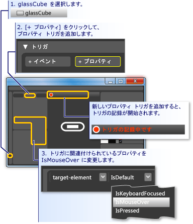
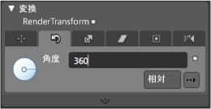

# チュートリアル: Microsoft Expression Blend を使用してボタンを作成する
このチュートリアルを作成するプロセスを[!INCLUDE[TLA2#tla_wpf](../../../../includes/tla2sharptla-wpf-md.md)]Microsoft Expression Blend を使用してカスタマイズされたボタンをクリックします。  
  
> [!IMPORTANT]
>  Microsoft Expression Blend を生成することによって動作[!INCLUDE[TLA#tla_xaml](../../../../includes/tlasharptla-xaml-md.md)]し、実行可能プログラムをコンパイルします。 使用する場合[!INCLUDE[TLA#tla_xaml](../../../../includes/tlasharptla-xaml-md.md)]が 1 つを使って、このと同じアプリケーションを作成するもう 1 つのチュートリアルを直接[!INCLUDE[TLA#tla_xaml](../../../../includes/tlasharptla-xaml-md.md)]Blend ではなく、Visual Studio を使用します。 参照してください[を使用して XAML でボタンを作成する](walkthrough-create-a-button-by-using-xaml.md)詳細についてはします。  
  
 次の図はを作成してカスタマイズされたボタンを示しています。  
  
   
  
## 図形をボタンへの変換します。  
 このチュートリアルの最初の部分では、独自のカスタム ボタンの外観を作成します。 これを行うには、最初にボタンに四角形を変換します。 図形を追加、ボタンのテンプレートをより複雑な外観のボタンを作成します。 なぜ標準ボタンと開始され、カスタマイズできますか。 ボタンが必要はありません。 組み込みの機能カスタムのボタンの四角形を開始する簡単です。  
  
#### Expression Blend で新しいプロジェクトを作成するには  
  
1.  Expression Blend を開始します。 (クリックして**開始**、 をポイント**すべてのプログラム**、 をポイント**Microsoft Expression**、順にクリックします**Microsoft Expression Blend**)。  
  
2.  必要な場合は、アプリケーションを最大化します。  
  
3.  **[ファイル]** メニューの **[新しいプロジェクト]** をクリックします。  
  
4.  選択**標準アプリケーション (.exe)** します。  
  
5.  プロジェクトに名前を`CustomButton`キーを押します**OK**します。  
  
 この時点で、空白がある[!INCLUDE[TLA2#tla_wpf](../../../../includes/tla2sharptla-wpf-md.md)]プロジェクト。 アプリケーションの実行に F5 キーを押します。 ご想像のとおり、アプリケーションは空白のウィンドウのみで構成されます。 次に、角の丸い四角形を作成し、ボタンに変換します。  
  
#### 四角形をボタンに変換するには  
  
1.  **ウィンドウの背景のプロパティを black に設定します。** ウィンドウを選択して、、**プロパティ タブ**、設定、<xref:System.Windows.Controls.Control.Background%2A>プロパティを`Black`します。  
  
       
  
2.  **ウィンドウに四角形のボタンのサイズの約を描画します。** ツールの左側のパネルで、四角形ツールを選択し、ウィンドウに四角形をドラッグします。  
  
       
  
3.  **四角形の角を丸めます。** 四角形の制御点をドラッグするか、直接設定、<xref:System.Windows.Shapes.Rectangle.RadiusX%2A>と<xref:System.Windows.Shapes.Rectangle.RadiusY%2A>プロパティ。 値を設定<xref:System.Windows.Shapes.Rectangle.RadiusX%2A>と<xref:System.Windows.Shapes.Rectangle.RadiusY%2A>20 にします。  
  
       
  
4.  **ボタンの四角形を変更します。** 四角形を選択します。 **ツール** メニューのをクリックして**ボタンの作成**です。  
  
       
  
5.  **スタイルまたはテンプレートのスコープを指定します。** 次のようなダイアログ ボックスが表示されます。  
  
       
  
     **リソース名 (キー)**、**すべてに適用**します。  これにより、結果として得られるスタイルとボタン テンプレート ボタンであるすべてのオブジェクトに適用します。 **で定義**、**アプリケーション**します。 これにより、結果として得られるスタイルとボタンのテンプレートはアプリケーション全体にスコープがあります。 これら 2 つのボックスで、値を設定するとボタンのスタイルとテンプレートは、全体のアプリケーション内のすべてのボタンに適用し、アプリケーションで作成するいずれかのボタンは、既定では、このテンプレートを使用します。  
  
## Button テンプレートを編集します。  
 四角形のボタンに変化していることがあるようになりました。 このセクションで、ボタンのテンプレートを変更し、さらに外観をカスタマイズします。  
  
#### ボタンの外観を変更するボタンのテンプレートを編集するには  
  
1.  **テンプレートの表示ビューを参照してください。** さらに、ボタンの外観をカスタマイズするには、ボタン テンプレートを編集する必要があります。 このテンプレートは、四角形をボタンに変換したときに作成されました。 Button テンプレートを編集するには、ボタンを右クリックして**コントロールのパーツを編集する (テンプレート)** し**テンプレートの編集**します。  
  
       
  
     テンプレート エディターで、ボタンに区切られたようになりましたことに注意してください、 <xref:System.Windows.Shapes.Rectangle> 、<xref:System.Windows.Controls.ContentPresenter>します。 <xref:System.Windows.Controls.ContentPresenter>ボタン (たとえば、文字列"Button") 内のコンテンツを表示するために使用します。 両方の四角形と<xref:System.Windows.Controls.ContentPresenter>内のレイアウトは、<xref:System.Windows.Controls.Grid>します。  
  
       
  
2.  **テンプレートのコンポーネントの名前を変更します。** テンプレートのインベントリ、変更の四角形を右クリックし、 <xref:System.Windows.Shapes.Rectangle> 「サイズ」を"[Rectangle]"の名前を指定し、"[ContentPresenter]"を変更します。  
  
       
  
3.  **四角形を変更 (ドーナツ) のように空の内部では。** 選択**サイズ**設定と<xref:System.Windows.Shapes.Shape.Fill%2A>"Transparent"と<xref:System.Windows.Shapes.Shape.StrokeThickness%2A>5 にします。  
  
       
  
     設定し、<xref:System.Windows.Shapes.Shape.Stroke%2A>内のテンプレートがどのようになるかの色にします。 これを行う場合は、横に小さな白いボックスをクリックします**ストローク**を選択します**CustomExpression**、ダイアログ ボックスに「{TemplateBinding バック グラウンド}」を入力します。  
  
       
  
4.  **内側の四角形を作成します。** ここで、別の四角形を作成 (名前を付けます「において」) の内側に対称的に置きます**サイズ**します。 この種類の作業では、編集領域で、ボタンを大きくズームするは可能性があります。  
  
    > [!NOTE]
    >  図のとは異なる、四角形になります (たとえば、その可能性がありますが丸く)。  
  
       
  
5.  **ContentPresenter を先頭に移動します。** この時点では、テキスト"Button"はもうは表示されないことが可能です。 これはため、これは場合、**において**の上には、 **myContentPresenter**します。 この問題を解決するにはドラッグ**myContentPresenter**下**において**します。 四角形の位置を変更し、 **myContentPresenter**に次のようになります。  
  
    > [!NOTE]
    >  または、配置することも**myContentPresenter**上を右クリックし、キーを押して**送信転送**します。  
  
       
  
6.  **においての外観を変更します。** 設定、 <xref:System.Windows.Shapes.Rectangle.RadiusX%2A>、 <xref:System.Windows.Shapes.Rectangle.RadiusY%2A>、および<xref:System.Windows.Shapes.Shape.StrokeThickness%2A>20 の値。 また、設定、<xref:System.Windows.Shapes.Shape.Fill%2A>カスタム式「{TemplateBinding バック グラウンド}」を使用して、テンプレートの背景に) を設定および<xref:System.Windows.Shapes.Shape.Stroke%2A>「透過的」になります。 注意の設定、<xref:System.Windows.Shapes.Shape.Fill%2A>と<xref:System.Windows.Shapes.Shape.Stroke%2A>の**において**は逆の場合の**サイズ**します。  
  
       
  
7.  **上のグラス レイヤーを追加します。** ボタンの外観のカスタマイズの最後の部分では、一番上にガラス レイヤーを追加します。 このガラス レイヤーは、3 番目の四角形で構成されます。 グラス四角形にディメンションと類似しています、ガラスには、ボタンは、全体を対象は、しているため、**サイズ**します。 そのためのコピーを単純にすると、四角形を作成、**サイズ**します。 強調表示**サイズ**CTRL + C と CTRL + V を使用して、コピーを作成するとします。 この新しい四角形"glassCube"の名前を付けます。  
  
8.  **GlassCube の位置を変更して、必要な場合。** 場合**glassCube**はボタン全体をカバーするように配置されていない、位置にドラッグします。  
  
9. **GlassCube サイズよりも若干異なる図形に説明します。** プロパティを変更**glassCube**します。 最初に変更することで、<xref:System.Windows.Shapes.Rectangle.RadiusX%2A>と<xref:System.Windows.Shapes.Rectangle.RadiusY%2A>10 プロパティと<xref:System.Windows.Shapes.Shape.StrokeThickness%2A>2 にします。  
  
       
  
10. **GlassCube のガラスのように行います。** 設定、 <xref:System.Windows.Shapes.Shape.Fill%2A> 75% 不透明であり、白と交互 Transparent 6 以上約均等に分散される線形グラデーションの間隔の間隔を使用して、ガラスのような外観にします。 これは、何をグラデーションの分岐点を設定します。  
  
    -   グラデーションの分岐点 1:白、75% のアルファ値  
  
    -   グラデーションの分岐点 2:透明  
  
    -   グラデーションの分岐点 3:白、75% のアルファ値  
  
    -   グラデーションの分岐点 4:透明  
  
    -   グラデーションの分岐点 5:白、75% のアルファ値  
  
    -   グラデーションの分岐点 6:透明  
  
     これには、「波線」のガラスの外観が作成されます。  
  
       
  
11. **グラスのレイヤーを非表示にします。** ガラスのようなレイヤーがどのように表示場合は、これに移動、**外観ウィンドウ**の**プロパティ パネル**を非表示にする、0% の不透明度を設定するとします。 セクションでは、事前にプロパティ トリガーとイベントを表示し、ガラス レイヤーを操作に使用します。  
  
       
  
## ボタンの動作をカスタマイズします。  
 この時点では、そのテンプレートを編集して、ボタンの表示をカスタマイズしているが、ボタンは通常のボタンの操作 (たとえば、マウス オーバー時の外観を変更する、フォーカスを受け取るおよび をクリックします。) としてユーザーの操作に反応しません次の 2 つの手順では、カスタム ボタンに上記のような動作を構築する方法を説明します。 シンプル プロパティのトリガーで開始がされ、イベント トリガーとアニメーションを追加します。  
  
#### プロパティ トリガーを設定するには  
  
1.  **新しいプロパティ トリガーを作成します。**  **GlassCube** 選択されていること、 **+ プロパティ** で、 **トリガー** パネル (次の手順を次の図を参照してください)。 これにより、プロパティ トリガーが既定のプロパティ トリガーを作成します。  
  
2.  **IsMouseOver、トリガーで使用されるプロパティを行います。** プロパティを変更<xref:System.Windows.UIElement.IsMouseOver%2A>します。 これにより、プロパティ トリガーの場合にアクティブ化、<xref:System.Windows.UIElement.IsMouseOver%2A>プロパティは`true`(ユーザーが指す、ボタン、マウスを使用する場合)。  
  
       
  
3.  **IsMouseOver は、glassCube の 100% の不透明度がトリガーされます。** なお、**トリガーの記録がオン**(上記の図を参照してください)。 プロパティの値に加えた変更はすべてこれにより**glassCube**の記録がオンの間に行われるときにアクションなります<xref:System.Windows.UIElement.IsMouseOver%2A>は`true`します。 記録中は、変更、<xref:System.Windows.UIElement.Opacity%2A>の**glassCube**を 100% にします。  
  
       
  
     最初のプロパティ トリガーが作成されました。 注意して、**トリガー パネル**が、エディターの記録、 <xref:System.Windows.UIElement.Opacity%2A> 100% に変更されます。  
  
     ![[トリガー] パネル](./media/custom-button-blend-propertytriggerinfo.png "custom_button_blend_PropertyTriggerInfo")  
  
     F5 キーを押して、アプリケーションを実行し、上とボタンの外にマウス ポインターを移動します。 時に表示されるガラス レイヤーが表示するボタンをマウスでポイントして、ポインターが離れたときに表示されなくなります。  
  
4.  **IsMouseOver トリガー値の変更のストロークを描画します。** その他のアクションに関連付けてみましょう、<xref:System.Windows.UIElement.IsMouseOver%2A>トリガーします。 記録中に、選択した項目を切り替える**glassCube**に**サイズ**します。 設定し、<xref:System.Windows.Shapes.Shape.Stroke%2A>の**サイズ**"以下 {DynamicResource {x: 静的 SystemColors.HighlightBrushKey}}"のカスタム式にします。 これにより設定、<xref:System.Windows.Shapes.Shape.Stroke%2A>標準的なボタンで使用される色を強調表示します。 F5 キーを押して、ボタンにマウスを置くときの効果を確認します。  
  
       
  
5.  **IsMouseOver ぼやけてテキストがトリガーされます。** 1 つ以上の処理に関連付けてみましょう、<xref:System.Windows.UIElement.IsMouseOver%2A>プロパティ トリガーします。 上にガラスが表示されるときに、少しぼやけて表示されるボタンのコンテンツを作成します。 これを行うには、ブラーを適用できる<xref:System.Windows.Media.Effects.BitmapEffect>を<xref:System.Windows.Controls.ContentPresenter>(**myContentPresenter**)。  
  
       
  
    > [!NOTE]
    >  返される、**プロパティ パネル**ことが、検索を実行した前に<xref:System.Windows.Media.Effects.BitmapEffect>からのテキストをクリア、**検索ボックス**します。  
  
     この時点を使用してプロパティ トリガーに関連付けられているいくつかの操作、マウス ポインターがボタン領域に出入りするときの動作を強調表示を作成します。 フォーカスがあるときに強調表示するボタンをもう 1 つの一般的な動作は、(クリックしてされた後など)。 もう 1 つのプロパティ トリガーを追加することでこのような動作を追加できる、<xref:System.Windows.UIElement.IsFocused%2A>プロパティ。  
  
6.  **IsFocused のプロパティ トリガーを作成します。** 場合と同じ手順を使用して<xref:System.Windows.UIElement.IsMouseOver%2A>(このセクションの最初の手順を参照) の別のプロパティ トリガーを作成、<xref:System.Windows.UIElement.IsFocused%2A>プロパティ。 中に**トリガーの記録がオン**、次のアクション、トリガーを追加します。  
  
    -   **glassCube**取得、<xref:System.Windows.UIElement.Opacity%2A>の 100% です。  
  
    -   **サイズ**取得、 <xref:System.Windows.Shapes.Shape.Stroke%2A> "以下 {DynamicResource {x: 静的 SystemColors.HighlightBrushKey}}"のカスタム式の値。  
  
 このチュートリアルの最後の手順としては、ボタンに、アニメーションを追加します。 これらのアニメーションはイベントによってトリガーされます-具体的には、<xref:System.Windows.UIElement.MouseEnter>と<xref:System.Windows.Controls.Primitives.ButtonBase.Click>イベント。  
  
#### イベント トリガーとアニメーションを使用して、対話機能を追加するには  
  
1.  **MouseEnter イベント トリガーを作成します。** 新しいイベント トリガーを追加し、選択<xref:System.Windows.UIElement.MouseEnter>としてイベントをトリガーに使用します。  
  
       
  
2.  **アニメーション タイムラインを作成します。** 次に、アニメーション タイムラインを関連付ける、<xref:System.Windows.UIElement.MouseEnter>イベント。  
  
       
  
     キーを押す**OK** 、新しいタイムラインを作成する、**タイムライン パネル**が表示されますされ「タイムラインの記録がオン」の設計のパネルに表示されます。 つまり、(アニメーション化するプロパティの変更) タイムラインでプロパティの変更を記録し始めることができます。  
  
    > [!NOTE]
    >  ウィンドウやパネルを表示するには、サイズを変更する必要があります。  
  
       
  
3.  **キーフレームを作成します。** アニメーションを作成するには、アニメーション化する、2 つまたは複数のキーフレームをタイムラインで、これらのキーフレームの作成、アニメーションの補間にするプロパティの値を設定するオブジェクトを選択します。 次の図に従って、キーフレームを作成します。  
  
       
  
4.  **このキーフレームに glassCube を縮小するには。** 選択されている 2 番目のキーフレーム、サイズの縮小、 **glassCube**を使用して、フル サイズの 90% を**サイズ変換**します。  
  
       
  
     F5 キーを押してアプリケーションを実行します。 ボタンの上にマウス ポインターを移動します。 ボタンの上にガラス レイヤーが縮小することに注意してください。  
  
5.  **別のイベント トリガーを作成し、さまざまなアニメーションを関連付けます。** さらに 1 つのアニメーションを追加してみましょう。 イベント トリガーの前のアニメーションを作成するために使用するのと同様の手順を使用します。  
  
    1.  新しいイベント トリガーを作成、<xref:System.Windows.Controls.Primitives.ButtonBase.Click>イベント。  
  
    2.  新しいタイムラインを関連付ける、<xref:System.Windows.Controls.Primitives.ButtonBase.Click>イベント。  
  
       
  
    1.  このタイムラインの 2 つのキーフレーム、0.0 秒で 0.3 秒に 2 つ目を作成します。  
  
    2.  強調表示されている 0.3 の秒のキーフレーム、設定、**回転角度**を 360 度。  
  
       
  
    1.  F5 キーを押してアプリケーションを実行します。 ボタンをクリックします。 グラス レイヤーが回転することに注意してください。  
  
## まとめ  
 カスタマイズされたボタンが完了しました。 このアプリケーションのすべてのボタンに適用されているボタン テンプレートを使用して行いました。 テンプレート編集モードのままにする場合 (次の図を参照してください) と他のボタンを作成、外観し、動作は既定のボタンではなく、カスタム ボタンのように表示されます。  
  
   
  
   
  
 F5 キーを押してアプリケーションを実行します。 ボタンをクリックして、これらはすべて動作と同じ方法に注意してください。  
  
 テンプレートをカスタマイズしていたときに設定することに注意してください、<xref:System.Windows.Shapes.Shape.Fill%2A>プロパティの**において**と<xref:System.Windows.Shapes.Shape.Stroke%2A>プロパティ**サイズ**テンプレート バック グラウンド ({TemplateBinding バック グラウンド})。 このため、個々 のボタンの背景色を設定すると、設定した背景は、個々 のプロパティの使用されます。 これで、背景を変更してみてください。 次の図では、さまざまなグラデーションが使用されます。 そのため、テンプレートは全体のカスタマイズ ボタンのようなコントロールの場合に便利ですが、コントロール テンプレートを使用できる変更することも互いに異なります。  
  
   
  
 結論として、ボタン テンプレートをカスタマイズするプロセスでは Microsoft Expression Blend では、次を実行する方法について説明しました。  
  
-   コントロールの外観をカスタマイズします。  
  
-   プロパティ トリガーを設定します。 プロパティ トリガーは、コントロールにだけでなく、ほとんどのオブジェクトで使用されるあるために、非常に便利です。  
  
-   イベント トリガーを設定します。 イベント トリガーは、コントロールにだけでなく、ほとんどのオブジェクトで使用されるあるために、非常に便利です。  
  
-   アニメーションを作成します。  
  
-   BitmapEffects を追加する: その他のグラデーションを作成し、変換を使用するオブジェクトの基本プロパティを設定します。  
  
## 関連項目
- [XAML を使用したボタンの作成](walkthrough-create-a-button-by-using-xaml.md)
- [スタイルとテンプレート](styling-and-templating.md)
- [アニメーションの概要](../graphics-multimedia/animation-overview.md)
- [純色およびグラデーションによる塗りつぶしの概要](../graphics-multimedia/painting-with-solid-colors-and-gradients-overview.md)
- [ビットマップ効果の概要](../graphics-multimedia/bitmap-effects-overview.md)
