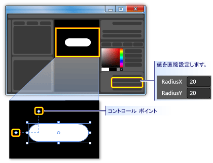
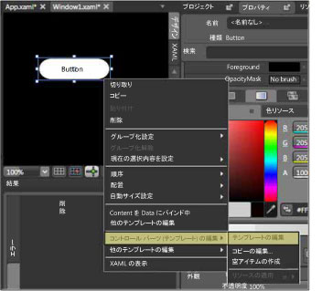
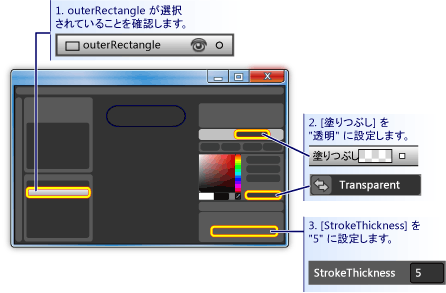
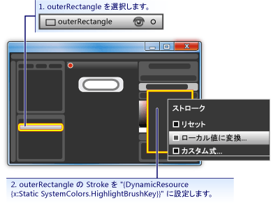
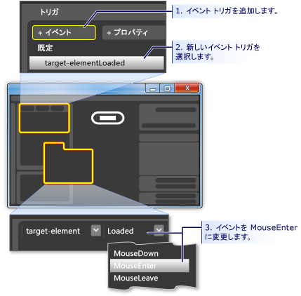

# チュートリアル : Microsoft Expression Blend を使用してボタンを作成する
このチュートリアルの作成プロセス、 [!INCLUDE[TLA2#tla_wpf](../../../../includes/tla2sharptla-wpf-md.md)] Microsoft Expression Blend を使用してカスタマイズされたボタンをクリックします。  
  
> [!IMPORTANT]
>  Microsoft Expression Blend が生成することによって動作[!INCLUDE[TLA#tla_xaml](../../../../includes/tlasharptla-xaml-md.md)]をコンパイルする実行可能プログラムを作成します。 使用することで場合[!INCLUDE[TLA#tla_xaml](../../../../includes/tlasharptla-xaml-md.md)]が 1 つ使用して、このと同じアプリケーションを作成するもう 1 つのチュートリアルを直接[!INCLUDE[TLA#tla_xaml](../../../../includes/tlasharptla-xaml-md.md)]で[!INCLUDE[vs_current_short](../../../../includes/vs-current-short-md.md)]Blend ではなくです。 参照してください[xaml を使用してボタンを作成して](../../../../docs/framework/wpf/controls/walkthrough-create-a-button-by-using-xaml.md)詳細についてはします。  
  
 次の図を作成する場合、カスタマイズされたボタンを示しています。  
  
   
  
## 図形をボタンに変換します。  
 このチュートリアルの最初の部分では、独自のカスタム ボタンの外観を作成します。 これを行うには、最初に変換する四角形のボタンにします。 図形を追加、ボタンのテンプレートにより複雑な探し求めているボタンを作成します。 標準のボタンで開始し、カスタマイズしないのはなぜですか。 ボタンがある機能する必要はありません。 が組み込まれているためカスタム ボタンの四角形を開始する簡単です。  
  
#### Expression Blend で新しいプロジェクトを作成するには  
  
1.  Expression Blend を開始します。 (をクリックして**開始**、 をポイント**すべてのプログラム**、 をポイント**Microsoft Expression**、順にクリック**Microsoft Expression Blend**)。  
  
2.  必要な場合は、アプリケーションを最大化します。  
  
3.  **[ファイル]** メニューの **[新しいプロジェクト]** をクリックします。  
  
4.  選択**標準的なアプリケーション (.exe)**です。  
  
5.  プロジェクトに名前を`CustomButton`とキーを押します**OK**です。  
  
 この時点では空白がある[!INCLUDE[TLA2#tla_wpf](../../../../includes/tla2sharptla-wpf-md.md)]プロジェクト。 アプリケーションの実行に f5 キーを押すことができます。 ご想像のとおり、空白のウィンドウのみのアプリケーションで構成されます。 次に、角の丸い四角形を作成し、ボタンに変換します。  
  
#### 四角形をボタンに変換するには  
  
1.  **プロパティ ウィンドウの背景色を黒に設定:**ウィンドウを選択し、をクリックして、**プロパティ タブ**、設定と、<xref:System.Windows.Controls.Control.Background%2A>プロパティを`Black`です。  
  
       
  
2.  **ウィンドウ上の四角形のボタンとほぼ同じサイズの描画:**ツールの左側のパネルに四角形ツールを選択し、ウィンドウに、四角形をドラッグします。  
  
       
  
3.  **四角形の角をラウンド:**四角形の制御点をドラッグするか、直接設定、<xref:System.Windows.Shapes.Rectangle.RadiusX%2A>と<xref:System.Windows.Shapes.Rectangle.RadiusY%2A>プロパティです。 値を設定<xref:System.Windows.Shapes.Rectangle.RadiusX%2A>と<xref:System.Windows.Shapes.Rectangle.RadiusY%2A>20 です。  
  
       
  
4.  **ボタンの四角形に変換します。**四角形を選択します。 **ツール** メニューのをクリックして**ボタンの作成**です。  
  
       
  
5.  **スタイルまたはテンプレートのスコープを指定します。**次が表示されるように、ダイアログ ボックス。  
  
       
  
     **リソース名 (キー)****すべてに適用**です。  これにより、結果として得られるスタイルと button のテンプレートのボタンは、すべてのオブジェクトに適用します。 **で定義****アプリケーション**です。 これにより、結果として得られるスタイルと button のテンプレートのスコープを持つアプリケーション全体にします。 これら 2 つのボックスで、値を設定する場合は、ボタンのスタイルとテンプレートが全体のアプリケーション内のすべてのボタンに適用され、アプリケーションで作成するいずれかのボタンは、既定では、このテンプレートを使用します。  
  
## Button テンプレートを編集します。  
 ボタンに変更された四角形があるようになりました。 ここをボタンのテンプレートを変更し、さらにカスタマイズして結果を確認します。  
  
#### ボタンの外観を変更するボタンのテンプレートを編集するには  
  
1.  **編集テンプレート ビューに移動:**さらにボタンの外観をカスタマイズする必要がありますを button テンプレートを編集します。 このテンプレートは、ボタンに四角形に変換したときに作成されました。 Button テンプレートを編集するボタンを右クリックし **編集コントロールのパーツ (テンプレート)**し**テンプレートの編集**です。  
  
       
  
     テンプレート エディターで、ボタンが今すぐ分割されていることに注意してください、<xref:System.Windows.Shapes.Rectangle>と<xref:System.Windows.Controls.ContentPresenter>です。 <xref:System.Windows.Controls.ContentPresenter>ボタン (たとえば、文字列"Button") 内のコンテンツを表示するためにします。 両方の四角形と<xref:System.Windows.Controls.ContentPresenter>内のレイアウト、<xref:System.Windows.Controls.Grid>です。  
  
       
  
2.  **テンプレートのコンポーネントの名前を変更:**テンプレート インベントリ、変更の四角形を右クリックし、 <xref:System.Windows.Shapes.Rectangle> 「サイズ」を「[四角形]」の名前を指定しを""[ContentPresenter]"を変更します。  
  
       
  
3.  **内の空 (ドーナツ) のようになるように、四角形を変更:**選択**サイズ**設定と<xref:System.Windows.Shapes.Shape.Fill%2A>「透明」と<xref:System.Windows.Shapes.Shape.StrokeThickness%2A>5 にします。  
  
       
  
     設定して、<xref:System.Windows.Shapes.Shape.Stroke%2A>テンプレートができる任意の色にします。 これを行う場合は の横に小さな白いボックスをクリックして**ストローク**を選択**CustomExpression**、ダイアログ ボックスで、"{TemplateBinding"バック グラウンド} を入力します。  
  
       
  
4.  **内部の四角形を作成:**ここで、別の四角形を作成 (名前を付けます「において」) の内側の対称的に配置**サイズ**です。 この種類の作業では、おそらくする編集領域で、ボタンのサイズを大きくするズームします。  
  
    > [!NOTE]
    >  図とは異なる、四角形になります (たとえば、その可能性がありますが丸く)。  
  
       
  
5.  **ContentPresenter を一番上に移動:**この時点では、可能であればテキスト"Button"ができなくなった場合は表示されないことです。 これは場合、これはため**において**の上には、 **myContentPresenter**です。 この問題を解決するにはドラッグ**myContentPresenter**下**において**です。 四角形の位置を変更し、 **myContentPresenter**に次のようになります。  
  
    > [!NOTE]
    >  また、配置することも**myContentPresenter**上を右クリックして、キーを押して**送信転送**です。  
  
       
  
6.  **においての外観を変更:**設定、 <xref:System.Windows.Shapes.Rectangle.RadiusX%2A>、 <xref:System.Windows.Shapes.Rectangle.RadiusY%2A>、および<xref:System.Windows.Shapes.Shape.StrokeThickness%2A>20 の値。 また、設定、<xref:System.Windows.Shapes.Shape.Fill%2A>カスタム式"{TemplateBinding"バック グラウンド} を使用して、テンプレートの背景に) を設定および<xref:System.Windows.Shapes.Shape.Stroke%2A>「透過的」にします。 注意しての設定、<xref:System.Windows.Shapes.Shape.Fill%2A>と<xref:System.Windows.Shapes.Shape.Stroke%2A>の**において**は逆の場合の**サイズ**です。  
  
       
  
7.  **上部でガラス レイヤーを追加:**ボタンの外観のカスタマイズの最後の部分は上部でガラス レイヤーを追加します。 このグラス レイヤーは、3 つ目の四角形で構成されます。 グラス四角形がディメンションに似ています虫眼鏡ボタン全体を対象とは、ため、**サイズ**です。 そのためのコピーするだけで四角形を作成、**サイズ**です。 強調表示**サイズ**CTRL + C と CTRL + V を使用して、コピーを作成するとします。 この新しい四角形"glassCube"の名前を付けます。  
  
8.  **GlassCube の位置を変更して必要に応じて:**場合**glassCube**は全体のボタンに対応するように配置されていない、位置にドラッグします。  
  
9. **GlassCube サイズよりも若干異なる図形に付ける:**のプロパティを変更**glassCube**です。 変更することによって、まず、<xref:System.Windows.Shapes.Rectangle.RadiusX%2A>と<xref:System.Windows.Shapes.Rectangle.RadiusY%2A>10 プロパティおよび<xref:System.Windows.Shapes.Shape.StrokeThickness%2A>2 にします。  
  
       
  
10. **GlassCube のガラスのように検索を行う:**設定、 <xref:System.Windows.Shapes.Shape.Fill%2A> 75% 不透明でありが交互に白と透明 6 以上ほぼ均等にある線形グラデーションの間隔の間隔を使用してガラスのような外観にします。 これは、グラデーションの終了位置に設定する新機能です。  
  
    -   グラデーションの分岐点 1: 白、75% のアルファ値  
  
    -   グラデーションの分岐点 2: 透過的な  
  
    -   グラデーションの分岐点 3: 白、75% のアルファ値  
  
    -   グラデーションの分岐点 4: 透過的な  
  
    -   グラデーションの分岐点 5: 白、75% のアルファ値  
  
    -   グラデーションの分岐点 6: 透過的な  
  
     これには、「波線」グラスの外観が作成されます。  
  
       
  
11. **グラス レイヤーを非表示に:**になったので、ガラスのようなレイヤーの外観が表示されたら、移動、**外観ウィンドウ**の**プロパティ パネル**し、非表示にする 0% 不透明度を設定します。 セクションで、事前プロパティ トリガーとイベントを表示およびグラス レイヤーを操作に使用されます。  
  
       
  
## ボタンの動作をカスタマイズします。  
 この時点で、そのテンプレートを編集して、ボタンの表示をカスタマイズしているが、ボタンは (たとえば、マウス カーソルを置いての外観を変更する、受信、フォーカスおよび をクリックします。) の通常のボタンはユーザーの操作に反応しません次の 2 つの手順では、カスタム ボタンに上記のような動作を作成する方法を説明します。 単純なプロパティ トリガーで起動し、イベントのトリガーとアニメーションを追加おします。  
  
#### プロパティを設定するには、次のようにトリガーします。  
  
1.  **新しいプロパティ トリガーの作成:**で**glassCube**をクリックして選択すると、 **+ プロパティ**で、**トリガー**パネル (次の手順を次の図を参照してください)。 既定のプロパティ トリガー プロパティ トリガーが作成されます。  
  
2.  **ように、トリガーで使用されるプロパティの IsMouseOver:**プロパティを変更<xref:System.Windows.UIElement.IsMouseOver%2A>です。 これにより、アクティブ化するときにプロパティ トリガー、<xref:System.Windows.UIElement.IsMouseOver%2A>プロパティは`true`(ときに、ユーザーが指す、マウスのボタン)。  
  
       
  
3.  **IsMouseOver glassCube の 100% の不透明度のトリガー:**ことに注意して、**トリガーの記録がオン**(上記の図を参照してください)。 つまり、このプロパティの値に加えた変更はすべて**glassCube**の記録が入っているときに行われるときにアクションなります<xref:System.Windows.UIElement.IsMouseOver%2A>は`true`します。 記録中は、変更、<xref:System.Windows.UIElement.Opacity%2A>の**glassCube**を 100% にします。  
  
       
  
     最初のプロパティ トリガーが作成されました。 注意して、**トリガー パネル**エディターが記録されている、 <xref:System.Windows.UIElement.Opacity%2A> 100% に変更されます。  
  
     ![[トリガー] パネル](../../../../docs/framework/wpf/controls/media/custom-button-blend-propertytriggerinfo.png "custom_button_blend_PropertyTriggerInfo")  
  
     F5 キーを押して、アプリケーションを実行し、経由で、オフ、ボタンにマウス ポインターを移動します。 ときに表示グラス レイヤーが表示されます ボタンをマウスでポイントして、ポインターから離れたときに表示されなくなります。  
  
4.  **値の変更の境界線の描画 IsMouseOver トリガー:**みましょうでその他のいくつかのアクションを関連付ける、<xref:System.Windows.UIElement.IsMouseOver%2A>トリガーします。 記録が引き続き発生する間には、選択した項目を切り替えます**glassCube**に**サイズ**です。 設定して、<xref:System.Windows.Shapes.Shape.Stroke%2A>の**サイズ**"以下 {DynamicResource {X:static SystemColors.HighlightBrushKey}}"のカスタム式にします。 これにより設定、<xref:System.Windows.Shapes.Shape.Stroke%2A>標準的なボタンで使用される色を強調表示します。 F5 キーを押して、ボタンにマウスを置く場合の効果を確認します。  
  
       
  
5.  **IsMouseOver トリガーがぼやけてテキスト:**みましょうを 1 つ以上のアクションを関連付ける、<xref:System.Windows.UIElement.IsMouseOver%2A>プロパティ トリガーします。 ボタンのコンテンツを上に表示されたら、ガラスに少しがぼやけて見えるようにします。 これを行うには、適用しても、ぼかし<xref:System.Windows.Media.Effects.BitmapEffect>を<xref:System.Windows.Controls.ContentPresenter>(**myContentPresenter**)。  
  
       
  
    > [!NOTE]
    >  返される、**プロパティ パネル**バックアップの状態にしたときの検索前に<xref:System.Windows.Media.Effects.BitmapEffect>からのテキストをクリア、**検索ボックス**です。  
  
     この時点では、マウスのポインター ボタン領域に出入りしたときの強調表示動作を作成するのにいくつかの関連するアクションがあるプロパティ トリガーを使用しています。 ボタンの他の一般的な動作はフォーカスがあるときに強調表示する (がクリックされた後など)。 別のプロパティ トリガーを追加することによってこのような動作を追加できる、<xref:System.Windows.UIElement.IsFocused%2A>プロパティです。  
  
6.  **IsFocused のプロパティのトリガーの作成:**場合と同じ手順を使用して<xref:System.Windows.UIElement.IsMouseOver%2A>(このセクションの最初の手順を参照) の別のプロパティ トリガーを作成、<xref:System.Windows.UIElement.IsFocused%2A>プロパティです。 中に**トリガーの記録がオン**トリガーを次のアクションを追加します。  
  
    -   **glassCube**を取得、 <xref:System.Windows.UIElement.Opacity%2A> 100% です。  
  
    -   **サイズ**を取得、 <xref:System.Windows.Shapes.Shape.Stroke%2A> "以下 {DynamicResource {X:static SystemColors.HighlightBrushKey}}"のカスタム式の値。  
  
 このチュートリアルの最後の手順としては、ボタンに、アニメーションを追加します。 これらのアニメーションがイベントによってトリガーされます — 具体的には、<xref:System.Windows.UIElement.MouseEnter>と<xref:System.Windows.Controls.Primitives.ButtonBase.Click>イベント。  
  
#### イベント トリガーとアニメーションを使用して、対話機能を追加するには  
  
1.  **MouseEnter イベント トリガーの作成:**新しいイベント トリガーを追加し、選択<xref:System.Windows.UIElement.MouseEnter>イベントをトリガーに使用するとします。  
  
       
  
2.  **アニメーション タイムラインを作成します。**次に、アニメーション タイムラインを関連付ける、<xref:System.Windows.UIElement.MouseEnter>イベント。  
  
       
  
     キーを押す**[ok]**新しいタイムラインを作成する、**タイムライン パネル**が表示され「タイムラインの記録がオン」に、[デザイン] パネルに表示されます。 つまり、タイムライン (アニメーションのプロパティが変更された) プロパティの変更を記録し始めることができます。  
  
    > [!NOTE]
    >  ウィンドウや表示を表示するパネルのサイズを変更する必要があります。  
  
       
  
3.  **キーフレームを作成する:**アニメーションを作成するには、アニメーション化する、タイムラインで、およびそれらのキーフレームの 2 つ以上のキーフレームを作成、補間するアニメーションを適用するプロパティ値を設定するオブジェクトを選択します。 次の図では、キーフレームの作成を説明します。  
  
       
  
4.  **このキーフレームの glassCube の圧縮:**選択されている 2 番目のキーフレーム、サイズの縮小、 **glassCube**を使用して、フル サイズの 90% を**サイズ変換**です。  
  
       
  
     F5 キーを押してアプリケーションを実行します。 ボタンの上にマウス ポインターを移動します。 グラス レイヤーが、ボタンの上に縮小することに注意してください。  
  
5.  **別のイベント トリガーを作成し、別のアニメーションを関連付ける:** 1 つ以上のアニメーションを追加してみましょう。 前のイベント トリガー アニメーションを作成するために使用するのと同様の手順を使用します。  
  
    1.  新しいイベント トリガーを使用して、作成、<xref:System.Windows.Controls.Primitives.ButtonBase.Click>イベント。  
  
    2.  新しいタイムライン、<xref:System.Windows.Controls.Primitives.ButtonBase.Click>イベント。  
  
       
  
    1.  このタイムラインの 2 つのキーフレーム、0.0 秒で 0.3 秒の間隔で 2 つ目を作成します。  
  
    2.  強調表示されている 0.3 の秒の位置、キーフレームを設定、**回転角度**360 度にします。  
  
       
  
    1.  F5 キーを押してアプリケーションを実行します。 ボタンをクリックします。 グラス レイヤーが回転することに注意してください。  
  
## まとめ  
 カスタマイズされたボタンが完了しました。 アプリケーションのすべてのボタンに適用されている button テンプレートを使用してこのしました。 テンプレート編集モードのままにする場合 (次図参照) と他のボタンを作成、外観や動作を既定のボタンではなく、カスタム ボタンのように表示されます。  
  
   
  
   
  
 F5 キーを押してアプリケーションを実行します。 ボタンをクリックし、すべての動作と同じことを確認します。  
  
 テンプレートをカスタマイズしていたときに設定することに注意してください、<xref:System.Windows.Shapes.Shape.Fill%2A>プロパティ**において**と<xref:System.Windows.Shapes.Shape.Stroke%2A>プロパティ**サイズ**テンプレート バック グラウンド ({TemplateBinding バック グラウンド})。 このため、、個々 のボタンの背景色を設定するときに設定した背景は、個々 のプロパティに使用されます。 これで、背景を変更してください。 次の図には、さまざまなグラデーションが使用されます。 そのため、テンプレートはボタンのようにコントロールの全体的なカスタマイズの場合に便利ですが、テンプレートを使用してコントロールを変更できます互いに異なる外観にします。  
  
   
  
 結論として、button テンプレートをカスタマイズする処理を行って Microsoft Expression Blend では、次を行う方法について学習しました。  
  
-   コントロールの外観をカスタマイズします。  
  
-   プロパティ トリガーを設定します。 プロパティ トリガーは、コントロールだけでなく、ほとんどのオブジェクトで使用されることがあるために、非常に便利です。  
  
-   イベント トリガーを設定します。 イベント トリガーは、コントロールだけでなく、ほとんどのオブジェクトで使用されることがあるために、非常に便利です。  
  
-   アニメーションを作成します。  
  
-   BitmapEffects を追加のグラデーションを作成するその他: し、変換を使用してオブジェクトの基本プロパティを設定します。  
  
## 関連項目  
 [XAML を使用したボタンの作成](../../../../docs/framework/wpf/controls/walkthrough-create-a-button-by-using-xaml.md)  
 [スタイルとテンプレート](../../../../docs/framework/wpf/controls/styling-and-templating.md)  
 [アニメーションの概要](../../../../docs/framework/wpf/graphics-multimedia/animation-overview.md)  
 [純色およびグラデーションによる塗りつぶしの概要](../../../../docs/framework/wpf/graphics-multimedia/painting-with-solid-colors-and-gradients-overview.md)  
 [ビットマップ効果の概要](../../../../docs/framework/wpf/graphics-multimedia/bitmap-effects-overview.md)
