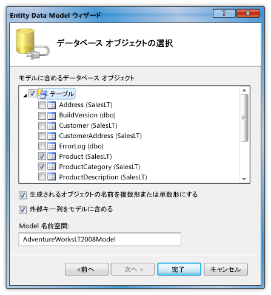

# チュートリアル: DataGrid コントロールでの SQL Server データベースのデータを表示

このチュートリアルで、SQL Server データベースからデータを取得およびそのデータを表示、<xref:System.Windows.Controls.DataGrid>コントロール。 ADO.NET Entity Framework を使用するには、データを表し、エンティティ クラスから指定されたデータを取得するクエリを記述するのに LINQ を使用するエンティティ クラスを作成します。

## 必須コンポーネント

このチュートリアルを実行するには、次のコンポーネントが必要です。

-   Visual Studio

-   SQL Server または SQL Server Express を接続して、AdventureWorks サンプル データベースを持つの実行中のインスタンスへのアクセス。 AdventureWorks データベースをダウンロードすることができます、 [GitHub](https://github.com/Microsoft/sql-server-samples/releases)します。

## エンティティ クラスを作成します。

1. Visual Basic または c# の場合で新しい WPF アプリケーション プロジェクトを作成し、名前`DataGridSQLExample`します。

2. ソリューション エクスプ ローラーでプロジェクトを右クリックして**追加**、し、**新しい項目の**します。

     新しい項目の追加 ダイアログ ボックスが表示されます。

3. インストールされたテンプレート ウィンドウで次のように選択します。**データ**でテンプレートの一覧で、次のように選択します。 **ADO.NET Entity Data Model**します。

     

4. ファイルに名前を`AdventureWorksModel.edmx`し**追加**します。

     Entity Data Model ウィザードが表示されます。

5. [モデルのコンテンツの選択] 画面で、次のように選択します。**データベースの EF デザイナー**順にクリックします**次**します。

6. データ接続の選択 画面で、AdventureWorksLT2008 データベースへの接続を提供します。 詳細については、次を参照してください。 [Your のデータ接続のダイアログ ボックスを選択](https://go.microsoft.com/fwlink/?LinkId=160190)します。

    名前があるかどうかを確認`AdventureWorksLT2008Entities`ことと、**エンティティ接続設定の app.config に保存** チェック ボックスが選択されているし、順にクリックします**次へ**します。

7. データベース オブジェクトの選択 画面で、テーブル ノードを展開し、選択、**製品**と**ProductCategory**テーブル。

     は、テーブルのすべてのエンティティ クラスを生成することができますただし、この例ではのみからデータを取り出すこれら 2 つのテーブル。

     

8. **[完了]** をクリックします。

     エンティティ デザイナーでは、Product および ProductCategory エンティティが表示されます。

     

## データを取得して

1. MainWindow.xaml ファイルを開きます。

2. 設定、<xref:System.Windows.FrameworkElement.Width%2A>プロパティを<xref:System.Windows.Window>450 にします。

3. XAML エディターで次のコードを追加<xref:System.Windows.Controls.DataGrid>タグの間、`<Grid>`と`</Grid>`タグを追加する、<xref:System.Windows.Controls.DataGrid>という`dataGrid1`。

     [!code-xaml[DataGrid_SQL_EF_Walkthrough#3](~/samples/snippets/csharp/VS_Snippets_Wpf/DataGrid_SQL_EF_Walkthrough/CS/MainWindow.xaml#3)]

     

4. <xref:System.Windows.Window>を選択します。

5. イベント ハンドラーを作成する [プロパティ] ウィンドウまたは XAML のエディターを使用して、<xref:System.Windows.Window>という`Window_Loaded`の<xref:System.Windows.FrameworkElement.Loaded>イベント。 詳細については、「[方法 :単純なイベント ハンドラーを作成](https://docs.microsoft.com/previous-versions/visualstudio/visual-studio-2010/bb675300(v=vs.100))です。

     次は、MainWindow.xaml の XAML を示します。

    > [!NOTE]
    > Visual Basic では、MainWindow.xaml の最初の行でを使用している場合は置き換えます`x:Class="DataGridSQLExample.MainWindow"`で`x:Class="MainWindow"`します。

     [!code-xaml[DataGrid_SQL_EF_Walkthrough#1](~/samples/snippets/csharp/VS_Snippets_Wpf/DataGrid_SQL_EF_Walkthrough/CS/MainWindow.xaml#1)]

6. 分離コード ファイル (MainWindow.xaml.vb または MainWindow.xaml.cs) を開き、<xref:System.Windows.Window>します。

7. 結合されたテーブルから特定の値を取得および設定するには、次のコードを追加、<xref:System.Windows.Controls.ItemsControl.ItemsSource%2A>のプロパティ、<xref:System.Windows.Controls.DataGrid>クエリの結果にします。

     [!code-csharp[DataGrid_SQL_EF_Walkthrough#2](~/samples/snippets/csharp/VS_Snippets_Wpf/DataGrid_SQL_EF_Walkthrough/CS/MainWindow.xaml.cs#2)]
     [!code-vb[DataGrid_SQL_EF_Walkthrough#2](~/samples/snippets/visualbasic/VS_Snippets_Wpf/DataGrid_SQL_EF_Walkthrough/VB/MainWindow.xaml.vb#2)]

8. 例を実行します。

     表示する必要があります、<xref:System.Windows.Controls.DataGrid>データを表示します。

     

## 関連項目

- <xref:System.Windows.Controls.DataGrid>
- [How Do i:WPF アプリケーションで Entity Framework で開始できますか。](https://go.microsoft.com/fwlink/?LinkId=159868)