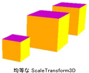

# 3-D 変換の概要
ここでは、[!INCLUDE[TLA#tla_winclient](../../../../includes/tlasharptla-winclient-md.md)] のグラフィックス システムで 3\-D モデルに変換を適用する方法について説明します。  変換を使用すると、開発者は、モデルを定義する基本値を変更せずに、モデルの位置、サイズ、および向きを変更することができます。  
  
   
  
## 3\-D 座標空間  
 [!INCLUDE[TLA#tla_winclient](../../../../includes/tlasharptla-winclient-md.md)] の 3\-D グラフィックス コンテンツは、2 次元要素の構造内に追加できる要素 <xref:System.Windows.Controls.Viewport3D> 内にカプセル化されます。  グラフィックス システムでは Viewport3D を他の多くの [!INCLUDE[TLA#tla_winclient](../../../../includes/tlasharptla-winclient-md.md)] と同様に 2 次元のビジュアル要素として扱います。  Viewport3D は 3 次元シーンへのウィンドウ \(ビューポート\) として機能します。  正確には、3\-D シーンが投影されるサーフェイスです。  同じシーン グラフ内で Viewport3D を他の 2\-D 描画オブジェクトと共に使用できますが、Viewport3D 内で 2\-D オブジェクトと 3\-D オブジェクトを相互に貫入させることはできません。  以下の説明では、示される座標空間は Viewport3D 要素に含まれています。  
  
 2\-D グラフィックスの [!INCLUDE[TLA#tla_winclient](../../../../includes/tlasharptla-winclient-md.md)] 座標系では、レンダリング サーフェイス \(通常は画面\) の左上に原点を置きます。  2\-D 座標系では、正の x 軸の値で右に移動し、正の y 軸の値で下に移動します。  しかし、3\-D 座標系では、原点は画面の中心に置かれ、正の x 軸の値で右に移動しますが、正の y 軸の値では上に移動し、さらに正の z 軸の値で原点から離れて観察者に向かう方向に移動します。  
  
   
座標系の比較  
  
 これらの軸によって定義される空間は、[!INCLUDE[TLA#tla_winclient](../../../../includes/tlasharptla-winclient-md.md)] の 3\-D オブジェクトを参照する静止座標系です。  この座標空間にモデルを構築し、照明とカメラを作成して表示するときに、この静止座標系、つまり "ワールド座標" と、変換を適用するときにモデルごとに作成するローカル座標とを区別すると役に立ちます。  また、ワールド座標のオブジェクトは、照明とカメラの設定によってまったく違って見えたり何も表示されないことがあります。ただし、カメラの位置によってワールド座標におけるオブジェクトの場所が変わることはありません。  
  
## モデルの変換  
 モデルを作成すると、モデルはシーン内の特定の場所に配置されます。  モデルをシーン内で移動したり、回転したり、サイズを変更したりするために、モデル自身を定義する頂点を変更するのは実用的ではありません。  代わりに、2\-D と同様、モデルに変換を適用します。  
  
 各モデル オブジェクトには、<xref:System.Windows.Media.Media3D.Model3D.Transform%2A> プロパティがあり、モデルを移動したり、向きやサイズを変更したりできます。  変換を適用すると、変換で指定されたベクターまたは値だけモデルの点をすべてオフセットできるため効率的です。  つまり、モデルが定義されている座標空間 \(モデル空間\) を変換しても、シーン全体の座標系におけるモデルの図形座標 \(ワールド座標\) を構成する値は変更されません。  
  
## 平行移動変換  
 3\-D 変換は抽象基本クラス <xref:System.Windows.Media.Media3D.Transform3D> を継承します。具体的には、アフィン変換クラス <xref:System.Windows.Media.Media3D.TranslateTransform3D>、<xref:System.Windows.Media.Media3D.ScaleTransform3D>、<xref:System.Windows.Media.Media3D.RotateTransform3D> などがあります。  また、[!INCLUDE[TLA#tla_winclient](../../../../includes/tlasharptla-winclient-md.md)] 3\-D 座標系は、より簡潔な行列演算で同じ変換を指定できるようにする <xref:System.Windows.Media.Media3D.MatrixTransform3D> クラスも提供します。  
  
 <xref:System.Windows.Media.Media3D.TranslateTransform3D> は、<xref:System.Windows.Media.Media3D.TranslateTransform3D.OffsetX%2A>、<xref:System.Windows.Media.Media3D.TranslateTransform3D.OffsetY%2A>、および <xref:System.Windows.Media.Media3D.TranslateTransform3D.OffsetZ%2A> プロパティを使用して指定するオフセット ベクターの方向に Model3D のすべての点を移動します。  たとえば、立方体の 1 つの頂点が \(2,2,2\) の場合、オフセット ベクター \(0,1.6,1\) はその頂点 \(2,2,2\) を \(2,3.6,3\) に移動します。  立方体の頂点は、モデル空間では \(2,2,2\) のままですが、モデル空間とワールド座標の関係は変更され、モデル空間での \(2,2,2\) はワールド座標では \(2,3.6,3\) になっています。  
  
   
オフセットによる平行移動  
  
 平行移動を適用する方法を次のコード例に示します。  
  
 [!code-xml[animation3dgallery_snip#Translation3DAnimationExampleWholePage](../../../../samples/snippets/csharp/VS_Snippets_Wpf/Animation3DGallery_snip/CS/Translation3DAnimationExample.xaml#translation3danimationexamplewholepage)]  
  
## スケール変換  
 <xref:System.Windows.Media.Media3D.ScaleTransform3D> は、中心点を基準にして指定したスケールのベクターを使用してモデルのスケールを変更します。  モデルのサイズを比率に応じて変更するには、X 軸、Y 軸、および Z 軸方向に同じ値ずつモデルをスケーリングする均等なスケールを指定します。  たとえば、変換の <xref:System.Windows.Media.ScaleTransform.ScaleX%2A>、<xref:System.Windows.Media.ScaleTransform.ScaleY%2A>、および <xref:System.Windows.Media.Media3D.ScaleTransform3D.ScaleZ%2A> プロパティを 0.5 に設定すると、モデルのサイズが半分になります。同じプロパティを 2 に設定すると、3 つすべての軸方向にスケールが倍になります。  
  
   
ScaleVector の例  
  
 不均等なスケール変換、つまり X、Y、および Z の値の一部が異なるスケール変換を指定すると、他の次元に影響を与えずに 1 つまたは 2 つの次元でモデルを伸縮できます。  たとえば、<xref:System.Windows.Media.ScaleTransform.ScaleX%2A> を 1、<xref:System.Windows.Media.ScaleTransform.ScaleY%2A> を 2、<xref:System.Windows.Media.Media3D.ScaleTransform3D.ScaleZ%2A> を 1 に設定すると、変換されたモデルの高さは 2 倍になりますが、X 軸および Z 軸方向は変更されません。  
  
 既定では、ScaleTransform3D によって頂点が原点 \(0,0,0\) を中心として伸縮されます。  ただし、変換するモデルが原点から描画されていない場合、原点からのモデルのスケーリングでは、モデルは "その場で" スケーリングされません。代わりに、モデルの頂点がスケールのベクターで乗算されるとき、スケーリング操作でモデルの平行移動およびそのスケーリングが実行されます。  
  
   
スケールの中心の例  
  
 モデルを "その場で" スケーリングするには、ScaleTransform3D の <xref:System.Windows.Media.ScaleTransform.CenterX%2A>、<xref:System.Windows.Media.ScaleTransform.CenterY%2A>、および <xref:System.Windows.Media.Media3D.ScaleTransform3D.CenterZ%2A> プロパティを設定してモデルの中心を指定します。  これにより、グラフィックス システムでモデル空間がスケーリングされ、指定した <xref:System.Windows.Media.Media3D.Point3D> の中心に平行移動されます。  逆に、原点を中心とするモデルを構築して別の中心点を指定すると、モデルは原点から平行移動されます。  
  
## 回転変換  
 3\-D のモデルは、さまざまな方法で回転できます。  一般的な回転変換では、軸とその軸に沿った回転角度を指定します。  <xref:System.Windows.Media.Media3D.RotateTransform3D> クラスを使用して、<xref:System.Windows.Media.Media3D.RotateTransform3D.Rotation%2A> プロパティで <xref:System.Windows.Media.Media3D.Rotation3D> を定義できます。  次に、Rotation3D \(この場合は <xref:System.Windows.Media.Media3D.AxisAngleRotation3D>\) で <xref:System.Windows.Media.Media3D.AxisAngleRotation3D.Axis%2A> および <xref:System.Windows.Media.Media3D.AxisAngleRotation3D.Angle%2A> プロパティを指定して変換を定義します。  次の例では、Y 軸に沿ってモデルを 60°回転します。  
  
 [!code-xml[animation3dgallery_snip#Rotate3DUsingAxisAngleRotation3DExampleWholePage](../../../../samples/snippets/csharp/VS_Snippets_Wpf/Animation3DGallery_snip/CS/Rotat3DUsingAxisAngleRotation3DExample.xaml#rotate3dusingaxisanglerotation3dexamplewholepage)]  
  
 メモ : [!INCLUDE[TLA#tla_winclient](../../../../includes/tlasharptla-winclient-md.md)] の 3\-D は右回りの座標系です。つまり、回転の角度値が正の場合は、軸に沿って反時計回りに回転が行われます。  
  
 軸\/角度回転では、値が RotateTransform3D の <xref:System.Windows.Media.Media3D.RotateTransform3D.CenterX%2A>、<xref:System.Windows.Media.Media3D.RotateTransform3D.CenterY%2A>、および <xref:System.Windows.Media.Media3D.RotateTransform3D.CenterZ%2A> プロパティに指定されていない場合は、原点を中心とする回転が想定されます。  スケーリングと同様に、回転ではモデルの座標空間全体が変換されることに留意してください。  モデルが原点を中心として作成されていない場合、または以前に平行移動されている場合は、回転時にその場で回転する代わりに原点を中心として "旋回" する可能性があります。  
  
   
新しい中心が指定された回転  
  
 モデルを "その場で" 回転するには、モデルの実際の中心を回転の中心として指定します。  通常、ジオメトリは原点を中心としてモデル化されるため、多くの場合、まずモデルのサイズを設定し \(スケーリング\)、次にその向きを設定し \(回転\)、最後にモデルを目的の位置に移動すると \(平行移動\)、一連の変換の予想どおりの結果が得られます。  
  
   
回転の例  
  
 軸\/角度回転は、静的な変換と一部のアニメーションで正しく動作します。  ただし、立方体モデルを X 軸に沿って 60°回転してから Z 軸に沿って 45°回転することを考えてみます。  この変換は、2 つの個別のアフィン変換または行列として記述できます。  ただし、この方法で定義した回転をスムーズにアニメーション化するのは困難です。  モデルの開始位置および終了位置はどちらの方法で計算しても同じですが、モデルが受け取る中間位置は、計算上は不確定です。  四元数は、回転の開始と終了の間の補間を計算する別の方法を示します。  
  
 四元数は、3\-D 空間の軸とその軸に沿った回転を表します。  たとえば、四元数は、\(1,1,2\) の軸と 50°の回転を表します。  四元数の回転の定義機能は、四元数で実行可能な構成および補間の 2 つの操作に基づきます。  ジオメトリに適用される 2 つの四元数の構成は、"ジオメトリを axis2 に沿って rotation2 だけ回転してから axis1 に沿って rotation1 だけ回転する" ことを意味します。構成を使用すると、ジオメトリに対する 2 つの回転を組み合わせて、結果を表す単一の四元数を取得することができます。  四元数の補間では、軸および向きの滑らかで適切なパスを計算できるため、元の四元数から構成済みの四元数に補間して滑らかな遷移を実現し、変換をアニメーション化することができます。  アニメーション化するモデルでは、<xref:System.Windows.Media.Media3D.RotateTransform3D.Rotation%2A> プロパティの <xref:System.Windows.Media.Media3D.QuaternionRotation3D> を使用して、回転先の <xref:System.Windows.Media.Media3D.Quaternion> を指定できます。  
  
## 変換コレクションの使用  
 シーンの作成時には、複数の変換を 1 つのモデルに適用するのが一般的です。  変換を <xref:System.Windows.Media.Media3D.Transform3DGroup> クラスの <xref:System.Windows.Media.Media3D.Transform3DGroup.Children%2A> コレクションに追加して、シーン内のさまざまなモデルに適用する変換を簡単にグループ化できます。  多くの場合、異なる変換セットを各インスタンスに適用することでモデルを再利用できるのと同様に、複数の異なるグループで変換を再利用すると便利です。  変換をコレクションに追加する順序が重要であることに注意してください。コレクション内の変換は、始めから終わりまで適用されます。  
  
## 変換のアニメーション化  
 [!INCLUDE[TLA#tla_winclient](../../../../includes/tlasharptla-winclient-md.md)] 3\-D 実装は、2\-D グラフィックスと同じタイミングとアニメーション システムに追加されます。  つまり、3\-D シーンにアニメーションを適用するには、そのモデルのプロパティにアニメーションを適用します。  プリミティブのプロパティに直接アニメーションを適用できますが、通常はモデルの位置や外観を変更する変換にアニメーションを適用する方が簡単です。  変換は、個々のモデル同様、<xref:System.Windows.Media.Media3D.Model3DGroup> オブジェクトに適用できるため、Model3Dgroup の子にアニメーションのセットを適用し、オブジェクトのグループに別のアニメーションのセットを適用することが可能です。  [!INCLUDE[TLA#tla_winclient](../../../../includes/tlasharptla-winclient-md.md)] のタイミングとアニメーション システムに関する背景情報として、「[アニメーションの概要](../../../../docs/framework/wpf/graphics-multimedia/animation-overview.md)」および「[ストーリーボードの概要](../../../../docs/framework/wpf/graphics-multimedia/storyboards-overview.md)」を参照してください。  
  
 [!INCLUDE[TLA#tla_winclient](../../../../includes/tlasharptla-winclient-md.md)] のオブジェクトをアニメーション化するには、タイムラインを作成し、アニメーションを定義し \(これは、実際は一定期間にわたって一部のプロパティ値を変更します\)、アニメーションを適用するプロパティを指定します。  このプロパティは、FrameworkElement のプロパティでなければなりません。  3\-D シーン内のすべてのオブジェクトは Viewport3D の子であるため、シーンに適用するアニメーションの対象となるプロパティは、Viewport3D のプロパティです。  構文が詳細な場合があるため、アニメーションのプロパティ パスは慎重に指定することが重要です。  
  
 たとえば、オブジェクトをその場で回転し、同時に旋回動作を適用してオブジェクトのより多くの部分が見えるようにするとします。  モデルに RotateTransform3D を適用して、あるベクトルから別のベクトルへの回転の軸にアニメーションを適用できます。  RotateTransform3D は <xref:System.Windows.Media.TransformGroup> でモデルに適用されている複数の変換の 1 つであるという前提で、<xref:System.Windows.Media.Animation.Vector3DAnimation> を変換の Rotation3D の Axis プロパティに適用する方法を次のコード例に示します。  
  
 [!code-csharp[3doverview#3DOverview3DN1](../../../../samples/snippets/csharp/VS_Snippets_Wpf/3DOverview/CSharp/Window1.xaml.cs#3doverview3dn1)]
 [!code-vb[3doverview#3DOverview3DN1](../../../../samples/snippets/visualbasic/VS_Snippets_Wpf/3DOverview/visualbasic/window1.xaml.vb#3doverview3dn1)]  
  
 [!code-csharp[3doverview#3DOverview3DN3](../../../../samples/snippets/csharp/VS_Snippets_Wpf/3DOverview/CSharp/Window1.xaml.cs#3doverview3dn3)]
 [!code-vb[3doverview#3DOverview3DN3](../../../../samples/snippets/visualbasic/VS_Snippets_Wpf/3DOverview/visualbasic/window1.xaml.vb#3doverview3dn3)]  
  
 同様の構文を使用して、オブジェクトを移動またはスケーリングする他の変換プロパティをターゲットにします。  たとえば、<xref:System.Windows.Media.Animation.Point3DAnimation> をスケール変換の ScaleCenter プロパティに適用して、モデルの形状をスムーズにゆがめます。  
  
 前の例では <xref:System.Windows.Media.Media3D.GeometryModel3D> のプロパティを変換しましたが、シーン内のその他のモデルのプロパティを変換することもできます。  たとえば、光源オブジェクトに適用された平行移動をアニメーション化すると、モデルの外観を大幅に変更できる光と影の移動効果を作り出すことができます。  
  
 カメラもモデルであるため、カメラのプロパティも変換することができます。  カメラの位置または平面距離を変換することで \(実際にはシーン投影全体を変換することで\) シーンの外観を確実に変更できますが、この方法で得られる効果の多くは、シーン内のモデルの位置に適用される変換に比べると、見る側にとって "視覚的な意味" があまりないことに注意してください。  
  
## 参照  
 [3\-D グラフィックスの概要](../../../../docs/framework/wpf/graphics-multimedia/3-d-graphics-overview.md)   
 [変換の概要](../../../../docs/framework/wpf/graphics-multimedia/transforms-overview.md)   
 [2\-D 変換のサンプル](http://go.microsoft.com/fwlink/?LinkID=158252)