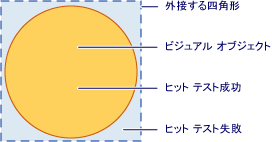

# ビジュアル層でのヒット テスト
ここでは、ビジュアル層で提供されるヒット テスト機能の概要について説明します。 ヒット テストのサポートでは、ジオメトリまたはポイント値の表示内容内かどうかを確認できます。、 <xref:System.Windows.Media.Visual>、複数のオブジェクトを選択する四角形を描くなどのユーザー インターフェイスの動作を実装することができます。  
  
 
  
   
## ヒット テストのシナリオ  
 <xref:System.Windows.UIElement>クラスには、<xref:System.Windows.UIElement.InputHitTest%2A>メソッドで、指定した座標値を使用して、要素に対してヒット テストすることができます。 多くの場合、<xref:System.Windows.UIElement.InputHitTest%2A>メソッドは、要素のテスト ヒットを実装するのに必要な機能を提供します。 ただし、ビジュアル層でのヒット テストを実装する必要があるシナリオもいくつか存在します。  
  
-   非に対するヒット テスト<xref:System.Windows.UIElement>オブジェクト: ヒット テスト以外を行う場合に適用されます<xref:System.Windows.UIElement>などのオブジェクト<xref:System.Windows.Media.DrawingVisual>やグラフィックス オブジェクト。  
  
-   ジオメトリを使用したヒット テスト: ポイントの座標値ではなくジオメトリ オブジェクトを使用してヒット テストを行う必要がある場合に適用されます。  
  
-   複数のオブジェクトに対するヒット テスト: 重なっているオブジェクトなどの複数のオブジェクトに対してヒット テストを行う必要がある場合に適用されます。 最初のビジュアルだけでなく、ジオメトリまたはポイントと交差するすべてのビジュアルの結果を取得できます。  
  
-   無視<xref:System.Windows.UIElement>ヒット テスト ポリシー: これは、無視する必要がある場合は適用されます、<xref:System.Windows.UIElement>ヒット テスト ポリシーで、要素が無効になっているかどうか、または非表示としてこのような要因を考慮します。  
  
> [!NOTE]
>  ビジュアル層でのテスト ヒットを示すコード サンプル全体については、「[DrawingVisuals を使用したヒット テストのサンプル](https://go.microsoft.com/fwlink/?LinkID=159994)」と「[Win32 相互運用によるヒット テストのサンプル](https://go.microsoft.com/fwlink/?LinkID=159995)」を参照してください。  
  
   
## ヒット テストのサポート  
 目的、<xref:System.Windows.Media.VisualTreeHelper.HitTest%2A>メソッド、<xref:System.Windows.Media.VisualTreeHelper>クラスは、ジオメトリまたはポイント座標の値がコントロールやグラフィック要素など、特定のオブジェクトの描画されるコンテンツ内かどうかを決定します。 たとえば、ヒット テストを使用することで、オブジェクトの外接する四角形内でのマウス クリックが、円のジオメトリ内にあるかどうかを確認できます。 また、ヒット テストの既定の実装をオーバーライドして、独自のカスタム ヒット テスト計算を実行することもできます。  
  
 四角形以外のオブジェクトの領域と外接する四角形の関係を次の図に示します。  
  
   
有効なヒット テスト領域のダイアグラム  
  
   
## ヒット テストと z オーダー  
 [!INCLUDE[TLA#tla_winclient](../../../../includes/tlasharptla-winclient-md.md)] のビジュアル層は、最上位のオブジェクトだけでなく、ポイントまたはジオメトリの下にあるすべてのオブジェクトに対するヒット テストをサポートします。 結果は z オーダーで返されます。 ただし、ビジュアル オブジェクトをパラメーターとして渡す、<xref:System.Windows.Media.VisualTreeHelper.HitTest%2A>メソッドは、どの部分を決定がヒットするビジュアル ツリーのテストします。 ヒット テストは、ビジュアル ツリー全体またはその一部に対して実行できます。  
  
 次の図では、四角形と三角形の両方のオブジェクト上に円オブジェクトがあります。 ヒット テストの z オーダーの値が最上位のビジュアル オブジェクトは場合、は、返されるビジュアル ヒット テストの列挙型を設定することができます<xref:System.Windows.Media.HitTestResultBehavior.Stop>から、<xref:System.Windows.Media.HitTestResultCallback>を最初の項目の後にヒット テストの移動を停止します。  
  
   
ビジュアル ツリーの z オーダーのダイアグラム  
  
 特定のポイントまたはジオメトリの下のすべてのビジュアル オブジェクトを列挙する場合は、返す<xref:System.Windows.Media.HitTestResultBehavior.Continue>から、<xref:System.Windows.Media.HitTestResultCallback>します。 つまり、完全に隠されているものも含めて、他のオブジェクトの下にあるすべてのビジュアル オブジェクトに対してヒット テストを行うことができます。 詳細については、「ヒット テスト結果のコールバックの使用」のサンプル コードを参照してください。  
  
> [!NOTE]
>  透明なビジュアル オブジェクトのヒット テストも実行できます。  
  
   
## 既定のヒット テストの使用  
 使用して、ビジュアル オブジェクトのジオメトリ内にポイントがあるかどうかを識別することができます、<xref:System.Windows.Media.VisualTreeHelper.HitTest%2A>ビジュアル オブジェクトとポイント座標のテスト対象の値を指定します。 ビジュアル オブジェクトのパラメーターは、ヒット テストの検索のためのビジュアル ツリー内の開始点を識別します。 ジオメトリに座標が含まれています、ビジュアル ツリーで、ビジュアル オブジェクトが見つかった場合に設定されて、<xref:System.Windows.Media.HitTestResult.VisualHit%2A>のプロパティを<xref:System.Windows.Media.HitTestResult>オブジェクト。 <xref:System.Windows.Media.HitTestResult>から返されます、<xref:System.Windows.Media.VisualTreeHelper.HitTest%2A>メソッド。 ポイントがヒット テストはビジュアル サブツリーに含まれていない場合<xref:System.Windows.Media.VisualTreeHelper.HitTest%2A>返します`null`します。  
  
> [!NOTE]
>  既定のヒット テストでは、常に z オーダーで最上位のオブジェクトが返されます。 部分的または完全に隠されているものも含めて、すべてのビジュアル オブジェクトを識別するには、ヒット テストの結果のコールバックを使用します。  
  
 ポイント パラメーターとして渡す座標値、<xref:System.Windows.Media.VisualTreeHelper.HitTest%2A>メソッドは、に対するテストがヒットしたビジュアル オブジェクトの座標空間を基準にある必要があります。 たとえば、入れ子になったビジュアル オブジェクトが親の座標空間の (100, 100) に定義されている場合、(0, 0) での子のビジュアルのヒット テストは、親の座標空間の (100, 100) でのヒット テストと同じになります。  
  
 次のコードは、マウス イベント ハンドラーを設定する方法を示しています、<xref:System.Windows.UIElement>ヒット テストのために使用されるイベントをキャプチャするために使用するオブジェクト。  
  
 [!code-csharp[HitTestingOverview#100](../../../../samples/snippets/csharp/VS_Snippets_Wpf/HitTestingOverview/CSharp/Window1.xaml.cs#100)]
 [!code-vb[HitTestingOverview#100](../../../../samples/snippets/visualbasic/VS_Snippets_Wpf/HitTestingOverview/visualbasic/window1.xaml.vb#100)]  
  
### ヒット テストに対するビジュアル ツリーの影響  
 ビジュアル ツリー内の開始点によって、ヒット テストによるオブジェクトの列挙時に返されるオブジェクトが決定されます。 ヒット テストの対象となるオブジェクトが複数存在する場合、ビジュアル ツリー内の開始点として使用されるビジュアル オブジェクトは、対象となるすべてのオブジェクトの共通の先祖である必要があります。 たとえば、次の図のボタン要素と描画ビジュアルの両方のヒット テストを行う場合、ビジュアル ツリー内の開始点を、その両方の共通の先祖に設定する必要があります。 この場合、キャンバス要素がボタン要素と描画ビジュアルの両方の共通の先祖になります。  
  
   
ビジュアル ツリー階層のダイアグラム  
  
> [!NOTE]
>  <xref:System.Windows.UIElement.IsHitTestVisible%2A>プロパティを取得または設定を宣言する値かどうかを<xref:System.Windows.UIElement>-、表示される内容の一部から派生したオブジェクトがヒット テストの結果として返される可能性があることができます。 これにより、ビジュアル ツリーを選択的に変更し、ヒット テストの対象となるビジュアル オブジェクトを決定することができます。  
  
   
## ヒット テスト結果のコールバックの使用  
 ジオメトリに指定した座標値が含まれるビジュアル ツリーのすべてのビジュアル オブジェクトを列挙できます。 これにより、他のビジュアル オブジェクトによって部分的または完全に隠されているものも含めて、すべてのビジュアル オブジェクトを識別することができます。 ビジュアル ツリーの使用中のビジュアル オブジェクトを列挙するために、<xref:System.Windows.Media.VisualTreeHelper.HitTest%2A>ヒット テスト コールバック関数を持つメソッド。 ヒット テスト コールバック関数は、指定した座標値がビジュアル オブジェクトに含まれている場合にシステムによって呼び出されます。  
  
 ヒット テストの結果の列挙時には、ビジュアル ツリーを変更する操作を実行しないでください。 走査中のビジュアル ツリーに対してオブジェクトの追加または削除を行うと、予測不可能な動作を招く可能性があります。 安全にした後、ビジュアル ツリーを変更することができます、<xref:System.Windows.Media.VisualTreeHelper.HitTest%2A>メソッドを返します。 など、データ構造を提供することも、 <xref:System.Collections.ArrayList>、ヒット テスト結果の列挙中に値を格納します。  
  
 [!code-csharp[HitTestingOverview#101](../../../../samples/snippets/csharp/VS_Snippets_Wpf/HitTestingOverview/CSharp/Window1.xaml.cs#101)]
 [!code-vb[HitTestingOverview#101](../../../../samples/snippets/visualbasic/VS_Snippets_Wpf/HitTestingOverview/visualbasic/window1.xaml.vb#101)]  
  
 ヒット テストのコールバック メソッドは、ビジュアル ツリーの特定のビジュアル オブジェクトでヒット テストが識別されたときに、ユーザーが実行するアクションを定義します。 操作を実行した後に戻す、<xref:System.Windows.Media.HitTestResultBehavior>かどうかは、他のビジュアル オブジェクトの列挙を続行するかどうかを決定する値。  
  
 [!code-csharp[HitTestingOverview#102](../../../../samples/snippets/csharp/VS_Snippets_Wpf/HitTestingOverview/CSharp/Window1.xaml.cs#102)]
 [!code-vb[HitTestingOverview#102](../../../../samples/snippets/visualbasic/VS_Snippets_Wpf/HitTestingOverview/visualbasic/window1.xaml.vb#102)]  
  
> [!NOTE]
>  ヒットしたビジュアル オブジェクトの列挙の順序は、z オーダー順です。 z オーダーの最上位のビジュアル オブジェクトが最初に列挙されます。 その他のビジュアル オブジェクトは、z オーダーの上位から順に列挙されます。 この列挙の順序は、ビジュアルの描画順序に対応します。  
  
 返すことによって、ヒット テスト コールバック関数でいつでも、ビジュアル オブジェクトの列挙を停止する<xref:System.Windows.Media.HitTestResultBehavior.Stop>します。  
  
 [!code-csharp[HitTestingOverview#103](../../../../samples/snippets/csharp/VS_Snippets_Wpf/HitTestingOverview/CSharp/Window1.xaml.cs#103)]
 [!code-vb[HitTestingOverview#103](../../../../samples/snippets/visualbasic/VS_Snippets_Wpf/HitTestingOverview/visualbasic/window1.xaml.vb#103)]  
  
   
## ヒット テスト フィルターのコールバックの使用  
 オプションのヒット テスト フィルターを使用して、ヒット テストの結果に渡されるオブジェクトを制限できます。 これにより、ヒット テストの結果でビジュアル ツリーの一部を処理する必要がない場合、その部分を無視できます。 ヒット テスト フィルターを実装するヒット テスト フィルターのコールバック関数を定義およびを呼び出すときにパラメーター値として渡す、<xref:System.Windows.Media.VisualTreeHelper.HitTest%2A>メソッド。  
  
 [!code-csharp[HitTestingOverview#104](../../../../samples/snippets/csharp/VS_Snippets_Wpf/HitTestingOverview/CSharp/Window1.xaml.cs#104)]
 [!code-vb[HitTestingOverview#104](../../../../samples/snippets/visualbasic/VS_Snippets_Wpf/HitTestingOverview/visualbasic/window1.xaml.vb#104)]  
  
 オプションのヒット テスト フィルターのコールバック関数を指定しない場合は、渡す、`null`に対してパラメーターと値、<xref:System.Windows.Media.VisualTreeHelper.HitTest%2A>メソッド。  
  
 [!code-csharp[HitTestingOverview#105](../../../../samples/snippets/csharp/VS_Snippets_Wpf/HitTestingOverview/CSharp/Window1.xaml.cs#105)]
 [!code-vb[HitTestingOverview#105](../../../../samples/snippets/visualbasic/VS_Snippets_Wpf/HitTestingOverview/visualbasic/window1.xaml.vb#105)]  
  
   
ビジュアル ツリーの簡略化  
  
 ヒット テスト フィルターのコールバック関数を使用すると、描画されるコンテンツに指定した座標が含まれるすべてのビジュアルを列挙できます。 ただし、ヒット テストの結果のコールバック関数で、ビジュアル ツリーの一部の分岐を処理する必要がない場合、これらの分岐を無視できます。 ヒット テスト フィルターのコールバック関数の戻り値によって、ビジュアル オブジェクトの列挙体が実行するアクションの種類が決定されます。 たとえば、次の値を返す<xref:System.Windows.Media.HitTestFilterBehavior.ContinueSkipSelfAndChildren>、ヒット テスト結果の列挙体から現在のビジュアル オブジェクトとその子を削除することができます。 つまり、ヒット テストの結果のコールバック関数は、列挙体でこれらのオブジェクトを認識しなくなります。 オブジェクトのビジュアル ツリーから余分なものを取り除くと、ヒット テストの結果の列挙体が渡されるときの処理を減らすことができます。 次のコード例では、フィルターはラベルとその子孫をスキップし、他のすべてのヒット テストを行います。  
  
 [!code-csharp[HitTestingOverview#106](../../../../samples/snippets/csharp/VS_Snippets_Wpf/HitTestingOverview/CSharp/Window1.xaml.cs#106)]
 [!code-vb[HitTestingOverview#106](../../../../samples/snippets/visualbasic/VS_Snippets_Wpf/HitTestingOverview/visualbasic/window1.xaml.vb#106)]  
  
> [!NOTE]
>  ヒット テスト フィルターのコールバックは、ヒット テストの結果のコールバックが呼び出されない場合に呼び出されることがあります。  
  
   
## 既定のヒット テストのオーバーライド  
 ビジュアル オブジェクトの既定のヒット テストのオーバーライドすることでサポートをオーバーライドすることができます、<xref:System.Windows.Media.Visual.HitTestCore%2A>メソッド。 つまり、呼び出すときに、<xref:System.Windows.Media.VisualTreeHelper.HitTest%2A>メソッド、オーバーライドされた実装の<xref:System.Windows.Media.Visual.HitTestCore%2A>が呼び出されます。 座標がビジュアル オブジェクトの描画されるコンテンツの外側にあっても、ビジュアル オブジェクトの外接する四角形内でヒット テストが実行されると、オーバーライドされたメソッドが呼び出されます。  
  
 [!code-csharp[HitTestingOverview#107](../../../../samples/snippets/csharp/VS_Snippets_Wpf/HitTestingOverview/CSharp/Window1.xaml.cs#107)]
 [!code-vb[HitTestingOverview#107](../../../../samples/snippets/visualbasic/VS_Snippets_Wpf/HitTestingOverview/visualbasic/window1.xaml.vb#107)]  
  
 ビジュアル オブジェクトの外接する四角形と描画されるコンテンツの両方に対してヒット テストを行う必要が生じる場合もあります。 使用して、`PointHitTestParameters`パラメーターの値でオーバーライドされた<xref:System.Windows.Media.Visual.HitTestCore%2A>基本メソッドにパラメーターとしてメソッド<xref:System.Windows.Media.Visual.HitTestCore%2A>、ビジュアル オブジェクトの外接する四角形のヒットに基づいてアクションを実行してに対する 2 番目のヒット テストを実行し、ビジュアル オブジェクトのコンテンツをレンダリングします。  
  
 [!code-csharp[HitTestingOverview#108](../../../../samples/snippets/csharp/VS_Snippets_Wpf/HitTestingOverview/CSharp/Window1.xaml.cs#108)]
 [!code-vb[HitTestingOverview#108](../../../../samples/snippets/visualbasic/VS_Snippets_Wpf/HitTestingOverview/visualbasic/window1.xaml.vb#108)]  
  
## 関連項目  
 <xref:System.Windows.Media.VisualTreeHelper.HitTest%2A>  
 <xref:System.Windows.Media.HitTestResult>  
 <xref:System.Windows.Media.HitTestResultCallback>  
 <xref:System.Windows.Media.HitTestFilterCallback>  
 <xref:System.Windows.UIElement.IsHitTestVisible%2A>  
 [DrawingVisuals のサンプルを使用してヒット テスト](https://go.microsoft.com/fwlink/?LinkID=159994)  
 [Win32 の相互運用サンプルによるヒット テスト](https://go.microsoft.com/fwlink/?LinkID=159995)  
 [ビジュアル内のジオメトリのヒット テストを実行する](../../../../docs/framework/wpf/graphics-multimedia/how-to-hit-test-geometry-in-a-visual.md)  
 [Win32 ホスト コンテナーを使用してヒット テストを実行する](../../../../docs/framework/wpf/graphics-multimedia/how-to-hit-test-using-a-win32-host-container.md)
