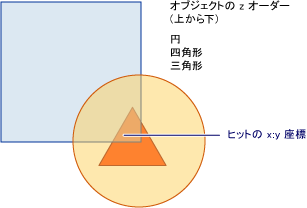

# ビジュアル層でのヒット テスト
ここでは、ビジュアル層で提供されるヒット テスト機能の概要について説明します。 ヒット テストのサポートでは、geometry 型またはポイントの値の表示内容内かどうかを確認することができます、 <xref:System.Windows.Media.Visual>、複数のオブジェクトを選択する四角形を描くなどのユーザー インターフェイスの動作を実装することができます。  
  
 
  
   
## ヒット テストのシナリオ  
 <xref:System.Windows.UIElement>クラスを提供、<xref:System.Windows.UIElement.InputHitTest%2A>メソッドで、指定された座標の値を使用して、要素に対してヒット テストすることができます。 多くの場合、<xref:System.Windows.UIElement.InputHitTest%2A>要素のテストのヒットを実装するメソッドが必要な機能を提供します。 ただし、ビジュアル層でのヒット テストを実装する必要があるシナリオもいくつか存在します。  
  
-   非に対するヒット テスト<xref:System.Windows.UIElement>オブジェクト: これ以外のテストがヒットする場合に当てはまります<xref:System.Windows.UIElement>などのオブジェクト<xref:System.Windows.Media.DrawingVisual>またはグラフィックス オブジェクト。  
  
-   ジオメトリを使用したヒット テスト: ポイントの座標値ではなくジオメトリ オブジェクトを使用してヒット テストを行う必要がある場合に適用されます。  
  
-   複数のオブジェクトに対するヒット テスト: 重なっているオブジェクトなどの複数のオブジェクトに対してヒット テストを行う必要がある場合に適用されます。 最初のビジュアルだけでなく、ジオメトリまたはポイントと交差するすべてのビジュアルの結果を取得できます。  
  
-   無視<xref:System.Windows.UIElement>ヒット テスト ポリシー: を無視する必要がある場合にこれが適用されます、<xref:System.Windows.UIElement>ヒット テスト ポリシーで、要素が無効になっているかどうかまたは非表示としてなどの条件を考慮します。  
  
> [!NOTE]
>  ビジュアル層でのテスト ヒットを示すコード サンプル全体については、「[DrawingVisuals を使用したヒット テストのサンプル](http://go.microsoft.com/fwlink/?LinkID=159994)」と「[Win32 相互運用によるヒット テストのサンプル](http://go.microsoft.com/fwlink/?LinkID=159995)」を参照してください。  
  
   
## ヒット テストのサポート  
 目的、<xref:System.Windows.Media.VisualTreeHelper.HitTest%2A>内のメソッド、<xref:System.Windows.Media.VisualTreeHelper>クラスは、geometry 型またはポイント座標の値がコントロールのグラフィック要素など、特定のオブジェクトの描画された内容内かどうかを決定します。 たとえば、ヒット テストを使用することで、オブジェクトの外接する四角形内でのマウス クリックが、円のジオメトリ内にあるかどうかを確認できます。 また、ヒット テストの既定の実装をオーバーライドして、独自のカスタム ヒット テスト計算を実行することもできます。  
  
 四角形以外のオブジェクトの領域と外接する四角形の関係を次の図に示します。  
  
   
有効なヒット テスト領域のダイアグラム  
  
   
## ヒット テストと z オーダー  
 [!INCLUDE[TLA#tla_winclient](../../../../includes/tlasharptla-winclient-md.md)] のビジュアル層は、最上位のオブジェクトだけでなく、ポイントまたはジオメトリの下にあるすべてのオブジェクトに対するヒット テストをサポートします。 結果は z オーダーで返されます。 ただし、ビジュアル オブジェクトをパラメーターとして渡す、<xref:System.Windows.Media.VisualTreeHelper.HitTest%2A>のどの部分を決定するメソッドがヒットするビジュアル ツリーのテストします。 ヒット テストは、ビジュアル ツリー全体またはその一部に対して実行できます。  
  
 次の図では、四角形と三角形の両方のオブジェクト上に円オブジェクトがあります。 ヒット z オーダー値がある最上位のビジュアル オブジェクトをテストに興味のみ場合は、返されるビジュアル ヒット テスト列挙型を設定できます<xref:System.Windows.Media.HitTestResultBehavior.Stop>から、<xref:System.Windows.Media.HitTestResultCallback>を最初の項目の後にヒット テストの検査を停止します。  
  
   
ビジュアル ツリーの z オーダーのダイアグラム  
  
 特定の時点または geometry 下にあるすべてのビジュアル オブジェクトを列挙する場合は、返す<xref:System.Windows.Media.HitTestResultBehavior.Continue>から、<xref:System.Windows.Media.HitTestResultCallback>です。 つまり、完全に隠されているものも含めて、他のオブジェクトの下にあるすべてのビジュアル オブジェクトに対してヒット テストを行うことができます。 詳細については、「ヒット テスト結果のコールバックの使用」のサンプル コードを参照してください。  
  
> [!NOTE]
>  透明なビジュアル オブジェクトのヒット テストも実行できます。  
  
   
## 既定のヒット テストの使用  
 ポイントを使用してビジュアル オブジェクトのジオメトリ内かどうかを識別することができます、 <xref:System.Windows.Media.VisualTreeHelper.HitTest%2A> visual オブジェクトと、ポイント座標と比較する値を指定します。 ビジュアル オブジェクトのパラメーターは、ヒット テストの検索のためのビジュアル ツリー内の開始点を識別します。 設定されているジオメトリには、目的の座標が含まれています。 ビジュアル ツリーで visual オブジェクトが見つかった場合、<xref:System.Windows.Media.HitTestResult.VisualHit%2A>のプロパティ、<xref:System.Windows.Media.HitTestResult>オブジェクト。 <xref:System.Windows.Media.HitTestResult>からは返され、<xref:System.Windows.Media.VisualTreeHelper.HitTest%2A>メソッドです。 ポイントがヒット テストは visual のサブツリーに含まれていない場合<xref:System.Windows.Media.VisualTreeHelper.HitTest%2A>返します`null`です。  
  
> [!NOTE]
>  既定のヒット テストでは、常に z オーダーで最上位のオブジェクトが返されます。 部分的または完全に隠されているものも含めて、すべてのビジュアル オブジェクトを識別するには、ヒット テストの結果のコールバックを使用します。  
  
 座標の値のポイントのパラメーターとして渡す、<xref:System.Windows.Media.VisualTreeHelper.HitTest%2A>への座標空間に対するテストがヒットしたビジュアル オブジェクトの相対的なメソッドには。 たとえば、入れ子になったビジュアル オブジェクトが親の座標空間の (100, 100) に定義されている場合、(0, 0) での子のビジュアルのヒット テストは、親の座標空間の (100, 100) でのヒット テストと同じになります。  
  
 次のコードのマウス イベントのハンドラーを設定する方法を示しています、<xref:System.Windows.UIElement>ヒット テストのためのイベントをキャプチャするために使用できるオブジェクト。  
  
 [!code-csharp[HitTestingOverview#100](../../../../samples/snippets/csharp/VS_Snippets_Wpf/HitTestingOverview/CSharp/Window1.xaml.cs#100)]
 [!code-vb[HitTestingOverview#100](../../../../samples/snippets/visualbasic/VS_Snippets_Wpf/HitTestingOverview/visualbasic/window1.xaml.vb#100)]  
  
### ヒット テストに対するビジュアル ツリーの影響  
 ビジュアル ツリー内の開始点によって、ヒット テストによるオブジェクトの列挙時に返されるオブジェクトが決定されます。 ヒット テストの対象となるオブジェクトが複数存在する場合、ビジュアル ツリー内の開始点として使用されるビジュアル オブジェクトは、対象となるすべてのオブジェクトの共通の先祖である必要があります。 たとえば、次の図のボタン要素と描画ビジュアルの両方のヒット テストを行う場合、ビジュアル ツリー内の開始点を、その両方の共通の先祖に設定する必要があります。 この場合、キャンバス要素がボタン要素と描画ビジュアルの両方の共通の先祖になります。  
  
   
ビジュアル ツリー階層のダイアグラム  
  
> [!NOTE]
>  <xref:System.Windows.UIElement.IsHitTestVisible%2A>プロパティを取得またはを宣言する値を設定するかどうか、 <xref:System.Windows.UIElement>-、表示される内容の一部から派生したオブジェクトがヒット テストの結果として返される可能性のあることができます。 これにより、ビジュアル ツリーを選択的に変更し、ヒット テストの対象となるビジュアル オブジェクトを決定することができます。  
  
   
## ヒット テスト結果のコールバックの使用  
 ジオメトリに指定した座標値が含まれるビジュアル ツリーのすべてのビジュアル オブジェクトを列挙できます。 これにより、他のビジュアル オブジェクトによって部分的または完全に隠されているものも含めて、すべてのビジュアル オブジェクトを識別することができます。 ビジュアル ツリーを使用してビジュアル オブジェクトを列挙する、<xref:System.Windows.Media.VisualTreeHelper.HitTest%2A>ヒット テストのコールバック関数を持つメソッドです。 ヒット テスト コールバック関数は、指定した座標値がビジュアル オブジェクトに含まれている場合にシステムによって呼び出されます。  
  
 ヒット テストの結果の列挙時には、ビジュアル ツリーを変更する操作を実行しないでください。 走査中のビジュアル ツリーに対してオブジェクトの追加または削除を行うと、予測不可能な動作を招く可能性があります。 安全に後のビジュアル ツリーを変更することができます、<xref:System.Windows.Media.VisualTreeHelper.HitTest%2A>メソッドを返します。 など、データ構造を提供することも、 <xref:System.Collections.ArrayList>、ヒット テスト結果の列挙中に値を格納します。  
  
 [!code-csharp[HitTestingOverview#101](../../../../samples/snippets/csharp/VS_Snippets_Wpf/HitTestingOverview/CSharp/Window1.xaml.cs#101)]
 [!code-vb[HitTestingOverview#101](../../../../samples/snippets/visualbasic/VS_Snippets_Wpf/HitTestingOverview/visualbasic/window1.xaml.vb#101)]  
  
 ヒット テストのコールバック メソッドは、ビジュアル ツリーの特定のビジュアル オブジェクトでヒット テストが識別されたときに、ユーザーが実行するアクションを定義します。 操作を実行した後に戻す、<xref:System.Windows.Media.HitTestResultBehavior>を他のビジュアル オブジェクトの列挙を続行するかどうかを決定する値。  
  
 [!code-csharp[HitTestingOverview#102](../../../../samples/snippets/csharp/VS_Snippets_Wpf/HitTestingOverview/CSharp/Window1.xaml.cs#102)]
 [!code-vb[HitTestingOverview#102](../../../../samples/snippets/visualbasic/VS_Snippets_Wpf/HitTestingOverview/visualbasic/window1.xaml.vb#102)]  
  
> [!NOTE]
>  ヒットしたビジュアル オブジェクトの列挙の順序は、z オーダー順です。 z オーダーの最上位のビジュアル オブジェクトが最初に列挙されます。 その他のビジュアル オブジェクトは、z オーダーの上位から順に列挙されます。 この列挙の順序は、ビジュアルの描画順序に対応します。  
  
 ヒット テストのコールバック関数でいつでもビジュアル オブジェクトの列挙を停止するには、返すを<xref:System.Windows.Media.HitTestResultBehavior.Stop>です。  
  
 [!code-csharp[HitTestingOverview#103](../../../../samples/snippets/csharp/VS_Snippets_Wpf/HitTestingOverview/CSharp/Window1.xaml.cs#103)]
 [!code-vb[HitTestingOverview#103](../../../../samples/snippets/visualbasic/VS_Snippets_Wpf/HitTestingOverview/visualbasic/window1.xaml.vb#103)]  
  
   
## ヒット テスト フィルターのコールバックの使用  
 オプションのヒット テスト フィルターを使用して、ヒット テストの結果に渡されるオブジェクトを制限できます。 これにより、ヒット テストの結果でビジュアル ツリーの一部を処理する必要がない場合、その部分を無視できます。 ヒット テスト フィルターを実装するヒット テスト フィルターのコールバック関数を定義して呼び出すときにパラメーター値として渡す、、<xref:System.Windows.Media.VisualTreeHelper.HitTest%2A>メソッドです。  
  
 [!code-csharp[HitTestingOverview#104](../../../../samples/snippets/csharp/VS_Snippets_Wpf/HitTestingOverview/CSharp/Window1.xaml.cs#104)]
 [!code-vb[HitTestingOverview#104](../../../../samples/snippets/visualbasic/VS_Snippets_Wpf/HitTestingOverview/visualbasic/window1.xaml.vb#104)]  
  
 省略可能なヒット テスト フィルターのコールバック関数を指定しない場合、`null`とそのパラメーターの値、<xref:System.Windows.Media.VisualTreeHelper.HitTest%2A>メソッドです。  
  
 [!code-csharp[HitTestingOverview#105](../../../../samples/snippets/csharp/VS_Snippets_Wpf/HitTestingOverview/CSharp/Window1.xaml.cs#105)]
 [!code-vb[HitTestingOverview#105](../../../../samples/snippets/visualbasic/VS_Snippets_Wpf/HitTestingOverview/visualbasic/window1.xaml.vb#105)]  
  
   
ビジュアル ツリーの簡略化  
  
 ヒット テスト フィルターのコールバック関数を使用すると、描画されるコンテンツに指定した座標が含まれるすべてのビジュアルを列挙できます。 ただし、ヒット テストの結果のコールバック関数で、ビジュアル ツリーの一部の分岐を処理する必要がない場合、これらの分岐を無視できます。 ヒット テスト フィルターのコールバック関数の戻り値によって、ビジュアル オブジェクトの列挙体が実行するアクションの種類が決定されます。 たとえば、次の値を返す<xref:System.Windows.Media.HitTestFilterBehavior.ContinueSkipSelfAndChildren>、ヒット テスト結果の列挙体から現在の visual オブジェクトとその子を削除することができます。 つまり、ヒット テストの結果のコールバック関数は、列挙体でこれらのオブジェクトを認識しなくなります。 オブジェクトのビジュアル ツリーから余分なものを取り除くと、ヒット テストの結果の列挙体が渡されるときの処理を減らすことができます。 次のコード例では、フィルターはラベルとその子孫をスキップし、他のすべてのヒット テストを行います。  
  
 [!code-csharp[HitTestingOverview#106](../../../../samples/snippets/csharp/VS_Snippets_Wpf/HitTestingOverview/CSharp/Window1.xaml.cs#106)]
 [!code-vb[HitTestingOverview#106](../../../../samples/snippets/visualbasic/VS_Snippets_Wpf/HitTestingOverview/visualbasic/window1.xaml.vb#106)]  
  
> [!NOTE]
>  ヒット テスト フィルターのコールバックは、ヒット テストの結果のコールバックが呼び出されない場合に呼び出されることがあります。  
  
   
## 既定のヒット テストのオーバーライド  
 オーバーライドすることでサポートをテストしてビジュアル オブジェクトの既定のヒットをオーバーライドすることができます、<xref:System.Windows.Media.Visual.HitTestCore%2A>メソッドです。 つまりを呼び出すときは、<xref:System.Windows.Media.VisualTreeHelper.HitTest%2A>メソッドは、のオーバーライドされた実装<xref:System.Windows.Media.Visual.HitTestCore%2A>と呼びます。 座標がビジュアル オブジェクトの描画されるコンテンツの外側にあっても、ビジュアル オブジェクトの外接する四角形内でヒット テストが実行されると、オーバーライドされたメソッドが呼び出されます。  
  
 [!code-csharp[HitTestingOverview#107](../../../../samples/snippets/csharp/VS_Snippets_Wpf/HitTestingOverview/CSharp/Window1.xaml.cs#107)]
 [!code-vb[HitTestingOverview#107](../../../../samples/snippets/visualbasic/VS_Snippets_Wpf/HitTestingOverview/visualbasic/window1.xaml.vb#107)]  
  
 ビジュアル オブジェクトの外接する四角形と描画されるコンテンツの両方に対してヒット テストを行う必要が生じる場合もあります。 使用して、 `PointHitTestParameters` 、オーバーライドのパラメーター値<xref:System.Windows.Media.Visual.HitTestCore%2A>基本メソッドにパラメーターとしてメソッド<xref:System.Windows.Media.Visual.HitTestCore%2A>、ビジュアル オブジェクトの外接する四角形のヒットに基づいてアクションを実行してに対して 2 つ目のヒット テストを実行しますビジュアル オブジェクトのコンテンツをレンダリングします。  
  
 [!code-csharp[HitTestingOverview#108](../../../../samples/snippets/csharp/VS_Snippets_Wpf/HitTestingOverview/CSharp/Window1.xaml.cs#108)]
 [!code-vb[HitTestingOverview#108](../../../../samples/snippets/visualbasic/VS_Snippets_Wpf/HitTestingOverview/visualbasic/window1.xaml.vb#108)]  
  
## 関連項目  
 <xref:System.Windows.Media.VisualTreeHelper.HitTest%2A>  
 <xref:System.Windows.Media.HitTestResult>  
 <xref:System.Windows.Media.HitTestResultCallback>  
 <xref:System.Windows.Media.HitTestFilterCallback>  
 <xref:System.Windows.UIElement.IsHitTestVisible%2A>  
 [ヒット テスト DrawingVisuals サンプルの使用](http://go.microsoft.com/fwlink/?LinkID=159994)  
 [ヒット テストの Win32 相互運用性サンプル](http://go.microsoft.com/fwlink/?LinkID=159995)  
 [ビジュアル内のジオメトリのヒット テストを実行する](../../../../docs/framework/wpf/graphics-multimedia/how-to-hit-test-geometry-in-a-visual.md)  
 [Win32 ホスト コンテナーを使用してヒット テストを実行する](../../../../docs/framework/wpf/graphics-multimedia/how-to-hit-test-using-a-win32-host-container.md)
