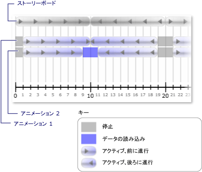

# 方法 : クロックの状態が変化したときに通知を受け取る
クロックの <xref:System.Windows.Media.Animation.Clock.CurrentStateInvalidated> イベントは、クロックの <xref:System.Windows.Media.Animation.Clock.CurrentState%2A> が無効化されたとき \(クロックが開始または停止されたときなど\) に発生します。  このイベントは、<xref:System.Windows.Media.Animation.Clock> を直接使用するか、または <xref:System.Windows.Media.Animation.Timeline> を使用して登録できます。  
  
 次の例では、 2 つの四角形の幅をアニメーション化するために、<xref:System.Windows.Media.Animation.Storyboard> と 2 つの <xref:System.Windows.Media.Animation.DoubleAnimation> オブジェクトを使用しています。  <xref:System.Windows.Media.Animation.Timeline.CurrentStateInvalidated> イベントは、クロック状態の変化を待機するために使われています。  
  
## 使用例  
 [!code-xml[timingbehaviors_snip#_graphicsmm_StateExampleMarkupWholePage](../../../../samples/snippets/csharp/VS_Snippets_Wpf/timingbehaviors_snip/CSharp/StateExample.xaml#_graphicsmm_stateexamplemarkupwholepage)]  
  
 [!code-csharp[timingbehaviors_snip#_graphicsmm_StateEventHandlers](../../../../samples/snippets/csharp/VS_Snippets_Wpf/timingbehaviors_snip/CSharp/StateExample.xaml.cs#_graphicsmm_stateeventhandlers)]
 [!code-vb[timingbehaviors_snip#_graphicsmm_StateEventHandlers](../../../../samples/snippets/visualbasic/VS_Snippets_Wpf/timingbehaviors_snip/visualbasic/stateexample.xaml.vb#_graphicsmm_stateeventhandlers)]  
  
 次の図は、親タイムライン \(*Storyboard*\) の進行に応じて、アニメーションがさまざまな状態に変化することを示したものです。  
  
   
  
 次の表は、*Animation1* の <xref:System.Windows.Media.Animation.Timeline.CurrentStateInvalidated> イベントが発生する時間を示したものです。  
  
||||||||  
|-|-|-|-|-|-|-|  
|時間 \(秒\)|1|10|19|21|30|39|  
|状態|Active|Active|Stopped|Active|Active|Stopped|  
  
 次の表は、*Animation2* の <xref:System.Windows.Media.Animation.Timeline.CurrentStateInvalidated> イベントが発生する時間を示したものです。  
  
||||||||||  
|-|-|-|-|-|-|-|-|-|  
|時間 \(秒\)|1|9|11|19|21|29|31|39|  
|状態|Active|Filling|Active|Stopped|Active|Filling|Active|Stopped|  
  
 *Animation1* の <xref:System.Windows.Media.Animation.Timeline.CurrentStateInvalidated> イベントは10秒で発生しますが、状態は <xref:System.Windows.Media.Animation.ClockState> のままになる点に注目してください。  これは、状態は 10 秒で変更されますが、<xref:System.Windows.Media.Animation.ClockState> から <xref:System.Windows.Media.Animation.ClockState> に変更され、同じタイミングで再び <xref:System.Windows.Media.Animation.ClockState> に戻されるためです。