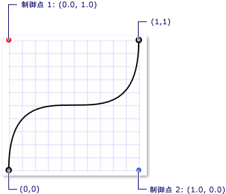

# キー フレーム アニメーションの概要
このトピックでは、キー フレーム アニメーションの概要を説明します。 キー フレーム アニメーションでは、3 つ以上のターゲット値を使用してアニメーション化することができ、アニメーションの補間方式を制御できます。  
  
   
## 必須コンポーネント  
 この概要を理解するのには、[!INCLUDE[TLA#tla_winclient](../../../../includes/tlasharptla-winclient-md.md)] アニメーションとタイムラインを理解しておく必要があります。 アニメーションの概要については、「[アニメーションの概要](../../../../docs/framework/wpf/graphics-multimedia/animation-overview.md)」を参照してください。 さらに、From/To/By アニメーションについて理解しておくと役に立ちます。 詳細については、「From/To/By アニメーションの概要」を参照してください。  
  
   
## キー フレーム アニメーションとは  
 From/To/By アニメーションと同じように、キー フレーム アニメーションも、ターゲット プロパティの値をアニメーション化します。 経由でターゲット値間の遷移を作成、<xref:System.Windows.Media.Animation.Timeline.Duration%2A>します。 ただし、From/To/By アニメーションは 2 つの値の間の遷移を作成しますが、キー フレーム アニメーションは、任意の数のターゲット値の間の遷移を作成できます。 From/To/By アニメーションとは異なり、キー フレーム アニメーションには、ターゲット値を設定する From、To、または By プロパティはありません。 キー フレーム アニメーションのターゲット値は、キー フレーム オブジェクトを使用して記述されます (このため、"キー フレーム アニメーション" という用語が使用されます)。 アニメーションのターゲット値を指定するキー フレーム オブジェクトを作成して、アニメーションに追加<xref:System.Windows.Media.Animation.DoubleAnimationUsingKeyFrames.KeyFrames%2A>コレクション。 アニメーションを実行すると、アニメーションが指定したフレームの間で遷移します。  
  
 複数のターゲット値のサポートに加え、一部のキー フレーム メソッドでは、複数の補間方式もサポートします。 アニメーションの補間方式は、1 つの値から次の値にどのように遷移するかを定義します。 補間には、離散、線形、およびスプラインの 3 つの種類があります。  
  
 キー フレーム アニメーションをアニメーション化するには、次の手順を完了します。  
  
-   アニメーションを宣言し、指定の<xref:System.Windows.Media.Animation.Timeline.Duration%2A>によって/アニメーションの場合と同様、します。  
  
-   各ターゲット値の適切な型のキー フレームを作成、その値を設定し、<xref:System.Windows.Media.Animation.KeyTime>に、アニメーションの追加と<xref:System.Windows.Media.Animation.DoubleAnimationUsingKeyFrames.KeyFrames%2A>コレクション。  
  
-   From/To/By アニメーションと同じように、アニメーションをプロパティに関連付けます。 ストーリーボードを使用したアニメーションのプロパティへの適用の詳細については、「[ストーリー ボードの概要](../../../../docs/framework/wpf/graphics-multimedia/storyboards-overview.md)」を参照してください。  
  
 次の例では、<xref:System.Windows.Media.Animation.DoubleAnimationUsingKeyFrames>をアニメーション化する、<xref:System.Windows.Shapes.Rectangle>要素を次の 4 つの異なる場所にします。  
  
 [!code-xaml[keyframes_ovw_snippet#BasicKeyFrameExampleWholePage](../../../../samples/snippets/csharp/VS_Snippets_Wpf/keyframes_ovw_snippet/CS/KeyFramesIntroduction.xaml#basickeyframeexamplewholepage)]  
  
 な From/に/By などのアニメーション、キー フレーム アニメーションを使用して、プロパティに適用できる、<xref:System.Windows.Media.Animation.Storyboard>マークアップとコードでまたはを使用して、<xref:System.Windows.Media.Animation.Animatable.BeginAnimation%2A>コード内のメソッド。 作成するキー フレーム アニメーションを使用することも、<xref:System.Windows.Media.Animation.AnimationClock>を 1 つまたは複数のプロパティに適用します。 アニメーションを適用するためのさまざまなメソッドの詳細については、「[プロパティ アニメーションの手法の概要](../../../../docs/framework/wpf/graphics-multimedia/property-animation-techniques-overview.md)」を参照してください。  
  
   
## キー フレーム アニメーションの種類  
 アニメーションはプロパティ値を生成するため、プロパティの型ごとに異なるアニメーションの種類があります。 受け取るプロパティをアニメーション化する、 <xref:System.Double> (要素のなど<xref:System.Windows.FrameworkElement.Width%2A>プロパティ)、生成するアニメーションを使用する<xref:System.Double>値。 受け取るプロパティをアニメーション化する、<xref:System.Windows.Point>を生成するアニメーションを使用する<xref:System.Windows.Point>値、という具合です。  
  
 属している、キー フレーム アニメーション クラス、<xref:System.Windows.Media.Animation>名前空間と、次の名前付け規則に従います。  
  
 *\<Type>* `AnimationUsingKeyFrames`  
  
 ここで、*\<Type>* は、クラスがアニメーション化する値の型です。  
  
 [!INCLUDE[TLA2#tla_winclient](../../../../includes/tla2sharptla-winclient-md.md)] は、次のキー フレーム アニメーション クラスを提供します。  
  
|プロパティの型|対応するFrom/To/By アニメーションのクラス|サポートされる補間方式|  
|-------------------|------------------------------------------------|-------------------------------------|  
|<xref:System.Boolean>|<xref:System.Windows.Media.Animation.BooleanAnimationUsingKeyFrames>|離散|  
|<xref:System.Byte>|<xref:System.Windows.Media.Animation.ByteAnimationUsingKeyFrames>|離散、線形、スプライン|  
|<xref:System.Windows.Media.Color>|<xref:System.Windows.Media.Animation.ColorAnimationUsingKeyFrames>|離散、線形、スプライン|  
|<xref:System.Decimal>|<xref:System.Windows.Media.Animation.DecimalAnimationUsingKeyFrames>|離散、線形、スプライン|  
|<xref:System.Double>|<xref:System.Windows.Media.Animation.DoubleAnimationUsingKeyFrames>|離散、線形、スプライン|  
|<xref:System.Int16>|<xref:System.Windows.Media.Animation.Int16AnimationUsingKeyFrames>|離散、線形、スプライン|  
|<xref:System.Int32>|<xref:System.Windows.Media.Animation.Int32AnimationUsingKeyFrames>|離散、線形、スプライン|  
|<xref:System.Int64>|<xref:System.Windows.Media.Animation.Int64AnimationUsingKeyFrames>|離散、線形、スプライン|  
|<xref:System.Windows.Media.Matrix>|<xref:System.Windows.Media.Animation.MatrixAnimationUsingKeyFrames>|離散|  
|<xref:System.Object>|<xref:System.Windows.Media.Animation.ObjectAnimationUsingKeyFrames>|離散|  
|<xref:System.Windows.Point>|<xref:System.Windows.Media.Animation.PointAnimationUsingKeyFrames>|離散、線形、スプライン|  
|<xref:System.Windows.Media.Media3D.Quaternion>|<xref:System.Windows.Media.Animation.QuaternionAnimationUsingKeyFrames>|離散、線形、スプライン|  
|<xref:System.Windows.Rect>|<xref:System.Windows.Media.Animation.RectAnimationUsingKeyFrames>|離散、線形、スプライン|  
|<xref:System.Windows.Media.Media3D.Rotation3D>|<xref:System.Windows.Media.Animation.Rotation3DAnimationUsingKeyFrames>|離散、線形、スプライン|  
|<xref:System.Single>|<xref:System.Windows.Media.Animation.SingleAnimationUsingKeyFrames>|離散、線形、スプライン|  
|<xref:System.String>|<xref:System.Windows.Media.Animation.StringAnimationUsingKeyFrames>|離散|  
|<xref:System.Windows.Size>|<xref:System.Windows.Media.Animation.SizeAnimationUsingKeyFrames>|離散、線形、スプライン|  
|<xref:System.Windows.Thickness>|<xref:System.Windows.Media.Animation.ThicknessAnimationUsingKeyFrames>|離散、線形、スプライン|  
|<xref:System.Windows.Media.Media3D.Vector3D>|<xref:System.Windows.Media.Animation.Vector3DAnimationUsingKeyFrames>|離散、線形、スプライン|  
|<xref:System.Windows.Vector>|<xref:System.Windows.Media.Animation.VectorAnimationUsingKeyFrames>|離散、線形、スプライン|  
  
   
## ターゲット値 (キー フレーム) とキー時刻  
 さまざまな種類のプロパティをアニメーション化するための多様な種類のキー フレーム アニメーションがあるように、さまざまな種類のキー フレーム オブジェクトがあります (アニメーション化される値の型とサポートされる補間方式ごとに 1 種類のオブジェクト)。 キー フレームの種類は、次の名前付け規則に従います。  
  
 *\<InterpolationMethod>\<Type>* `KeyFrame`  
  
 ここで、*\<InterpolationMethod>* は、キー フレームで使用される補間方式であり、*\<Type>* は、クラスがアニメーション化する値の型です。 3 つの補間方式のすべてをサポートするキー フレーム アニメーションでは、3 種類のキー フレームを使用できます。 たとえば、キー フレームの 3 種類を使用することができます、 <xref:System.Windows.Media.Animation.DoubleAnimationUsingKeyFrames>: <xref:System.Windows.Media.Animation.DiscreteDoubleKeyFrame>、 <xref:System.Windows.Media.Animation.LinearDoubleKeyFrame>、および<xref:System.Windows.Media.Animation.SplineDoubleKeyFrame>します。 (補間方式については、後のセクションで詳しく説明します)。  
  
 キー フレームの主な目的は、指定する、<xref:System.Windows.Media.Animation.IKeyFrame.KeyTime%2A>と<xref:System.Windows.Media.Animation.IKeyFrame.Value%2A>します。 すべての種類のキー フレームには、次の 2 つのプロパティがあります。  
  
-   <xref:System.Windows.Media.Animation.IKeyFrame.Value%2A>プロパティがそのキー フレームのターゲット値を指定します。  
  
-   <xref:System.Windows.Media.Animation.IKeyFrame.KeyTime%2A>プロパティでは、タイミングを指定します (アニメーションの内<xref:System.Windows.Media.Animation.Timeline.Duration%2A>) キー フレームの<xref:System.Windows.Media.Animation.IKeyFrame.Value%2A>に到達します。  
  
 キー フレーム アニメーションの開始時に、によって定義された順序でキー フレームを反復処理、<xref:System.Windows.Media.Animation.IKeyFrame.KeyTime%2A>プロパティ。  
  
-   アニメーションが、ターゲット プロパティの現在の値の間の遷移を作成する時間が 0 のキー フレームがない場合は、および<xref:System.Windows.Media.Animation.IKeyFrame.Value%2A>最初のキー フレームのそれ以外の場合、アニメーションの出力値の最初のキー フレームの値になります。  
  
-   アニメーションの間の遷移が作成されます、 <xref:System.Windows.Media.Animation.IKeyFrame.Value%2A> 2 番目のキー フレームで指定された補間メソッドを使用して、最初と 2 番目キー フレームの。 最初のキー フレームからの移行が開始<xref:System.Windows.Media.Animation.IKeyFrame.KeyTime%2A>は終了と 2 番目のキー フレームの<xref:System.Windows.Media.Animation.IKeyFrame.KeyTime%2A>に到達します。  
  
-   アニメーションは、前後のキー フレームの間の遷移を作成しながら続行されます。  
  
-   最後に、最も大きなキー時刻をキー フレームの値にアニメーション遷移またはであると等しく、アニメーションのより小さい<xref:System.Windows.Media.Animation.Timeline.Duration%2A>します。  
  
 場合、アニメーションの<xref:System.Windows.Media.Animation.Timeline.Duration%2A>は<xref:System.Windows.Duration.Automatic%2A>またはその<xref:System.Windows.Media.Animation.Timeline.Duration%2A>の最後のキー フレーム アニメーションの終了時刻と同じです。 の場合、アニメーションの<xref:System.Windows.Duration>が最後のキー フレーム アニメーション保留リストの末尾に到達するまで、キー フレーム値のキー時刻よりも大きい、<xref:System.Windows.Duration>します。 すべてのアニメーションのように、キー フレーム アニメーションを使用してその<xref:System.Windows.Media.Animation.Timeline.FillBehavior%2A>かどうかを保持する最終的な値に達すると、アクティブな期間の終了を決定するプロパティ。 詳細については、「[タイミング動作の概要](../../../../docs/framework/wpf/graphics-multimedia/timing-behaviors-overview.md)」を参照してください。  
  
 次の例では、<xref:System.Windows.Media.Animation.DoubleAnimationUsingKeyFrames>オブジェクトを示すために前の例で定義されている方法、<xref:System.Windows.Media.Animation.IKeyFrame.Value%2A>と<xref:System.Windows.Media.Animation.IKeyFrame.KeyTime%2A>プロパティ。  
  
-   最初のキー フレームは、アニメーションの出力値をただちに 0 に設定します。  
  
-   2 番目のキー フレームは、0 から 350 までアニメーション化されます。 最初のキー フレームが終わった時点で開始され (時刻 = 0 秒)、2 秒間再生され、時刻 = 0:0:2 で終わります。  
  
-   3 番目のキー フレームは、350 から 50 までアニメーション化されます。 2 番目のキー フレームが終わった時点で開始され (時刻 = 2 秒)、5 秒間再生され、時刻 = 0:0:7 で終わります。  
  
-   4 番目のキー フレームは、50 から 200 までアニメーション化されます。 3 番目のキー フレームが終わった時点で開始され (時刻 = 7 秒)、1 秒間再生され、時刻 = 0:0:8 で終わります。  
  
-   <xref:System.Windows.Media.Animation.Timeline.Duration%2A>アニメーションのプロパティが 10 秒に設定された、アニメーションが終了する前に 2 秒間、最終的な値を保持している時刻 = 0:0:10。  
  
 [!code-xaml[keyframes_ovw_snippet#BasicKeyFrameExampleWholePage](../../../../samples/snippets/csharp/VS_Snippets_Wpf/keyframes_ovw_snippet/CS/KeyFramesIntroduction.xaml#basickeyframeexamplewholepage)]  
  
   
## 補間方式  
 前のセクションで、一部のキー フレーム アニメーションでは複数の補間方式がサポートされることに言及しました。 アニメーションの補間は、その継続時間中にアニメーションがどのように遷移するかを表します。 アニメーションで使用するキー フレームの種類を選択することで、そのキー フレーム セグメントの補間方式を定義できます。 補間方式には、線形、離散、およびスプラインの 3 つの種類があります。  
  
### 線形補間  
 線形補間では、アニメーションは、セグメントの継続期間中、一定の率で進行します。 たとえば、キー フレーム セグメントが 5 秒間で 0 から 10 に遷移する場合、アニメーションは、指定された時間に次の値を出力します。  
  
|時刻|出力値|  
|----------|------------------|  
|0|0|  
|1|2|  
|2|4|  
|3|6|  
|4|8|  
|4.25|8.5|  
|4.5|9|  
|5|10|  
  
### 離散補間  
 離散補間では、アニメーション関数は、1 つの値から次の値に補間なしでジャンプします。 キー フレーム セグメントが 5 秒間で 0 から 10 に遷移する場合、アニメーションは、指定された時間で次の値を出力します。  
  
|時間|出力値|  
|----------|------------------|  
|0|0|  
|1|0|  
|2|0|  
|3|0|  
|4|0|  
|4.25|0|  
|4.5|0|  
|5|10|  
  
 アニメーションの出力値は、セグメント期間の最後の最後に達するまで変化しないことに注意してください。  
  
 スプライン補間はさらに複雑です。 次のセクションで説明します。  
  
   
### スプライン補間  
 スプライン補間を使用して、リアルなタイミング効果を実現できます。 アニメーションは現実世界で起こる効果を模倣するために使用されることが多いため、開発者は、オブジェクトの加速と減速を細かく制御し、タイミング セグメントを緻密に操作することが必要になる場合があります。 スプライン キーフレームでは、スプライン補間を使用してアニメーション化できます。 他のキー フレームを使用して指定する<xref:System.Windows.Media.Animation.IKeyFrame.Value%2A>と<xref:System.Windows.Media.Animation.IKeyFrame.KeyTime%2A>します。 スプライン キー フレームを指定することも、<xref:System.Windows.Media.Animation.SplineDoubleKeyFrame.KeySpline%2A>します。 次の例はの単一のスプライン キー フレームを<xref:System.Windows.Media.Animation.DoubleAnimationUsingKeyFrames>します。 通知、<xref:System.Windows.Media.Animation.KeySpline>スプライン キー フレームを他の種類のキー フレームからさまざまな点であるプロパティ。  
  
 [!code-xaml[keyframes_ovw_snippet#SingleSplineKeyFrameExample](../../../../samples/snippets/csharp/VS_Snippets_Wpf/keyframes_ovw_snippet/CS/InterpolationMethodsExample.xaml#singlesplinekeyframeexample)]  
  
 3 次ベジエ曲線は、開始点、終点、および 2 つの制御点によって定義されます。 <xref:System.Windows.Media.Animation.KeySpline>スプライン キー フレームのプロパティ (0, 0) から (1, 1) までベジエ曲線の 2 つのコントロール ポイントを定義します。 最初の制御点は、ベジエ曲線の前半分の曲率を制御し、2 つ目の制御点は、後半分の曲率を制御します。 結果として得られる曲線は、そのスプライン キー フレームの変化率を表します。 曲線が急であればあるほど、キー フレームの値は急激に変化します。 曲線が平坦になると、キー フレームの値は緩やかに変化します。  
  
 使用する場合があります<xref:System.Windows.Media.Animation.KeySpline>を水またはボールなどの物理的な軌道をシミュレートするか、モーション アニメーションに他の「イーズイン」と「イーズアウト」効果を適用します。 背景のフェードやコントロール ボタンの復帰などのユーザー操作効果では、スプライン補間を適用して、アニメーションの変化率を特定の方法で加速したり減速したりできます。  
  
 次の例を指定します、<xref:System.Windows.Media.Animation.KeySpline>の 0, 1 1, 0、次のベジエ曲線が作成されます。  
  
   
制御点が (0.0, 1.0) および (1.0, 0.0) のキー スプライン  
  
 [!code-xaml[keyframes_ovw_snippet#SingleSplineKeyFrameExample](../../../../samples/snippets/csharp/VS_Snippets_Wpf/keyframes_ovw_snippet/CS/InterpolationMethodsExample.xaml#singlesplinekeyframeexample)]  
  
 このキー フレームは、開始されると速いスピードでアニメーション化され、その後スピードが低下し、終了前に再びスピードが上がります。  
  
 次の例を指定します、<xref:System.Windows.Media.Animation.KeySpline>の 0.5,0.25 0.75,1.0 は、次のベジエ曲線を作成します。  
  
   
制御点が (0.25, 0.5) および (0.75, 1.0) のキー スプライン  
  
 [!code-xaml[keyframes_ovw_snippet#SingleSplineKeyFrameExampleInline3](../../../../samples/snippets/csharp/VS_Snippets_Wpf/keyframes_ovw_snippet/CS/InterpolationMethodsExample.xaml#singlesplinekeyframeexampleinline3)]  
  
 ベジエ曲線の曲率がほとんど変化しないため、このキー フレームは、ほぼ一定の率でアニメーション化され、最後の最後にわずかに減速します。  
  
 次の例では、<xref:System.Windows.Media.Animation.DoubleAnimationUsingKeyFrames>四角形の位置をアニメーション化します。 <xref:System.Windows.Media.Animation.DoubleAnimationUsingKeyFrames>使用<xref:System.Windows.Media.Animation.SplineDoubleKeyFrame>オブジェクトの場合、各キー フレーム値の間の移行は、スプライン補間を使用します。  
  
 [!code-xaml[keyframes_ovw_snippet#SplinedInterpolationExample](../../../../samples/snippets/csharp/VS_Snippets_Wpf/keyframes_ovw_snippet/CS/InterpolationMethodsExample.xaml#splinedinterpolationexample)]  
  
 スプライン補間は理解するのが難しいことがあります。さまざまな設定で実験すると理解しやすくなります。 [キー スプライン アニメーションのサンプル](https://go.microsoft.com/fwlink/?LinkID=160011)を使用して、キー スプライン値を変更し、その結果をアニメーションで確認することができます。  
  
   
### 補間方式の組み合わせ  
 補間の種類が異なるキー フレームを 1 つのキー フレーム アニメーションで使用できます。 補間の種類が異なる 2 つのキー フレーム アニメーションが連続する場合は、2 番目のキー フレームの補間方式を使用して、最初の値から 2 番目の値への遷移が作成されます。  
  
 次の例では、<xref:System.Windows.Media.Animation.DoubleAnimationUsingKeyFrames>を使用して線形、スプライン、および離散補間が作成されます。  
  
 [!code-xaml[keyframes_ovw_snippet#ComboInterpolationExample](../../../../samples/snippets/csharp/VS_Snippets_Wpf/keyframes_ovw_snippet/CS/InterpolationMethodsExample.xaml#combointerpolationexample)]  
  
   
## 継続時間とキー時刻の詳細  
 キー フレーム アニメーションがあるその他のアニメーションと同様に、<xref:System.Windows.Duration>プロパティ。 アニメーションを指定するだけでなく<xref:System.Windows.Duration>、キー フレームごとにどの程度の時間が与えられるかを指定する必要があります。 記述することで、これを行う、<xref:System.Windows.Media.Animation.IKeyFrame.KeyTime%2A>ごとのアニメーションのキーフレームです。 各キー フレームの<xref:System.Windows.Media.Animation.IKeyFrame.KeyTime%2A>そのキー フレームの終了を指定します。  
  
 <xref:System.Windows.Media.Animation.IKeyFrame.KeyTime%2A>プロパティはキー時間の再生時間を指定していません。 キー フレームが再生される時間の長さは、そのキー フレームの終了時刻、前のキー フレームの終了時刻、およびアニメーションの継続時間によって決まります。 時刻の値の割合、または特殊な値として、キー時刻を指定する場合があります<xref:System.Windows.Media.Animation.KeyTime.Uniform%2A>または<xref:System.Windows.Media.Animation.KeyTime.Paced%2A>します。  
  
 次の一覧で、キー時刻を指定するさまざまな方法について説明します。  
  
### TimeSpan 値  
 使用することが<xref:System.TimeSpan>値を指定する、<xref:System.Windows.Media.Animation.KeyTime>します。 値は、0 以上、アニメーションの継続時間以下にする必要があります。 次の例は、継続時間が 10 秒で、キー時刻が時刻値として指定されている 4 つのキー フレームがあるアニメーションを示しています。  
  
-   最初のキー フレームは、最初の 3 秒間で基準値から 100 までアニメーション化され、時刻 = 0:0:03 で終わります。  
  
-   2 番目のキー フレームは、100 から 200 までアニメーション化されます。 最初のキー フレームが終わった時点で開始され (時刻 = 3 秒)、5 秒間再生され、時刻 = 0:0:8 で終わります。  
  
-   3 番目のキー フレームは、200 から 500 までアニメーション化されます。 2 番目のキー フレームが終わった時点で開始され (時刻 = 8 秒)、1 秒間再生され、時刻 = 0:0:9 で終わります。  
  
-   4 番目のキー フレームは、500 から 600 までアニメーション化されます。 3 番目のキー フレームが終わった時点で開始され (時刻 = 9 秒)、1 秒間再生され、時刻 = 0:0:10 で終わります。  
  
 [!code-xaml[keyframes_ovw_snippet#TimeSpanKeyTimeExample](../../../../samples/snippets/csharp/VS_Snippets_Wpf/keyframes_ovw_snippet/CS/KeyTimesExample.xaml#timespankeytimeexample)]  
  
### パーセント値  
 パーセント値では、アニメーションの割合でのキー フレームの終了を指定します<xref:System.Windows.Media.Animation.Timeline.Duration%2A>します。 [!INCLUDE[TLA2#tla_xaml](../../../../includes/tla2sharptla-xaml-md.md)] では、後ろに `%` 記号が付いた数値として指定します。 コードで使用する、<xref:System.Windows.Media.Animation.KeyTime.FromPercent%2A>メソッドを渡して、<xref:System.Double>割合を示します。 値は、0 以上、100 パーセント以下にする必要があります。 次の例は、継続時間が 10 秒で、キー時刻がパーセントとして指定されている 4 つのキー フレームがあるアニメーションを示しています。  
  
-   最初のキー フレームは、最初の 3 秒間で基準値から 100 までアニメーション化され、時刻 = 0:0:3 で終わります。  
  
-   2 番目のキー フレームは、100 から 200 までアニメーション化されます。 最初のキー フレームが終わった時点で開始され (時刻 = 3 秒)、5 秒間再生され、時刻 = 0:0:8 (0.8 * 10 = 8) で終わります。  
  
-   3 番目のキー フレームは、200 から 500 までアニメーション化されます。 2 番目のキー フレームが終わった時点で開始され (時刻 = 8 秒)、1 秒間再生され、時刻 = 0:0:9 (0.9 * 10 = 9) で終わります。  
  
-   4 番目のキー フレームは、500 から 600 までアニメーション化されます。 3 番目のキー フレームが終わった時点で開始され (時刻 = 9 秒)、1 秒間再生され、時刻 = 0:0:10 (1 * 10 = 10)で終わります。  
  
 [!code-xaml[keyframes_ovw_snippet#PercentageKeyTimeExample](../../../../samples/snippets/csharp/VS_Snippets_Wpf/keyframes_ovw_snippet/CS/KeyTimesExample.xaml#percentagekeytimeexample)]  
  
### 特殊な値 Uniform  
 使用<xref:System.Windows.Media.Animation.KeyTime.Uniform%2A>タイミング、各キー フレームが同じ時間がかかる場合に使用します。  
  
 A<xref:System.Windows.Media.Animation.KeyTime.Uniform%2A>キー時刻を数値で除算使用可能な時間もの各キー フレームの終了時刻を決定するキー フレームの数。 次の例では、期間が 10 秒のアニメーションとキーを持つが 4 つのキー フレームは、として指定<xref:System.Windows.Media.Animation.KeyTime.Uniform%2A>します。  
  
-   最初のキー フレームは、最初の 2.5 秒間で基準値から 100 までアニメーション化され、時刻 = 0:0:2.5 で終わります。  
  
-   2 番目のキー フレームは、100 から 200 までアニメーション化されます。 最初のキー フレームが終わった時点で開始され (時刻 = 0:0:2.5 秒)、2.5 秒間再生され、時刻 = 0:0:5 で終わります。  
  
-   3 番目のキー フレームは、200 から 500 までアニメーション化されます。 2 番目のキー フレームが終わった時点で開始され (時刻 = 5 秒)、2.5 秒間再生され、時刻 = 0:0:7.5 で終わります。  
  
-   4 番目のキー フレームは、500 から 600 までアニメーション化されます。 2 番目のキー フレームが終わった時点で開始され (時刻 = 7.5 秒)、2.5 秒間再生され、時刻 = 0:0:10 で終わります。  
  
 [!code-xaml[keyframes_ovw_snippet#UniformKeyTimeExample](../../../../samples/snippets/csharp/VS_Snippets_Wpf/keyframes_ovw_snippet/CS/KeyTimesExample.xaml#uniformkeytimeexample)]  
  
### 特殊な値 Paced  
 使用<xref:System.Windows.Media.Animation.KeyTime.Paced%2A>一定の率でアニメーション化するときにタイムアウトします。  
  
 A<xref:System.Windows.Media.Animation.KeyTime.Paced%2A>キー時刻は、各フレームの継続時間を特定するキー フレームのそれぞれの長さに従って使用可能な時間を割り当てます。  これにより、アニメーションの速さ (ペース) を一定に保つ動作が提供されます。  次の例では、期間が 10 秒のアニメーションとキーを持つ倍、3 つのキー フレームは、として指定<xref:System.Windows.Media.Animation.KeyTime.Paced%2A>します。  
  
 [!code-xaml[keyframes_ovw_snippet#PacedKeyTimeExample](../../../../samples/snippets/csharp/VS_Snippets_Wpf/keyframes_ovw_snippet/CS/KeyTimesExample.xaml#pacedkeytimeexample)]  
  
 最後のキー フレームのキー時刻がある場合、注意してください。<xref:System.Windows.Media.Animation.KeyTime.Paced%2A>または<xref:System.Windows.Media.Animation.KeyTime.Uniform%2A>、その解決されたキー時刻は 100% に設定されます。 マルチ フレーム アニメーションの最初のキー フレームが Paced の場合、解決されたキー時刻は 0 に設定されます  (キー フレーム コレクションにキー フレームが 1 つだけ含まれているときに、それが Paced が設定されたキー フレームの場合は、解決されたキー時刻は 100% に設定されます)。  
  
 1 つのキー フレーム アニメーション内の異なるキー フレームで異なるキー時刻を使用できます。  
  
   
## キー時刻と順不同のキー フレームの組み合わせ  
 キー フレームを使用するには異なる<xref:System.Windows.Media.Animation.KeyTime>同じアニメーション内の型の値します。 さらに、キー フレームは再生する順序で追加することをお勧めしますが、それは必須ではありません。 アニメーションとタイミング システムは、順不同のキー フレームを解決できます。 キー時刻が無効なキー フレームは無視されます。  
  
 キー フレーム アニメーションのキー フレームのキー時刻が解決される手順を次に示します。  
  
1.  解決<xref:System.TimeSpan><xref:System.Windows.Media.Animation.KeyTime>値。  
  
2.  アニメーションの*合計補間時間*を決定します。これは、キー フレーム アニメーションが順方向の反復を完了するまでにかかる合計時間です。  
  
    1.  場合、アニメーションの<xref:System.Windows.Media.Animation.Timeline.Duration%2A>ない<xref:System.Windows.Duration.Automatic%2A>または<xref:System.Windows.Duration.Forever%2A>、合計補間時間は、アニメーションの値<xref:System.Windows.Media.Animation.Timeline.Duration%2A>プロパティ。  
  
    2.  それ以外の場合、合計補間時間は最大<xref:System.TimeSpan><xref:System.Windows.Media.Animation.KeyTime>存在する場合に、キー フレームの間で指定された値。  
  
    3.  それ以外の場合、合計補間時間は 1 秒間です。  
  
3.  解決するのには、合計補間の時刻の値を使用して<xref:System.Windows.Media.Animation.KeyTimeType.Percent><xref:System.Windows.Media.Animation.KeyTime>値。  
  
4.  前の手順で解決されていなければ、最後のキー フレームを解決します。 場合、<xref:System.Windows.Media.Animation.KeyTime>キー フレームは、前回の<xref:System.Windows.Media.Animation.KeyTime.Uniform%2A>または<xref:System.Windows.Media.Animation.KeyTime.Paced%2A>、解決時間、合計補間時間に等しくなります。  
  
     場合、<xref:System.Windows.Media.Animation.KeyTime>の最初のキー フレームが<xref:System.Windows.Media.Animation.KeyTime.Paced%2A>このアニメーションが複数のキー フレームは、解決するには、その<xref:System.Windows.Media.Animation.KeyTime>1 つのキー フレームがある場合は、値 0 をその<xref:System.Windows.Media.Animation.KeyTime>値は<xref:System.Windows.Media.Animation.KeyTime.Paced%2A>は合計値に解決されます前の手順で説明されている補間時間。  
  
5.  残りの解決<xref:System.Windows.Media.Animation.KeyTime.Uniform%2A><xref:System.Windows.Media.Animation.KeyTime>値: これらはそれぞれ指定を均等に利用可能な時間。  このプロセスの間の未解決<xref:System.Windows.Media.Animation.KeyTime.Paced%2A><xref:System.Windows.Media.Animation.KeyTime>値として扱われます一時的に<xref:System.Windows.Media.Animation.KeyTime.Uniform%2A><xref:System.Windows.Media.Animation.KeyTime>値、および一時的な解決時間を取得します。  
  
6.  解決するには、<xref:System.Windows.Media.Animation.KeyTime>キー フレームの値では、解決、最も近くに宣言されているキー フレームを使用してキー時刻が指定されていない<xref:System.Windows.Media.Animation.KeyTime>値。  
  
7.  解決するには残り<xref:System.Windows.Media.Animation.KeyTime.Paced%2A><xref:System.Windows.Media.Animation.KeyTime>値。 <xref:System.Windows.Media.Animation.KeyTime.Paced%2A> <xref:System.Windows.Media.Animation.KeyTime> 使用して、<xref:System.Windows.Media.Animation.KeyTime>の近隣の値のキーを解決時間を決定します。  目標は、アニメーションの速度がこのキー フレームの解決時間近くで一定であることを保証することです。  
  
8.  つまり解決時間 (主キー) の順序と宣言 (セカンダリ キー) の順序でキー フレームを並べ替え、解決されたキー フレームに基づいて、使用して安定した並べ替え<xref:System.Windows.Media.Animation.KeyTime>値。  
  
## 関連項目  
 <xref:System.Windows.Media.Animation.KeyTime>  
 <xref:System.Windows.Media.Animation.KeySpline>  
 <xref:System.Windows.Media.Animation.Timeline>  
 [キー スプライン アニメーションのサンプル](https://go.microsoft.com/fwlink/?LinkID=160011)  
 [キーフレーム アニメーションのサンプル](https://go.microsoft.com/fwlink/?LinkID=160012)  
 [アニメーションの概要](../../../../docs/framework/wpf/graphics-multimedia/animation-overview.md)  
 [ストーリーボードの概要](../../../../docs/framework/wpf/graphics-multimedia/storyboards-overview.md)  
 [キー フレームに関する「方法」トピック](../../../../docs/framework/wpf/graphics-multimedia/key-frame-animation-how-to-topics.md)  
 [タイミング動作の概要](../../../../docs/framework/wpf/graphics-multimedia/timing-behaviors-overview.md)
