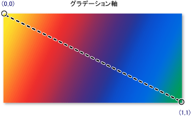

# 純色およびグラデーションによる塗りつぶしの概要
ここでは、<xref:System.Windows.Media.SolidColorBrush>、<xref:System.Windows.Media.LinearGradientBrush>、および <xref:System.Windows.Media.RadialGradientBrush> オブジェクトを使用して、純色、線形グラデーション、および放射状グラデーションで塗りつぶす方法について説明します。  
  
   
  
   
## 純色による領域の塗りつぶし  
 どのようなプラットフォームでも最も一般的な操作の 1 つが、純色の <xref:System.Windows.Media.Color> で領域を塗りつぶす操作です。  このタスクを実現するために、[!INCLUDE[TLA#tla_winclient](../../../../includes/tlasharptla-winclient-md.md)] は <xref:System.Windows.Media.SolidColorBrush> クラスを提供します。  以下のセクションでは、<xref:System.Windows.Media.SolidColorBrush> で塗りつぶすためのさまざまな方法について説明します。  
  
   
### "XAML" での SolidColorBrush の使用  
 [!INCLUDE[TLA2#tla_xaml](../../../../includes/tla2sharptla-xaml-md.md)] で純色で領域を塗りつぶすには、次のいずれかの方法を使用します。  
  
-   定義済みの純色のブラシを名前によって選択します。  たとえば、ボタンの <xref:System.Windows.Controls.Control.Background%2A> を "Red" または "MediumBlue" に設定できます。  その他の定義済みの純色のブラシの一覧については、<xref:System.Windows.Media.Brushes> クラスの静的プロパティを参照してください。  例を次に示します。  
  
     [!code-xml[BrushOverviewExamples_snip#SolidColorBrushNamedColor1XAML](../../../../samples/snippets/xaml/VS_Snippets_Wpf/BrushOverviewExamples_snip/XAML/SolidColorBrushExample.xaml#solidcolorbrushnamedcolor1xaml)]  
  
-   赤、緑、および青の量を指定して単一の純色に組み合わせることによって、32 ビットのカラー パレットから色を選択します。  32 ビット パレットから色を指定するための形式は、"*\#rrggbb*" です。ここでは、*rr* は赤の相対的な量を指定する 2 桁の 16 進数であり、*gg* は緑の量を指定し、*bb* は青の量を指定します。  また、色は "\#*aarrggbb*" として指定できます。ここでは、*aa* は色のアルファ値、つまり透明度を指定します。  この方法によって、部分的に透明な色を作成できます。  次の例では、<xref:System.Windows.Controls.Button> の <xref:System.Windows.Controls.Control.Background%2A> は、16 進数表記を使用して完全に不透明な赤に設定されます。  
  
     [!code-xml[BrushOverviewExamples_snip#SolidColorBrushHex1XAML](../../../../samples/snippets/xaml/VS_Snippets_Wpf/BrushOverviewExamples_snip/XAML/SolidColorBrushExample.xaml#solidcolorbrushhex1xaml)]  
  
-   <xref:System.Windows.Media.SolidColorBrush> を記述するには、プロパティ タグ構文を使用します。  この構文は、記述は冗長になりますが、ブラシの不透明度などの追加の設定を指定できます。  次の例では、2 つの <xref:System.Windows.Controls.Button> 要素の <xref:System.Windows.Controls.Control.Background%2A> プロパティが完全に不透明な赤に設定されます。  最初のブラシの色は、定義済みの色の名前を使用して記述されています。  2 番目のブラシの色は、16 進表記を使用して記述されています。  
  
     [!code-xml[BrushOverviewExamples_snip#SolidColorBrushPropertyTag1XAML](../../../../samples/snippets/xaml/VS_Snippets_Wpf/BrushOverviewExamples_snip/XAML/SolidColorBrushExample.xaml#solidcolorbrushpropertytag1xaml)]  
  
   
### コードでの SolidColorBrush による塗りつぶし  
 コードで純色で領域を塗りつぶすには、次のいずれかの方法を使用します。  
  
-   <xref:System.Windows.Media.Brushes> クラスによって提供されている定義済みブラシのいずれかを使用します。  次の例では、<xref:System.Windows.Controls.Button> の <xref:System.Windows.Controls.Control.Background%2A> が <xref:System.Windows.Media.Brushes.Red%2A> に設定されています。  
  
     [!code-csharp[BrushOverviewExamples_snip#SolidColorBrushPredefinedBrush1CSharp](../../../../samples/snippets/csharp/VS_Snippets_Wpf/BrushOverviewExamples_snip/CSharp/SolidColorBrushExample.cs#solidcolorbrushpredefinedbrush1csharp)]  
  
-   <xref:System.Windows.Media.SolidColorBrush> を作成し、その <xref:System.Windows.Media.SolidColorBrush.Color%2A> プロパティを <xref:System.Windows.Media.Color> 構造体を使用して設定します。  <xref:System.Windows.Media.Colors> クラスから定義済みの色を使用するか、静的な <xref:System.Windows.Media.Color.FromArgb%2A> メソッドを使用して <xref:System.Windows.Media.Color> を作成することができます。  
  
     定義済みの色を使用して <xref:System.Windows.Media.SolidColorBrush> の <xref:System.Windows.Media.SolidColorBrush.Color%2A> プロパティを設定する方法を次の例に示します。  
  
     [!code-csharp[BrushOverviewExamples_snip#SolidColorBrushPredefinedColor1CSharp](../../../../samples/snippets/csharp/VS_Snippets_Wpf/BrushOverviewExamples_snip/CSharp/SolidColorBrushExample.cs#solidcolorbrushpredefinedcolor1csharp)]  
  
 静的な <xref:System.Windows.Media.Color.FromArgb%2A> によって、色の[アルファ](GTMT)、赤、緑、および青の値を指定できます。  これらの各値の一般的な範囲は、0 ～ 255 です。  たとえば、[アルファ](GTMT)値が 0 の場合は色が完全に透明であることを示し、値が 255 の場合は色が完全に不透明であることを示します。  同様に、red 値が 0 である場合は色に赤が含まれないことを示し、値が 255 である場合は使用できる赤の最大量が含まれていることを示します。  以降の例では、ブラシの色はアルファ、赤、緑、および青の値を指定することによって記述されます。  
  
 [!code-csharp[BrushOverviewExamples_snip#SolidColorBrushfromArgbExample1CSharp](../../../../samples/snippets/csharp/VS_Snippets_Wpf/BrushOverviewExamples_snip/CSharp/SolidColorBrushExample.cs#solidcolorbrushfromargbexample1csharp)]  
  
 色を指定するためのその他の方法については、<xref:System.Windows.Media.Color> のリファレンス トピックを参照してください。  
  
   
## グラデーションによる領域の塗りつぶし  
 グラデーション ブラシは、軸に沿ってブレンドしあう複数の色で領域を塗りつぶします。  これらを使用して、光と影の印象を作成でき、コントロールの外観を 3 次元にできます。  これらを使用して、ガラス、クロム、水、およびその他の滑らかな表面をシミュレートすることもできます。  [!INCLUDE[TLA2#tla_winclient](../../../../includes/tla2sharptla-winclient-md.md)] には、<xref:System.Windows.Media.LinearGradientBrush> と <xref:System.Windows.Media.RadialGradientBrush> の 2 種類のグラデーション ブラシが用意されています。  
  
   
## 線形グラデーション  
 <xref:System.Windows.Media.LinearGradientBrush> は、グラデーション軸という線に沿って定義されたグラデーションで領域を塗りつぶします。  <xref:System.Windows.Media.GradientStop> オブジェクトを使用して、グラデーションの色、およびそのグラデーション軸に沿った位置を指定します。  グラデーション軸を変更することもでき、これによって、横グラデーションと縦グラデーションの作成、およびグラデーション方向の反転が可能になります。  グラデーション軸については、次のセクションで説明します。  既定では、斜線グラデーションが作成されます。  
  
 4 色の線形グラデーションを作成するコードを次の例に示します。  
  
 [!code-xml[GradientBrushExamples_snip#DiagonalGradient1XAML](../../../../samples/snippets/xaml/VS_Snippets_Wpf/GradientBrushExamples_snip/XAML/LinearGradientBrushExample.xaml#diagonalgradient1xaml)]  
  
 [!code-csharp[GradientBrushExamples_snip#DiagonalGradient1CSharp](../../../../samples/snippets/csharp/VS_Snippets_Wpf/GradientBrushExamples_snip/CSharp/LinearGradientBrushExample.cs#diagonalgradient1csharp)]  
  
 このコードを実行すると、次のグラデーションが生成されます。  
  
   
  
 **メモ :** このトピックのグラデーションの例では、開始点と終了点の設定に既定の座標系を使用しています。  既定の座標系は境界ボックスに対して相対的です。0 は境界ボックスの 0% を示し、1 は境界ボックスの 100% を示します。  この座標系を変更するには、<xref:System.Windows.Media.GradientBrush.MappingMode%2A> プロパティを <xref:System.Windows.Media.BrushMappingMode> という値に設定します。  絶対座標系は、境界ボックスに対して相対的ではありません。  値は、ローカル空間で直接解釈されます。  
  
 <xref:System.Windows.Media.GradientStop> はグラデーション ブラシの基本的なビルド ブロックです。  グラデーション終了位置は、グラデーション軸に沿った <xref:System.Windows.Media.GradientStop.Offset%2A> 位置の <xref:System.Windows.Media.GradientStop.Color%2A> を示します。  
  
-   グラデーション終了位置の <xref:System.Windows.Media.GradientStop.Color%2A> プロパティは、グラデーション終了位置の色を指定します。  色の設定には、<xref:System.Windows.Media.Colors> クラスによる定義済みの色を使用するか、ScRGB 値または ARGB 値を指定することができます。  [!INCLUDE[TLA2#tla_xaml](../../../../includes/tla2sharptla-xaml-md.md)] では、色を記述するために 16 進数表記も使用できます。  詳細については、<xref:System.Windows.Media.Color> 構造体の説明を参照してください。  
  
-   グラデーション終了位置の <xref:System.Windows.Media.GradientStop.Offset%2A> プロパティは、グラデーション軸上のグラデーション終了位置の色の位置を指定します。  オフセットは 0 ～ 1 の <xref:System.Double> 値です。  グラデーション終了位置のオフセット値が 0 に近づくにつれて、色はグラデーションの始点に近づきます。  グラデーションのオフセット値が 1 に近づくほど、色はグラデーションの終点に近づきます。  
  
 グラデーション終了位置の間の各点の色は、2 つの境界グラデーション終了位置によって指定された色の組み合わせとして線形に補間されます。  次の図は、前の例のグラデーション終了位置を示しています。  円はグラデーション終了位置の位置を示し、破線はグラデーション軸を示しています。  
  
   
  
 最初のグラデーション終了位置は、オフセット位置 `0.0` の色として黄色を指定します。  2 番目のグラデーション終了位置は、オフセット位置 `0.25` の色として赤を指定します。  これらの 2 つの終了位置の間の点は、グラデーション軸に沿って左から右に移動するにつれて黄色から赤に徐々に変化します。  3 番目のグラデーション終了位置は、オフセット位置 `0.75` の色として青を指定します。  2 番目と 3 番目のグラデーション終了位置の間の点は、赤から青に徐々に変化します。  4 番目のグラデーション終了位置は、オフセット位置 `1.0` の色として淡い緑を指定します。  3 番目と 4 番目のグラデーション終了位置の間の点は、青から淡い緑に徐々に変化します。  
  
   
### グラデーション軸  
 前に説明したように、線形グラデーション ブラシのグラデーション終了位置は、グラデーション軸という線に沿って配置されます。  この線の方向とサイズは、ブラシの <xref:System.Windows.Media.LinearGradientBrush.StartPoint%2A> プロパティおよび <xref:System.Windows.Media.LinearGradientBrush.EndPoint%2A> プロパティを使用して変更できます。  ブラシの <xref:System.Windows.Media.LinearGradientBrush.StartPoint%2A> および <xref:System.Windows.Media.LinearGradientBrush.EndPoint%2A> を操作することによって、横グラデーションおよび縦グラデーションの作成、グラデーション方向の反転、グラデーションの拡散の縮小などを行うことができます。  
  
 既定では、線形グラデーションのブラシの <xref:System.Windows.Media.LinearGradientBrush.StartPoint%2A> および <xref:System.Windows.Media.LinearGradientBrush.EndPoint%2A> は塗りつぶされている領域に対して相対的なものになります。  点 \(0,0\) は塗りつぶされている領域の左上隅を表し、\(1,1\) は塗りつぶされている領域の右下隅を表します。  <xref:System.Windows.Media.LinearGradientBrush> の既定の <xref:System.Windows.Media.LinearGradientBrush.StartPoint%2A> は \(0,0\) であり、既定の <xref:System.Windows.Media.LinearGradientBrush.EndPoint%2A> は \(1,1\) です。これによって、塗りつぶされている領域の左上隅から開始し、右下隅に伸びていく斜線グラデーションが作成されます。  既定の <xref:System.Windows.Media.LinearGradientBrush.StartPoint%2A> および <xref:System.Windows.Media.LinearGradientBrush.EndPoint%2A> を持つ線形グラデーション ブラシのグラデーション軸を次の図に示します。  
  
   
  
 ブラシの <xref:System.Windows.Media.LinearGradientBrush.StartPoint%2A> および <xref:System.Windows.Media.LinearGradientBrush.EndPoint%2A> を指定して横グラデーションを作成する方法を次の例に示します。  グラデーション終了位置は前の例と同じであることに注意してください。<xref:System.Windows.Media.LinearGradientBrush.StartPoint%2A> および <xref:System.Windows.Media.LinearGradientBrush.EndPoint%2A> を変更しただけで、グラデーションは斜線から横に変更されました。  
  
 [!code-xml[GradientBrushExamples_snip#HorizontalGradient1XAML](../../../../samples/snippets/xaml/VS_Snippets_Wpf/GradientBrushExamples_snip/XAML/LinearGradientBrushExample.xaml#horizontalgradient1xaml)]  
  
 [!code-csharp[GradientBrushExamples_snip#HorizontalGradient1CSharp](../../../../samples/snippets/csharp/VS_Snippets_Wpf/GradientBrushExamples_snip/CSharp/LinearGradientBrushExample.cs#horizontalgradient1csharp)]  
  
 次の図は、作成されたグラデーションを示しています。  グラデーションの軸は破線、グラデーションの分岐点は円で示されています。  
  
   
  
 縦グラデーションを作成する方法を次の例に示します。  
  
 [!code-xml[GradientBrushExamples_snip#VerticalGradient1XAML](../../../../samples/snippets/xaml/VS_Snippets_Wpf/GradientBrushExamples_snip/XAML/LinearGradientBrushExample.xaml#verticalgradient1xaml)]  
  
 [!code-csharp[GradientBrushExamples_snip#VerticalGradient1CSharp](../../../../samples/snippets/csharp/VS_Snippets_Wpf/GradientBrushExamples_snip/CSharp/LinearGradientBrushExample.cs#verticalgradient1csharp)]  
  
 次の図は、作成されたグラデーションを示しています。  グラデーションの軸は破線、グラデーションの分岐点は円で示されています。  
  
   
  
   
## 放射状グラデーション  
 <xref:System.Windows.Media.LinearGradientBrush> と同様に、<xref:System.Windows.Media.RadialGradientBrush> は軸に沿ってブレンドしあう複数の色で領域を塗りつぶします。  前の例では、線形グラデーション ブラシの軸がどのような直線であるかを示しました。  放射状グラデーション ブラシの軸は、円によって定義されます。色は原点から外側に向かって "放射" されます。  
  
 次の例では、放射状グラデーション ブラシは、四角形の内部を塗りつぶすために使用されます。  
  
 [!code-xml[GradientBrushExamples_snip#RadialGradient1XAML](../../../../samples/snippets/xaml/VS_Snippets_Wpf/GradientBrushExamples_snip/XAML/RadialGradientBrushExample.xaml#radialgradient1xaml)]  
  
 [!code-csharp[GradientBrushExamples_snip#RadialGradient1CSharp](../../../../samples/snippets/csharp/VS_Snippets_Wpf/GradientBrushExamples_snip/CSharp/RadialGradientBrushExample.cs#radialgradient1csharp)]  
  
 前の例で作成したグラデーションを次の図に示します。  ブラシのグラデーション終了位置が示されています。  結果は異なりますが、この例のグラデーション終了位置は前の線形グラデーション ブラシの例のグラデーション終了位置と同じであることに注意してください。  
  
   
  
 <xref:System.Windows.Media.RadialGradientBrush.GradientOrigin%2A> は、放射状グラデーション ブラシのグラデーション軸の始点を指定します。  グラデーション軸は、グラデーションの原点からグラデーションの円に向かって放射します。  ブラシのグラデーションの円は、<xref:System.Windows.Media.RadialGradientBrush.Center%2A>、<xref:System.Windows.Media.RadialGradientBrush.RadiusX%2A>、<xref:System.Windows.Media.RadialGradientBrush.RadiusY%2A> の各プロパティによって定義されます。  
  
 さまざまな <xref:System.Windows.Media.RadialGradientBrush.GradientOrigin%2A>、<xref:System.Windows.Media.RadialGradientBrush.Center%2A>、<xref:System.Windows.Media.RadialGradientBrush.RadiusX%2A>、および <xref:System.Windows.Media.RadialGradientBrush.RadiusY%2A> の設定を持つ複数の放射状グラデーションを次の図に示します。  
  
   
さまざまな GradientOrigin、Center、RadiusX、および RadiusY の設定を持つ RadialGradientBrushes  
  
   
## 透明または部分的に透明なグラデーション終了位置の指定  
 グラデーション終了位置には不透明度プロパティがないため、マークアップで [!INCLUDE[TLA#tla_argb](../../../../includes/tlasharptla-argb-md.md)] 16 進数表記を使用して色のアルファ チャネルを指定するか、<xref:System.Windows.Media.Color.FromScRgb%2A?displayProperty=fullName> メソッドを使用して、透明または部分的に透明なグラデーション終了位置を作成する必要があります。  以下のセクションでは、[!INCLUDE[TLA2#tla_xaml](../../../../includes/tla2sharptla-xaml-md.md)] およびコードで部分的に透明なグラデーション終了位置を作成する方法について説明します。  ブラシ全体の不透明度の設定については、「[ブラシの不透明度の指定](#brushesAndOpacity)」を参照してください。  
  
   
### "XAML" での色の透過度の指定  
 [!INCLUDE[TLA2#tla_xaml](../../../../includes/tla2sharptla-xaml-md.md)] では、[!INCLUDE[TLA2#tla_argb](../../../../includes/tla2sharptla-argb-md.md)] 16 進数表記を使用して、個別の色の透過度を指定します。  [!INCLUDE[TLA2#tla_argb](../../../../includes/tla2sharptla-argb-md.md)] の 16 進数表記では次の構文が使用されます。  
  
 `#`**aa** *rrggbb*  
  
 この構文の *aa* は、色の不透明度を指定する 2 桁の 16 進数の値を表します。  *rr*、*gg*、*bb* はそれぞれ、赤、緑、青の各色の量を指定する 2 桁の 16 進数を表します。  16 進数の各桁には、0 から 9、または A から F の値を指定できます。  0 が最小値で、F が最大値になります。  00 のアルファ値は、完全に透明な色の指定、FF のアルファ値は、完全に不透明な色の指定を表します。  次の例に、16 進数の [!INCLUDE[TLA2#tla_argb](../../../../includes/tla2sharptla-argb-md.md)] 表記を使用した 2 種類の色の指定方法を示します。  最初の例は部分的に透明 \(アルファ値が x20\) であり、2 番目の例は完全に不透明です。  
  
 [!code-xml[GradientBrushExamples_snip#TransparentGradientStopExample1XAML](../../../../samples/snippets/xaml/VS_Snippets_Wpf/GradientBrushExamples_snip/XAML/GradientStopsExample.xaml#transparentgradientstopexample1xaml)]  
  
   
### コードでの色の不透明度の指定  
 コードを使用する場合は、静的な <xref:System.Windows.Media.Color.FromArgb%2A> メソッドを使用すると、色を作成するときにアルファ値を指定できます。  このメソッドは <xref:System.Byte> 型の 4 つのパラメーターを取ります。  最初のパラメーターは色のアルファ チャネルを指定します。その他の 3 つのパラメーターは色の赤、緑、および青の値を指定します。  各値は、0 ～ 255 のいずれかです。  アルファ値 0 は完全に透明な色を指定し、アルファ値 255 は完全に不透明な色を指定します。  次の例では、<xref:System.Windows.Media.Color.FromArgb%2A> メソッドは 2 つの色を生成するために使用されます。  最初の色は部分的に透明 \(アルファ値が 32\) であり、2 番目の色は完全に不透明です。  
  
 [!code-csharp[GradientBrushExamples_snip#TransparentGradientStopExample1CSharp](../../../../samples/snippets/csharp/VS_Snippets_Wpf/GradientBrushExamples_snip/CSharp/GradientStopsExample.cs#transparentgradientstopexample1csharp)]  
  
 また、ScRGB 値を使用して色を作成できるようにする <xref:System.Windows.Media.Color.FromScRgb%2A> メソッドを使用できます。  
  
   
## イメージ、描画、ビジュアル、およびパターンによる塗りつぶし  
 <xref:System.Windows.Media.ImageBrush>、<xref:System.Windows.Media.DrawingBrush>、<xref:System.Windows.Media.VisualBrush> の各クラスを使用すると、イメージ、描画、またはビジュアルで領域を塗りつぶすことができます。  イメージ、描画、およびパターンによる塗りつぶしについては、「[イメージ、描画、およびビジュアルによる塗りつぶし](../../../../docs/framework/wpf/graphics-multimedia/painting-with-images-drawings-and-visuals.md)」を参照してください。  
  
## 参照  
 <xref:System.Windows.Media.Brush>   
 <xref:System.Windows.Media.SolidColorBrush>   
 <xref:System.Windows.Media.LinearGradientBrush>   
 <xref:System.Windows.Media.RadialGradientBrush>   
 [イメージ、描画、およびビジュアルによる塗りつぶし](../../../../docs/framework/wpf/graphics-multimedia/painting-with-images-drawings-and-visuals.md)   
 [ブラシの変換の概要](../../../../docs/framework/wpf/graphics-multimedia/brush-transformation-overview.md)   
 [グラフィックスの描画層](../../../../docs/framework/wpf/advanced/graphics-rendering-tiers.md)