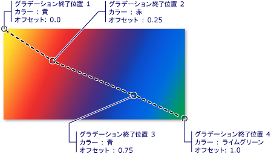

# 純色およびグラデーションによる塗りつぶしの概要
このトピックでは、使用する方法を説明します<xref:System.Windows.Media.SolidColorBrush>、 <xref:System.Windows.Media.LinearGradientBrush>、および<xref:System.Windows.Media.RadialGradientBrush>純色、線状グラデーション、および放射状グラデーションを描画するオブジェクト。  
  

  
   
## 領域を純色で塗りつぶす  
 信頼性の高い領域を塗りつぶすには、任意のプラットフォームで最も一般的な操作のいずれかの<xref:System.Windows.Media.Color>します。 このタスクを実行する[!INCLUDE[TLA#tla_winclient](../../../../includes/tlasharptla-winclient-md.md)]提供、<xref:System.Windows.Media.SolidColorBrush>クラス。 次のセクションでは、描画に使用するさまざまな方法を説明します、<xref:System.Windows.Media.SolidColorBrush>します。  
  
   
### "XAML" での SolidColorBrush の使用  
 [!INCLUDE[TLA2#tla_xaml](../../../../includes/tla2sharptla-xaml-md.md)] で領域を純色で塗りつぶすには、次のオプションのいずれかを使用します。  
  
-   定義済みの純色のブラシを名前で選択します。  たとえば、ボタンを設定することができます<xref:System.Windows.Controls.Control.Background%2A>"Red"または"MediumBlue"にします。  他の定義済みの純色ブラシの静的プロパティを参照してください、<xref:System.Windows.Media.Brushes>クラス。 次に例を示します。  
  
     [!code-xaml[BrushOverviewExamples_snip#SolidColorBrushNamedColor1XAML](~/samples/snippets/xaml/VS_Snippets_Wpf/BrushOverviewExamples_snip/XAML/SolidColorBrushExample.xaml#solidcolorbrushnamedcolor1xaml)]  
  
-   赤、緑、および青の量を指定して単一の純色に結合することで、32 ビット カラー パレットからカラーを選択します。  32 ビット パレットからカラーを指定するための書式は、"*#rrggbb*" です。ここで、*rr* は赤の相対的な量を指定する 2 桁の 16 進数であり、*gg* は緑の量を、*bb*は青の量を指定します。  さらに、カラーは、"#*aarrggbb*" として指定することもできます。ここで、*aa* はカラーの*アルファ*値 (透明度) を指定します。 この方法により、部分的に透明な色を作成することができます。  次の例では、<xref:System.Windows.Controls.Control.Background%2A>の<xref:System.Windows.Controls.Button>は 16 進数表記を使用して完全に不透明な赤に設定します。  
  
     [!code-xaml[BrushOverviewExamples_snip#SolidColorBrushHex1XAML](~/samples/snippets/xaml/VS_Snippets_Wpf/BrushOverviewExamples_snip/XAML/SolidColorBrushExample.xaml#solidcolorbrushhex1xaml)]  
  
-   プロパティ タグ構文を使用して記述する、<xref:System.Windows.Media.SolidColorBrush>します。 この構文は冗長ですが、ブラシの不透明度などの追加設定を指定することができます。 次の例では、 <xref:System.Windows.Controls.Control.Background%2A> 2 つのプロパティ<xref:System.Windows.Controls.Button>要素は完全に不透明な赤に設定します。 最初のブラシの色は、定義済みの色の名前を使用して記述されています。 2 番目のブラシの色は、16 進表記で記述されています。  
  
     [!code-xaml[BrushOverviewExamples_snip#SolidColorBrushPropertyTag1XAML](~/samples/snippets/xaml/VS_Snippets_Wpf/BrushOverviewExamples_snip/XAML/SolidColorBrushExample.xaml#solidcolorbrushpropertytag1xaml)]  
  
   
### コードでの SolidColorBrush による塗りつぶし  
 コードで領域を純色で塗りつぶすには、次のオプションのいずれかを使用します。  
  
-   によって提供される定義済みのブラシのいずれかを使用して、<xref:System.Windows.Media.Brushes>クラス。 次の例では、<xref:System.Windows.Controls.Control.Background%2A>の<xref:System.Windows.Controls.Button>に設定されている<xref:System.Windows.Media.Brushes.Red%2A>します。  
  
     [!code-csharp[BrushOverviewExamples_snip#SolidColorBrushPredefinedBrush1CSharp](~/samples/snippets/csharp/VS_Snippets_Wpf/BrushOverviewExamples_snip/CSharp/SolidColorBrushExample.cs#solidcolorbrushpredefinedbrush1csharp)]  
  
-   作成、<xref:System.Windows.Media.SolidColorBrush>設定とその<xref:System.Windows.Media.SolidColorBrush.Color%2A>プロパティを使用して、<xref:System.Windows.Media.Color>構造体。 定義済みの色を使用することができます、<xref:System.Windows.Media.Colors>クラスを作成できる、<xref:System.Windows.Media.Color>静的<xref:System.Windows.Media.Color.FromArgb%2A>メソッド。  
  
     次の例は、設定する方法を示します、<xref:System.Windows.Media.SolidColorBrush.Color%2A>のプロパティを<xref:System.Windows.Media.SolidColorBrush>定義済みの色を使用します。  
  
     [!code-csharp[BrushOverviewExamples_snip#SolidColorBrushPredefinedColor1CSharp](~/samples/snippets/csharp/VS_Snippets_Wpf/BrushOverviewExamples_snip/CSharp/SolidColorBrushExample.cs#solidcolorbrushpredefinedcolor1csharp)]  
  
 静的な<xref:System.Windows.Media.Color.FromArgb%2A>カラーのアルファ、赤、緑、および青の値を指定することができます。 これらの各値の一般的な範囲は、0 ～ 255 です。 たとえば、アルファ値 0 はカラーが完全に透明であることを示し、値 255 はカラーが完全に不透明であることを示します。 同様に、赤値 0 はカラーに赤が全く含まれないことを示し、値 255 は可能な最大量の赤が含まれることを示します。  次の例では、ブラシのカラーは、アルファ、赤、緑、および青の値を指定することで記述されています。  
  
 [!code-csharp[BrushOverviewExamples_snip#SolidColorBrushfromArgbExample1CSharp](~/samples/snippets/csharp/VS_Snippets_Wpf/BrushOverviewExamples_snip/CSharp/SolidColorBrushExample.cs#solidcolorbrushfromargbexample1csharp)]  
  
 色を指定するその他の方法を参照してください、<xref:System.Windows.Media.Color>リファレンス トピック。  
  
   
## 領域をグラデーションで塗りつぶす  
 グラデーション ブラシは、軸に沿って互いに溶け込む複数の色で領域を塗りつぶします。 これらを使用して、光と影の感じを作り出して、コントロールを立体的に見せることができます。 ガラス、クロム メッキ、水、その他の滑らかな表面をシミュレートするためにも使用できます。  [!INCLUDE[TLA2#tla_winclient](../../../../includes/tla2sharptla-winclient-md.md)] 2 つの種類のグラデーション ブラシを提供します。<xref:System.Windows.Media.LinearGradientBrush>と<xref:System.Windows.Media.RadialGradientBrush>します。  
  
   
## 線状グラデーション  
 A<xref:System.Windows.Media.LinearGradientBrush>に沿って、定義されているグラデーションを使用して領域を塗りつぶします、*グラデーション軸*します。  グラデーションの色とを使用して、グラデーション軸に沿った位置を指定する<xref:System.Windows.Media.GradientStop>オブジェクト。  グラデーション軸を変更することもできます。これにより、水平方向と垂直方向のグラデーションの作成やグラデーションの方向の反転を行うことができます。 グラデーション軸については、次のセクションで説明します。 既定では、対角線方向のグラデーションが作成されます。  
  
 次の例では、4 津のカラーを使用して線状グラデーションを作成するコードを示します。  
  
 [!code-xaml[GradientBrushExamples_snip#DiagonalGradient1XAML](~/samples/snippets/xaml/VS_Snippets_Wpf/GradientBrushExamples_snip/XAML/LinearGradientBrushExample.xaml#diagonalgradient1xaml)]  
  
 [!code-csharp[GradientBrushExamples_snip#DiagonalGradient1CSharp](~/samples/snippets/csharp/VS_Snippets_Wpf/GradientBrushExamples_snip/CSharp/LinearGradientBrushExample.cs#diagonalgradient1csharp)]  
  
 このコードを実行すると、次のグラデーションが生成されます。  
  
   
  
 **注:** このトピックのグラデーションの例は、始点と終点を設定するための既定の座標系を使用します。 既定の座標系は、境界ボックスに対して相対的です。0 は、境界ボックスの 100% を示します、境界ボックスと 1 の 0% を示します。 この座標系を設定して変更することができます、<xref:System.Windows.Media.GradientBrush.MappingMode%2A>プロパティ値を<xref:System.Windows.Media.BrushMappingMode.Absolute>します。 絶対座標系は、境界ボックスに相対しません。 値は、ローカル空間に直接変換されます。  
  
 <xref:System.Windows.Media.GradientStop>はグラデーション ブラシの基本的な構成要素です。  グラデーションの分岐点を指定します、<xref:System.Windows.Media.GradientStop.Color%2A>で、<xref:System.Windows.Media.GradientStop.Offset%2A>グラデーション軸に沿ったします。  
  
-   グラデーションの分岐点<xref:System.Windows.Media.GradientStop.Color%2A>プロパティは、グラデーションの分岐点の色を指定します。 定義済みの色を使用して、色を設定することがあります (によって提供される、<xref:System.Windows.Media.Colors>クラス) か、ScRGB 値または ARGB 値を指定しています。 [!INCLUDE[TLA2#tla_xaml](../../../../includes/tla2sharptla-xaml-md.md)] では、16 進表記を使用してカラーを記述することもできます。 詳細については、次を参照してください。、<xref:System.Windows.Media.Color>構造体。  
  
-   グラデーションの分岐点<xref:System.Windows.Media.GradientStop.Offset%2A>プロパティが、グラデーション軸上のグラデーションの分岐点の色の位置を指定します。 オフセットは、 <xref:System.Double> 1 ~ 0 の範囲をします。 グラデーション境界のオフセット値が 0 に近ければ近いほど、カラーはグラデーションの始まりに近づきます。 グラデーションのオフセット値が 1 に近ければ近いほど、カラーはグラデーションの終わりに近づきます。  
  
 グラデーション境界の間の各点のカラーは、2 つのグラデーション境界によって指定されたカラーの混合として線形補間されます。 次の図は、前の例のグラデーション境界を強調しています。 円はグラデーション境界の位置をマークし、破線はグラデーション軸を示しています。  
  
   
  
 最初のグラデーション境界は、オフセット`0.0` に黄色を指定しています。  2 番目のグラデーション境界は、オフセット `0.25` に赤色を指定しています。  これら 2 つの境界の間の点は、グラデーション軸に沿って左から右に移動するにつれて、黄色から徐々に赤色に変化します。  3 番目のグラデーション境界は、オフセット `0.75` に青色を指定しています。  2 番目と 3 番目のグラデーション境界の間の点は、赤から青に徐々に変化します。 4 番目のグラデーション境界は、オフセット `1.0` に緑色を指定しています。 3 番目と 4 番目のグラデーション境界の間の点は、青から緑に徐々に変化します。  
  
   
### グラデーション軸  
 前述のように、線状グラデーション ブラシのグラデーション境界は、直線のグラデーション軸に沿って配置されます。 ブラシを使用して行のサイズと向きを変更することがあります<xref:System.Windows.Media.LinearGradientBrush.StartPoint%2A>と<xref:System.Windows.Media.LinearGradientBrush.EndPoint%2A>プロパティ。 ブラシを操作することによって<xref:System.Windows.Media.LinearGradientBrush.StartPoint%2A>と<xref:System.Windows.Media.LinearGradientBrush.EndPoint%2A>水平を作成、および垂直方向のグラデーションのグラデーションの方向を反転、グラデーションの広がりとその詳細を要約します。  
  
 既定では、線状グラデーション ブラシの<xref:System.Windows.Media.LinearGradientBrush.StartPoint%2A>と<xref:System.Windows.Media.LinearGradientBrush.EndPoint%2A>は塗りつぶされる領域を基準とします。 点 (0, 0) は塗りつぶされる領域の左上隅を、点 (1, 1) は塗りつぶされる領域の右下隅を表します。 既定値<xref:System.Windows.Media.LinearGradientBrush.StartPoint%2A>の<xref:System.Windows.Media.LinearGradientBrush>(0, 0) とその既定<xref:System.Windows.Media.LinearGradientBrush.EndPoint%2A>(1, 1) は、左上隅から開始し、塗りつぶされる領域の右下隅に拡張する対角線方向のグラデーションを作成します。 次の図は、既定値は、線状グラデーション ブラシのグラデーション軸<xref:System.Windows.Media.LinearGradientBrush.StartPoint%2A>と<xref:System.Windows.Media.LinearGradientBrush.EndPoint%2A>します。  
  
   
  
 ブラシを指定することで、次の例がグラデーションにある水平方向を作成する方法を示します<xref:System.Windows.Media.LinearGradientBrush.StartPoint%2A>と<xref:System.Windows.Media.LinearGradientBrush.EndPoint%2A>します。 グラデーション境界は、前の例と同じことに注意してください。変更するだけで、<xref:System.Windows.Media.LinearGradientBrush.StartPoint%2A>と<xref:System.Windows.Media.LinearGradientBrush.EndPoint%2A>グラデーションが水平方向に斜めから変更されました。  
  
 [!code-xaml[GradientBrushExamples_snip#HorizontalGradient1XAML](~/samples/snippets/xaml/VS_Snippets_Wpf/GradientBrushExamples_snip/XAML/LinearGradientBrushExample.xaml#horizontalgradient1xaml)]  
  
 [!code-csharp[GradientBrushExamples_snip#HorizontalGradient1CSharp](~/samples/snippets/csharp/VS_Snippets_Wpf/GradientBrushExamples_snip/CSharp/LinearGradientBrushExample.cs#horizontalgradient1csharp)]  
  
 次の図は、作成されるグラデーションを示しています。 グラデーション軸は破線でマークされ、グラデーション境界は円でマークされています。  
  
   
  
 次の例では、垂直方向のグラデーションを作成する方法を示します。  
  
 [!code-xaml[GradientBrushExamples_snip#VerticalGradient1XAML](~/samples/snippets/xaml/VS_Snippets_Wpf/GradientBrushExamples_snip/XAML/LinearGradientBrushExample.xaml#verticalgradient1xaml)]  
  
 [!code-csharp[GradientBrushExamples_snip#VerticalGradient1CSharp](~/samples/snippets/csharp/VS_Snippets_Wpf/GradientBrushExamples_snip/CSharp/LinearGradientBrushExample.cs#verticalgradient1csharp)]  
  
 次の図は、作成されるグラデーションを示しています。 グラデーション軸は破線でマークされ、グラデーション境界は円でマークされています。  
  
   
  
   
## 放射状グラデーション  
 ように、 <xref:System.Windows.Media.LinearGradientBrush>、<xref:System.Windows.Media.RadialGradientBrush>軸に沿ってブレンドされるカラーで領域を塗りつぶします。 前の例では、線状グラデーション ブラシの軸は直線であることを示しました。 放射状グラデーション ブラシの軸は円によって定義され、そのカラーはその原点から外側に "放射" されます。  
  
 次の例では、放射状グラデーション ブラシを使用して、四角形の内側を塗りつぶします。  
  
 [!code-xaml[GradientBrushExamples_snip#RadialGradient1XAML](~/samples/snippets/xaml/VS_Snippets_Wpf/GradientBrushExamples_snip/XAML/RadialGradientBrushExample.xaml#radialgradient1xaml)]  
  
 [!code-csharp[GradientBrushExamples_snip#RadialGradient1CSharp](~/samples/snippets/csharp/VS_Snippets_Wpf/GradientBrushExamples_snip/CSharp/RadialGradientBrushExample.cs#radialgradient1csharp)]  
  
 次の図は、前の例で作成されるグラデーションを示しています。 ブラシのグラデーション境界が強調されています。 結果は異なっていますが、この例のグラデーション境界は、前の線状グラデーション ブラシの例のグラデーション境界と同じであることに注目してください。  
  
   
  
 <xref:System.Windows.Media.RadialGradientBrush.GradientOrigin%2A>放射状グラデーション ブラシのグラデーション軸の始点を指定します。 グラデーション軸は、グラデーションの原点からグラデーション円に放射状に広がります。 ブラシのグラデーション円がによって定義されているその<xref:System.Windows.Media.RadialGradientBrush.Center%2A>、 <xref:System.Windows.Media.RadialGradientBrush.RadiusX%2A>、および<xref:System.Windows.Media.RadialGradientBrush.RadiusY%2A>プロパティ。  
  
 次の図は、異なるいくつかの放射状グラデーション<xref:System.Windows.Media.RadialGradientBrush.GradientOrigin%2A>、 <xref:System.Windows.Media.RadialGradientBrush.Center%2A>、 <xref:System.Windows.Media.RadialGradientBrush.RadiusX%2A>、および<xref:System.Windows.Media.RadialGradientBrush.RadiusY%2A>設定します。  
  
   
GradientOrigin、Center、RadiusX、および RadiusY の設定が異なる RadialGradientBrushes。  
  
   
## 透明または部分的に透明なグラデーション境界の指定  
 使用して色のアルファ チャネルを指定する必要がありますのグラデーションの分岐点は不透明度プロパティを指定しないため、[!INCLUDE[TLA#tla_argb](../../../../includes/tlasharptla-argb-md.md)]マークアップかを使用して 16 進数表記、<xref:System.Windows.Media.Color.FromScRgb%2A?displayProperty=nameWithType>は透明または部分的に透明なグラデーションの分岐点を作成します。 以降のセクションで、部分的に透明なグラデーション境界を [!INCLUDE[TLA2#tla_xaml](../../../../includes/tla2sharptla-xaml-md.md)] とコードで作成する方法を説明します。  
  
   
### "XAML" でのカラーの不透明度の指定  
 [!INCLUDE[TLA2#tla_xaml](../../../../includes/tla2sharptla-xaml-md.md)] では、[!INCLUDE[TLA2#tla_argb](../../../../includes/tla2sharptla-argb-md.md)] の 16 進表記を使用して、個々の色の不透明度を指定します。 [!INCLUDE[TLA2#tla_argb](../../../../includes/tla2sharptla-argb-md.md)] の 16 進表記では、次の構文を使用します。  
  
 `#` **aa** *rrggbb*  
  
 前の行の *aa* は、カラーの不透明度を指定するために使用する 2 桁の 16 進値を表します。 *rr*、*gg*、および *bb* は、それぞれ、カラーの赤、緑、および青の量を指定するために使用される 2 桁の 16 進値を表します。 各 16 進数には、0 ～ 9 または A ～ F の値を指定できます。 0 は最小値であり、F は最大値です。 アルファ値 00 は完全に透明なカラーを指定し、アルファ値 FF は完全に不透明なカラーを指定します。  次の例では、[!INCLUDE[TLA2#tla_argb](../../../../includes/tla2sharptla-argb-md.md)] の 16 進表記を使用して、2 つのカラーを指定しています。 1 つ目は部分的に透明 (アルファ値 x20 ) であり、2 つ目は完全に不透明です。  
  
 [!code-xaml[GradientBrushExamples_snip#TransparentGradientStopExample1XAML](~/samples/snippets/xaml/VS_Snippets_Wpf/GradientBrushExamples_snip/XAML/GradientStopsExample.xaml#transparentgradientstopexample1xaml)]  
  
   
### コードでのカラーの不透明度の指定  
 静的なコードを使用するときに<xref:System.Windows.Media.Color.FromArgb%2A>メソッドでは、色を作成するときに、アルファ値を指定することができます。 メソッドは型の 4 つのパラメーターを受け取ります<xref:System.Byte>します。 最初のパラメーターはカラーのアルファ チャネルを指定し、その他の 3 つのパラメーターはカラーの赤、緑、および青の値を指定します。 各値は、0 ～ 255 (0 と 255 を含む) の数値にする必要があります。 アルファ値 0 はカラーが完全に透明であることを指定し、アルファ値 255 はカラーが完全に不透明であることを指定します。 次の例では、<xref:System.Windows.Media.Color.FromArgb%2A>メソッドは、2 つの色を生成するために使用します。 1 つ目のカラーは部分的に透明 (アルファ値32) であり、2 つ目のカラーは完全に不透明です。  
  
 [!code-csharp[GradientBrushExamples_snip#TransparentGradientStopExample1CSharp](~/samples/snippets/csharp/VS_Snippets_Wpf/GradientBrushExamples_snip/CSharp/GradientStopsExample.cs#transparentgradientstopexample1csharp)]  
  
 また、使用することがあります、<xref:System.Windows.Media.Color.FromScRgb%2A>メソッドで、ScRGB 値を使用して色を作成することができます。  
  
   
## イメージ、描画、ビジュアル、およびパターンによる塗りつぶし  
 <xref:System.Windows.Media.ImageBrush>、 <xref:System.Windows.Media.DrawingBrush>、および<xref:System.Windows.Media.VisualBrush>クラスは、イメージ、描画、またはビジュアルで領域を塗りつぶすことができます。 イメージ、描画、およびパターンによる塗りつぶしの詳細については、「[イメージ、描画、およびビジュアルによる塗りつぶし](painting-with-images-drawings-and-visuals.md)」を参照してください。  
  
## 関連項目
- <xref:System.Windows.Media.Brush>
- <xref:System.Windows.Media.SolidColorBrush>
- <xref:System.Windows.Media.LinearGradientBrush>
- <xref:System.Windows.Media.RadialGradientBrush>
- [イメージ、描画、およびビジュアルによる塗りつぶし](painting-with-images-drawings-and-visuals.md)
- [ブラシの変換の概要](brush-transformation-overview.md)
- [グラフィックスの描画層](../advanced/graphics-rendering-tiers.md)
