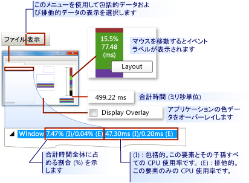

# WPF グラフィックス レンダリングの概要
ここでは、[!INCLUDE[TLA2#tla_winclient](../../../../includes/tla2sharptla-winclient-md.md)] のビジュアル層の概要について説明します。 ロールに焦点を当てます、<xref:System.Windows.Media.Visual>でのサポートを表示するためのクラス、[!INCLUDE[TLA2#tla_winclient](../../../../includes/tla2sharptla-winclient-md.md)]モデル。  
  
  
   
## ビジュアル オブジェクトの役割  
 <xref:System.Windows.Media.Visual>クラスは、元の基本的な抽象化すべて<xref:System.Windows.FrameworkElement>オブジェクトが派生します。 また、このクラスは、[!INCLUDE[TLA2#tla_winclient](../../../../includes/tla2sharptla-winclient-md.md)] で新しいコントロールを作成するためのエントリ ポイントとしても機能し、多くの点で Win32 アプリケーション モデルのウィンドウ ハンドル (HWND) と考えることができます。  
  
 <xref:System.Windows.Media.Visual>オブジェクトは、コア[!INCLUDE[TLA2#tla_winclient](../../../../includes/tla2sharptla-winclient-md.md)]そのプライマリの役割は描画をサポートするオブジェクト。 などのユーザー インターフェイス コントロール<xref:System.Windows.Controls.Button>と<xref:System.Windows.Controls.TextBox>から派生、<xref:System.Windows.Media.Visual>クラス、およびレンダリング データを保持するのに使用します。 <xref:System.Windows.Media.Visual>オブジェクトのサポートを提供します。  
  
-   出力表示: ビジュアルの、シリアル化された永続的な描画内容をレンダリングします。  
  
-   変換: は、ビジュアルに変換を実行します。  
  
-   クリッピング: ビジュアルのクリッピング領域をサポートします。  
  
-   ヒット テスト: 座標またはジオメトリがビジュアルの境界内に含まれているかどうかを判断します。  
  
-   境界ボックスの計算: ビジュアルの四角形領域を決定します。  
  
 ただし、<xref:System.Windows.Media.Visual>オブジェクトが非表示の機能のサポートをなど含まれません。  
  
-   イベント処理  
  
-   レイアウト  
  
-   スタイル  
  
-   データ バインディング  
  
-   グローバリゼーション  
  
 <xref:System.Windows.Media.Visual> 元の子クラスを派生する必要があります、パブリックの抽象クラスとして公開されます。 [!INCLUDE[TLA2#tla_winclient](../../../../includes/tla2sharptla-winclient-md.md)] で公開されるビジュアル オブジェクトの階層構造を次の図に示します。  
  
   
Visual クラスの階層構造  
  
### DrawingVisual クラス  
 <xref:System.Windows.Media.DrawingVisual>は軽量の描画図形、画像、またはテキストを表示するために使用されるクラス。 このクラスが軽量と見なされる理由は、レイアウトやイベントの処理を行わないため、実行時のパフォーマンスが向上するからです。 そのため、背景やクリップ アートの描画に適しています。 <xref:System.Windows.Media.DrawingVisual>カスタム ビジュアル オブジェクトを作成するために使用できます。 詳しくは、「[DrawingVisual オブジェクトの使用](../../../../docs/framework/wpf/graphics-multimedia/using-drawingvisual-objects.md)」をご覧ください。  
  
### Viewport3DVisual クラス  
 <xref:System.Windows.Media.Media3D.Viewport3DVisual> 2D の間の橋渡し<xref:System.Windows.Media.Visual>と<xref:System.Windows.Media.Media3D.Visual3D>オブジェクト。 <xref:System.Windows.Media.Media3D.Visual3D>クラスはすべての 3D ビジュアル要素の基本クラスです。 <xref:System.Windows.Media.Media3D.Viewport3DVisual>定義する必要があります、<xref:System.Windows.Media.Media3D.Viewport3DVisual.Camera%2A>値と<xref:System.Windows.Media.Media3D.Viewport3DVisual.Viewport%2A>値。 カメラを使用するとシーンを表示できます。 ビューポートは、投影が 2D サーフェイス上にマップされる場所を設定します。 [!INCLUDE[TLA2#tla_winclient](../../../../includes/tla2sharptla-winclient-md.md)] の 3D について詳しくは、「[3-D グラフィックスの概要](../../../../docs/framework/wpf/graphics-multimedia/3-d-graphics-overview.md)」をご覧ください。  
  
### ContainerVisual クラス  
 <xref:System.Windows.Media.ContainerVisual>クラスは、のコレクションのコンテナーとして使用<xref:System.Windows.Media.Visual>オブジェクト。 <xref:System.Windows.Media.DrawingVisual>クラスから派生、<xref:System.Windows.Media.ContainerVisual>クラス、ビジュアル オブジェクトのコレクションを格納することができます。  
  
### ビジュアル オブジェクトの描画コンテンツ  
 A<xref:System.Windows.Media.Visual>オブジェクトとしてレンダリング データの格納、**ベクタ グラフィックス命令リスト**します。 命令リスト内の各項目は、グラフィックス データと関連リソースの低レベル セットを、シリアル化された形式で表します。 描画コンテンツを格納できるレンダリング データには、次の 4 つの種類があります。  
  
|描画コンテンツの種類|説明|  
|--------------------------|-----------------|  
|ベクター グラフィックス|ベクター グラフィックス データ、および関連<xref:System.Windows.Media.Brush>と<xref:System.Windows.Media.Pen>情報。|  
|イメージ|によって定義される領域内のイメージを表す、<xref:System.Windows.Rect>します。|  
|グリフ|レンダリングする描画を表す、 <xref:System.Windows.Media.GlyphRun>、これは、指定したフォント リソースからグリフのシーケンス。 テキストはこれによって表示されます。|  
|ビデオ|ビデオをレンダリングする描画を表します。|  
  
 <xref:System.Windows.Media.DrawingContext>を設定することができます、<xref:System.Windows.Media.Visual>にビジュアル コンテンツ。 使用すると、<xref:System.Windows.Media.DrawingContext>オブジェクトの描画コマンドを実際には、一連のグラフィックス システムによって後で使用されるレンダリング データを格納する; がリアルタイムの画面に描画します。  
  
 作成するときに、[!INCLUDE[TLA2#tla_winclient](../../../../includes/tla2sharptla-winclient-md.md)]など、制御、 <xref:System.Windows.Controls.Button>、コントロール自体を描画するためのレンダリング データを暗黙的に生成します。 たとえば、設定、<xref:System.Windows.Controls.ContentControl.Content%2A>のプロパティ、<xref:System.Windows.Controls.Button>により、グリフのレンダリング表現を格納するコントロール。  
  
 A<xref:System.Windows.Media.Visual>として 1 つまたは複数のコンテンツについて説明します<xref:System.Windows.Media.Drawing>に含まれるオブジェクトを<xref:System.Windows.Media.DrawingGroup>します。 A<xref:System.Windows.Media.DrawingGroup>不透明マスク、変換、ビットマップ効果、およびその内容に適用されるその他の操作についても説明します。 <xref:System.Windows.Media.DrawingGroup> 操作は、コンテンツがレンダリングされるときに、次の順序で適用されます: <xref:System.Windows.Media.DrawingGroup.OpacityMask%2A>、 <xref:System.Windows.Media.DrawingGroup.Opacity%2A>、 <xref:System.Windows.Media.DrawingGroup.BitmapEffect%2A>、 <xref:System.Windows.Media.DrawingGroup.ClipGeometry%2A>、 <xref:System.Windows.Media.DrawingGroup.GuidelineSet%2A>、し<xref:System.Windows.Media.DrawingGroup.Transform%2A>します。  
  
 次の図は、これで順序を示します<xref:System.Windows.Media.DrawingGroup>操作は、レンダリング シーケンス中に適用されます。  
  
   
DrawingGroup の操作の順序  
  
 詳しくは、「[Drawing オブジェクトの概要](../../../../docs/framework/wpf/graphics-multimedia/drawing-objects-overview.md)」をご覧ください。  
  
#### ビジュアル層での描画コンテンツ  
 決して直接インスタンス化する、 <xref:System.Windows.Media.DrawingContext>; など、特定のメソッドから描画コンテキストを取得することができます、ただし、<xref:System.Windows.Media.DrawingGroup.Open%2A?displayProperty=nameWithType>と<xref:System.Windows.Media.DrawingVisual.RenderOpen%2A?displayProperty=nameWithType>します。 次の例では、取得、<xref:System.Windows.Media.DrawingContext>から、<xref:System.Windows.Media.DrawingVisual>四角形を描画するためにこれを使用しています。  
  
 [!code-csharp[drawingvisualsample#101](../../../../samples/snippets/csharp/VS_Snippets_Wpf/DrawingVisualSample/CSharp/Window1.xaml.cs#101)]
 [!code-vb[drawingvisualsample#101](../../../../samples/snippets/visualbasic/VS_Snippets_Wpf/DrawingVisualSample/visualbasic/window1.xaml.vb#101)]  
  
#### ビジュアル層で描画コンテンツを列挙する  
 その他の使用方法だけでなく<xref:System.Windows.Media.Drawing>オブジェクトの内容を列挙するオブジェクト モデルは用意も、<xref:System.Windows.Media.Visual>します。  
  
> [!NOTE]
>  ビジュアルの内容を列挙するときは、取得する<xref:System.Windows.Media.Drawing>オブジェクト、およびしない、ベクター グラフィックス命令リストとしてのレンダリング データの基になる表現。  
  
 次の例では、<xref:System.Windows.Media.VisualTreeHelper.GetDrawing%2A>を取得するメソッド、<xref:System.Windows.Media.DrawingGroup>の値を<xref:System.Windows.Media.Visual>し、それを列挙します。  
  
 [!code-csharp[DrawingMiscSnippets_snip#GraphicsMMRetrieveDrawings](../../../../samples/snippets/csharp/VS_Snippets_Wpf/DrawingMiscSnippets_snip/CSharp/EnumerateDrawingsExample.xaml.cs#graphicsmmretrievedrawings)]  
  
   
## ビジュアル オブジェクトを使用してコントロールをビルドする方法  
 [!INCLUDE[TLA2#tla_winclient](../../../../includes/tla2sharptla-winclient-md.md)] のオブジェクトの多くは、他のビジュアル オブジェクトで構成されています。そのため、それらのオブジェクトには、子孫オブジェクトのさまざまな階層を格納することができます。 [!INCLUDE[TLA2#tla_winclient](../../../../includes/tla2sharptla-winclient-md.md)] のユーザー インターフェイス要素 (コントロールなど) の多くは、さまざまな種類のレンダリング要素を表す、複数のビジュアル オブジェクトで構成されています。 たとえば、<xref:System.Windows.Controls.Button>コントロールを含むその他のオブジェクトの数値を含めることができます<xref:Microsoft.Windows.Themes.ClassicBorderDecorator>、 <xref:System.Windows.Controls.ContentPresenter>、および<xref:System.Windows.Controls.TextBlock>します。  
  
 次のコードは、<xref:System.Windows.Controls.Button>マークアップで定義されているコントロール。  
  
 [!code-xaml[VisualsOverview#VisualsOverviewSnippet1](../../../../samples/snippets/csharp/VS_Snippets_Wpf/VisualsOverview/CSharp/Window1.xaml#visualsoverviewsnippet1)]  
  
 既定値を構成するビジュアル オブジェクトを列挙したかどうか<xref:System.Windows.Controls.Button>コントロールでは、次の図に、ビジュアル オブジェクトの階層に見つかります。  
  
   
ビジュアル ツリー階層のダイアグラム  
  
 <xref:System.Windows.Controls.Button>コントロールが含まれています、<xref:Microsoft.Windows.Themes.ClassicBorderDecorator>要素が含まれます<xref:System.Windows.Controls.ContentPresenter>要素。 <xref:Microsoft.Windows.Themes.ClassicBorderDecorator>境界線と背景を描画するため、要素は、<xref:System.Windows.Controls.Button>します。 <xref:System.Windows.Controls.ContentPresenter>の内容を表示するため、要素は、<xref:System.Windows.Controls.Button>します。 テキストを表示するためここでは、<xref:System.Windows.Controls.ContentPresenter>要素が含まれています、<xref:System.Windows.Controls.TextBlock>要素。 という事実を<xref:System.Windows.Controls.Button>コントロール、<xref:System.Windows.Controls.ContentPresenter>など他の要素によって、コンテンツを表すことができることを意味、 <xref:System.Windows.Controls.Image> 、geometry など、<xref:System.Windows.Media.EllipseGeometry>します。  
  
### コントロール テンプレート  
 コントロールのコントロールの階層に拡張する鍵は、<xref:System.Windows.Controls.ControlTemplate>します。 コントロール テンプレートは、コントロールの既定のビジュアル階層を指定します。 コントロールを明示的に参照すると、コントロールのビジュアル階層が暗黙的に参照されます。 コントロール テンプレートの既定値をオーバーライドして、コントロールの外観をカスタマイズすることもできます。 背景色の値を変更するなど、<xref:System.Windows.Controls.Button>純色の値ではなく線形グラデーションの色の値を使用するように制御します。 詳しくは、「[ボタンのスタイルとテンプレート](../../../../docs/framework/wpf/controls/button-styles-and-templates.md)」をご覧ください。  
  
 ユーザー インターフェイス要素をなど、<xref:System.Windows.Controls.Button>コントロールをコントロールの全体のレンダリング定義を記述するいくつかのベクター グラフィックス命令リストが含まれています。 次のコードは、<xref:System.Windows.Controls.Button>マークアップで定義されているコントロール。  
  
 [!code-xaml[VisualsOverview#VisualsOverviewSnippet2](../../../../samples/snippets/csharp/VS_Snippets_Wpf/VisualsOverview/CSharp/Window1.xaml#visualsoverviewsnippet2)]  
  
 ビジュアル オブジェクトを列挙して、ベクター グラフィックス命令リストを構成するした場合、<xref:System.Windows.Controls.Button>コントロールでは、次の図にオブジェクトの階層に見つかります。  
  
   
ビジュアル ツリーおよび描画データのダイアグラム  
  
 <xref:System.Windows.Controls.Button>コントロールが含まれています、<xref:Microsoft.Windows.Themes.ClassicBorderDecorator>要素が含まれます<xref:System.Windows.Controls.ContentPresenter>要素。 <xref:Microsoft.Windows.Themes.ClassicBorderDecorator>要素は、ボタンの背景、境界線を構成する、独立したすべてのグラフィック要素を描画します。 <xref:System.Windows.Controls.ContentPresenter>の内容を表示するため、要素は、<xref:System.Windows.Controls.Button>します。 イメージを表示するためここで、<xref:System.Windows.Controls.ContentPresenter>要素が含まれています、<xref:System.Windows.Controls.Image>要素。  
  
 ビジュアル オブジェクトとベクター グラフィックス命令リストの階層については、次の点に注意する必要があります。  
  
-   階層内の順序は、描画情報のレンダリング順序を表します。 子要素は、ルート ビジュアル要素を起点として、左から右、上から下に走査されます。 要素に子ビジュアル要素がある場合、子ビジュアル要素は要素の兄弟よりも先に走査されます。  
  
-   階層では、非リーフ ノード要素など<xref:System.Windows.Controls.ContentPresenter>、子要素を格納するための命令リストが含まれていません。  
  
-   ビジュアル要素にベクター グラフィックス命令リストとビジュアル子の両方が含まれている場合は、ビジュアル子オブジェクトが描画される前に、親ビジュアル要素の命令リストがレンダリングされます。  
  
-   ベクター グラフィックス命令リスト内の項目は、左から右の順にレンダリングされます。  
  
   
## ビジュアル ツリー  
 ビジュアル ツリーには、アプリケーションのユーザー インターフェイスで使用されるすべてのビジュアル要素が含まれます。 ビジュアル要素には永続化された描画情報が含まれているので、ビジュアル ツリーは、ディスプレイ デバイスへの出力を構成するのに必要なレンダリング情報をすべて含んだ、シーン グラフであると考えることができます。 このツリーは、コードかマークアップかを問わず、アプリケーションで直接作成されたすべてのビジュアル要素を累積したものです。 ビジュアル ツリーには、コントロールやデータ オブジェクトなど、要素のテンプレート拡張によって作成されたビジュアル要素もすべて含まれます。  
  
 次のコードは、<xref:System.Windows.Controls.StackPanel>マークアップで定義された要素。  
  
 [!code-xaml[VisualsOverview#VisualsOverviewSnippet3](../../../../samples/snippets/csharp/VS_Snippets_Wpf/VisualsOverview/CSharp/Window1.xaml#visualsoverviewsnippet3)]  
  
 含んだビジュアル オブジェクトを列挙したかどうか、<xref:System.Windows.Controls.StackPanel>要素のマークアップ例では、次の図に、ビジュアル オブジェクトの階層に見つかります。  
  
   
ビジュアル ツリー階層のダイアグラム  
  
### レンダリング順序  
 ビジュアル ツリーは、[!INCLUDE[TLA2#tla_winclient](../../../../includes/tla2sharptla-winclient-md.md)] のビジュアル オブジェクトと描画オブジェクトの表示順序を決定します。 走査の順序は、ビジュアル ツリーの最上位ノードであるルート ビジュアルから始まります。 次に、ルート ビジュアルの子が左から右に走査されます。 ビジュアルの子が存在する場合、子はビジュアルの兄弟よりも先に走査されます。 つまり、子ビジュアルの内容は、そのビジュアル自体の内容よりも前面に表示されます。  
  
   
ビジュアル ツリー描画順序のダイアグラム  
  
### ルート ビジュアル  
 **ルート ビジュアル**は、ビジュアル ツリー階層内の最上位の要素です。 ルート ビジュアルの基底クラスでは、ほとんどのアプリケーションではいずれかの<xref:System.Windows.Window>または<xref:System.Windows.Navigation.NavigationWindow>します。 ただし、ビジュアル オブジェクトを Win32 アプリケーションでホストする場合は、Win32 ウィンドウにホストする最上位のビジュアルがルート ビジュアルになります。 詳しくは、「[チュートリアル: Win32 アプリケーションでのビジュアル オブジェクトのホスト](../../../../docs/framework/wpf/graphics-multimedia/tutorial-hosting-visual-objects-in-a-win32-application.md)」をご覧ください。  
  
### 論理ツリーとの関係  
 [!INCLUDE[TLA2#tla_winclient](../../../../includes/tla2sharptla-winclient-md.md)] の論理ツリーは、実行時のアプリケーションの要素を表します。 このツリーを直接操作することはありませんが、アプリケーションのこのビューは、プロパティの継承やイベントのルーティングを理解する上で役立ちます。 ビジュアル ツリーとは異なり、論理ツリーは、非ビジュアルのデータ オブジェクトなど<xref:System.Windows.Documents.ListItem>します。 多くの場合、論理ツリーはアプリケーションのマークアップ定義にほぼ一致します。 次のコードは、<xref:System.Windows.Controls.DockPanel>マークアップで定義された要素。  
  
 [!code-xaml[VisualsOverview#VisualsOverviewSnippet5](../../../../samples/snippets/csharp/VS_Snippets_Wpf/VisualsOverview/CSharp/Window1.xaml#visualsoverviewsnippet5)]  
  
 含んだ論理オブジェクトを列挙したかどうか、<xref:System.Windows.Controls.DockPanel>要素のマークアップ例では、次の図に、論理オブジェクトの階層に見つかります。  
  
   
論理ツリーのダイアグラム  
  
 ビジュアル ツリーと論理ツリーはどちらも、現在のアプリケーション要素セットと同期し、要素の追加、削除、または変更をすべて反映します。 ただし、これらのツリーが表すアプリケーションのビューはそれぞれ異なるものです。 ビジュアル ツリーとは異なり、論理ツリーでは、コントロールの<xref:System.Windows.Controls.ContentPresenter>要素。 つまり、同じオブジェクト セットについて見ても、論理ツリーとビジュアルツリーの間に 1 対 1 の対応関係はありません。 実際には、呼び出し、 **LogicalTreeHelper**オブジェクトの<xref:System.Windows.LogicalTreeHelper.GetChildren%2A>メソッドと**VisualTreeHelper**オブジェクトの<xref:System.Windows.Media.VisualTreeHelper.GetChild%2A>同じ要素を使用して異なる結果をパラメーターとしてメソッド.  
  
 論理ツリーについて詳しくは、「[WPF のツリー](../../../../docs/framework/wpf/advanced/trees-in-wpf.md)」をご覧ください。  
  
### XamlPad を使用したビジュアル ツリーの表示  
 [!INCLUDE[TLA2#tla_winclient](../../../../includes/tla2sharptla-winclient-md.md)] ツールである XamlPad は、現在定義されている [!INCLUDE[TLA#tla_titlexaml](../../../../includes/tlasharptla-titlexaml-md.md)] コンテンツに対応するビジュアル ツリーを表示、探索するために使用できます。 ビジュアル ツリーを表示するには、メニュー バーの **[Show Visual Tree]** (ビジュアル ツリーを表示) ボタンをクリックします。 次の図は、XamlPad の **[Visual Tree Explorer]** (ビジュアル ツリー エクスプローラー) パネルに表示されたビジュアル ツリー ノードで、[!INCLUDE[TLA#tla_titlexaml](../../../../includes/tlasharptla-titlexaml-md.md)] コンテンツを展開した様子を示したものです。  
  
   
XamlPad のビジュアル ツリー エクスプローラー パネル  
  
 通知方法、 <xref:System.Windows.Controls.Label>、 <xref:System.Windows.Controls.TextBox>、および<xref:System.Windows.Controls.Button>の各コントロールは別々 のビジュアル オブジェクトの階層を表示、**ビジュアル ツリー エクスプ ローラー** XamlPad のパネル。 これは、ため[!INCLUDE[TLA2#tla_winclient](../../../../includes/tla2sharptla-winclient-md.md)]コントロールが、<xref:System.Windows.Controls.ControlTemplate>そのコントロールのビジュアル ツリーを格納しています。 コントロールを明示的に参照すると、コントロールのビジュアル階層が暗黙的に参照されます。  
  
### ビジュアル パフォーマンスのプロファイリング  
 [!INCLUDE[TLA2#tla_winclient](../../../../includes/tla2sharptla-winclient-md.md)] にはパフォーマンス プロファイリング ツールのセットがあります。アプリケーションの実行時動作を分析したり、適用できるパフォーマンス最適化の種類を決定したりできます。 Visual Profiler ツールでは、パフォーマンス データをアプリケーションのビジュアル ツリーに直接マップすることにより、それらのデータを多彩なグラフィカル ビューで表示できます。 このスクリーンショットでは、Visual Profiler の **[CPU 使用率]** セクションに、オブジェクトの [!INCLUDE[TLA2#tla_winclient](../../../../includes/tla2sharptla-winclient-md.md)] サービスの使用率が詳しく表示されています (レンダリングやレイアウトなど)。  
  
   
Visual Profiler 表示出力  
  
   
## ビジュアル レンダリング動作  
 [!INCLUDE[TLA2#tla_winclient](../../../../includes/tla2sharptla-winclient-md.md)] では、ビジュアル オブジェクトのレンダリング動作に影響を及ぼす機能が導入されています。保持モード グラフィックス、ベクター グラフィックス、およびデバイス非依存グラフィックスです。  
  
### 保持モード グラフィックス  
 ビジュアル オブジェクトの役割を理解するためには、**イミディエイト モード**のグラフィックス システムと**保持モード**のグラフィックス システムの違いについて理解することが重要です。 GDI または GDI+ に基づく標準的な Win32 アプリケーションでは、イミディエイト モードのグラフィックス システムが使用されます。 これは、ウィンドウのサイズ変更やオブジェクトの外観変更などといったアクションによって無効化されたクライアント領域の部分を、アプリケーションが再描画するということを意味します。  
  
   
Win32 レンダリング シーケンスのダイアグラム  
  
 これに対し、[!INCLUDE[TLA2#tla_winclient](../../../../includes/tla2sharptla-winclient-md.md)] では、保持モード システムが使用されます。 これは、外観を持つアプリケーション オブジェクト側で、シリアル化された一連の描画データが定義されるということを意味します。 描画データが定義された後は、アプリケーション オブジェクトをレンダリングするためのすべての再描画要求に、システム側が対応します。 実行時であっても、アプリケーション オブジェクトを変更したり作成した場合の描画要求への対応は、システムに任せることができます。 保持モードのグラフィックス システムでは、描画情報が常にシリアル化された状態でアプリケーションに保持されますが、レンダリングはシステムによって実行されます。これが、保持モードのグラフィックス システムの長所です。 次の図は、アプリケーションでの描画要求が [!INCLUDE[TLA2#tla_winclient](../../../../includes/tla2sharptla-winclient-md.md)] によって処理される様子を示したものです。  
  
   
WPF レンダリング シーケンスのダイアグラム  
  
#### インテリジェントな再描画  
 保持モード グラフィックスを使用することの最も大きな利点の 1 つは、アプリケーション内のどの項目を再描画するのかを、[!INCLUDE[TLA2#tla_winclient](../../../../includes/tla2sharptla-winclient-md.md)] が効率的に最適化できることです。 さまざまな不透明度が適用された複雑なシーンがある場合でも、通常、再描画を最適化するために特殊な目的のコードを記述する必要はありません。 これに対し、Win32 プログラミングでは、更新領域内の再描画量を最小化してアプリケーションを最適化するために、多大な労力が費やされることもあります。 Win32 アプリケーションで再描画を最適化するための複雑な作業の例については、「[Redrawing in the Update Region](/windows/desktop/gdi/redrawing-in-the-update-region)」(更新領域での再描画) をご覧ください。  
  
### ベクター グラフィックス  
 [!INCLUDE[TLA2#tla_winclient](../../../../includes/tla2sharptla-winclient-md.md)] では、がレンダリング データ形式として**ベクタ グラフィックス**が使用されます。 スケーラブル ベクター グラフィックス (SVG)、Windows メタファイル (.wmf)、TrueType フォントなどのベクター グラフィックスは、レンダリング データを格納し、それを命令リストとして伝達します。命令リストには、グラフィックス プリミティブを使用してイメージを再作成するための方法が記述されます。 たとえば、TrueType フォントは、ピクセル配列ではなく、直線、曲線、およびコマンドのセットで表されるアウトライン フォントです。 ベクター グラフィックスの主な利点の 1 つは、任意のサイズや解像度に拡大縮小できることです。  
  
 ビットマップ グラフィックスは、ベクター グラフィックスとは異なり、特定の解像度で事前にレンダリングされた、ピクセル単位のイメージ表現としてレンダリング データを格納します。 ビットマップ グラフィックス形式とベクター グラフィックス形式の主な違いの 1 つは、元のソース イメージへの忠実性です。 たとえば、ソース イメージのサイズを変更した場合、ビットマップ グラフィックス システムではイメージが伸縮されますが、ベクタ グラフィックス システムでは、イメージが拡大縮小されるため、イメージの忠実性が維持されます。  
  
 次の図は、ソース イメージが 300% に拡大された場合の例です。 ソース イメージをビットマップ グラフィックス イメージとして拡大したイメージには、ゆがみが生じています。ベクター グラフィックス イメージとして拡大縮小した場合、こうしたゆがみは生じません。  
  
   
ラスター グラフィックスとベクター グラフィックスの違い  
  
 次のマークアップに 2 つ示します<xref:System.Windows.Shapes.Path>要素を定義します。 2 番目の要素を使用して、 <xref:System.Windows.Media.ScaleTransform> 300% で最初の要素の描画命令のサイズを変更します。 注意の描画命令、<xref:System.Windows.Shapes.Path>要素は変更されません。  
  
 [!code-xaml[VectorGraphicsSnippets#VectorGraphicsSnippet1](../../../../samples/snippets/csharp/VS_Snippets_Wpf/VectorGraphicsSnippets/CS/PageOne.xaml#vectorgraphicssnippet1)]  
  
### 解像度とデバイス非依存グラフィックスについて  
 画面上のテキストやグラフィックスのサイズを決定するシステム要素は、2 つあります。解像度と DPI です。 解像度は、画面に表示されるピクセルの数を表します。 解像度が高くなると、ピクセルが小さくなり、グラフィックスとテキストがより滑らかに表示されます。 モニターの解像度が 1024 x 768 に設定されている場合、解像度を 1600 x 1200 に変更すると、表示されるグラフィックスがより小さくなります。  
  
 もう 1 つのシステム設定である DPI は、画面上の 1 インチのサイズをピクセル単位で表したものです。 ほとんどの [!INCLUDE[TLA#tla_mswin](../../../../includes/tlasharptla-mswin-md.md)] システムは 96 DPI であり、これは、画面上の 1 インチが 96 ピクセルであることを意味します。 DPI の設定を上げると、画面上の 1 インチが長くなり、設定を下げると、画面上の 1 インチが短くなります。 そのため、ほとんどのシステムでは、画面上の 1 インチと実際の 1 インチが同じサイズにはなりません。 DPI を大きくすると、画面上の 1 インチのサイズが大きくなるため、DPI 対応のグラフィックスとテキストは大きくなります。 DPI を大きくすると、特に高解像度の場合にはテキストが読みやすくなります。  
  
 ただし、すべてのアプリケーションが DPI に対応しているわけではありません。一部のアプリケーションでは、主要な測定単位としてハードウェア ピクセルが使用されているため、システム DPI を変更しても影響がありません。 また、フォント サイズに DPI 対応の単位を使用している場合でも、それ以外の項目にはすべてピクセルを使用するアプリケーションが数多く存在します。 これらのアプリケーションで DPI を過度に小さくしたり、大きくしたりした場合、アプリケーションのテキストはシステムの DPI 設定に従って拡大縮小されますが、アプリケーションの UI は拡大縮小されないため、レイアウトの問題が発生する可能性があります。 この問題は、[!INCLUDE[TLA2#tla_winclient](../../../../includes/tla2sharptla-winclient-md.md)] を使用して開発されたアプリケーションでは発生しません。  
  
 [!INCLUDE[TLA2#tla_winclient](../../../../includes/tla2sharptla-winclient-md.md)] では、ハードウェア ピクセルの代わりに、デバイス非依存のピクセルを主要測定単位として用いた、自動拡大縮小機能がサポートされています。つまり、アプリケーション開発者が手を加えなくても、グラフィックスとテキストが適切に拡大縮小されます。 次の図は、[!INCLUDE[TLA2#tla_winclient](../../../../includes/tla2sharptla-winclient-md.md)] のテキストとグラフィックスが、さまざまな DPI でどのように表示されるかを示したものです。  
  
   
異なる DPI 設定のグラフィックスとテキスト  
  
   
## VisualTreeHelper クラス  
 <xref:System.Windows.Media.VisualTreeHelper>クラスは、高性能なカスタム コントロールの開発など、非常に特定のシナリオに便利であるビジュアル オブジェクト レベルでのプログラミングの低レベルの機能を提供する静的ヘルパー クラスです。 ほとんどの場合より高度な[!INCLUDE[TLA2#tla_winclient](../../../../includes/tla2sharptla-winclient-md.md)]などのフレームワーク オブジェクト<xref:System.Windows.Controls.Canvas>と<xref:System.Windows.Controls.TextBlock>柔軟性と使いやすさを提供します。  
  
### ヒット テスト  
 <xref:System.Windows.Media.VisualTreeHelper>ヒット テストのビジュアル オブジェクトに対する既定のヒット テストのサポートはお客様のニーズを満たしていないために、クラスがメソッドを提供します。 使用することができます、<xref:System.Windows.Media.VisualTreeHelper.HitTest%2A>メソッド、<xref:System.Windows.Media.VisualTreeHelper>ジオメトリまたはポイント座標の値は、コントロールやグラフィック要素など、特定のオブジェクトの境界内かどうかを判断するクラス。 たとえば、ヒット テストを使用して、オブジェクトの四角形領域内でのマウス クリックが円のジオメトリ内にあるかどうかを確認することもできます。また、ヒット テストの既定の実装をオーバーライドして、独自のカスタム ヒット テスト計算を実行することもできます。  
  
 ヒット テストについて詳しくは、「[ビジュアル層でのヒット テスト](../../../../docs/framework/wpf/graphics-multimedia/hit-testing-in-the-visual-layer.md)」をご覧ください。  
  
### ビジュアル ツリーを列挙する  
 <xref:System.Windows.Media.VisualTreeHelper>クラスには、ビジュアル ツリーのメンバーを列挙するための機能が用意されています。 親を取得する、<xref:System.Windows.Media.VisualTreeHelper.GetParent%2A>メソッド。 子、または、ビジュアル オブジェクトの直接の子孫を取得する、<xref:System.Windows.Media.VisualTreeHelper.GetChild%2A>メソッド。 このメソッドは、子を返します<xref:System.Windows.Media.Visual>の指定したインデックス位置にある親。  
  
 次の例に示すのは、ビジュアル オブジェクトのすべての子孫を列挙する方法です。これは、ビジュアル オブジェクト階層のすべての描画情報をシリアル化する必要がある場合に使用できる手法です。  
  
 [!code-csharp[VisualsOverview#101](../../../../samples/snippets/csharp/VS_Snippets_Wpf/VisualsOverview/CSharp/Window1.xaml.cs#101)]
 [!code-vb[VisualsOverview#101](../../../../samples/snippets/visualbasic/VS_Snippets_Wpf/VisualsOverview/visualbasic/window1.xaml.vb#101)]  
  
 ほとんどの場合、[!INCLUDE[TLA2#tla_winclient](../../../../includes/tla2sharptla-winclient-md.md)] アプリケーションの要素を表すのには、論理ツリーの方が役立ちます。 論理ツリーを直接変更することはありませんが、アプリケーションのこのビューは、プロパティの継承やイベントのルーティングを理解する上で役立ちます。 ビジュアル ツリーとは異なり、論理ツリーは、非ビジュアルのデータ オブジェクトなど<xref:System.Windows.Documents.ListItem>します。 論理ツリーについて詳しくは、「[WPF のツリー](../../../../docs/framework/wpf/advanced/trees-in-wpf.md)」をご覧ください。  
  
 <xref:System.Windows.Media.VisualTreeHelper>クラスは、ビジュアル オブジェクトの外接する四角形を返すためのメソッドを提供します。 呼び出すことによって、ビジュアル オブジェクトの外接する四角形を返すことができます<xref:System.Windows.Media.VisualTreeHelper.GetContentBounds%2A>します。 呼び出すことによってビジュアル オブジェクト自体を含め、ビジュアル オブジェクトのすべての子孫の外接する四角形を返すことができます<xref:System.Windows.Media.VisualTreeHelper.GetDescendantBounds%2A>します。 次のコードは、ビジュアル オブジェクトとそのすべての子孫の四角形領域を計算する方法を示したものです。  
  
 [!code-csharp[VisualsOverview#102](../../../../samples/snippets/csharp/VS_Snippets_Wpf/VisualsOverview/CSharp/Window1.xaml.cs#102)]
 [!code-vb[VisualsOverview#102](../../../../samples/snippets/visualbasic/VS_Snippets_Wpf/VisualsOverview/visualbasic/window1.xaml.vb#102)]  
  
## 関連項目  
 <xref:System.Windows.Media.Visual>  
 <xref:System.Windows.Media.VisualTreeHelper>  
 <xref:System.Windows.Media.DrawingVisual>  
 [2D グラフィックスとイメージング](../../../../docs/framework/wpf/advanced/optimizing-performance-2d-graphics-and-imaging.md)  
 [ビジュアル層でのヒット テスト](../../../../docs/framework/wpf/graphics-multimedia/hit-testing-in-the-visual-layer.md)  
 [DrawingVisual オブジェクトの使用](../../../../docs/framework/wpf/graphics-multimedia/using-drawingvisual-objects.md)  
 [チュートリアル : Win32 アプリケーションでのビジュアル オブジェクトのホスト](../../../../docs/framework/wpf/graphics-multimedia/tutorial-hosting-visual-objects-in-a-win32-application.md)  
 [WPF アプリケーションのパフォーマンスの最適化](../../../../docs/framework/wpf/advanced/optimizing-wpf-application-performance.md)
