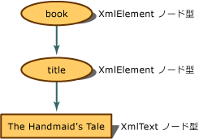

# <a name="mapping-the-object-hierarchy-to-xml-data"></a>オブジェクト階層の XML データへのマップ
メモリに読み込まれた XML ドキュメントは、ツリーという概念で表現されます。 プログラミングでは、オブジェクト階層を利用してツリーのノードにアクセスします。 XML コンテンツがどのようにノードに変換されるかを次の例に示します。  
  
 XML が XML ドキュメント オブジェクト モデル (DOM) に読み込まれると、各部がノードに変換されます。これらのノードは、ノード型や値など、ノード自身に関する付加的なメタデータを保持しています。 ノード型はノードのオブジェクトであり、ノード型によって実行可能なアクションおよび設定や取得が可能なプロパティが決まります。  
  
 次のような簡単な XML があるとします。  
  
 **入力**  
  
```xml  
<book>  
    <title>The Handmaid's Tale</title>  
</book>  
```  
  
 この入力は、メモリ上で次のようなノード ツリーとして表現され、ノード型プロパティが割り当てられます。  
  
   
book と title のノード ツリー表現  
  
 `book`要素は、 **XmlElement**オブジェクト、次の要素では、`title`にもなります、 **XmlElement**、要素の内容になります、 **XmlText**オブジェクト。 調べて、 **XmlElement**メソッドとプロパティ、メソッドおよびプロパティは、メソッドとプロパティで使用できるとは異なる、 **XmlText**オブジェクト。 実行可能なアクションはノード型によって決定されるため、XML マークアップがどのノード型になるかを理解することがきわめて重要です。  
  
 XML データを読み込み、ノード型に応じて異なるテキストを書き出す例を次に示します。 次の XML データ ファイルを使用して、入力として**items.xml**:  
  
 **入力**  
  
```xml  
<?xml version="1.0"?>  
<!-- This is a sample XML document -->  
<!DOCTYPE Items [<!ENTITY number "123">]>  
<Items>  
  <Item>Test with an entity: &number;</Item>  
  <Item>test with a child element <more/> stuff</Item>  
  <Item>test with a CDATA section <![CDATA[<456>]]> def</Item>  
  <Item>Test with a char entity: A</Item>  
  <!-- Fourteen chars in this element.-->  
  <Item>1234567890ABCD</Item>  
</Items>  
```  
  
 次のコード例を読み取り、 **items.xml**ファイルし、各ノードの種類の情報を表示します。  
  
```vb  
Imports System  
Imports System.IO  
Imports System.Xml  
  
Public Class Sample  
    Private Const filename As String = "items.xml"  
  
    Public Shared Sub Main()  
  
        Dim reader As XmlTextReader = Nothing  
  
        Try  
            ' Load the reader with the data file and   
            'ignore all white space nodes.   
            reader = New XmlTextReader(filename)  
            reader.WhitespaceHandling = WhitespaceHandling.None  
  
            ' Parse the file and display each of the nodes.  
            While reader.Read()  
                Select Case reader.NodeType  
                    Case XmlNodeType.Element  
                        Console.Write("<{0}>", reader.Name)  
                    Case XmlNodeType.Text  
                        Console.Write(reader.Value)  
                    Case XmlNodeType.CDATA  
                        Console.Write("<![CDATA[{0}]]>", reader.Value)  
                    Case XmlNodeType.ProcessingInstruction  
                        Console.Write("<?{0} {1}?>", reader.Name, reader.Value)  
                    Case XmlNodeType.Comment  
                        Console.Write("<!--{0}-->", reader.Value)  
                    Case XmlNodeType.XmlDeclaration  
                        Console.Write("<?xml version='1.0'?>")  
                    Case XmlNodeType.Document  
                    Case XmlNodeType.DocumentType  
                        Console.Write("<!DOCTYPE {0} [{1}]", reader.Name, reader.Value)  
                    Case XmlNodeType.EntityReference  
                        Console.Write(reader.Name)  
                    Case XmlNodeType.EndElement  
                        Console.Write("</{0}>", reader.Name)  
                End Select  
            End While  
  
        Finally  
            If Not (reader Is Nothing) Then  
                reader.Close()  
            End If  
        End Try  
    End Sub 'Main ' End class  
End Class 'Sample  
```  
  
```csharp  
using System;  
using System.IO;  
using System.Xml;  
  
public class Sample  
{  
    private const String filename = "items.xml";  
  
    public static void Main()  
    {  
        XmlTextReader reader = null;  
  
        try  
        {  
            // Load the reader with the data file and ignore   
            // all white space nodes.  
            reader = new XmlTextReader(filename);  
            reader.WhitespaceHandling = WhitespaceHandling.None;  
  
            // Parse the file and display each of the nodes.  
            while (reader.Read())  
            {  
                switch (reader.NodeType)  
                {  
                    case XmlNodeType.Element:  
                        Console.Write("<{0}>", reader.Name);  
                        break;  
                    case XmlNodeType.Text:  
                        Console.Write(reader.Value);  
                        break;  
                    case XmlNodeType.CDATA:  
                        Console.Write("<![CDATA[{0}]]>", reader.Value);  
                        break;  
                    case XmlNodeType.ProcessingInstruction:  
                        Console.Write("<?{0} {1}?>", reader.Name, reader.Value);  
                        break;  
                    case XmlNodeType.Comment:  
                        Console.Write("<!--{0}-->", reader.Value);  
                        break;  
                    case XmlNodeType.XmlDeclaration:  
                        Console.Write("<?xml version='1.0'?>");  
                        break;  
                    case XmlNodeType.Document:  
                        break;  
                    case XmlNodeType.DocumentType:  
                        Console.Write("<!DOCTYPE {0} [{1}]", reader.Name, reader.Value);  
                        break;  
                    case XmlNodeType.EntityReference:  
                        Console.Write(reader.Name);  
                        break;  
                    case XmlNodeType.EndElement:  
                        Console.Write("</{0}>", reader.Name);  
                        break;  
                }  
            }  
        }  
  
        finally  
        {  
            if (reader != null)  
                reader.Close();  
        }  
    }  
} // End class  
```  
  
 この例の出力を確認すると、データからノード型へのマップがわかります。  
  
 **出力**  
  
```xml  
<?xml version='1.0'?><!--This is a sample XML document --><!DOCTYPE Items [<!ENTITY number "123">]<Items><Item>Test with an entity: 123</Item><Item>test with a child element <more> stuff</Item><Item>test with a CDATA section <![CDATA[<456>]]> def</Item><Item>Test with a char entity: A</Item><--Fourteen chars in this element.--><Item>1234567890ABCD</Item></Items>  
```  
  
 入力と、コードから生成された出力を 1 行ずつ対比させた以下の表を見れば、どのノード テストによってどの出力行が生成されたのかを分析でき、どの XML データがどのノード型になったかがわかります。  
  
|入力|出力|ノード型のテスト|  
|-----------|------------|--------------------|  
|\<? xml バージョン =「1.0」? >|\<? xml バージョン ='1.0 '? >|XmlNodeType.XmlDeclaration|  
|\<!--これは、サンプルの XML ドキュメント-->|\<!--これは、サンプルの XML ドキュメント-->|XmlNodeType.Comment|  
|\<!DOCTYPE 項目 [\<!エンティティの数「123」>] >|\<!DOCTYPE 項目 [\<!エンティティの数「123」>]|XmlNodeType.DocumentType|  
|\<項目 >|\<項目 >|XmlNodeType.Element|  
|\<Item>|\<Item>|XmlNodeType.Element|  
|エンティティにテストします。&number;|Test with an entity:|XmlNodeType.Text|  
|\</アイテム >|\</アイテム >|XmlNodeType.EndElement|  
|\<Item>|\<Item>|XmNodeType.Element|  
|test with a child element|test with a child element|XmlNodeType.Text|  
|\<詳細 >|\<詳細 >|XmlNodeType.Element|  
|stuff|stuff|XmlNodeType.Text|  
|\</アイテム >|\</アイテム >|XmlNodeType.EndElement|  
|\<Item>|\<Item>|XmlNodeType.Element|  
|test with a CDATA section|test with a CDATA section|XmlTest.Text|  
|<![CDATA [\<456 >]\>|<![CDATA [\<456 >]\>|XmlTest.CDATA|  
|def|def|XmlNodeType.Text|  
|\</アイテム >|\</アイテム >|XmlNodeType.EndElement|  
|\<Item>|\<Item>|XmlNodeType.Element|  
|Char 型のエンティティにテストします。 (& a)\#65 です。|Test with a char entity: A|XmlNodeType.Text|  
|\</アイテム >|\</アイテム >|XmlNodeType.EndElement|  
|\<!--この要素で 14 文字-->|\<--この要素で 14 文字--> します。|XmlNodeType.Comment|  
|\<Item>|\<Item>|XmlNodeType.Element|  
|1234567890ABCD|1234567890ABCD|XmlNodeType.Text|  
|\</アイテム >|\</アイテム >|XmlNodeType.EndElement|  
|\</アイテム >|\</アイテム >|XmlNodeType.EndElement|  
  
 有効なアクションの種類と設定および取得できるプロパティの種類はノード型によって決まるため、割り当てられているノード型を知っておく必要があります。  
  
 空白ノードの作成には、データが、DOM に読み込まれるときに、制御、 **PreserveWhitespace**フラグ。 詳細については、次を参照してください。[空白および有意の空白処理 DOM を読み込むとき](../../../../docs/standard/data/xml/white-space-and-significant-white-space-handling-when-loading-the-dom.md)です。  
  
 新しいノードを DOM に追加するを参照してください。 [XML ドキュメントにノードの挿入](../../../../docs/standard/data/xml/inserting-nodes-into-an-xml-document.md)です。 DOM からノードを削除するを参照してください。[ノードの削除、コンテンツ、および XML ドキュメントから値](../../../../docs/standard/data/xml/removing-nodes-content-and-values-from-an-xml-document.md)です。 DOM のノードの内容を変更するを参照してください。[ノードの変更、コンテンツ、および XML ドキュメント内の値](../../../../docs/standard/data/xml/modifying-nodes-content-and-values-in-an-xml-document.md)です。  
  
## <a name="see-also"></a>関連項目  
 [XML ドキュメント オブジェクト モデル (DOM)](../../../../docs/standard/data/xml/xml-document-object-model-dom.md)
