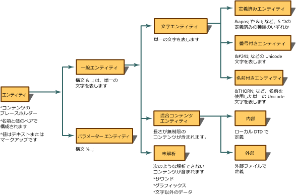
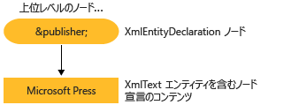

# <a name="reading-entity-declarations-and-entity-references-into-the-dom"></a>エンティティ宣言とエンティティ参照の DOM への読み込み
エンティティとは、コンテンツやマークアップの代わりに XML で使われる名前を指定する宣言です。 エンティティを使用するには、2 つの手順が必要です。 まず、エンティティ宣言を使用して、置換するコンテンツに名前を結び付ける必要があります。 エンティティ宣言は、ドキュメント型定義 (DTD) または XML スキーマの中で、`<!ENTITY name "value">` 構文を使って作成します。 次に、エンティティ宣言で定義した名前を XML で使用します。 XML で使用するときは、エンティティ参照と呼ばれます。 たとえば、次のエンティティ宣言は、`publisher` という名前のエンティティを宣言し、それを "Microsoft Press" というコンテンツに関連付けます。  
  
```xml  
<!ENTITY publisher "Microsoft Press">  
```  
  
 このエンティティ宣言を、XML でエンティティ参照として使用する例を次に示します。  
  
```xml  
<author>Fred</author>  
<pubinfo>Published by &publisher;</pubinfo>  
```  
  
 パーサーの中には、ドキュメントをメモリに読み込むとき、エンティティを自動的に展開するものがあります。 この場合は、XML がメモリに読み込まれるときに、エンティティ宣言が記憶されて保存されます。 その後、一般エンティティ参照を識別する `&;` 文字を検出すると、パーサーはその名前をエンティティ宣言テーブルで検索します。 `&publisher;` という参照は、それが表すコンテンツに置き換えられます。 たとえば、次の XML を使用します。  
  
```xml  
<author>Fred</author>  
<pubinfo>Published by &publisher;</pubinfo>  
```  
  
 エンティティ参照は展開され、`&publisher;` が Microsoft Press というコンテンツに置き換えられます。展開された XML は次のようになります。  
  
 **出力**  
  
```xml  
<author>Fred</author>  
<pubinfo>Published by Microsoft Press</pubinfo>  
```  
  
 エンティティには多くの種類があります。 エンティティの分類と用語を次の図に示します。  
  
   
  
 XML ドキュメント オブジェクト モデル (DOM) の Microsoft .NET Framework の実装では、XML の読み込み時に既定でエンティティ参照を保持し、エンティティを展開しません。 つまり、ドキュメントが DOM に読み込まれるときには、`&publisher;` という参照変数を含む **XmlEntityReference** ノードが作成され、その子ノードとして、DTD に宣言されたエンティティのコンテンツを表すノードが作成されます。  
  
 `<!ENTITY publisher "Microsoft Press">` というエンティティ宣言を使用した場合に、この宣言によって作成される **XmlEntity** ノードと **XmlText** ノードを次の図に示します。  
  
   
  
 エンティティ参照が展開されるかどうかによって、メモリの DOM ツリーに生成されるノードが変わります。 生成されるノードの違いについては、「[保持されるエンティティ参照](../../../../docs/standard/data/xml/entity-references-are-preserved.md)」と「[保持されずに展開されるエンティティ参照](../../../../docs/standard/data/xml/entity-references-are-expanded-and-not-preserved.md)」で説明しています。  
  
## <a name="see-also"></a>関連項目

- [XML ドキュメント オブジェクト モデル (DOM)](../../../../docs/standard/data/xml/xml-document-object-model-dom.md)
