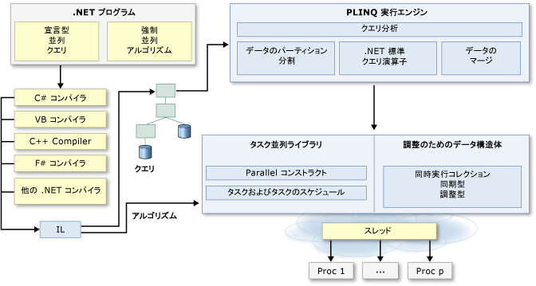

# .NET Framework の並列プログラミング
多くのパーソナル コンピューターとワークステーションには、複数スレッドの同時実行を可能にする 2 つまたは 4 つのコア (CPU) があります。 近い将来、コンピューターは、これよりはるかに多くのコアを搭載すると予想されています。 現在および将来のハードウェアを活用するには、コードを並列化して複数のプロセッサに負荷を分散します。 以前は、並列化には低水準のスレッドおよびロックの操作が必要でした。 [!INCLUDE[vs_dev10_long](../../../includes/vs-dev10-long-md.md)] および [!INCLUDE[net_v40_short](../../../includes/net-v40-short-md.md)] では、新しいランタイム、新しいクラス ライブラリの型、および新しい診断ツールを提供することで、並列プログラミングのサポートを強化しています。 これらの機能により並行開発が簡素化され、スレッドやスレッド プールを直接操作することなく、効率的で詳細な、拡張性のある並列コードを自然な表現方法で記述できるようになります。 [!INCLUDE[net_v40_short](../../../includes/net-v40-short-md.md)] の並列プログラミング アーキテクチャの高度な概要を次の図に示します。  
  
   
  
## 関連トピック  
  
|テクノロジ|説明|  
|----------------|-----------------|  
|[タスク並列ライブラリ (TPL)](../../../docs/standard/parallel-programming/task-parallel-library-tpl.md)|並列バージョンの `For` ループおよび `ForEach` ループを含む <xref:System.Threading.Tasks.Parallel?displayProperty=fullName> クラスに関するドキュメントと、非同期操作の推奨される表現方法を表す <xref:System.Threading.Tasks.Task?displayProperty=fullName> クラスに関するドキュメントが用意されています。|  
|[Parallel LINQ (PLINQ)](../../../docs/standard/parallel-programming/parallel-linq-plinq.md)|さまざまなシナリオでパフォーマンスを大幅に向上させる、LINQ to Objects の並列実装です。|  
|[並列プログラミングのデータ構造](../../../docs/standard/parallel-programming/data-structures-for-parallel-programming.md)|スレッド セーフなコレクション クラス、軽量な同期型、および限定的な初期化の種類に関するドキュメントへのリンクを示します。|  
|[並列診断ツール](../../../docs/standard/parallel-programming/parallel-diagnostic-tools.md)|Visual Studio デバッガーのタスク ウィンドウと並列スタック ウィンドウに関するドキュメントと、デバッグおよび並列コードのパフォーマンスの調整に使用できる [!INCLUDE[vsprvsts](../../../includes/vsprvsts-md.md)] プロファイラーの一連のビューで構成される [同時実行ビジュアライザー](http://msdn.microsoft.com/library/ae5879a0-1e1a-455a-ba72-148e57f59289) に関するドキュメントへのリンクを示します。|  
|[PLINQ および TPL 用のカスタム パーティショナー](../../../docs/standard/parallel-programming/custom-partitioners-for-plinq-and-tpl.md)|パーティションのしくみと、既定のパーティションの設定方法または新しいパーティションの作成方法について説明します。|  
|[タスク スケジューラ](http://msdn.microsoft.com/library/638f8ea5-21db-47a2-a934-86e1e961bf65)|スケジューラのしくみと既定のスケジューラの構成方法について説明します。|  
|[PLINQ および TPL のラムダ式](../../../docs/standard/parallel-programming/lambda-expressions-in-plinq-and-tpl.md)|C# および Visual Basic のラムダ式について簡単に説明し、PLINQ およびタスク並列ライブラリでラムダ式を使用する方法を示します。|  
|[関連項目](../../../docs/standard/parallel-programming/for-further-reading-parallel-programming.md)|.NET Framework での並列プログラミングに関する追加のドキュメントとサンプル リソースへのリンクを示します。|  
  
## 関連項目  
 [並列プログラミングのパターン: .NET Framework 4 での並列パターンの理解と適用](http://go.microsoft.com/fwlink/?LinkID=185142)   
 [.NET Framework による並列プログラミングのサンプル](http://code.msdn.microsoft.com/Samples-for-Parallel-b4b76364)
