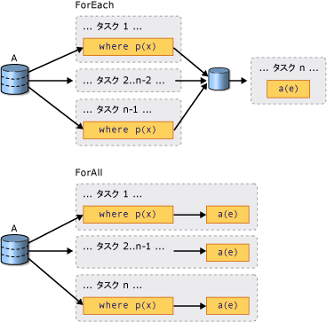

# PLINQ の概要

## 並列クエリとは

統合言語クエリ (LINQ) は [!INCLUDE[net_v35_long](../../../includes/net-v35-long-md.md)] で導入されました。 これはタイプ セーフな方法で任意の <xref:System.Collections.IEnumerable?displayProperty=nameWithType> または <xref:System.Collections.Generic.IEnumerable%601?displayProperty=nameWithType> のデータ ソースを照会する、統一されたモデルです。 LINQ to Objects とは、<xref:System.Collections.Generic.List%601> や配列などのメモリ内コレクションに対して実行される LINQ クエリの名前です。 この記事では、LINQ の基礎を理解していることを前提としています。 詳細については、「[統合言語クエリ (LINQ) - C#](../../csharp/programming-guide/concepts/linq/index.md)」または「[統合言語クエリ (LINQ) - Visual Basic](../../visual-basic/programming-guide/concepts/linq/index.md)」を参照してください。

Parallel LINQ (PLINQ) は、LINQ パターンの並列実装です。 PLINQ クエリは、あらゆる意味において、並列ではない LINQ to Objects クエリに似ています。 PLINQ クエリは、[!INCLUDE[vbteclinq](../../../includes/vbteclinq-md.md)] の順次クエリと同様、メモリ内の <xref:System.Collections.IEnumerable> または <xref:System.Collections.Generic.IEnumerable%601> データ ソースで実行され、遅延実行が存在するので、クエリが列挙されるまでは実行されません。 主な相違点は、PLINQ は、システムのすべてのプロセッサを十分に活用しようとする点です。 そのために、データ ソースをセグメントにパーティション分割し、複数のプロセッサで個々のワーカー スレッドの各セグメントに対してクエリを並行実行します。 多くの場合、並行実行によって、クエリは非常に高速に処理されます。

一部の種類のクエリについては、データ ソースに <xref:System.Linq.ParallelEnumerable.AsParallel%2A> クエリ操作を追加して並行実行することで、レガシ コードよりも大幅なパフォーマンスの向上を PLINQ で実現できます。 ただし、並列処理にはある程度の複雑さが伴うため、すべてのクエリ操作が PLINQ でより速く実行されるわけではありません。 実際、一部のクエリについては、並列化によって処理速度が遅くなります。 そのため、順序付けなどの問題が並列クエリに与える影響を理解しておく必要があります。 詳細については、「[Understanding Speedup in PLINQ (PLINQ での高速化について)](../../../docs/standard/parallel-programming/understanding-speedup-in-plinq.md)」を参照してください。

> [!NOTE]
> ここでは、ラムダ式を使用して PLINQ でデリゲートを定義します。 C# または Visual Basic のラムダ式についての情報が必要な場合は、「[Lambda Expressions in PLINQ and TPL (PLINQ および TPL のラムダ式)](../../../docs/standard/parallel-programming/lambda-expressions-in-plinq-and-tpl.md)」を参照してください。

この記事の残りの部分では、主な PLINQ クラスの概要を紹介し、PLINQ クエリの作成方法について説明します。 各セクションには、詳細情報とコード例へのリンクも含まれています。

## ParallelEnumerable クラス

<xref:System.Linq.ParallelEnumerable?displayProperty=nameWithType> クラスは、ほぼすべての PLINQ 機能を公開します。 このクラスと、その他の <xref:System.Linq?displayProperty=nameWithType> 名前空間の型は、System.Core.dll アセンブリにコンパイルされます。 Visual Studio の既定の C# プロジェクトと Visual Basic プロジェクトは、どちらもアセンブリを参照し、名前空間をインポートします。

<xref:System.Linq.ParallelEnumerable> には、LINQ to Objects がサポートするすべての標準クエリ演算子の実装が含まれていますが、各演算子の並列化は試行しません。 [!INCLUDE[vbteclinq](../../../includes/vbteclinq-md.md)] に精通していない場合は、「[LINQ の概要 (C#)](../../csharp/programming-guide/concepts/linq/introduction-to-linq.md)」および「[LINQ の概要 (Visual Basic)](../../visual-basic/programming-guide/concepts/linq/introduction-to-linq.md)」を参照してください。

<xref:System.Linq.ParallelEnumerable> クラスには、標準クエリ演算子に加え、並行実行固有の動作を可能にする一連のメソッドが含まれています。 次の表に、これらの PLINQ 固有のメソッドを示します。

|ParallelEnumerable 演算子|説明|
|---------------------------------|-----------------|
|<xref:System.Linq.ParallelEnumerable.AsParallel%2A>|PLINQ のエントリ ポイント。 可能な場合は、クエリの残りの部分は並列化されることを示します。|
|<xref:System.Linq.ParallelEnumerable.AsSequential%2A>|クエリの残りの部分は、並列ではない LINQ クエリとして順次実行されることを示します。|
|<xref:System.Linq.ParallelEnumerable.AsOrdered%2A>|PLINQ は、クエリの残り部分について、または orderby (Visual Basic の場合は Order By) 句を使用するなどして順序が変更されるまでは、ソース シーケンスの順序を保持する必要があることを示します。|
|<xref:System.Linq.ParallelEnumerable.AsUnordered%2A>|クエリの残りの部分の PLINQ では、ソース シーケンスの順序を保持する必要がないことを示します。|
|<xref:System.Linq.ParallelEnumerable.WithCancellation%2A>|PLINQ は、提示されたキャンセル トークンの状態を定期的に監視し、要求された場合は、実行を取り消す必要があることを示します。|
|<xref:System.Linq.ParallelEnumerable.WithDegreeOfParallelism%2A>|クエリを並列化するために PLINQ が使用する必要がある、プロセッサの最大数を示します。|
|<xref:System.Linq.ParallelEnumerable.WithMergeOptions%2A>|PLINQ が並列化の結果を consumer スレッドの単一のシーケンスに再マージできる場合は、その方法についてのヒントを示します。|
|<xref:System.Linq.ParallelEnumerable.WithExecutionMode%2A>|既定の動作が順次実行である場合でも、PLINQ がクエリを並列化する必要があるかどうかを指定します。|
|<xref:System.Linq.ParallelEnumerable.ForAll%2A>|マルチスレッドの列挙型メソッド。クエリの結果の反復処理とは異なり、先に consumer スレッドに再マージしなくても、結果を並列処理できます。|
|<xref:System.Linq.ParallelEnumerable.Aggregate%2A> オーバーロード|PLINQ 固有のオーバーロードで、スレッド ローカルのパーティション上で中間的な集約を行うと共に、すべてのパーティションの結果を結合する最終的なアグリゲーション関数も使用できます。|

## オプトイン モデル

クエリを記述するときに、次の例に示すようにデータ ソースの <xref:System.Linq.ParallelEnumerable.AsParallel%2A?displayProperty=nameWithType> 拡張メソッドを呼び出し、PLINQ を有効にします。

[!code-csharp[PLINQ#1](../../../samples/snippets/csharp/VS_Snippets_Misc/plinq/cs/plinq2_cs.cs#1)]
[!code-vb[PLINQ#1](../../../samples/snippets/visualbasic/VS_Snippets_Misc/plinq/vb/plinq2_vb.vb#1)]

<xref:System.Linq.ParallelEnumerable.AsParallel%2A> 拡張メソッドは、それ以降のクエリ演算子 (この場合は `where` および `select`) を <xref:System.Linq.ParallelEnumerable?displayProperty=nameWithType> の実装にバインドします。

## 実行モード

既定では、PLINQ は保守的です。 PLINQ インフラストラクチャは、実行時に、クエリの全体的な構造を分析します。 並列化によってクエリを高速化できることが見込まれる場合は、PLINQ は、同時実行できるタスクにソース シーケンスをパーティション分割します。 クエリの並列化が安全ではない場合は、PLINQ はクエリを順次実行します。 PLINQ で、負荷が高くなる可能性がある並列アルゴリズムと負荷が低い順次アルゴリズムを選ぶ必要がある場合は、既定では順次アルゴリズムが選択されます。 並列アルゴリズムを選択するよう PLINQ に指示するには、<xref:System.Linq.ParallelEnumerable.WithExecutionMode%2A> メソッドと <xref:System.Linq.ParallelExecutionMode?displayProperty=nameWithType> 列挙型を使用します。 これは、テストと測定の結果、特定のクエリで並列化の方が速く実行されることが判明している場合に便利です。 詳細については、「[方法 :PLINQ の実行モードを指定する](../../../docs/standard/parallel-programming/how-to-specify-the-execution-mode-in-plinq.md)」をご覧ください。

## 並列化の次数

既定では、PLINQ はホスト コンピューター上のすべてのプロセッサを使用します。 <xref:System.Linq.ParallelEnumerable.WithDegreeOfParallelism%2A> メソッドを使用すると、指定されたプロセッサ数よりも多くのプロセッサを使用するよう、PLINQ に指示できます。 これは、コンピューター上で実行されるその他のプロセスが、一定の CPU 時間を確保できるようにする場合に便利です。 次のスニペットでは、クエリが最大で 2 つのプロセッサしか使用できないように制限します。

[!code-csharp[PLINQ#5](../../../samples/snippets/csharp/VS_Snippets_Misc/plinq/cs/plinqsamples.cs#5)]
[!code-vb[PLINQ#5](../../../samples/snippets/visualbasic/VS_Snippets_Misc/plinq/vb/plinq2_vb.vb#5)]

クエリが、ファイル I/O など計算主体ではない作業を大量に実行している場合は、マシンのコア数よりも大きい並列化の次数を指定することをお勧めします。

## 順序ありの並列クエリと順序なしの並列クエリ

一部のクエリでは、クエリ演算子は、ソース シーケンスの順序を保持する結果を生成する必要があります。 そのために、PLINQ には <xref:System.Linq.ParallelEnumerable.AsOrdered%2A> 演算子が用意されています。 <xref:System.Linq.ParallelEnumerable.AsOrdered%2A> は、<xref:System.Linq.ParallelEnumerable.AsSequential%2A> とは異なります。 <xref:System.Linq.ParallelEnumerable.AsOrdered%2A> シーケンスは並列で処理されますが、その結果はバッファーに格納されて並べ替えられます。 通常、順序を保持するには追加の処理が必要となるため、<xref:System.Linq.ParallelEnumerable.AsOrdered%2A> シーケンスの処理は、既定の <xref:System.Linq.ParallelEnumerable.AsUnordered%2A> シーケンスよりも遅くなることがあります。 特定の順序ありの並列操作が、同じ操作の順次処理よりも高速であるかどうかは、さまざまな要因によって左右されます。

次のコード例に、順序の維持を有効にする方法を示します。

[!code-csharp[PLINQ#3](../../../samples/snippets/csharp/VS_Snippets_Misc/plinq/cs/plinq2_cs.cs#3)]
[!code-vb[PLINQ#3](../../../samples/snippets/visualbasic/VS_Snippets_Misc/plinq/vb/plinq2_vb.vb#3)]

詳細については、「[Order Preservation in PLINQ (PLINQ における順序維持)](../../../docs/standard/parallel-programming/order-preservation-in-plinq.md)」を参照してください。

## 並列クエリと順次クエリ

一部の操作では、ソース データを順次提供する必要があります。 <xref:System.Linq.ParallelEnumerable> クエリ演算子は、必要に応じて、順次モードに自動的に切り替わります。 ユーザー定義のクエリ演算子と、順次実行を必要とするユーザー デリゲート向けに、PLINQ では <xref:System.Linq.ParallelEnumerable.AsSequential%2A> メソッドを使用できます。 <xref:System.Linq.ParallelEnumerable.AsSequential%2A> を使用すると、それ以降のクエリの演算子は、<xref:System.Linq.ParallelEnumerable.AsParallel%2A> が再度呼び出されるまで順次実行されます。 詳細については、「[方法 :並列および順次の LINQ クエリを連結する](../../../docs/standard/parallel-programming/how-to-combine-parallel-and-sequential-linq-queries.md)」をご覧ください。

## クエリ結果のマージのオプション

PLINQ クエリが並列実行される場合、`foreach` ループ (Visual Basic では `For Each`) による消費、またはリストや配列への挿入を行うことができるよう、各ワーカー スレッドからの結果をメイン スレッドに再マージする必要があります。 結果をより迅速に生成する場合など、特定のマージ操作を指定すると便利なこともあります。 そのために、PLINQ では <xref:System.Linq.ParallelEnumerable.WithMergeOptions%2A> メソッドと <xref:System.Linq.ParallelMergeOptions> 列挙型をサポートしています。 詳細については、「[Merge Options in PLINQ (PLINQ のマージ オプション)](../../../docs/standard/parallel-programming/merge-options-in-plinq.md)」を参照してください。

## ForAll 演算子

[!INCLUDE[vbteclinq](../../../includes/vbteclinq-md.md)] の順次クエリでは、`foreach` (Visual Basic の場合は `For Each`) ループで列挙されるか、<xref:System.Linq.ParallelEnumerable.ToList%2A>、<xref:System.Linq.ParallelEnumerable.ToArray%2A>、<xref:System.Linq.ParallelEnumerable.ToDictionary%2A> などのメソッドを呼び出すまで、クエリの実行は延期されます。 PLINQ では、`foreach` を使用してクエリを実行し、結果を反復処理することもできます。 ただし、`foreach` 自体は並列実行されないので、ループが実行されるスレッドに、すべての並列タスクの出力を再マージする必要があります。 PLINQ では、クエリ結果の最終的な順序を維持する必要がある場合や、結果を順次的に処理している場合は (たとえば、各要素に対して `foreach` を呼び出している場合など)、`Console.WriteLine` を使用できます。 順序の維持が必要ない場合や、結果の処理自体を並列化できる場合にクエリ実行を高速化するには、<xref:System.Linq.ParallelEnumerable.ForAll%2A> メソッドで PLINQ クエリを実行します。 <xref:System.Linq.ParallelEnumerable.ForAll%2A> は、この最終的なマージ ステップを実行しません。 <xref:System.Linq.ParallelEnumerable.ForAll%2A> メソッドを使用するコード例を次に示します。 ここで <xref:System.Collections.Concurrent.ConcurrentBag%601?displayProperty=nameWithType> が使用されるのは、項目を削除せずに、同時に複数スレッドの追加を行うために最適化されるためです。

[!code-csharp[PLINQ#4](../../../samples/snippets/csharp/VS_Snippets_Misc/plinq/cs/plinq2_cs.cs#4)]
[!code-vb[PLINQ#4](../../../samples/snippets/visualbasic/VS_Snippets_Misc/plinq/vb/plinq2_vb.vb#4)]

次の図に、クエリ実行における `foreach` と <xref:System.Linq.ParallelEnumerable.ForAll%2A> の相違点を示します。

## キャンセル

PLINQ は、.NET Framework 4 のキャンセルの型に統合されています。 詳細については、「[Cancellation in Managed Threads (マネージド スレッドのキャンセル)](../../../docs/standard/threading/cancellation-in-managed-threads.md)」を参照してください。そのため、順次的な LINQ to Objects クエリとは異なり、PLINQ クエリは取り消すことができます。 キャンセル可能な PLINQ クエリを作成するには、クエリで <xref:System.Linq.ParallelEnumerable.WithCancellation%2A> 演算子を使用し、引数として <xref:System.Threading.CancellationToken> インスタンスを指定します。 トークンの <xref:System.Threading.CancellationToken.IsCancellationRequested%2A> プロパティが true に設定されていると、PLINQ はそれに気付き、すべてのスレッドの処理を中止して <xref:System.OperationCanceledException> をスローします。

キャンセル トークンが設定された後も、PLINQ クエリが一部の要素の処理を継続する可能性があります。

応答性を高めるため、長時間にわたるユーザー デリゲートのキャンセル要求に対応することもできます。 詳細については、「[方法 :PLINQ クエリを取り消す](../../../docs/standard/parallel-programming/how-to-cancel-a-plinq-query.md)」をご覧ください。

## 例外

PLINQ クエリが実行されると、異なるスレッドから複数の例外が同時にスローされることがあります。 また、例外を処理するコードが、例外をスローしたコードとは異なるスレッドにあることもあります。 PLINQ では <xref:System.AggregateException> 型を使用し、クエリによってスローされたすべての例外をカプセル化し、それらの例外を呼び出し元のスレッドにマーシャリングします。 呼び出し元のクエリでは、try-catch ブロックが 1 つだけ必要です。 ただし、<xref:System.AggregateException> でカプセル化されたすべての例外を反復処理し、安全に回復できる例外をキャッチできます。 まれに、<xref:System.AggregateException> にラップされていない例外がスローされ、<xref:System.Threading.ThreadAbortException> もラップされていないことがあります。

連結しているスレッドへ例外が上方向へ通知されると、例外が発生した後も、クエリによって一部の項目の処理が続行される可能性があります。

詳細については、「[方法 :PLINQ クエリの例外を処理する](../../../docs/standard/parallel-programming/how-to-handle-exceptions-in-a-plinq-query.md)」をご覧ください。

## カスタム パーティショナー

ソース データの特性を活用するカスタム パーティショナーを記述することによって、クエリのパフォーマンスを向上できる場合があります。 クエリでは、カスタム パーティショナー自体は、クエリの対象となる列挙可能なオブジェクトです。

[!code-csharp[PLINQ#2](../../../samples/snippets/csharp/VS_Snippets_Misc/plinq/cs/plinq2_cs.cs#2)]
[!code-vb[PLINQ#2](../../../samples/snippets/visualbasic/VS_Snippets_Misc/plinq/vb/plinq3.vb#2)]

PLINQ は、固定数のパーティションをサポートしています (ただし、負荷分散の目的で、これらのパーティションに対してデータが実行時に動的に再割り当てされることもあります)。 <xref:System.Threading.Tasks.Parallel.For%2A> および <xref:System.Threading.Tasks.Parallel.ForEach%2A> は動的なパーティション分割しかサポートしていないので、パーティションの数は実行時に変化します。 詳細については、「[Custom Partitioners for PLINQ and TPL (PLINQ および TPL 用のカスタム パーティショナー)](../../../docs/standard/parallel-programming/custom-partitioners-for-plinq-and-tpl.md)」を参照してください。

## PLINQ のパフォーマンスの測定

クエリは、多くの場合並列化できますが、並列クエリの設定に伴うオーバーヘッドは、並列化によって得られるパフォーマンスの利点よりも大きくなります。 クエリが大量の計算を実行しない場合、またはデータ ソースが小さい場合、PLINQ クエリは、順次的な LINQ to Objects クエリよりも低速になります。 Visual Studio Team Server の Parallel Performance Analyzer を使用し、さまざまなクエリのパフォーマンスの比較、処理のボトルネックの場所の特定、クエリが並行処理されているか順次処理されているかの確認を行うことができます。 詳細については、「[コンカレンシー ビジュアライザー](/visualstudio/profiling/concurrency-visualizer)」および「[方法:PLINQ クエリのパフォーマンスを測定する](../../../docs/standard/parallel-programming/how-to-measure-plinq-query-performance.md)」をご覧ください。

## 関連項目

- [Parallel LINQ (PLINQ)](../../../docs/standard/parallel-programming/parallel-linq-plinq.md)
- [PLINQ での高速化について](../../../docs/standard/parallel-programming/understanding-speedup-in-plinq.md)
