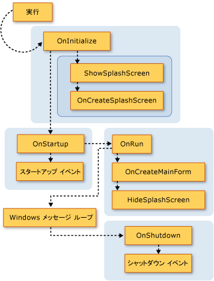

# Visual Basic アプリケーション モデルの拡張
アプリケーション モデルに対する機能を追加するにはオーバーライドすることで、 `Overridable` <xref:Microsoft.VisualBasic.ApplicationServices.WindowsFormsApplicationBase>クラス</xref:Microsoft.VisualBasic.ApplicationServices.WindowsFormsApplicationBase>のメンバー この手法を使用すると、アプリケーション モデルの動作をカスタマイズして、アプリケーションの起動およびシャット ダウンすると、独自のメソッドの呼び出しを追加できます。  
  
## アプリケーション モデルの視覚的な概要  
 ここでは、Visual Basic アプリケーション モデルで関数呼び出しのシーケンスを視覚的に示します。 次のセクションでは、各関数の詳細の目的について説明します。  
  
 次の図は、標準の Visual Basic Windows フォーム アプリケーションでのアプリケーション モデルの呼び出しシーケンスを示しています。 シーケンスが開始、`Sub Main`プロシージャの呼び出し、<xref:Microsoft.VisualBasic.ApplicationServices.WindowsFormsApplicationBase.Run%2A>メソッド</xref:Microsoft.VisualBasic.ApplicationServices.WindowsFormsApplicationBase.Run%2A>。  
  
   
  
 Visual Basic アプリケーション モデルにも用意されています、<xref:Microsoft.VisualBasic.ApplicationServices.WindowsFormsApplicationBase.StartupNextInstance>と<xref:Microsoft.VisualBasic.ApplicationServices.WindowsFormsApplicationBase.UnhandledException>イベント</xref:Microsoft.VisualBasic.ApplicationServices.WindowsFormsApplicationBase.UnhandledException></xref:Microsoft.VisualBasic.ApplicationServices.WindowsFormsApplicationBase.StartupNextInstance>。 次の図は、これらのイベントが発生するしくみを示します。  
  
   
  
   
  
## 基本メソッドのオーバーライド  
 <xref:Microsoft.VisualBasic.ApplicationServices.WindowsFormsApplicationBase.Run%2A>メソッドでは、順序を定義する、`Application`メソッドを実行します</xref:Microsoft.VisualBasic.ApplicationServices.WindowsFormsApplicationBase.Run%2A>。 既定では、 `Sub Main` Windows フォーム アプリケーションのプロシージャを呼び出す、<xref:Microsoft.VisualBasic.ApplicationServices.WindowsFormsApplicationBase.Run%2A>メソッド</xref:Microsoft.VisualBasic.ApplicationServices.WindowsFormsApplicationBase.Run%2A>。  
  
 アプリケーションが通常のアプリケーション (複数のインスタンス アプリケーション)、または単一インスタンスのアプリケーションの最初のインスタンスの場合、<xref:Microsoft.VisualBasic.ApplicationServices.WindowsFormsApplicationBase.Run%2A>メソッドが実行される、`Overridable`次の順序のメソッド:</xref:Microsoft.VisualBasic.ApplicationServices.WindowsFormsApplicationBase.Run%2A>  
  
1.  <xref:Microsoft.VisualBasic.ApplicationServices.WindowsFormsApplicationBase.OnInitialize%2A>.</xref:Microsoft.VisualBasic.ApplicationServices.WindowsFormsApplicationBase.OnInitialize%2A> Visual スタイル、テキストの表示スタイル、および (アプリケーションでは、Windows 認証を使用) 場合は、メイン アプリケーション スレッドの現在のプリンシパル既定では、このメソッドを設定および呼び出し`ShowSplashScreen`されなかった場合`/nosplash`も`-nosplash`コマンドライン引数として使用します。  
  
     この関数が返す場合、アプリケーションの起動処理が取り消された`False`です。 これは、アプリケーションを実行するはいけない状況がある場合に役立ちます。 ことができます。  
  
     <xref:Microsoft.VisualBasic.ApplicationServices.WindowsFormsApplicationBase.OnInitialize%2A>メソッドは、次のメソッドを呼び出します</xref:Microsoft.VisualBasic.ApplicationServices.WindowsFormsApplicationBase.OnInitialize%2A>。  
  
    1.  <xref:Microsoft.VisualBasic.ApplicationServices.WindowsFormsApplicationBase.ShowSplashScreen%2A>.</xref:Microsoft.VisualBasic.ApplicationServices.WindowsFormsApplicationBase.ShowSplashScreen%2A> かどうかをアプリケーション定義のスプラッシュ スクリーンと場合は、別のスレッドでスプラッシュ画面が表示されます。  
  
         <xref:Microsoft.VisualBasic.ApplicationServices.WindowsFormsApplicationBase.ShowSplashScreen%2A>メソッドには、スプラッシュを表示するコードが含まれている画面を少なくともによって指定されたミリ秒数、<xref:Microsoft.VisualBasic.ApplicationServices.WindowsFormsApplicationBase.MinimumSplashScreenDisplayTime%2A>プロパティ</xref:Microsoft.VisualBasic.ApplicationServices.WindowsFormsApplicationBase.MinimumSplashScreenDisplayTime%2A></xref:Microsoft.VisualBasic.ApplicationServices.WindowsFormsApplicationBase.ShowSplashScreen%2A>。 この機能を使用するのには、アプリケーションを使用して、スプラッシュ スクリーンを追加する必要があります、**プロジェクト デザイナー** (設定する、`My.Application.MinimumSplashScreenDisplayTime`プロパティを&2; 秒)、設定、または、`My.Application.MinimumSplashScreenDisplayTime`プロパティをオーバーライドするメソッドに、<xref:Microsoft.VisualBasic.ApplicationServices.WindowsFormsApplicationBase.OnInitialize%2A>または<xref:Microsoft.VisualBasic.ApplicationServices.WindowsFormsApplicationBase.OnCreateSplashScreen%2A>メソッド</xref:Microsoft.VisualBasic.ApplicationServices.WindowsFormsApplicationBase.OnCreateSplashScreen%2A></xref:Microsoft.VisualBasic.ApplicationServices.WindowsFormsApplicationBase.OnInitialize%2A>。 詳細については、 <xref:Microsoft.VisualBasic.ApplicationServices.WindowsFormsApplicationBase.MinimumSplashScreenDisplayTime%2A>。</xref:Microsoft.VisualBasic.ApplicationServices.WindowsFormsApplicationBase.MinimumSplashScreenDisplayTime%2A>を参照してください。  
  
    2.  <xref:Microsoft.VisualBasic.ApplicationServices.WindowsFormsApplicationBase.OnCreateSplashScreen%2A>.</xref:Microsoft.VisualBasic.ApplicationServices.WindowsFormsApplicationBase.OnCreateSplashScreen%2A> スプラッシュ スクリーンを初期化するコードを出力するデザイナーを使用します。  
  
         既定では、このメソッドは何もしません。 アプリケーションのスプラッシュ画面を選択するかどうか、 [!INCLUDE[vbprvb](../../../csharp/programming-guide/concepts/linq/includes/vbprvb_md.md)] **プロジェクト デザイナー**、デザイナーをオーバーライドし、<xref:Microsoft.VisualBasic.ApplicationServices.WindowsFormsApplicationBase.OnCreateSplashScreen%2A>メソッドを設定するメソッドを<xref:Microsoft.VisualBasic.ApplicationServices.WindowsFormsApplicationBase.SplashScreen%2A>スプラッシュ スクリーンのフォームの新しいインスタンスをプロパティ</xref:Microsoft.VisualBasic.ApplicationServices.WindowsFormsApplicationBase.SplashScreen%2A></xref:Microsoft.VisualBasic.ApplicationServices.WindowsFormsApplicationBase.OnCreateSplashScreen%2A>。  
  
2.  <xref:Microsoft.VisualBasic.ApplicationServices.WindowsFormsApplicationBase.OnStartup%2A>.</xref:Microsoft.VisualBasic.ApplicationServices.WindowsFormsApplicationBase.OnStartup%2A> 発生させるための拡張ポイントを提供、`Startup`イベントです。 この関数が返す場合、アプリケーションの起動処理が停止した`False`します。  
  
     既定では、このメソッドを発生させる、<xref:Microsoft.VisualBasic.ApplicationServices.WindowsFormsApplicationBase.Startup>イベント</xref:Microsoft.VisualBasic.ApplicationServices.WindowsFormsApplicationBase.Startup>。 イベント ハンドラーを設定する場合、@System.ComponentModel.CancelEventArgs.Cancelにイベント引数の`True`、メソッドが戻る`False`をアプリケーションの起動を取り消します。  
  
3.  <xref:Microsoft.VisualBasic.ApplicationServices.WindowsFormsApplicationBase.OnRun%2A>.</xref:Microsoft.VisualBasic.ApplicationServices.WindowsFormsApplicationBase.OnRun%2A> メインのアプリケーションに、初期化が完了した後に実行を開始する準備ができて場合の開始点を提供します。  
  
     既定では、Windows フォームのメッセージ ループに入る前にこのメソッドは、 `OnCreateMainForm` (フォームを作成するアプリケーションのメイン) と`HideSplashScreen`(スプラッシュ画面を閉じる) をメソッド。  
  
    1.  <xref:Microsoft.VisualBasic.ApplicationServices.WindowsFormsApplicationBase.OnCreateMainForm%2A>.</xref:Microsoft.VisualBasic.ApplicationServices.WindowsFormsApplicationBase.OnCreateMainForm%2A> デザイナーでメイン フォームの初期化コードを出力する方法を提供します。  
  
         既定では、このメソッドは何もしません。 ただしでのアプリケーションのメイン フォームを選択すると、 [!INCLUDE[vbprvb](../../../csharp/programming-guide/concepts/linq/includes/vbprvb_md.md)] **プロジェクト デザイナー**、デザイナーをオーバーライドし、<xref:Microsoft.VisualBasic.ApplicationServices.WindowsFormsApplicationBase.OnCreateMainForm%2A>メソッドを設定するメソッドを<xref:Microsoft.VisualBasic.ApplicationServices.WindowsFormsApplicationBase.MainForm%2A>プロパティをメイン フォームの新しいインスタンスにします</xref:Microsoft.VisualBasic.ApplicationServices.WindowsFormsApplicationBase.MainForm%2A></xref:Microsoft.VisualBasic.ApplicationServices.WindowsFormsApplicationBase.OnCreateMainForm%2A>。  
  
    2.  <xref:Microsoft.VisualBasic.ApplicationServices.WindowsFormsApplicationBase.HideSplashScreen%2A>.</xref:Microsoft.VisualBasic.ApplicationServices.WindowsFormsApplicationBase.HideSplashScreen%2A> アプリケーションには、スプラッシュ スクリーンが定義されており、それが開いている場合、このメソッドは、スプラッシュ スクリーンを閉じます。  
  
         既定では、このメソッドは、スプラッシュ スクリーンを閉じます。  
  
4.  <xref:Microsoft.VisualBasic.ApplicationServices.WindowsFormsApplicationBase.OnStartupNextInstance%2A>.</xref:Microsoft.VisualBasic.ApplicationServices.WindowsFormsApplicationBase.OnStartupNextInstance%2A> アプリケーションの別のインスタンスの起動時の単一インスタンス アプリケーションの動作をカスタマイズする方法を提供します。  
  
     既定では、このメソッドを発生させる、<xref:Microsoft.VisualBasic.ApplicationServices.WindowsFormsApplicationBase.StartupNextInstance>イベント</xref:Microsoft.VisualBasic.ApplicationServices.WindowsFormsApplicationBase.StartupNextInstance>。  
  
5.  <xref:Microsoft.VisualBasic.ApplicationServices.WindowsFormsApplicationBase.OnShutdown%2A>.</xref:Microsoft.VisualBasic.ApplicationServices.WindowsFormsApplicationBase.OnShutdown%2A> 発生させるための拡張ポイントを提供、`Shutdown`イベントです。 このメソッドは、メインのアプリケーションでハンドルされない例外が発生した場合に実行されません。  
  
     既定では、このメソッドを発生させる、<xref:Microsoft.VisualBasic.ApplicationServices.WindowsFormsApplicationBase.Shutdown>イベント</xref:Microsoft.VisualBasic.ApplicationServices.WindowsFormsApplicationBase.Shutdown>。  
  
6.  <xref:Microsoft.VisualBasic.ApplicationServices.WindowsFormsApplicationBase.OnUnhandledException%2A>.</xref:Microsoft.VisualBasic.ApplicationServices.WindowsFormsApplicationBase.OnUnhandledException%2A> 上に表示されているメソッドのいずれかでハンドルされない例外が発生した場合に実行します。  
  
     既定では、このメソッドを発生させる、<xref:Microsoft.VisualBasic.ApplicationServices.WindowsFormsApplicationBase.UnhandledException>イベントは、デバッガーがアタッチされていないと、アプリケーションの処理とならない限り、`UnhandledException`イベント</xref:Microsoft.VisualBasic.ApplicationServices.WindowsFormsApplicationBase.UnhandledException>。  
  
 アプリケーションの後続のインスタンスを呼び出すアプリケーションが単一インスタンス アプリケーションでは、アプリケーションが既に実行中の場合、<xref:Microsoft.VisualBasic.ApplicationServices.WindowsFormsApplicationBase.OnStartupNextInstance%2A>アプリケーション、およびし終了するは、元のインスタンス上のメソッドです</xref:Microsoft.VisualBasic.ApplicationServices.WindowsFormsApplicationBase.OnStartupNextInstance%2A>。  
  
 <xref:Microsoft.VisualBasic.ApplicationServices.WindowsFormsApplicationBase>コンス トラクターによって、<xref:Microsoft.VisualBasic.ApplicationServices.WindowsFormsApplicationBase.UseCompatibleTextRendering%2A>プロパティをアプリケーションのフォームを使用するどのテキスト レンダリング エンジンを確認します</xref:Microsoft.VisualBasic.ApplicationServices.WindowsFormsApplicationBase.UseCompatibleTextRendering%2A></xref:Microsoft.VisualBasic.ApplicationServices.WindowsFormsApplicationBase>。 既定では、<xref:Microsoft.VisualBasic.ApplicationServices.WindowsFormsApplicationBase.UseCompatibleTextRendering%2A>プロパティを返します`False`、これには、既定で GDI テキスト レンダリング エンジンを使用することを示す、 [!INCLUDE[vbprvblong](../../../visual-basic/developing-apps/customizing-extending-my/includes/vbprvblong_md.md)]。</xref:Microsoft.VisualBasic.ApplicationServices.WindowsFormsApplicationBase.UseCompatibleTextRendering%2A> 。 オーバーライドすることができます、<xref:Microsoft.VisualBasic.ApplicationServices.WindowsFormsApplicationBase.UseCompatibleTextRendering%2A>を返すプロパティ`True`GDI + テキスト レンダリング エンジンを使用することを示します既定で Visual Basic .NET 2002 および Visual Basic .NET 2003 である</xref:Microsoft.VisualBasic.ApplicationServices.WindowsFormsApplicationBase.UseCompatibleTextRendering%2A>。  
  
## アプリケーションを構成します。  
 一部として、[!INCLUDE[vbprvb](../../../csharp/programming-guide/concepts/linq/includes/vbprvb_md.md)]アプリケーション モデル、<xref:Microsoft.VisualBasic.ApplicationServices.WindowsFormsApplicationBase>クラスには、アプリケーションを構成する保護対象のプロパティが用意されています</xref:Microsoft.VisualBasic.ApplicationServices.WindowsFormsApplicationBase>。 これらのプロパティは、実装するクラスのコンス トラクターで設定する必要があります。  
  
 既定の Windows フォーム プロジェクトで、**プロジェクト デザイナー**デザイナーの設定とプロパティを設定するコードを作成します。 アプリケーションを起動すると、場合にのみ、プロパティを使用します。アプリケーションの起動後に設定しても効果はありません。  
  
|プロパティ|決定|プロジェクト デザイナーの [アプリケーション] ウィンドウの設定|  
|---|---|---|  
|<xref:Microsoft.VisualBasic.ApplicationServices.WindowsFormsApplicationBase.IsSingleInstance%2A></xref:Microsoft.VisualBasic.ApplicationServices.WindowsFormsApplicationBase.IsSingleInstance%2A>|かどうか、アプリケーションは、単一インスタンスまたは複数のインスタンスのアプリケーションとして実行されます。|**単一インスタンス アプリケーションを作成する** チェック ボックス|  
|<xref:Microsoft.VisualBasic.ApplicationServices.WindowsFormsApplicationBase.EnableVisualStyles%2A></xref:Microsoft.VisualBasic.ApplicationServices.WindowsFormsApplicationBase.EnableVisualStyles%2A>|場合は、アプリケーションでは、Windows XP に一致する visual スタイルを使用します。|**XP の visual スタイルを有効にする** チェック ボックス|  
|<xref:Microsoft.VisualBasic.ApplicationServices.WindowsFormsApplicationBase.SaveMySettingsOnExit%2A></xref:Microsoft.VisualBasic.ApplicationServices.WindowsFormsApplicationBase.SaveMySettingsOnExit%2A>|場合は、アプリケーションの終了時に、アプリケーションは自動的にアプリケーションのユーザー設定の変更を保存します。|**My.Settings をシャット ダウン時に保存** チェック ボックス|  
|<xref:Microsoft.VisualBasic.ApplicationServices.WindowsFormsApplicationBase.ShutdownStyle%2A></xref:Microsoft.VisualBasic.ApplicationServices.WindowsFormsApplicationBase.ShutdownStyle%2A>|アプリケーションをスタートアップ フォームを閉じたときや、最後のフォームを閉じたときなど、終了の原因です。|**シャット ダウン モード** ボックスの一覧|  
  
## 関連項目  
 <xref:Microsoft.VisualBasic.ApplicationServices.ApplicationBase></xref:Microsoft.VisualBasic.ApplicationServices.ApplicationBase>   
 <xref:Microsoft.VisualBasic.ApplicationServices.WindowsFormsApplicationBase.Startup></xref:Microsoft.VisualBasic.ApplicationServices.WindowsFormsApplicationBase.Startup>   
 <xref:Microsoft.VisualBasic.ApplicationServices.WindowsFormsApplicationBase.StartupNextInstance></xref:Microsoft.VisualBasic.ApplicationServices.WindowsFormsApplicationBase.StartupNextInstance>   
 <xref:Microsoft.VisualBasic.ApplicationServices.WindowsFormsApplicationBase.UnhandledException></xref:Microsoft.VisualBasic.ApplicationServices.WindowsFormsApplicationBase.UnhandledException>   
 <xref:Microsoft.VisualBasic.ApplicationServices.WindowsFormsApplicationBase.Shutdown></xref:Microsoft.VisualBasic.ApplicationServices.WindowsFormsApplicationBase.Shutdown>   
 <xref:Microsoft.VisualBasic.ApplicationServices.WindowsFormsApplicationBase.NetworkAvailabilityChanged></xref:Microsoft.VisualBasic.ApplicationServices.WindowsFormsApplicationBase.NetworkAvailabilityChanged>   
 <xref:Microsoft.VisualBasic.ApplicationServices.WindowsFormsApplicationBase></xref:Microsoft.VisualBasic.ApplicationServices.WindowsFormsApplicationBase>   
 [Visual Basic アプリケーション モデルの概要](../../../visual-basic/developing-apps/development-with-my/overview-of-the-visual-basic-application-model.md)   
 [[アプリケーション] ページ (プロジェクト デザイナー)](https://docs.microsoft.com/visualstudio/ide/reference/application-page-project-designer-visual-basic)
